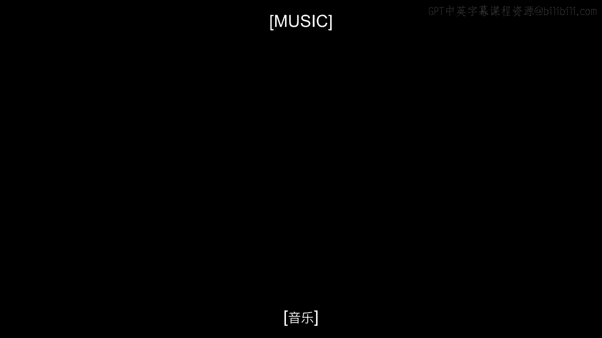
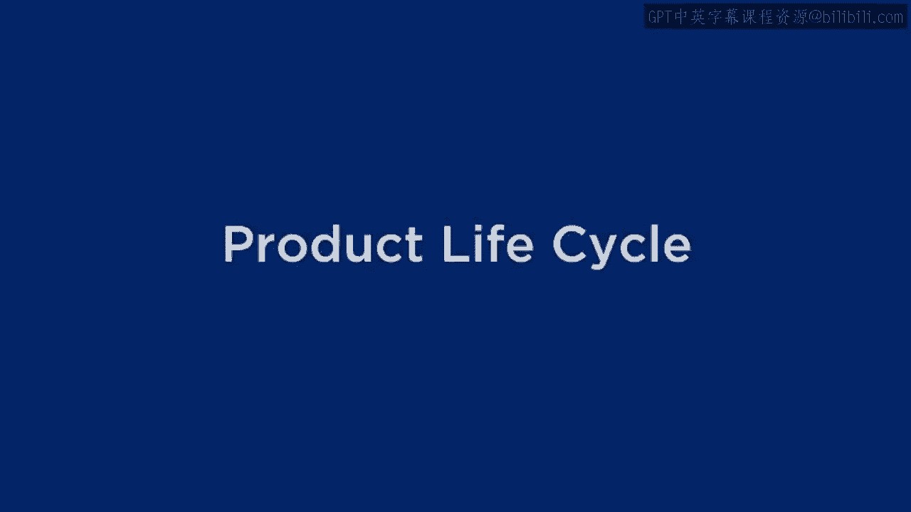
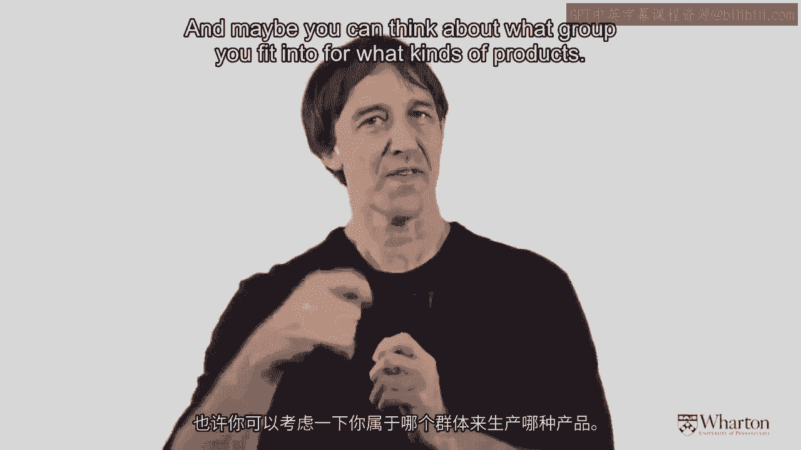
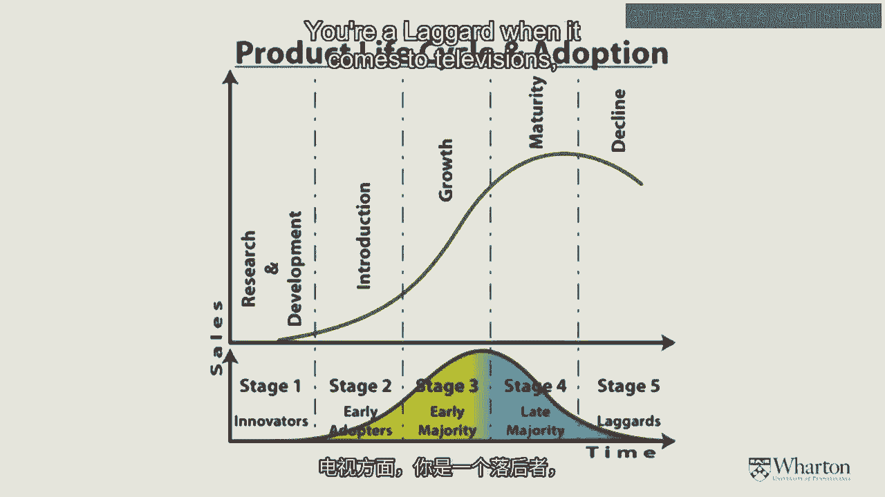
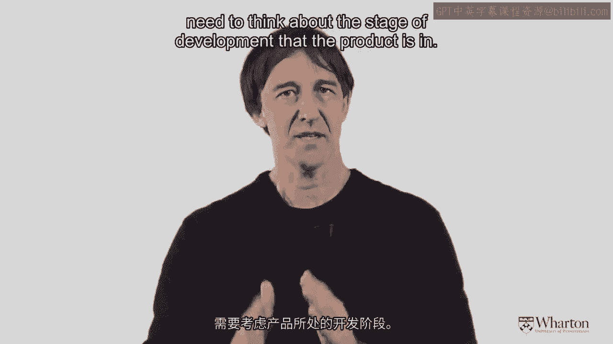
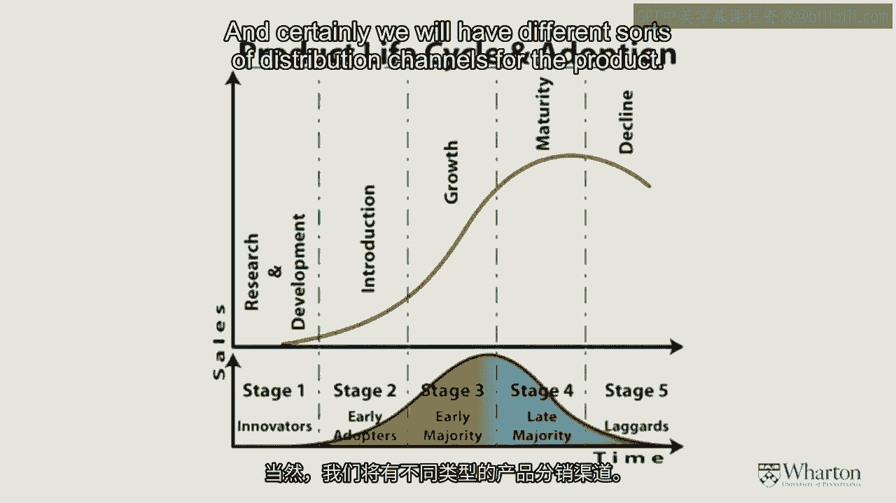
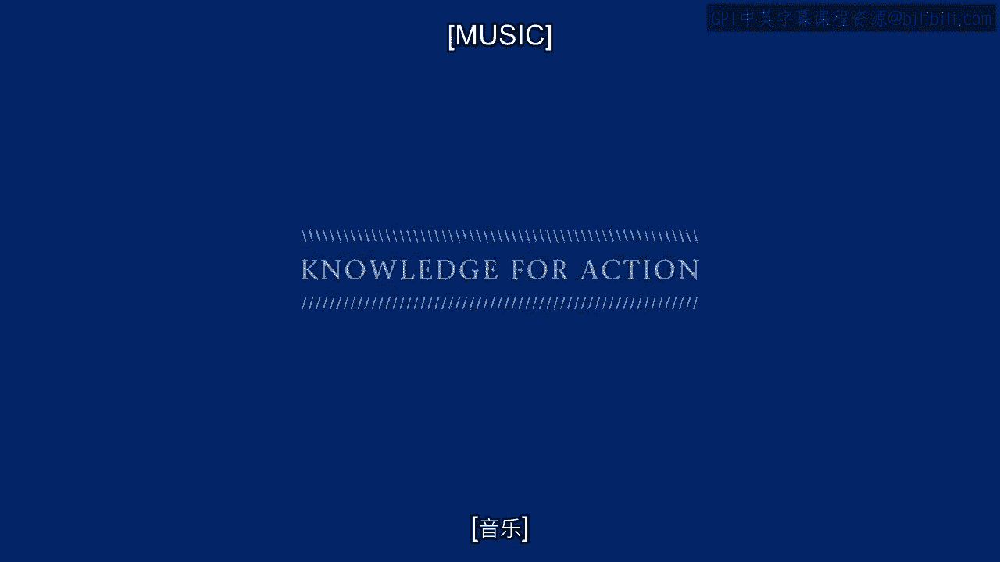

# 沃顿商学院《商务基础》课程笔记｜P152：产品生命周期与创新扩散理论 🚀

在本节课中，我们将学习市场营销中的一个核心概念——**产品生命周期**，以及与之紧密相关的**创新扩散理论**。理解这些概念，能帮助我们把握产品从诞生到衰退的全过程，并学会如何识别和利用早期用户来推动产品成功。

---

## 模块二：寻找领先用户与理解网络 📈

欢迎再次来到课堂。现在我们将进入模块二的学习。模块二的内容将非常引人入胜，它主要探讨如何寻找那些“领先用户”——即那些会真正与我们的品牌深度互动的特殊人群。我们将研究他们如何相互连接形成网络，影响力如何传播，以及其他相关且有趣的现象。

为了建立知识基础，我想先与大家分享一个在市场营销课程或营销思维中，我认为最基础的概念之一：**产品生命周期**。

---

## 产品生命周期：四个核心阶段 📊

产品生命周期理论认为，**每一件产品都会经历至少四个阶段**。

1.  **引入期**：产品首次面市。
2.  **成长期**：产品被市场接受，销量快速增长。
3.  **成熟期**：销量达到顶峰并趋于稳定。
4.  **衰退期**：销量逐渐下滑。

当然，在产品面市之前，还需要进行研发工作。正如屏幕上所示，产品的销售额会经历一个**起飞、达到峰值、最终逐渐消退**的过程。

这个销售曲线的背后，是**消费者**在驱动整个过程。我们的目标是，**尽可能快地启动这个过程**，并识别出曲线左侧那些真正具有创新精神的用户。他们乐于进行口碑传播，能将更多人带入产品的使用行列。

---

## 创新扩散理论：五类消费者 🧑‍🤝‍🧑

上一节我们介绍了产品生命周期的宏观框架，本节中我们来看看驱动这个周期的具体人群。这引出了一个经典理论——由埃弗里特·罗杰斯教授提出的**创新扩散理论**。

他认为，市场上大致存在五类消费者。你可以思考一下，对于不同类型的产品，你属于哪一类。

以下是这五类人群的划分：

*   **创新者**：这类人会主动购买新产品，无需与他人交流。他们约占人口的 **2.5%**。
*   **早期采用者**：约占人口的 **13.5%**。
*   **早期大众**：约占人口的 **34%**。至此，曲线左侧已覆盖50%的人口。
*   **晚期大众**：另一个 **34%** 的人口。
*   **滞后者**：最后进入市场的人群，约占 **16%**。

一个人可能在不同领域属于不同类别。例如，你可能是手机技术的**早期采用者**，总是最先购买新款三星或iPhone；但在电视领域，你可能是**滞后者**，并不关心是否拥有最新款的电视。

---

## 理论的应用与重要性 🔗

在接下来的课程中，我们将重点讨论：**如何聚焦这些创新人群？如何理解他们的社交网络？以及信息如何流动？**

这个概念对第三部分（或第三周）的学习也至关重要。因为当我们考虑进行广告投放、定价或选择分销渠道时，很大程度上需要思考产品所处的**生命周期阶段**。

*   在产品生命周期的**初期**和**末期**，我们可能采用不同的定价策略。
*   我们可能使用不同类型的**广告信息**。
*   我们肯定会为产品选择不同的**分销渠道**。

因此，深入理解产品生命周期和创新扩散理论非常有益。尽管这个理论有时存在争议，但它仍然是帮助我们理解产品如何起步、腾飞并最终衰退的绝佳框架。

---

## 总结 📝

本节课我们一起学习了：
1.  **产品生命周期**的四个阶段：引入期、成长期、成熟期和衰退期。
2.  **创新扩散理论**中的五类消费者：创新者、早期采用者、早期大众、晚期大众和滞后者。
3.  理解这些理论对于制定营销策略（如定价、广告和渠道选择）具有重要的指导意义。

掌握这些基础概念，将为我们后续深入学习如何寻找领先用户、分析网络效应打下坚实的基础。