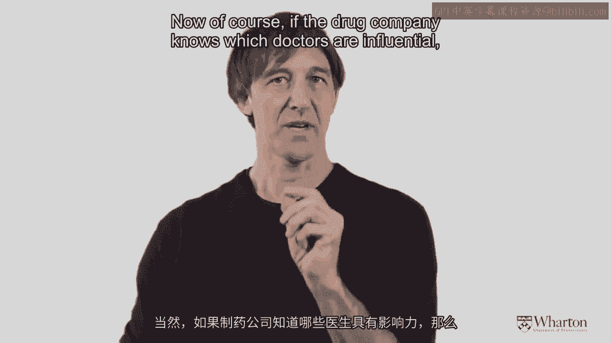
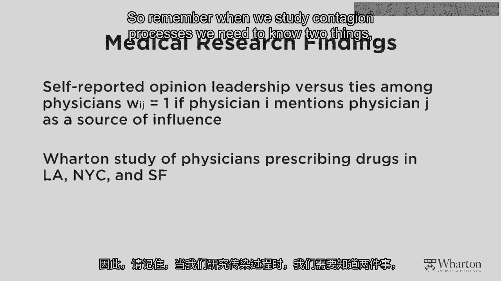
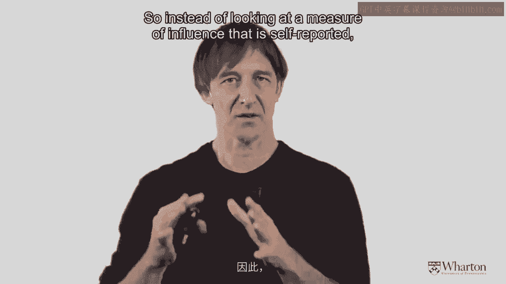
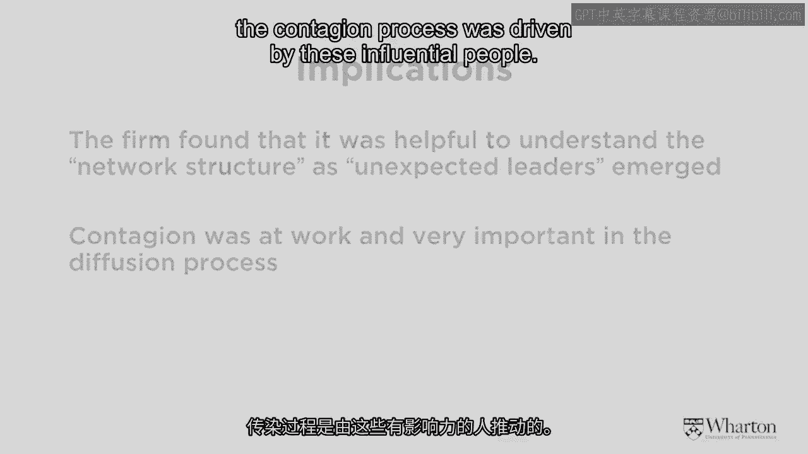
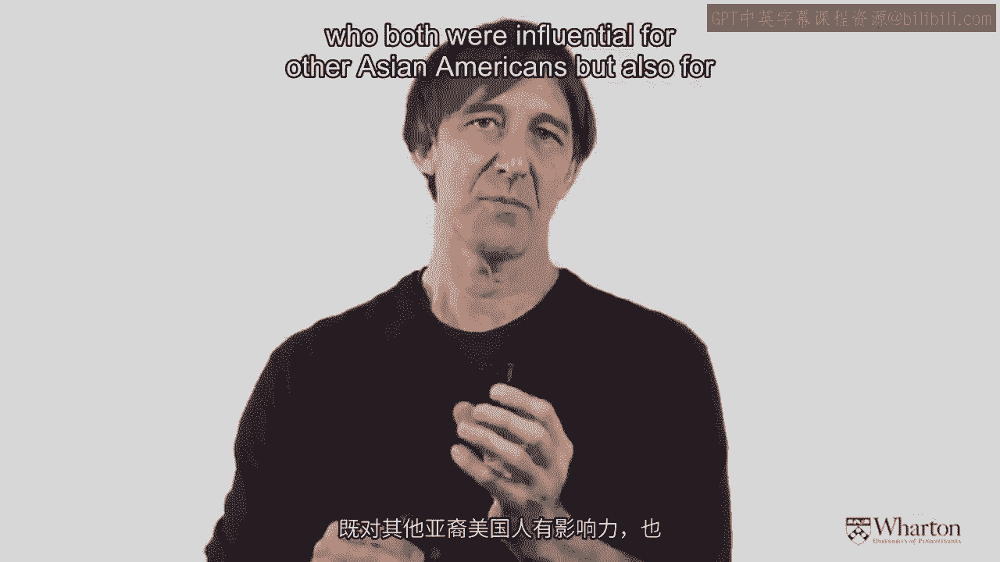
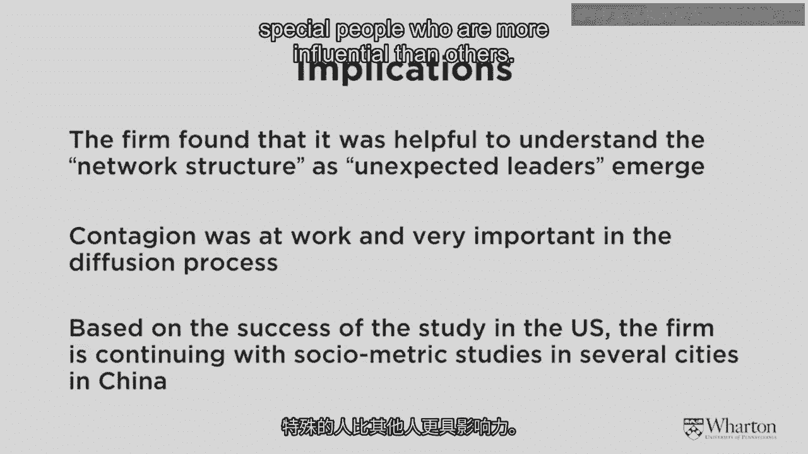
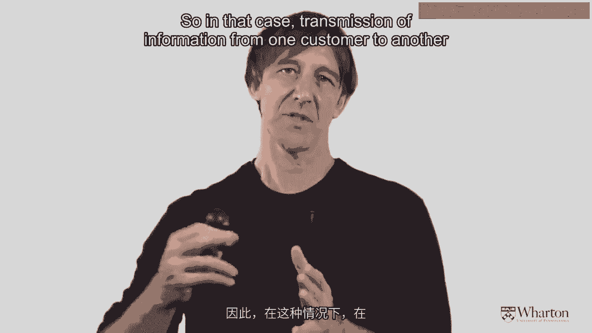
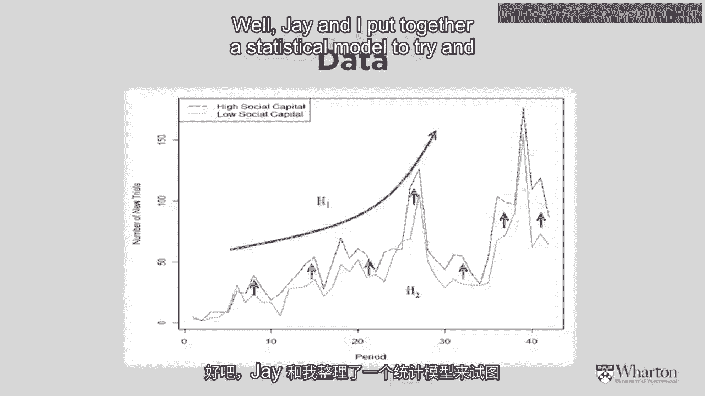
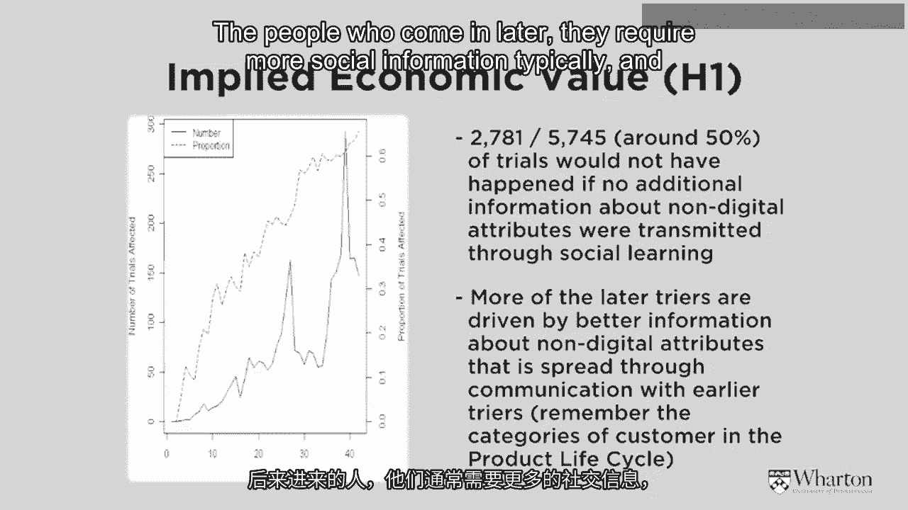
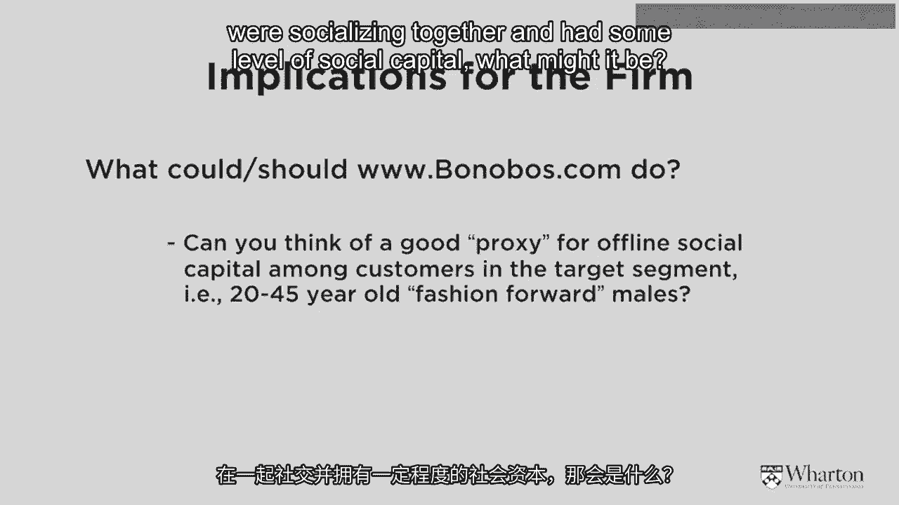

# 沃顿商学院《商务基础》｜第154课：更多影响力案例（二）📊

在本节课中，我们将继续探讨影响力与信息传播的案例。我们将从线上虚拟世界回到线下现实世界，分析专业人士网络中的影响力，并最终再次结合线上销售，探讨现实世界互动如何影响虚拟世界的商业行为。通过四个具体研究，我们将深入理解网络结构、关键影响者以及社会资本在商业传播中的作用。

## 回顾与过渡：从虚拟到现实世界 🔄

上一节我们介绍了两个研究，它们揭示了关于信息传播和影响用户的非常有趣的发现。我们研究了 **Demandforce.com** 在美国各社区间的传播，也探讨了社交网站中“谁对谁有影响力”的问题。

我们既观察了现实世界，也探索了虚拟世界。现在，让我们再次回到现实世界。

## 案例三：专业人士网络中的影响力与传播 🩺

一个被广泛研究影响力与传播的领域是专业人士群体，特别是医疗界人士。

这里展示的图表来自我两位沃顿商学院同事及其南加州大学同行合著的一篇论文。这种网络图与我们最初讨论网络和社区时看到的（展示肥胖症在全美传播的争议性研究）图表类似。

这张图展示了洛杉矶地区174名医生之间的连接关系，圆圈的大小也暗示了某种程度的影响力。医药公司和研究者希望了解的是：在这个网络中，**谁对谁有影响力，以及影响力有多大**。

再次以我的朋友克里斯为例，他现在扮演一名医生。如果克里斯开始给他的病人开某种药，我可能也会效仿。显然，如果制药公司知道哪些医生具有影响力，这对**精准营销**非常重要。

### 研究方法与发现

研究同事采用的方法与我之前展示的非常相似。之前我们有四个邮政编码（Z1, Z2, Z3, Z4），这次则是医生。他们首先查看了医生之间的连接关系，其次查看了哪些医生已经开了这种药，哪些还没有。

研究传播过程需要知道两件事：
1.  **谁与谁相连**。
2.  **到目前为止，谁做了什么**。

他们以两种截然不同的方式衡量影响力和传播：
*   **自我报告式**：直接询问人们“你是否有影响力？”，按1到10分打分。
*   **间接客观式**：衡量医生是否**引用**其他同行的科学著作或研究。

研究发现，虽然自我报告有一定参考价值，但**间接的、基于引用的客观衡量方式**在预测药物扩散路径方面更为重要。

### 核心要点总结

这项研究的主要结论如下：
1.  **理解网络结构至关重要**：公司发现，理解其客户（此处为医生）的网络结构非常有帮助。
2.  **传播过程在起作用**：通过理解网络结构，他们能够识别出存在一个由**关键影响者**驱动的传播过程。
3.  **识别真正的影响者**：有趣的是，一些真正的影响者并非那些自称有影响力的人，而是通过间接方式（如被同行引用）识别出来的人。
4.  **跨界影响者的存在**：研究中还发现了一些特殊人物，他们能跨越不同群体施加影响。例如，某些亚裔美国医生不仅对同族裔群体有影响力，也对其他族裔群体有影响力。

这告诉我们，作为营销人员，我们的任务是尝试理解网络中那些**特殊的关键影响者**是谁。

## 过渡：从现实医疗网络回到线上销售 💻

我们刚刚完成了对现实世界中医生的研究，也看过虚拟世界中的其他案例。现在，我们将再次回到虚拟世界，但这次带有一个现实世界的“转折”。

## 案例四：线下互动如何驱动线上销售 👔

我们这次研究的公司是 **Bonobos**，它自2007年左右成立，在线销售男士服装，也通过传统零售商销售。

这促成了我和同事杰·杨关于“邻里社会资本与在线销售”的论文。让我们看看这具体指什么。

Bonobos的目标客户是大约20至45岁、追求时尚且寻找高性价比服装的男性。我们想探究的是：**现实世界的互动是否会增加这家公司在虚拟世界的销售额**？

具体来说，如果我的朋友克里斯从Bonobos.com购买了一些衣服，我看到他穿着，并且他向我推荐，这是否会**增加**我从同一网站购买的概率？我们想研究现实世界的互动是否会为公司的网站带来额外的虚拟世界销售。

其次，我们想观察**社会资本**是否会产生影响。社会资本是一个迷人的概念，由哈佛大学肯尼迪政府学院的罗伯特·帕特南提出，他著有《独自打保龄》一书。其隐喻在于，人们可能变得不如过去那么社交，也许是因为我们花太多时间上网，与他人脱节。

帕特南希望通过一项名为“社会资本社区基准调查”的大型调查，了解当地社区人们的连接程度。他和团队走访了美国约1000个邮政编码区的3万人，询问诸如“你喜欢邻居吗？你信任邻居吗？你和邻居互动吗？”等问题，收集了关于信任和互动的有趣数据。

我们想看看，在**社会资本更高**（即拥有更多信任和互动）的社区，信息分享是否会**更高效**。

### 研究产品的特殊性

这项研究中，产品的三个条件尤为重要：
1.  **非数字属性**：像我所穿的毛衣这样的服装，具有难以在互联网上完美呈现的属性（如合身度、手感）。价格是数字属性，易于在线传达；但服装的合身感和质感则很难，因此线下客户间的信息传递可能非常重要。
2.  **聚焦首次购买者**：我们关注那些尚未从该网站购买过任何东西的客户，即他们的首次购买。因为一旦你购买并试穿过，你会有自己的判断，除非是关于整体时尚度，否则不一定需要他人意见。
3.  **社会可见性**：这是可能引发交谈的产品。我可能会看到克里斯并问：“嘿，克里斯，今天穿得真帅，裤子哪儿买的？”从而引发对话。

这与我们之前讨论的大部分产品（如肥皂、尿布）不同，那些产品主要具有数字属性，在线沟通没有障碍。这次我们想研究一个略有不同的时尚业务。

### 数据与研究发现

这是公司运营头42个月（约3.5年）的销售数据。数据显示，随着时间的推移，新客户数量在增加。蓝色箭头表明，在**信任和互动更多**的社区，销售额高于信任和互动较少的社区。

通过建立统计模型进行详细分析，我们发现了以下结果：

**研究发现一：社会学习的影响**
在我们观察的约6000次交易中，至少**一半**受到了我们称之为“社会学习”的影响。统计分析证据表明，一些新客户成为客户，是因为他们当地社区的某人告诉了他们。这是一个相当重要的效应。

此外，我们发现**后期加入的客户**最受社会互动的影响。这与我们之前讨论的主题一致：早期行动者通常不太依赖他人意见；后期加入者通常需要更多的社会信息，我们的研究也证实了这一点。

**研究发现二：社会资本的作用**
我们认为最有趣的发现是：在拥有更多信任和互动（更高社会资本）的社区，**销售额不一定更高**。并非高社会资本社区的居民就买更多东西。

关键在于，在这些社区中，当信息被传递时，它**更可信、更可靠、更高效**。如果克里斯和我住在一个彼此信任、喜欢的社区，他告诉我某事，我会给予更多重视。这就是这里呈现的结果。

### 商业应用与创造性思维

那么，Bonobos.com或任何公司如何利用这些信息呢？在我们的分析中，我们仅限于那些收集了社会资本调查数据的邮政编码区，但美国还有许多邮政编码区没有这些数据。

这里有一个问题：除了真实的社会资本测量，你能想到什么**替代变量**来指示20至45岁男性是否社交活跃并拥有一定社会资本吗？医院数量？教堂数量？橄榄球俱乐部数量？

实际上，**人均酒吧和酒类商店数量**是预测该群体间信息高效传播的一个很好的指标。我提到这一点，是希望你们在将这些概念应用于自己的业务或公司时，能够**更具创造性和拓展性**地思考。

## 课程总结 🎯

本节课我们一起学习了四个关于影响力与传播的研究：
1.  **Demandforce.com** 的社区传播案例。
2.  社交网站中的影响力关系研究。
3.  医生处方行为扩散的研究。
4.  Bonobos案例：线下互动如何影响线上产品销售。

通过这些案例，我们深入理解了网络结构、关键影响者的识别、社会资本在信息传播效率中的作用，以及如何创造性地将这些洞察应用于商业实践。