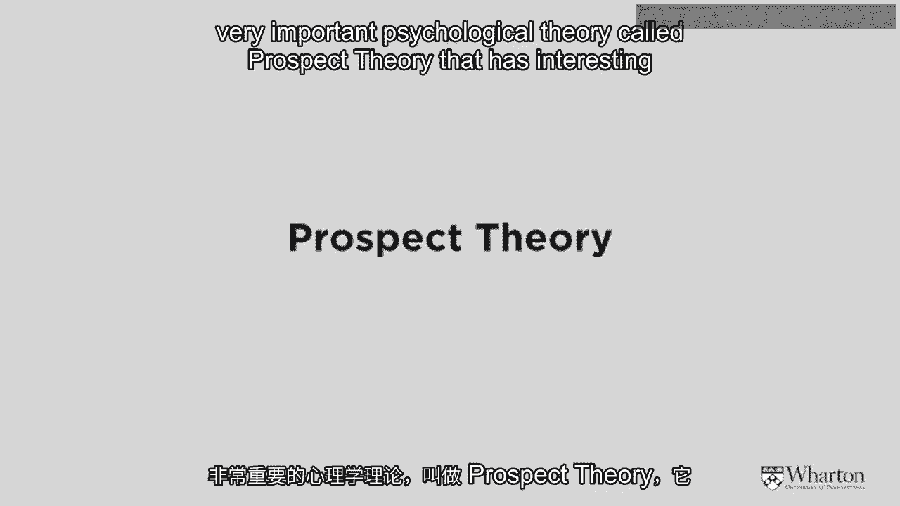
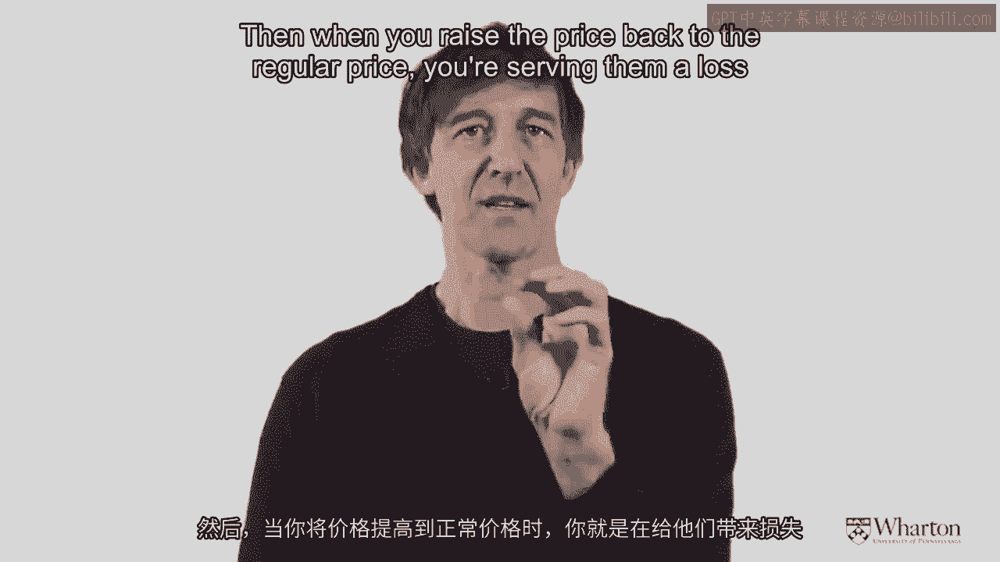

# 沃顿商学院《商务基础》｜Business Foundations Specialization｜（中英字幕） - P155：12_定价策略3 心理因素9 47.zh_en - GPT中英字幕课程资源 - BV1R34y1c74c

So let me introduce the concept of "men'sal accounting" which I think is really fascinating。

for pricing。 And here's the example I want to give as I mentioned was developed by Richard Thaler。

who's a professor at the University of Chicago。 And he presented people with the following scenario。

He said， "Imagine an individual that's called him Mr。 A， and Mr。 A has just won two tickets。

in lotteries。"， It's kind of a lucky guy。 He won one ticket for $50 and another ticket for $75。

So he's won two separate lotteries valued at $75 together。 Mr。 B， let's call him Mr。 Brown。

he also is pretty lucky。 He won a ticket for $75。 So from a strictly economic point of view。

both of these gentlemen have had their wealth， go up by $75。

So if we believe that people are completely rational， then the fact that both of these。

gentlemen increased their wealth by $75， they should be equally happy。

But when he presented this to individuals like you and I in an experiment and asked us to， say。

"Who do we think's happier？"， Mr。 A or Mr。 B， "We all think Mr。 A is happier。"。

And the reason we think that is when you get good news， like windfall gains， it's better。

for that good news to be spread around。

So think about if you had for your wife or husband or someone else in your family， sons。

or daughters， you wanted to buy them gifts for Christmas and you bought them three gifts。

for Christmas。 Would you wrap them all in one big box or would you separate them out？

I think we all know again， at least in Western culture， we'd rather separate them out。

So when news is good， you want to spread it all around。

Okay， so let's continue with this example。 What about if news is bad？ So in this case， Mr。

A in the experiment received two unfortunate letters from two different， tax authorities。

The federal government in the United States says， "Sorry， Mr。 A， you owe an extra $100。

on your taxes。"， The state of Pennsylvania also sent him a letter saying， "Sir。

you owe $50 on your taxes。"， So the poor guy has to cough up $150 to the tax authorities。 Now Mr。

B also received some bad news。 He owes $150 in tax， but only to the federal government。 So again。

we have two individuals who've both been given the same negative information。 They have to pay $150。

But because， again， Mr。 A has received two negative hits， people like you and I in the。

experiment think that Mr。 A is going to be less happy。 So this is exactly the opposite inference。

When you've got bad news， you should lump it all together。 Good news should be separated around。

So what does this mean for pricing？ Well， imagine that your company and your charging customers a lot of different things。

three， or four different things。 You might be better off trying to give that price information just as one overall price。

rather than itemizing the entire thing。 And again， if we think back to the financial crisis。

there was an interesting example of， this on a large scale。

You might remember that the federal government in the United States bailed out various banks。

and so on to the tune of about $750 billion。 That's a lot of negative information。 That's a big hit。

But I think people became especially annoyed about this when they saw that $50 billion was。

going to bank $100 billion to this bank。 And so listing things that are negative creates a disproportionate negative effect。

So if you've got bad news， what you should do is you should integrate it all together。

Now what about if news is mixed？ This is interesting things for pricing。 So again。

imagine my friend Amy here at the Wharton School。 She likes to come to school by bike。

And even though crime never happens in Philadelphia for the sake of argument， let's imagine that。

it does， and poor Amy's bike is stolen。 It's going to cost her $180 to replace it。

Chris as well again， perhaps it's the same thief who knows。 He has a bike， slightly better bike。

a $200 bike。 His bike is also stolen。 But Chris， on the way to get his lunch in the cafe and Huntsman Hall。

he notices on the， ground a $20 bill。 So Amy is out $180。 Chris is out $200 but he found $20。

But he's also out $180。 Well， who's happier？ It turns out that Chris is actually happier because of something called the silver lining。

principle。 Yeah， he got negative $200 but the plus $20 sort of makes him feel better。

So how will we translate this into pricing？ Well， if I'm trying to sell you a car for $20，000。

instead of charging you $20，000， I， might be better off charging you $22。

000 but let me give you a $2，000 rebate。

So I'm sure you can see how that principle kind of works。

So now I'm just going to spend a couple of minutes introducing a very， very important。

psychological theory called prospect theory that has interesting implications for pricing。

I'd encourage you if you're more interested in theory than just beyond what we're talking。

about to just have a search for on Google。 So prospect theory was developed by two psychologists。

The first of whom is Professor Daniel Kahneman who still teaches at Princeton University and。

has written a number of other influential things in the area of human psychology and decision。

making。 So the co-author was Professor Amos Tversky who unfortunately passed away who was a professor。

at Stanford University and the two of them received the Nobel Prize for this idea。

So it's a pretty good idea。 Let's see how it applies to pricing。

So in standard economics as you might imagine， you and I are supposed to be indifferent between。

outcomes that have the same expected value。 What do I mean by that？ Well。

let me give you a simple example。 So let's imagine my friend Amy offers to give me a $100 bill。

She says， "Okay David， you can have a $100 bill or you can take the following gamble。"。

And the gamble is I'm going to toss a coin， a fair coin。 If the coin comes up heads。

I'm going to give you $200。 And if it comes up tails， I'm going to give you nothing。

So if I think about that， getting $100 for sure， that's $100。

The gamble also has an expected value of $100 because 0。5 times 200 plus 0。5 times zero。

is also 100。 So the expected gain I'm going to get from these two things is exactly the same。

So if I'm a completely rational calculating person， then I should be indifferent between。

these two options。 But maybe you have a preference。 I would certainly have a preference。

I'd take the $100 for sure。 So what Professor Kahneman and Diversky found is when options were offered as a sure thing。

and that were positive options， like receiving money for example， people would rather have。

the sure thing than the gamble， even though the expected value was the same。

Counter to what we would learn in traditional economics。

So they developed a new theory called prospect theory that has three really important points。

to it that are missing from most other standard theories。

The first one is that people have an internal reference point where they expect certain。

things from a stimuli like price。 And I'll explain this with an example in a moment。

The second thing is people respond differently to deviations from the reference point whether。

they're positive or whether they're negative。 And then thirdly。

there's something called diminishing sensitivity that's a little bit， more complex。 I'll let you。

those of you out there who are very interested in this theory to look that， up on your own。

But let me give an example of how it works for pricing。

So imagine I go to my local Starbucks to buy a cup of coffee and I'm expecting to pay a。

dollar for the coffee。 That's my internal reference point。 When I get there。

the coffee is selling for 75 cents。 So I've just encountered a gain or a positive deviation from the reference point。

Paying 75 cents is better than paying a dollar。 So because of that gain of 75 cents on the x-axis here。

my happiness is going up by some， amount。 I'm happy from that gain of 75 cents。

But what's happened because of that transaction？ My reference point has now shifted from a dollar to 75 cents。

It's been affected by the experience that I've just had。

And then I go back to the Starbucks a day later expecting to pay 75 cents。 But lo and behold。

the price has gone up to a dollar。 So now what's happened from my reference point of 75 cents。

I've encountered a loss of， 25 cents。 The loss is the same size as the gain was before。

But the loss causes me to feel very， very unhappy。

So there's a phenomenon called loss aversion that for the same deviation， 25 cents in either。

direction。 The pain of the loss might be twice as much as the pleasure of the gain。 Again。

I'll let you go into this in more detail on your own。

But the idea is if you promote your product too often， then you try to raise it back to。

the regular price。 You've already driven somebody's reference point down。

And then when you raise the price back to the regular price， you're setting them a loss。

that they will react negatively to。 That's an important implication of this theory。 Okay。

so let me summarize what we've done in this module about pricing to value。 First and foremost。

the thing to keep in mind is the framework for inputs to the pricing， process。 First of all。

what's my marginal cost？ I do not want to price below that。 That's the floor。 Second of all。

what is the customer's willingness to pay is determined by their price sensitivity。

That's the ceiling。 Thirdly， by how much will I have to reduce the price because of competitive pressures。

And fourthly， by how much will I have to raise the final price to the consumer just to give。

my distributor or my partner some margin to play with， those are the four things that。

determine price。 That's the framework。 The second thing that we spent a lot of time on was the notion of customer price sensitivity。

and how it could be measured。 And then finally， pricing wouldn't be as much fun and wouldn't be as complicated and。

as intricate without thinking about all of the aspects of human psychology that come into， play。

Things like prospect theory， things like mental accounting， the endowment effect， and so on。

[MUSIC]。

[ Silence ]。
