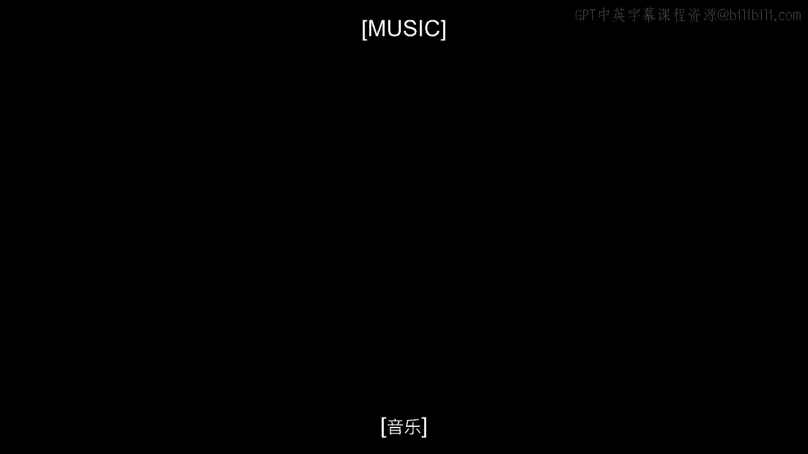
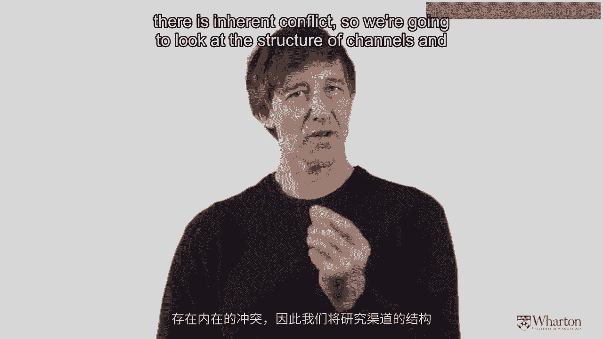
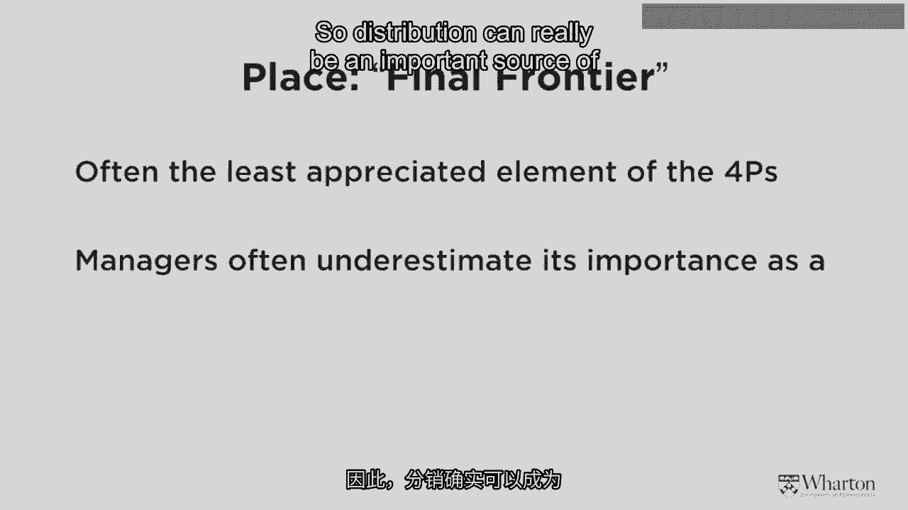
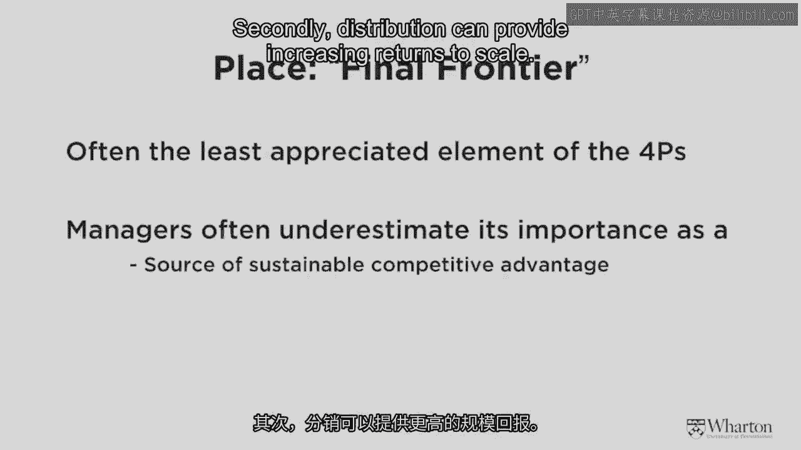
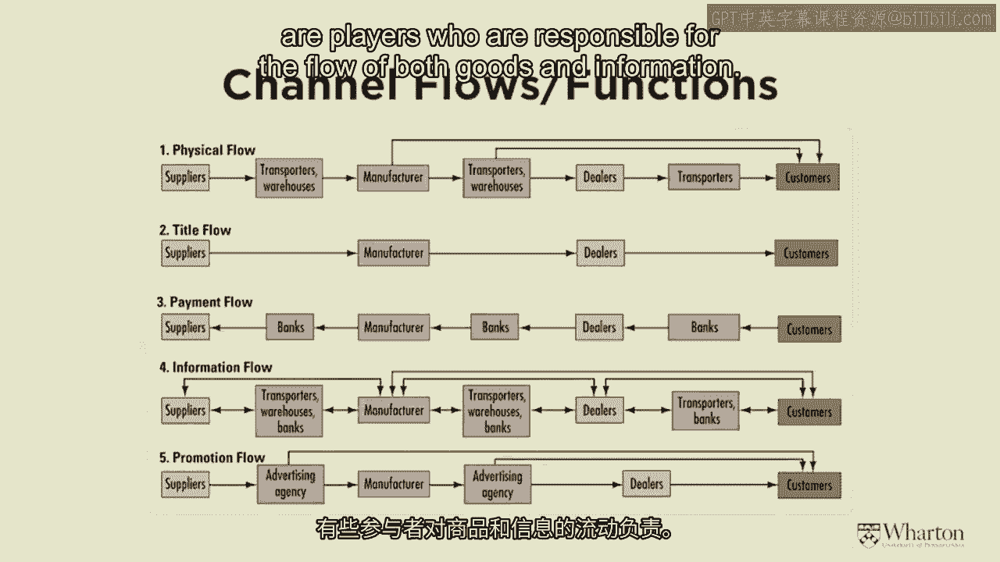
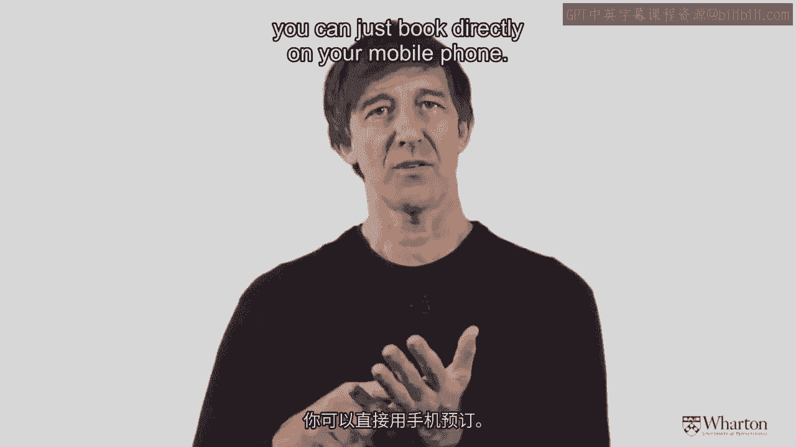
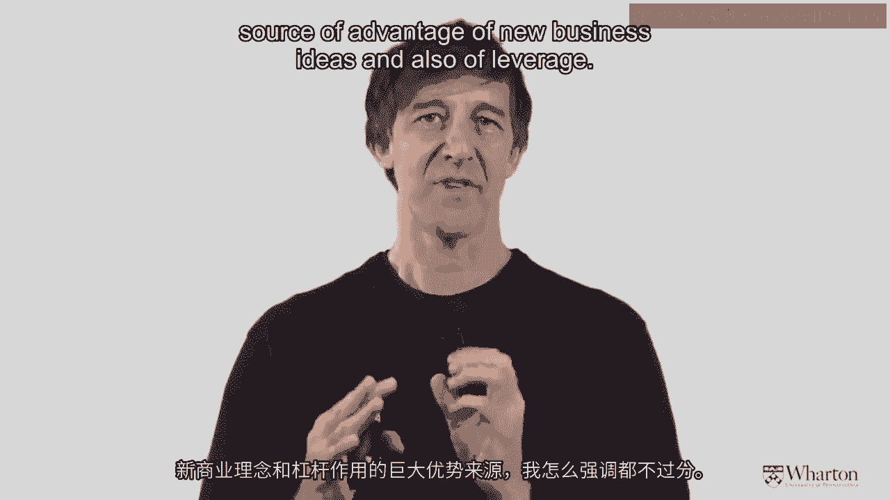
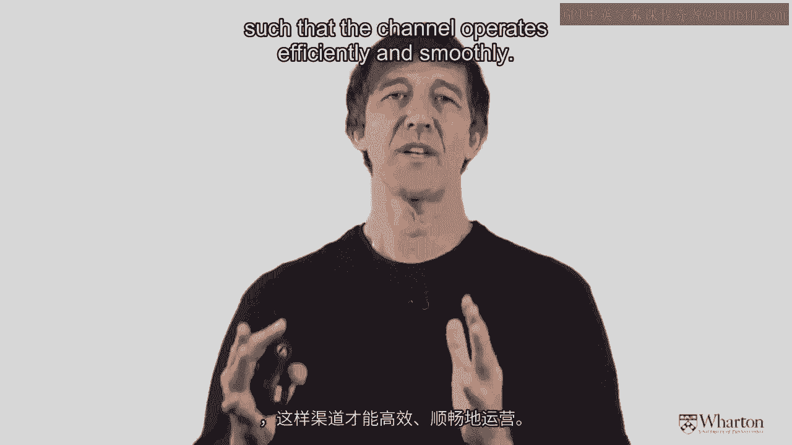
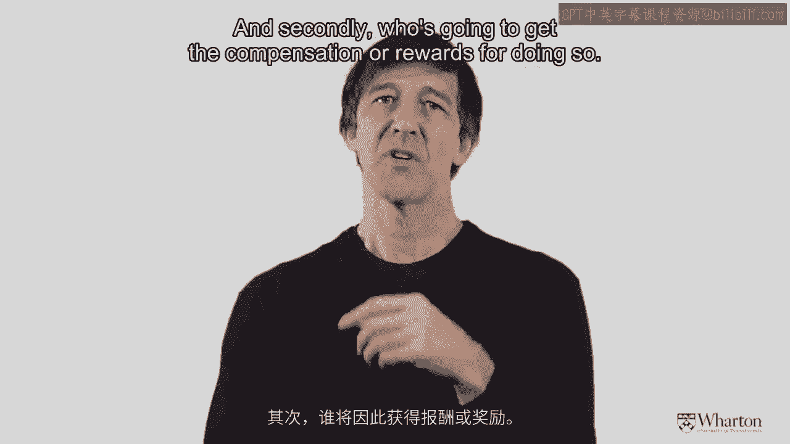
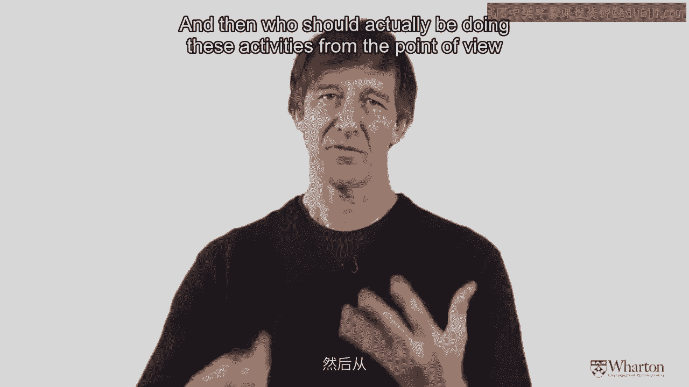

# 沃顿商学院《商务基础》课程 P156：分销策略（一）🚚

在本节课中，我们将要学习市场营销组合中的第四个“P”——渠道（Place），即分销策略。我们将探讨分销渠道的结构、协调方式，以及如何通过渠道创新来获得竞争优势。

---

## 分销渠道的重要性与创新潜力

上一节我们介绍了市场进入策略的整体框架，本节中我们来看看分销渠道的具体作用。分销有时被称为“最后的P”，常被忽视，但它实际上是可持续竞争优势的重要来源。

以下是分销至关重要的三个原因：

1.  **可持续竞争优势**：例如，苹果公司通过拥有自己的零售店并直接控制客户体验，建立了强大的竞争优势。
2.  **规模收益递增**：像可口可乐这样的大品牌，通过在宾夕法尼亚州所有网点分销，仅凭无处不在的覆盖率就能获得不成比例的市场份额回报。
3.  **长期性与高投入**：建立实体分销网络需要资金投入，因此必须确保能获得相应的回报。

分销也是解锁巨大商业价值的领域，通过创新可以催生新的服务和产品。一个关键创新是将**硬产品**转化为**软产品**。

*   **公式示例**：`硬产品 + 分销创新 = 软产品`
*   **代码示例**：`if (product.isHardGood() && distribution.isInnovative()) { product.becomeSoftGood(); }`

例如，现金（硬产品）变成信用卡或手机支付（软产品），彻底改变了交易方式。电影从只能在影院观看变为可流媒体播放，也是如此。我们正在进行的Coursera课程本身也是一个例子：它将原本在沃顿商学院实体教室、面向有限受众的课程，变成了可随时随地向广大受众传播的“软产品”。

---

## 渠道结构：直接 vs. 间接

理解分销渠道的第一步是分析其结构，识别关键参与者。最基本的结构区分在于渠道是**直接**的还是**间接**的。

*   **直接渠道**：商品或服务的提供者直接面向最终用户。
*   **间接渠道**：在生产者与最终用户之间存在中间商或层级。

美国医院供应公司的例子可以说明为何有时间接渠道更有效率。

假设一个市场有3家制造商（M1, M2, M3）和3位消费者（C1, C2, C3）。

*   **直接交易**：每家制造商需直接与每位消费者交易。交易组合总数为 `3 × 3 = 9`。
*   **引入分销商**：所有制造商将产品卖给一个分销商（D），所有消费者从该分销商处购买。交易组合总数变为 `3（制造商对D） + 3（D对消费者） = 6`。

通过引入中间商，交易总数减少了。在实际案例中，美国医院供应公司通过聚合，将市场所需交易总数从8.5亿笔大幅减少到仅约10万笔。

**公式表示**：设有 `m` 个制造商，`c` 个消费者。
*   直接渠道交易数：`m × c`
*   引入一个分销商后的交易数：`m + c`
*   当 `m` 和 `c` 很大时，`m + c` 远小于 `m × c`。

因此，从经济理论看，间接渠道有时优于直接渠道，因为它能减少所需交易的总数。

然而，直接渠道也有其优势：

1.  **建立进入壁垒**：例如，苹果通过自有零售店直接面向客户，使其他硬件和软件销售商难以复制或匹敌。
2.  **获取更佳市场反馈**：绕过中间商，可以直接了解客户的喜好、品种需求和价格敏感度。
3.  **高效捆绑销售**：制造商控制渠道时，可以更有效地捆绑销售高利润产品。例如，在苹果店购买iPhone时，店员可以同时推销笔记本电脑等其他设备。

---

## 分销渠道中的五大流

为了更全面地理解分销渠道的运作，我们需要审视其中发生的所有流程。下图展示了一个较长分销渠道中的五种关键“流”：

（此处为描述性文字，代表原视频中的图表）
从供应商到最终客户，渠道需要完成以下五类活动：

1.  **产品流**：实物产品从供应商流向最终用户。
2.  **所有权流**：商品所有权的转移。
3.  **付款流**：资金从最终用户流回供应商。
4.  **信息流**：市场信息、订单信息等在渠道成员间流动。
5.  **促销流**：广告、推销等营销沟通活动的流动。

这个框架有助于我们思考如何通过创新来**颠覆**现有渠道。让我们结合课程案例Quidsi.com（后被亚马逊收购的日用百货电商）来看。

在Quidsi出现之前，购买洗衣粉的流程是：制造商 -> 仓库/分销商 -> 超市 -> 消费者自行提货回家。Quidsi的创新在于**产品流**：它通过联邦快递或UPS等物流公司，将产品直接配送到消费者家中。

这种创新不仅限于实体产品，也适用于服务。例如，预订酒店的方式从打电话给旅行社或酒店，被Hotel Tonight等手机应用颠覆，用户可以直接在手机上查看并预订。

另一个经典例子是戴尔电脑。在1990年代，迈克尔·戴尔意识到，当消费者对电脑足够了解后，冗长的渠道（制造商->分销商->电脑商店->销售员）可以被简化。戴尔通过`1-800-DELL`电话直销，让客户直接定制电脑，然后制造并直接发货，从而颠覆了传统的电脑分销模式。

---

## 渠道功能：实体流与信息流

为了更简单地理解，我们可以将分销渠道的功能归纳为处理两大类事情：**实体流**和**信息流**。

以下是分销渠道需要承担的具体任务：

*   **实体流任务**：
    *   建立产品组合
    *   交付产品
    *   提供安装与维修服务
*   **信息流任务**：
    *   了解客户需求
    *   生成销售线索
    *   获取市场反馈

分销渠道中的几乎所有活动，都是实体流与信息流的某种组合。

---

## 渠道设计工具：混合网格

接下来，我们介绍一个用于理解和设计分销渠道的实用框架——**混合网格**。它是一个矩阵工具，帮助你优化渠道设计，确保由最合适的实体来执行最合适的任务。

*   **网格列**：代表需要执行的活动，从生成潜在客户线索，到完成销售，乃至售后服务。
*   **网格行**：代表负责执行这些活动的个人或实体（如公司销售团队、代理商、零售商等）。

设计目标是构建一个为客户优化的分销系统，让最合适的人执行最合适的任务，从而使渠道高效、顺畅地运行。

我们以孟山都公司销售的牛生长激素（BGH）为例。这是一个面向农民的企业级产品，其营销挑战包括：
1.  教育农民使用该产品。
2.  保证产品质量。
3.  确保农民正确使用。
4.  处理废弃针头等回收问题。

问题在于：这些事到底该由谁来做？

（此处为描述性文字，代表原视频中的混合网格图表）
在BGH的混合网格中，横向（列）是所有需要执行的活动（从“生成认知与兴趣”到“监控产品使用情况”）。纵向（行）是所有相关的实体（孟山都销售人员、外部电话营销机构、当地兽医、农民等）。图中蓝色方格表示某项活动由哪个实体来执行是最优组合。

确定最优组合基于两个原则：
1.  **能力**：从客户角度看，谁最擅长做这件事？
2.  **激励**：谁将因执行此事而获得补偿或回报？

例如，“生成认知与兴趣”这个任务，由外部电话营销机构和孟山都的销售人员负责最合适，因为当地兽医可能缺乏动力去做，除非他们能因此获得补偿。

如果你想应用这个工具，可以尝试分析你现有的业务或创业想法，列出所有需要完成的活动，然后从优化渠道设计的角度，决定应该由谁来执行这些活动。

---

本节课中我们一起学习了分销渠道的基础知识。我们认识到分销不仅是物流问题，更是战略优势和创新的关键来源。我们分析了直接与间接渠道的结构与优劣，剖析了渠道中产品、所有权、付款、信息和促销五大流的运作，并学习了通过混合网格工具来优化渠道设计。在下一节中，我们将继续探讨如何管理与协调分销渠道中的潜在冲突。