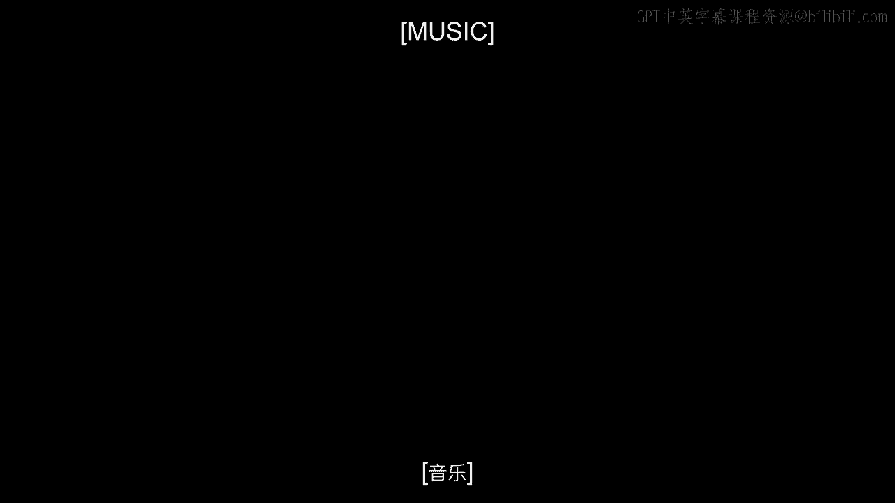

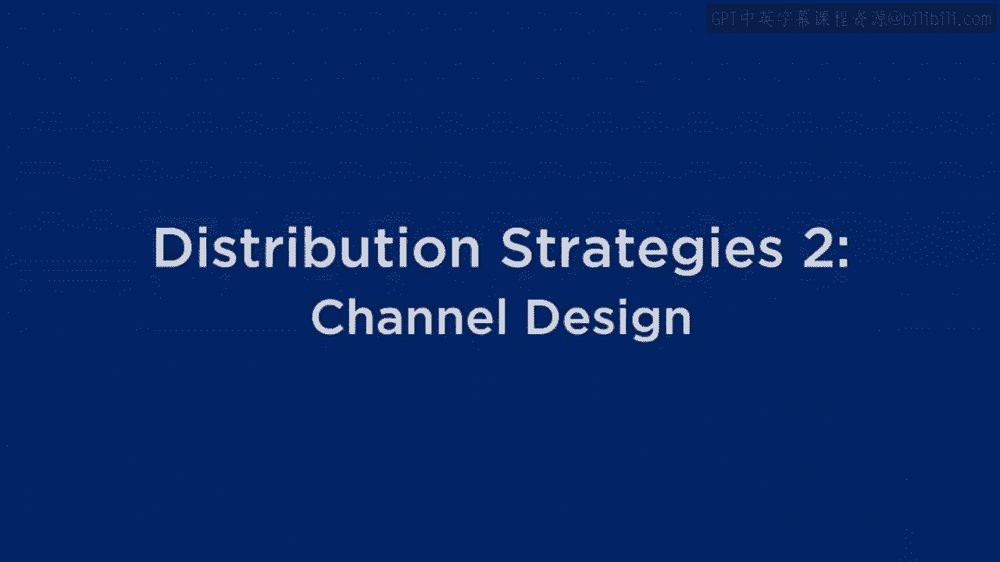

# 沃顿商学院《商务基础》课程｜第157讲：分销策略（二）渠道设计 🛒

在本节课中，我们将学习分销渠道设计的核心决策，包括分销强度、产品生命周期对渠道的影响，以及如何管理和协调渠道中的冲突。

---

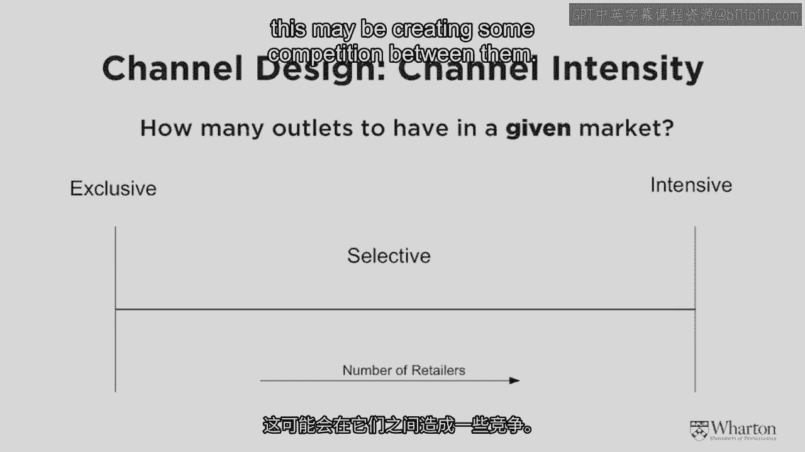

## 分销强度决策 📊

在确定了渠道中需要完成的活动和由谁来完成之后，我们需要就分销渠道的设计做出其他重要决策。一个有用的框架是思考分销的强度。

**分销强度**指的是在特定市场中，我们拥有多少个销售点或分销渠道来提供服务。

*   **独家分销**：在特定市场（如费城、洛杉矶、东京）中，我们只有一个分销商将产品推向市场。
*   **密集分销**：在特定市场中，有许多产品或服务的提供商。这可能会在他们之间制造竞争。
*   **选择性分销**：介于上述两者之间。

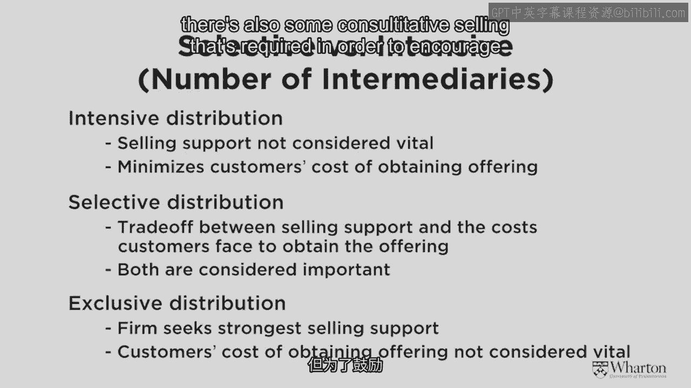

以下是决定采用哪种分销强度时需要考虑的一些经验法则：

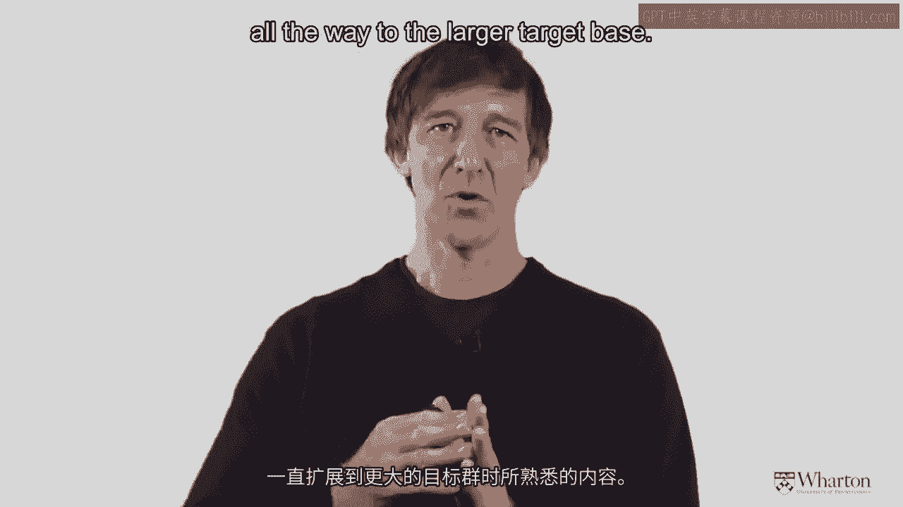

*   **密集分销**适用于不需要太多销售支持的产品。例如，可口可乐希望出现在每家商店、每个自动售货机，以最小化消费者获取产品的成本。
*   **独家分销**适用于希望找到最强的分销商并给予其奖励的情况。这在汽车市场很常见，例如法拉利，为了保护经销商并使其获得更好的利润，会授予其独家区域代理权。
*   **选择性分销**适用于上述两种极端情况都不合适时。客户需要能接触到产品，但同时需要一些咨询式销售来鼓励最终消费者购买。

---

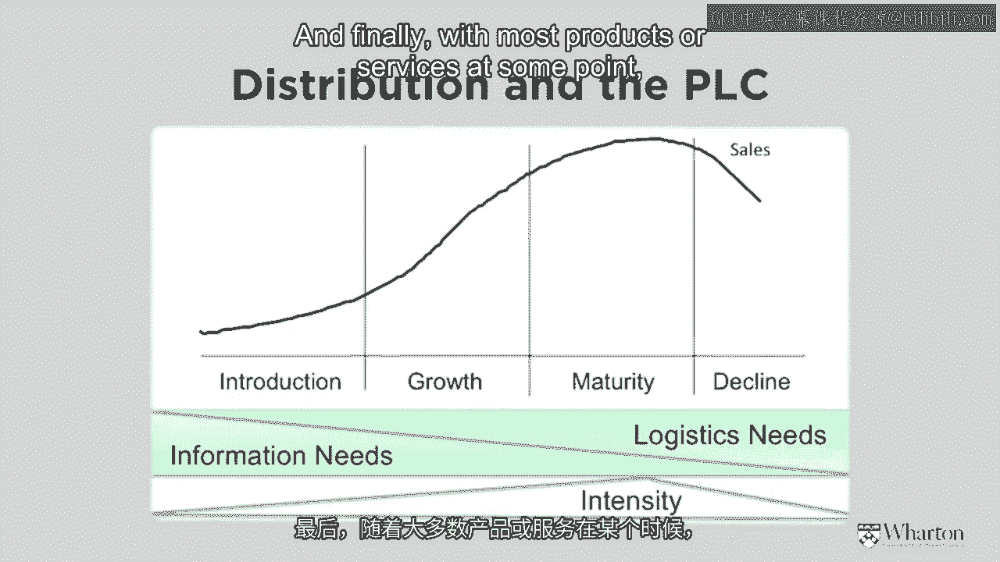

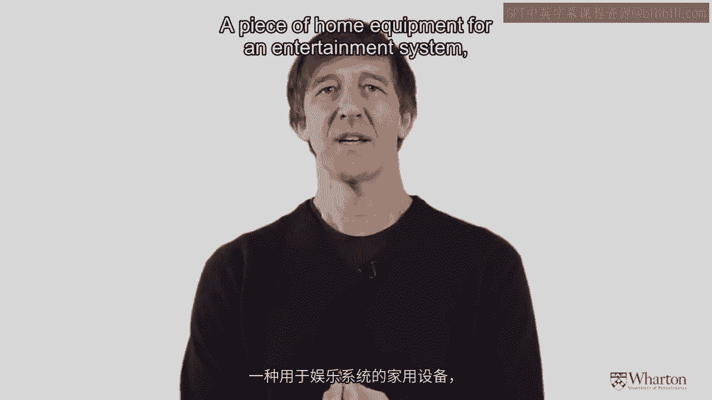

## 产品生命周期与渠道演变 🔄

现在，让我们重新引入之前讨论过的概念——产品生命周期。它分为四个阶段：引入期、成长期、成熟期和衰退期。

以家庭影院设备为例，说明渠道如何随产品生命周期演变：

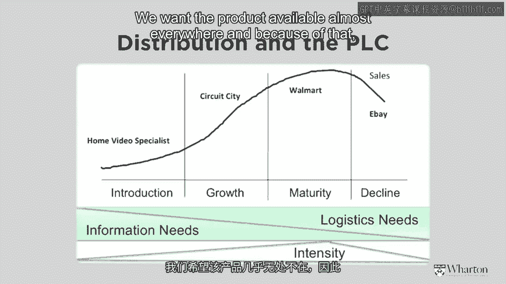

1.  **引入期**：产品最初可能通过家庭视频专家等选择性渠道引入。
2.  **成长期**：为了让产品更广泛地获得，可能会进入百思买等大型分销商。
3.  **成熟期**：产品可能会扩展到沃尔玛等其他渠道。
4.  **衰退期**：产品最终可能在eBay或其他二手市场上销售。

由此可见，随着产品经历生命周期，销售所需的信息量会减少（因为人们对产品更熟悉），但分销强度往往会增加，我们希望产品几乎无处不在。因此，物流需求也会相应增加。

从这一点可以看出，我们接触客户的方式也与产品自身的生命周期密切相关。

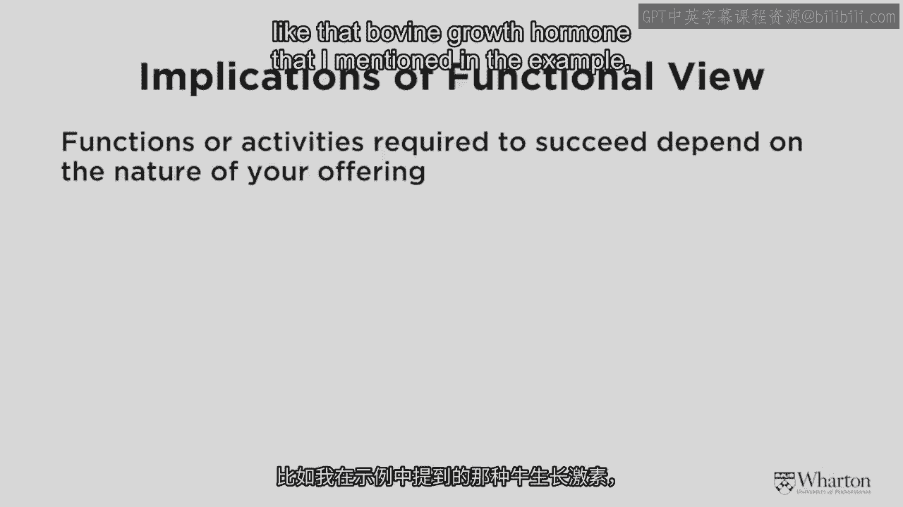

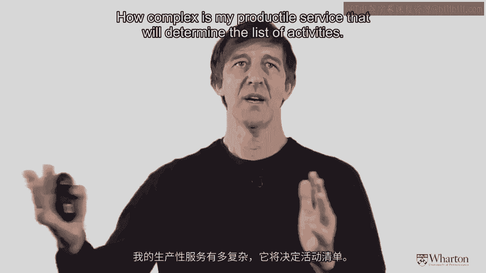

---

## 混合网格与渠道活动创新 🧩

接下来，我们继续探讨混合网格的概念，即某些实体以最优方式执行某些活动。使用混合网格这样的工具来理解你自己的客户接触计划或分销渠道，有哪些启示？

首先，需要完成的活动类型取决于产品的复杂程度。如果你的产品非常复杂（如之前提到的牛生长激素），可能需要完成从教育、认知、产品回收到售后服务等许多事情。因此，产品/服务的复杂程度决定了活动清单。

其次，一旦决定了需要完成哪些活动，这些活动就不能被消除。你无法改变这些“列”（活动本身），例如，你不能突然决定不提供售后服务或不开发新线索。

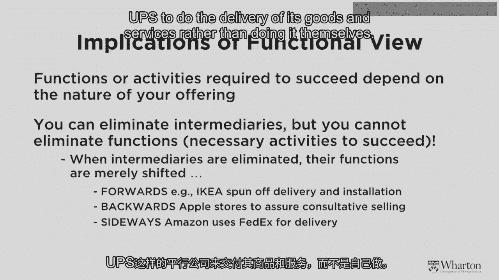

然而，你可以改变由谁来执行这些活动，这常常会带来非常有趣的创新。以下是三个例子：

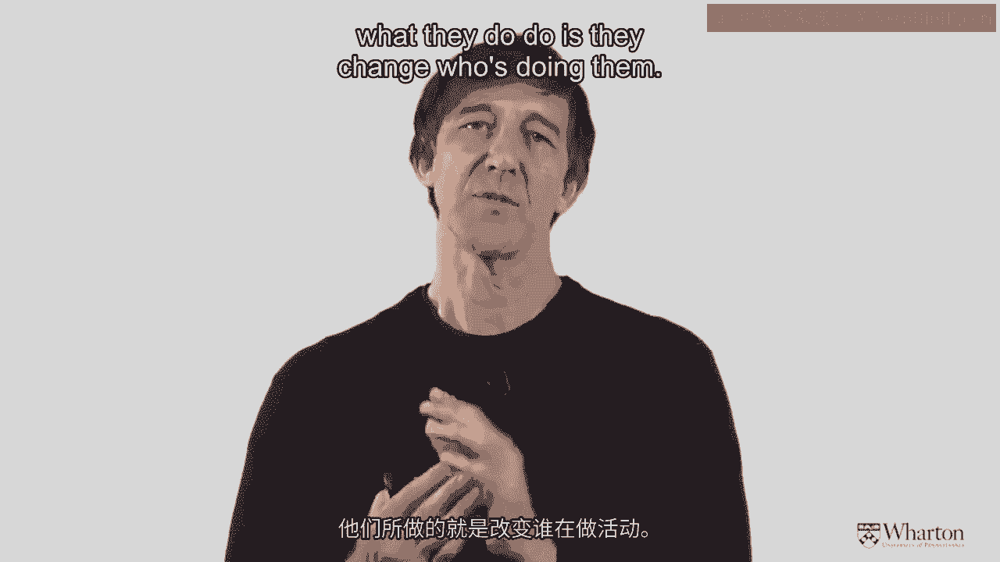

1.  **功能前移**：例如，宜家早期自己负责配送和安装，后来决定将这部分工作交给第三方。这是将活动外包给更擅长的实体。
2.  **后向整合**：例如，苹果通过开设自己的零售店，接管了部分销售其产品和服务的功能，而不是完全依赖独立零售商。
3.  **横向转移**：例如，亚马逊使用联邦快递或UPS等平行公司来配送其商品和服务，而不是自己完成。

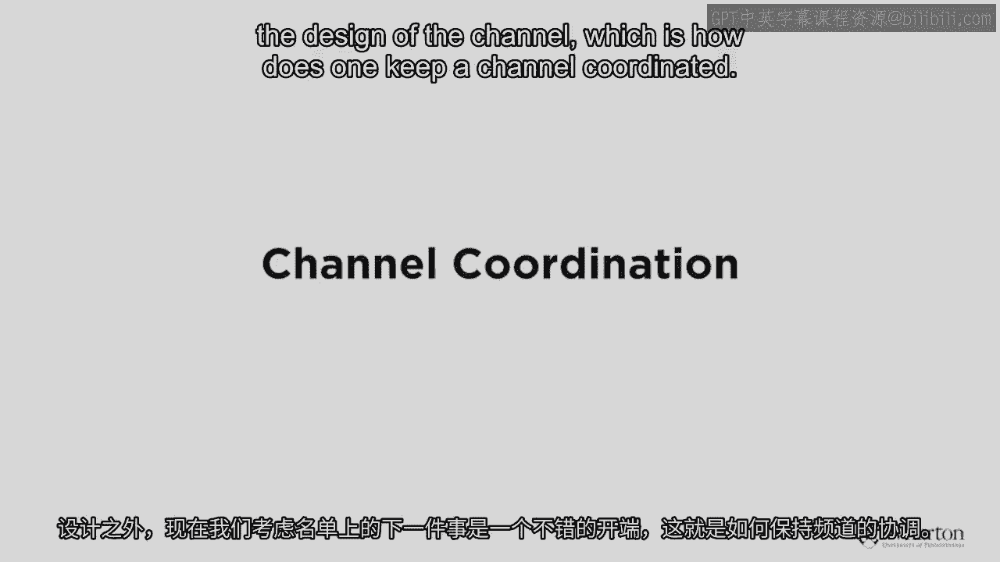

这是一个非常重要的启示：**你不能消除活动，但可以改变或消除某些参与者**。这通常是重要的创新来源，例如迈克尔·戴尔的创新、diapers.com等。许多创新型企业并不消除活动，而是改变活动的执行者。

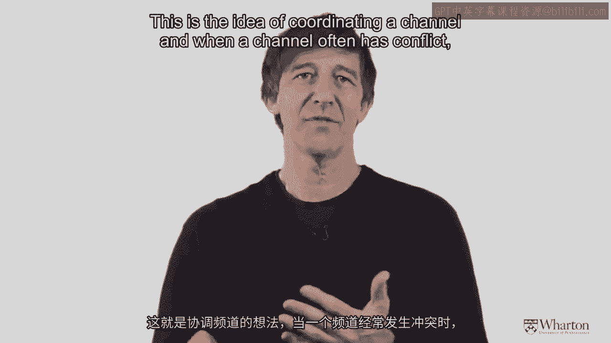

当然，必须记住，任何执行活动的参与者通常都需要以某种渠道利润的形式获得补偿，否则他们就会停止执行该活动。这为我们引出了下一个话题：在确定了渠道结构和设计之后，如何保持渠道的协调。

---

## 渠道协调与冲突管理 ⚖️

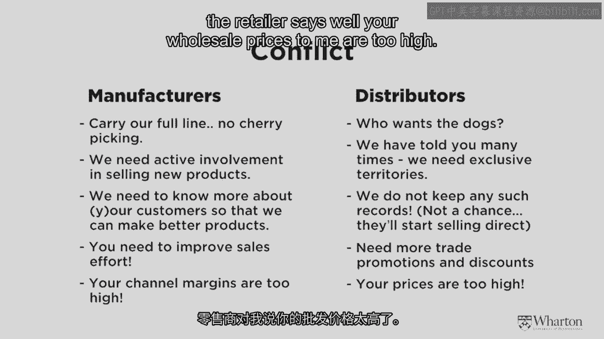

现在，我们来讨论客户接触和分销渠道的第三个部分：渠道协调。当渠道中经常出现冲突时，协调可能是一件棘手的事情。

让我们通过图表来说明分销渠道中可能发生的情况。制造商和零售商之间可能存在冲突：

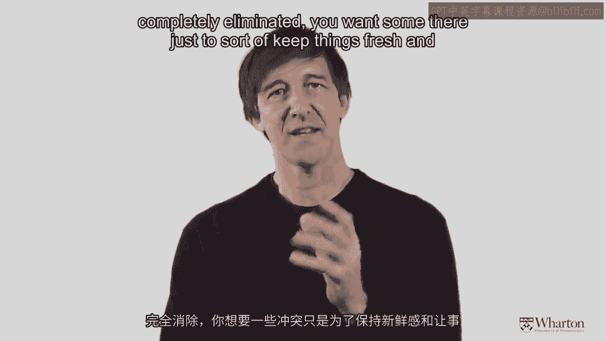

*   制造商可能说：“你为什么不接受我的全部产品线？”而零售商说：“我不想要所有滞销品，只想要最好的产品。”
*   制造商可能想要更多关于进店顾客的信息，而零售商可能不愿提供。
*   双方可能就利润率产生争执：制造商认为零售商利润太高，零售商则认为批发价太高。

分销渠道中通常存在独立的、有时利益对立的商业实体。我们需要找出解决这些冲突的方法。

首先，存在一定程度的冲突是好事，它能让大家保持警惕。你并不需要完全消除渠道中的所有冲突，适当的冲突可以保持事物的新鲜感和趣味性。

---

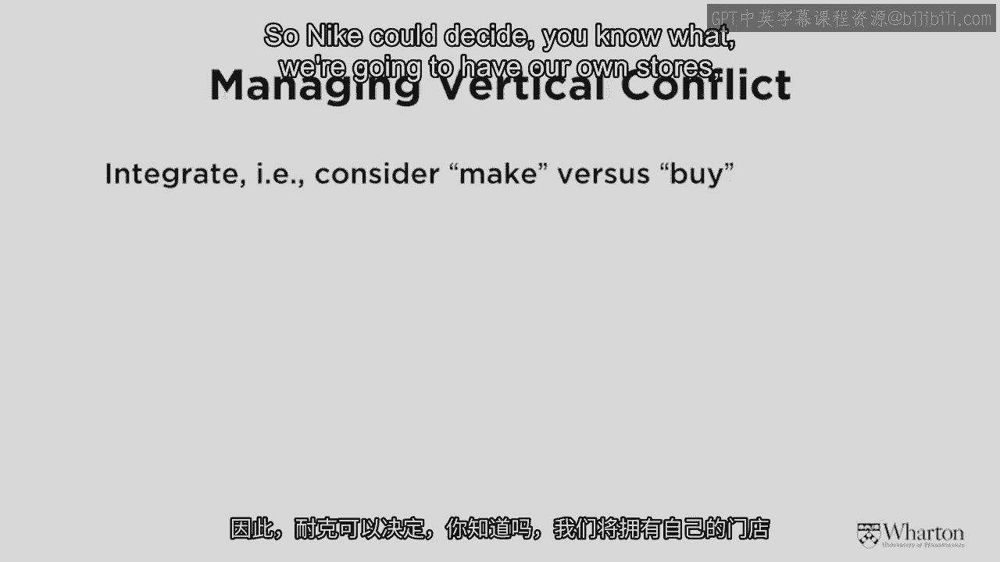

### 垂直冲突与水平冲突

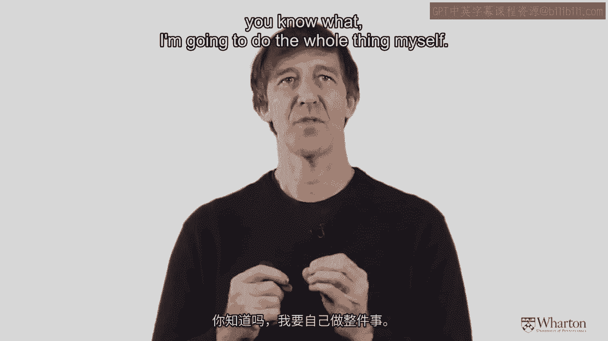

下图解释了分销渠道中发生的两种主要冲突类型及其解决方法。

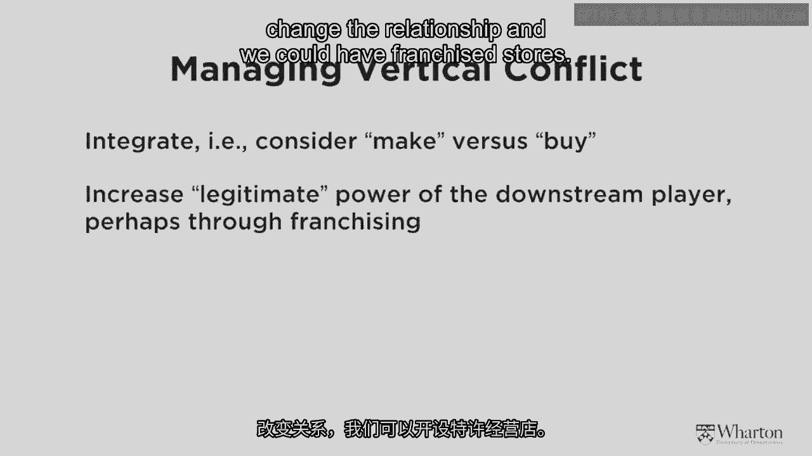

**垂直冲突**发生在渠道的不同层级之间，例如制造商与零售商之间。一个著名的案例是耐克与其主要分销商Foot Locker之间的冲突。Foot Locker不愿推广耐克的所有产品，而耐克希望获得更多支持。

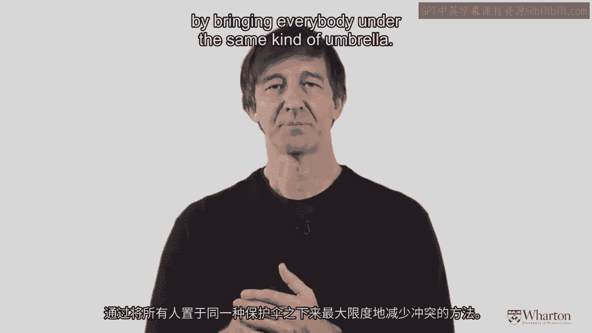

解决垂直冲突的方法包括：
*   **整合**：制造商可以开设自己的商店（如耐克的旗舰店）。
*   **改变关系**：采用特许经营模式（如埃克森美孚的加油站、麦当劳）。
*   **监控**：派遣神秘顾客了解下游情况并反馈。
*   **激励**：制造商只将热门产品提供给表现最好的零售商，采用“胡萝卜加大棒”策略。

**水平冲突**发生在渠道的同一层级之间，例如零售商A、B、C之间的冲突。这通常更为微妙。

水平冲突之所以发生，是因为除非零售商在服务水平和价格上完全相同，否则就可能出现“横向搭便车”行为，这实际上是你我作为消费者的行为。

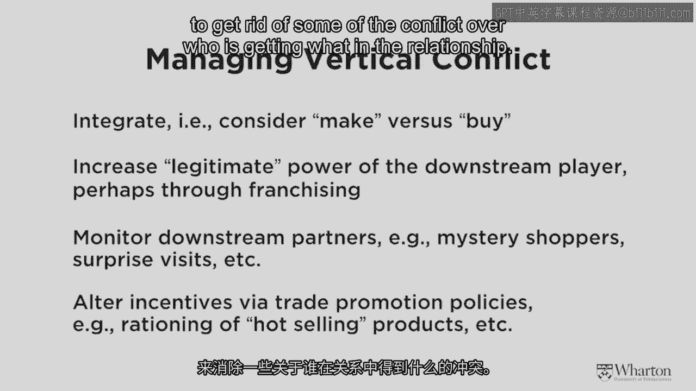

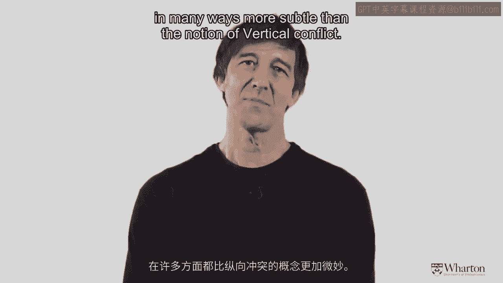

举例说明：假设社区里有克里斯的高价高服务店和艾米的低价折扣店。作为消费者，我可能会去克里斯的店花一小时向销售员咨询，了解最适合的电视和音响系统，然后却去街对面的艾米店以更低价格购买。我利用了克里斯提供的服务却没有补偿他，这被称为“横向搭便车”。其极端形式就是“展厅现象”——在实体店体验产品，然后去网上以更低价格购买。

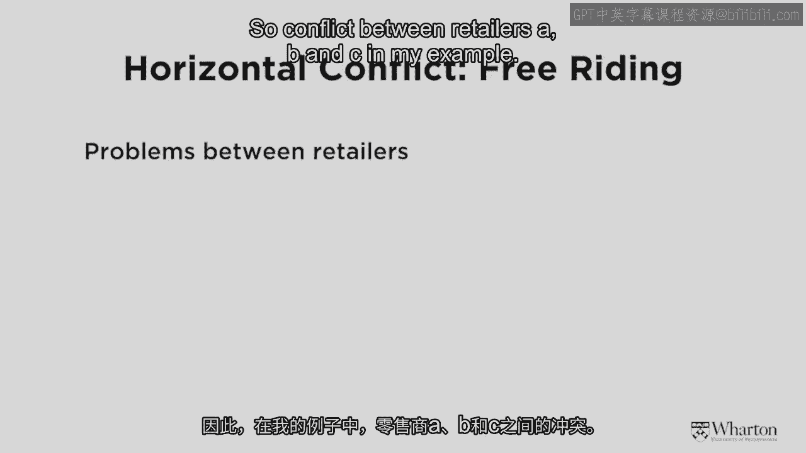

---

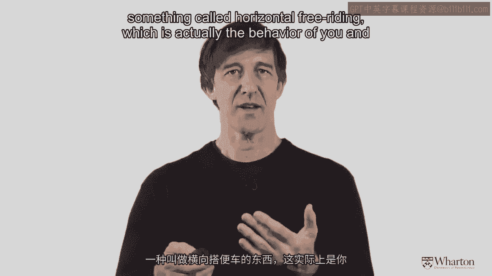

### 解决水平冲突

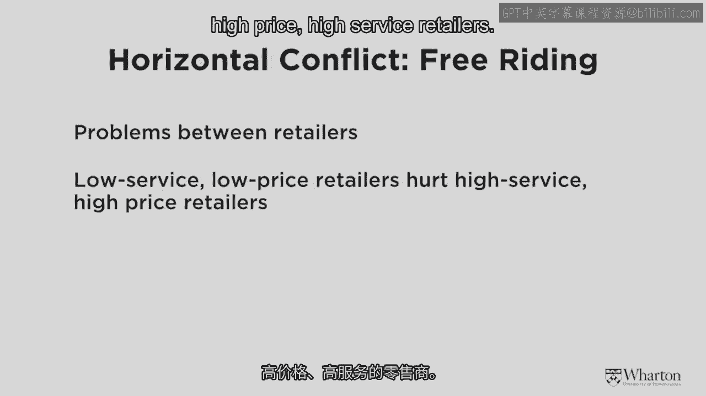

在讨论“展厅现象”之前，先看传统的横向搭便车。解决方法包括：
*   减少每个区域的零售商数量，将克里斯的店和艾米的店分开。
*   通过特许经营等方式使商店更加统一。
*   创建更偏向选择性或独家分销的体系，以最小化横向搭便车的机会。

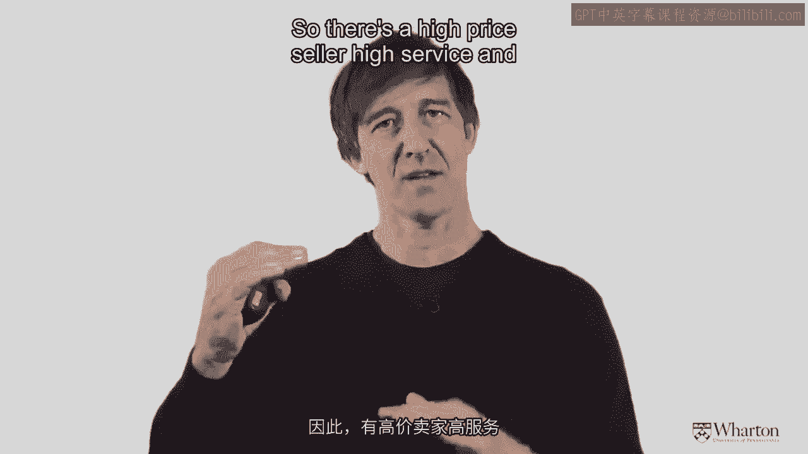

然而，当涉及互联网时，解决起来就更加困难了。

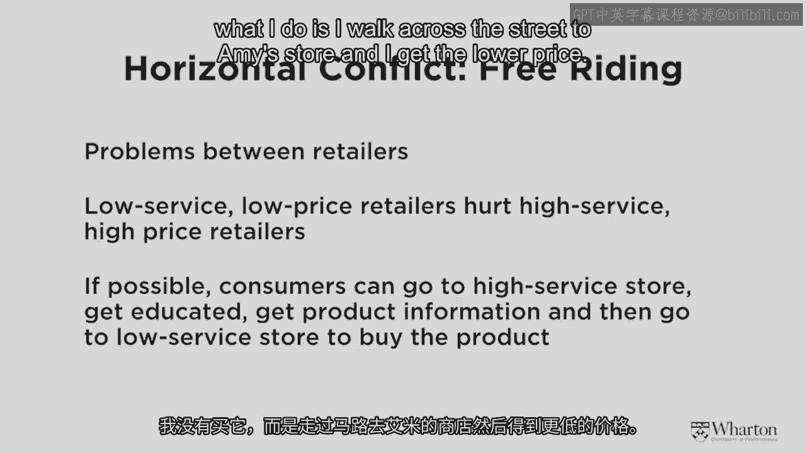

---

## 总结 📝

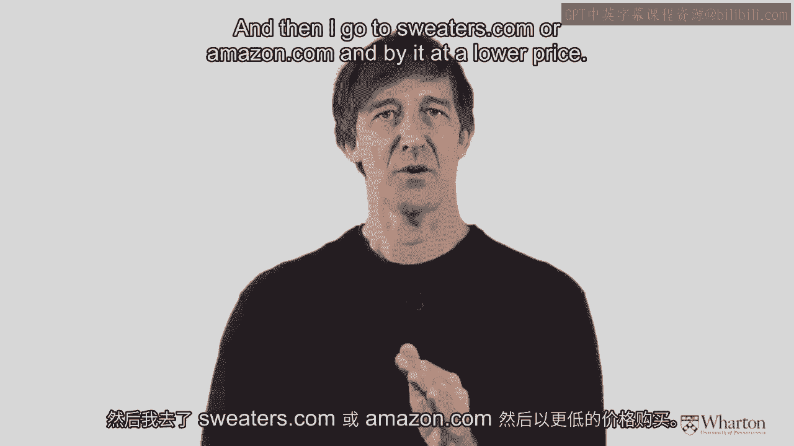

本节课中，我们一起学习了分销渠道设计的核心要素：

1.  **分销强度**：需根据产品特性和市场目标，在独家、选择性和密集分销之间做出决策。
2.  **生命周期影响**：渠道策略需随产品生命周期（引入、成长、成熟、衰退）动态调整，分销强度通常随产品成熟度增加。
3.  **活动与创新**：渠道中的必要活动不能被消除，但可以通过改变执行者（前移、后向整合、横向转移）来实现创新和效率提升。
4.  **渠道协调**：需要管理渠道中固有的**垂直冲突**（不同层级间）和**水平冲突**（同一层级间，如“横向搭便车”和“展厅现象”），并运用整合、特许经营、监控和激励等多种策略来化解冲突，保持渠道健康运行。

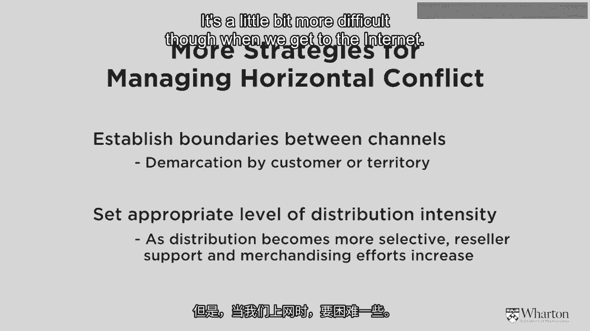

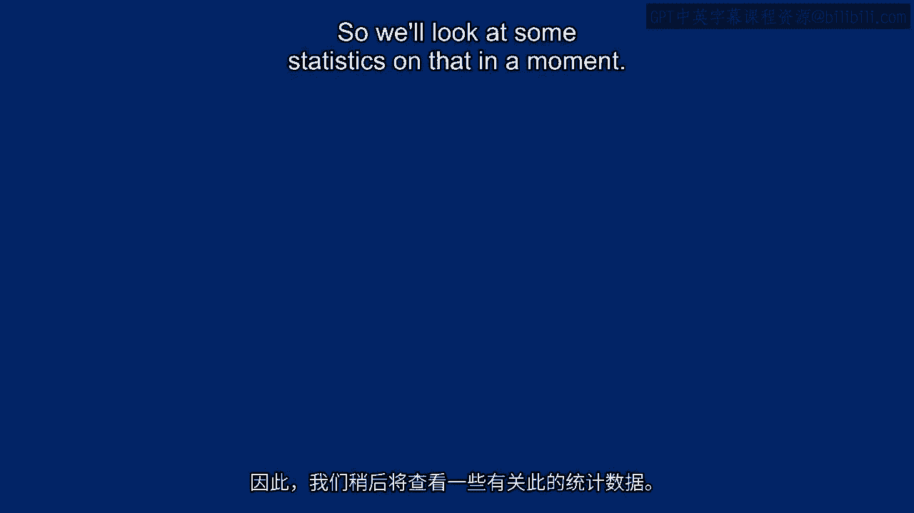

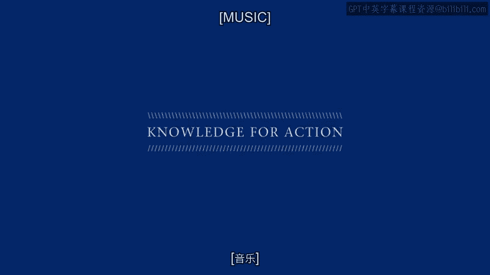

理解并有效管理这些方面，对于构建高效、稳定且能适应市场变化的分销网络至关重要。