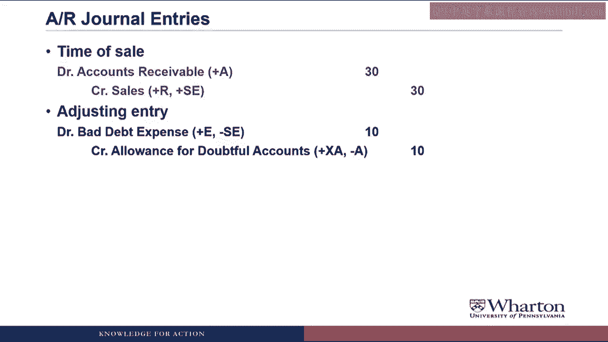

# 沃顿商学院《商务基础》｜Business Foundations Specialization｜（中英字幕） - P159：16_应收账款19 51.zh_en - GPT中英字幕课程资源 - BV1R34y1c74c

Hello， I'm Professor Brian Boucher。 Welcome to week four of our course， Sarah Course。

This week we're going to be taking a look at a count receivable and inventory in more， detail。

This video will start with a count receivable and look at that problem that we make sales。

to customers on account， but not all of them pay us。 What do we do to count for this？ Well。

let's get to it and see what happens。

We're going to start our look at accounts receivable with a review of the revenue recognition。

criteria。 So， if you remember back in week two， we talked about how revenues recognized when it's both。

earned， we provide the goods and services， and realized， which means we get paid in cash。

or something that can be converted to a known amount of cash， which would be accounts receivable。

So the accounts receivable， as we know by now， is created when the payment is due from。

customers after the revenue recognition。

One thing that came up at the time is that some of these customers are actually not going。

to pay us。 And so what we'll talk about now is how do we account for this？

Is that a rhetorical question？ Instead of worrying about how to account for this。

we should worry about not selling to， customers that don't pay us。 Of course。

companies are going to try to avoid selling to customers that aren't going to， pay them。

But if you're going to grow the business， you have to take some chances on your credit， sales。

And until somebody figures out a foolproof method to avoid selling to customers that won't。

pay you in the future， I'm going to keep teaching you how to account for the fact that some。

of those customers will default on their obligations to you。

So there are two methods that we can use to recognize or account for these uncollectable。

accounts。

We make an sale on accounts and we don't collect from customers。

First method is called the direct write-off method， which says that you just recognize。

and expanse when you realize that you can't collect from the customer。

This is what's used for tax reporting， but it's not allowed under GAP or financial reporting。

What？ How can the accounting for tax reporting be different from the accounting for financial。

reporting？ And like， what do you mean by financial reporting？ Hmm。

Somebody's going to have to go back and review those first week of videos。

So financial reporting is what we're doing here， putting together financial statements。

for external stakeholders， investors， analysts， creditors， and so forth。

The rules for tax reporting are generally different than the rules for your financial， statements。

We're going to talk later in the course about how to account for those differences， but。

this is going to be one of many situations where what we do on the financial statements。

is going to be different from what companies have to do in their tax returns。

So the method we're going to use for financial reporting， which is required under GAP， is。

called the allowance method。 The allowance method is going to force us to recognize bad debt expense for unestimated。

future uncollectible amounts from all the sales that we made during the period。 Before you go on。

may you please explain why we have to estimate future uncollectible accounts。

during the same period as the sales？ Best way to think about this is the matching principle。

So a cost of doing business is period， a cost of generating revenue of shipping goods to。

customers is that some of them are not going to pay us in the future。

So we want to estimate those expected losses now to match them to the revenue that we're。

booking this period。 So the bad debt expense is a cost of generating revenue this period。

Another way to think about this is when we look at revenue minus expenses， that profit。

should equal the cash that we're going to collect either now or in the future。

And by recognizing that bad debt expense， we reduce the revenue to the amount of cash that。

we eventually expect to collect from the customers on those sales。

In addition to recognizing an expense on the income statement， we're going to create。

an allowance for doubtful accounts to offset accounts receivable on the balance sheet。

Allowance for doubtful accounts is going to be a contra asset。

So it's going to work just like accumulated depreciation where we're going to use it to。

keep track of expected reductions in accounts receivable。

And I'm going to go through examples on this in a little bit。

But what that means is what you'll see on the balance sheet is net accounts receivable。

which is going to equal gross accounts receivable。

The amount of receivables you originally booked when you made the sales minus this allowance。

for doubtful accounts。 And this is completely analogous to net property plant equipment equals property plant equipment。

at its original cost minus accumulated depreciation。

Basically， accountants have like four or five tricks and we use them over and over and over。

again。 So contra asset is one of these tricks that we use over and over again。

So let's go through an example of how this works。 So BOC makes $10 in sales on account to each of three customers。

Jordan， Dakota and。

Peyton。

Not that it really matters for the example， but just so I can get a mental picture， are， Jordan。

Dakota and Peyton， guys or gals？ They can be whatever gender you want them to be。

One of the things that professors often do in coming up with example names is to try。

to find unisex names that could be either men or women。 In the old days we would have done Chris。

Pat and Tracy。 But nowadays if you go to a playground and you hear Jordan， Dakota or Peyton， you're。

just as likely to see a little boy or a little girl come running up。

Of course I do realize what I need to work on are internationally neutral names so that。

you're not necessarily picturing little Americans as you are with these names。

The way these transactions will look on our balance sheet equation is we'll have $30 of。

accounts receivable and $30 of sales revenue。

So we've got the asset and the stockholders' equity account。 But then we need a second ledger。

a subsidiary ledger called the accounts receivable ledger。

where we need to keep track of accounts receivable for each and every customer so that we can。

know what a customer owes us and then record it when they pay us back。

So what we actually see on the balance sheet is this total accounts receivable account。

But actually companies are keeping track of little accounts receivable accounts for every。

customer。 So we've got Jordan， Dakota and Peyton each have accounts receivable of $10 which add。

up to the $30 that you would see on the balance sheet。

Now we're not going to forget about journal entries as we go through this new material。

We're always going to go back to how things are going to be represented in journal entries。

and in T accounts。 So at the time of sale you would debit accounts receivable to increase the asset。

credit。

the sales revenue for $30 or if you did it for each individual customer it would be three。

entries with debits and credits of $10 each。

Then we're going to look at the accounts receivable related T accounts。

So we're going to track the actual accounts receivable account。

This contra asset allows for doubtful accounts because its contra asset notice the beginning。

balance is going to go on the credit side。

We'll have a T account for sales revenue and an account for bad debt expense。

Why is the allowance called doubtful accounts while the expense is called bad debts？

And like you called them in collectible amounts before。 Dude what is the correct jargon？

Yeah thank you for asking that。 I'm purposefully using three different names because this is an item where companies use。

a lot of different names to represent it。 You'll hear bad debts， doubtful accounts。

uncollectible accounts。 In fact you often never hear bad debt expense because that sounds really bad。

Instead it's called provision for doubtful accounts or provision for uncollectible accounts。

which sounds much more pleasant。 Although provision means the exact same thing as an expense。

And the way this first entry will affect our T accounts is the credit sales will increase。

accounts receivable and increase sales revenue on the debit side for accounts receivable。

on the credit side for sales revenue。

Moving on with the example at the end of the period it's time to put together financial。

statements and BOC has to estimate what amount of the sales made during the period will not。

be collected。 Their estimate is ten dollars。

Now later on we will talk about how you estimate this amount but for now let's just assume this。

is our best estimate。 So what's going to happen is we're going to make an adjusting entry where we create an。

allowance for doubtful accounts of ten and we recognize an expensive ten called bad debt。

expense。 So what this is going to do is it's going to reduce our accounts receivable on the balance。

sheet to twenty。

Net accounts receivable is going to be accounts receivable minus the allowance。

And what shows up in the income statement is thirty of revenue minus ten of bad debt expense。

So a net of twenty that we would net of twenty profit on this which is what we expect to。

actually collect from customers。 In terms of accounts receivable ledger we don't do anything because we don't know which。

of these three people is not going to pay us。

And this is the whole reason for creating the allowance account is if we were going to。

reduce accounts receivable directly we would also have to reduce one of the individual accounts。

to get it to balance in our accounts receivable ledger but we can't do that because we don't。

know which of the three are going to not pay us so we store the expected losses in this。

allowance account until we really find out who's the debt beat。

I mean who's the one that doesn't end up paying us。

So the journal entry is we debit bad debt expense so that expense is going the income。

statement of ten and we credit this contract asset allowance for doubtful accounts。

Credit increases the contract asset and it's going to reduce total assets when we put together。

the balance sheet。 Adjusting entries are the ones that the accountant does on New Year's Eve。

correct？ Why do we not simply do the bad debt entry each time we make a sale？

Now you do realize I was joking about accountants staying on New Year's Eve to do adjusting。

in journal entries。 They actually have two to four weeks after the end of the period to do their adjusting。

entries， I mean the accountants are probably the first ones out the door on New Year's， Eve day。

But anyway we do this as an adjusting entry because we only have to get this right when。

we put together financial statements。 So we go ahead and wait till the end of the period and then estimate either bad debt expense。

or the allowance based on sales or receivables for the period。

In the next video we're going to look at the different methods for estimating this and then。

you'll see why it makes sense to do this as an adjusting entry。

Anyway this will map into our T accounts by increasing the allowance for doubtful accounts。

So there's the credit entry for bad debt expense and then there's a debit entry to increase。

our bad debt expense。

Continuing on with the example in the next period BOC collects the cash from Jordan and。

Peyton。 So we end up increasing cash that each bonus 10 we increase cash by 20 and we reduce the。

accounts receivable。 In the AR ledger what we're going to do is get rid of Jordan's accounts so have a credit。

to 10 so now the balance is zero。 Get rid of Peyton's accounts so credit at 10 now it has a balance of zero and that adds。

up to the credit of 20 overall for our accounts receivable。

Obviously we don't do anything for Dakota because we're still waiting to collect from， Dakota。

Journal entry here is one you should be familiar with we collect cash， cash goes up through。

a debit and we credit accounts receivable we reduce the asset through a credit both for。

20。

And then in our T accounts the cash collections will show up on the credit to accounts receivable。

and I had to slip in in the bottom a cash T account to show the other side the debit， side。

I don't have this up here because eventually we're going to use these T accounts to solve。

for missing items and so we really need to focus on the core for as opposed to do the。

cash but I want you to see both the debit and the credit。

Anyway continuing on with the example after 90 days BOC gives up on collecting from Dakota。

and decides to write off the receivable。 So what's going to happen here is first of all we're writing off the accounts receivable。

we're saying Dakota is not going to pay us we reduce the accounts receivable with a credit。

or a negative so we reduce accounts receivable by 10 and we also get rid of the allowance。

for doubtful accounts。

It's no longer an allowance for doubtful accounts it is the doubtful account so we've been storing。

up this 10 waiting to see who didn't pay us now that we know it's Dakota we can get rid。

of this allowance we basically use it up。

Now that we know Dakota is not going to pay us why don't we have to erase the revenue。

from the sale to him or her。 That's a good question we don't erase the revenue at this point we essentially zeroed。

out that revenue when we recognized bad debt expense because the bad debt expense was reducing。

the revenue to get to a profit number which reflected what we actually expected to collect。

in other words anticipating the write off of the uncollectable which turned out to be， Dakota。

If we reduced revenue again when the write off happened we'd essentially be deducting。

from revenue twice。 So once we do the bad debt expense during the period of sale we're taking care of the。

future write offs you don't need to do anything else in terms of revenue or expense when the。

actual write off happens。

And then if we look at our accounts receivable ledger we're going to zero out Dakota's account。

not because Dakota paid us but because we've given up on Dakota paying us so we reduced。

the accounts receivable to Dakota from Dakota to zero we reduced total accounts receivable。

and now everything is zeroed out。

Final entry is we debit allowance for doubtful accounts by ten that reduces the contract。

asset and we credit accounts receivable for ten so here's we're actually writing off。

writing down the balance in accounts receivable。

In our tea accounts the write offs will be something that reduces accounts receivable through。

a credit and reduces the allowance for doubtful accounts through a debit。

So if we look at our final totals we got twenty dollars of cash and twenty dollars of pre-tax。

income。 The accounts receivable we created thirty but then we either collect a cash or wrote。

them off。 We created the allowance for doubtful accounts but then when we found out who didn't pay。

us we zeroed that out we have twenty or thirty of revenue ten of expenses for twenty。

of pre-tax income so in the end the amount of pre-tax income we get matches the cash。

we actually collect。 In our accounts receivable ledger everything is zeroed out at this point either people。

have paid us cash or we've written off the account。

And so if this is all that happens you could go ahead and put an ending balance for accounts。

receivable ending balance for a allowance for doubtful accounts。

One more thing that would come in with a sales account is that there's cash sales in addition。

to credit sales。

Once you have those in there we have the income statement amount and then the bad debt。

and that expenses the only thing that's going to hit this accounts and that will show up。

on the income statement。 What shall we do if Dakota pays us now？

Do we refuse to accept her or his payment because we have written off the receivable？

No I would actually take the cash from Dakota if she's going to pay us even though it makes。

the accounting a little trickier。 So let's look at what you would do if you recover an account that you would originally。

written off。 So let's take a look at what happens if Dakota later pays us。

So after the write off Dakota wins the lottery and one of the first things that she or he。

does is decide to pay us the ten dollars that he or she owes us。

So this would be an unexpected recovery what we're going to do is first increase accounts。

receivable so basically restore Dakota's accounts receivable credit allowance for doubtful。

accounts basically restore the allowance because we set that aside thinking somebody wouldn't。

pay us。 Initially we thought it was Dakota。 Turns out not to be Dakota so we need to put the allowance back for someone else that might。

not pay us。

Wait this journal entry has created a balance in the allowance account but like we do not。

have any more receivables outstanding。 Yeah the problem with this example is we only made three sales and we were done。

In practice we would be making new sales all the time new credit sales we would need new。

allowance for those credit sales and by putting this allowance back we're just saying we initially。

thought it was Dakota but she paid us back。 There's someone else that we've made it sale to subsequently that's not going to pay us。

and this allowance will help offset that。 Anyway once we've restored the accounts receivable then we credit it to eliminate it and we collect。

the cash debit the cash。 So we essentially have to recreate the accounts receivable so that we can collect on it and。

then recreate the allowance so that it can be used to another customer that ends up not。

paying us。

So we've got one more element really in our T accounts which is we may have recoveries。

Recoveries would increase accounts receivable and increase the allowance for doubtful accounts。

and then of course we would record the cash collection in this case where that would reduce。

accounts receivable and increase our cash。 So hopefully that this example gives you a sense for how all these different activities。

related to estimating and recognizing bad debts flow through the journal entries and。

T accounts and the thing we won't need to work on next is estimating the dollar amount。

for the uncollectible accounts。

I keep ending my voice over PowerPoint narration saying the exact thing that I intend to say。

in the wrap up video。 I need to stop that。 So at the risk of repeating myself what we will do next video is see how we estimate this。

number for bad debt expense each period。 I'll see you then。 See you next video。 Bye。 。 [ Silence ]。
