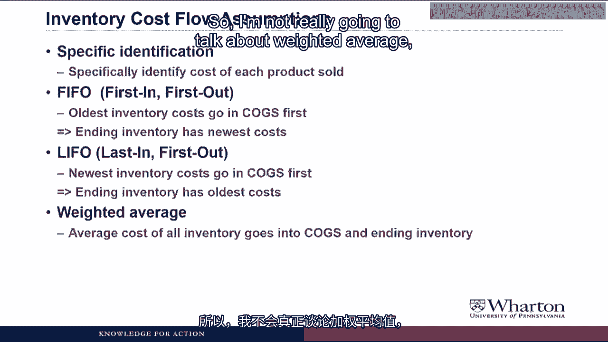
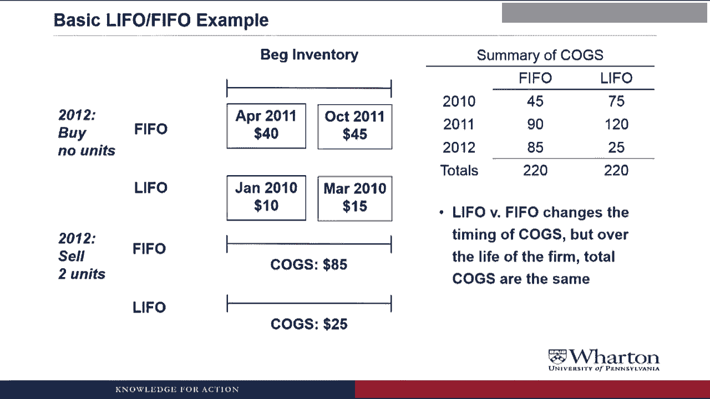

# 沃顿商学院《商务基础》课程笔记 P163：后进先出法（LIFO）与先进先出法（FIFO）📊

## 概述
在本节课中，我们将深入学习存货成本流转假设，重点对比**后进先出法（LIFO）**和**先进先出法（FIFO）**。这两种方法对公司的销售成本、期末存货价值以及利润有重大影响。我们将通过一个简单的例子来理解其运作原理和实际应用。

---

## 核心假设：成本流转与实物流转分离
在深入探讨具体方法之前，我们必须明确一个关键假设：**存货的成本流转不必与其实物（物理）流转保持一致**。

*   **实物流转**：指商品实际的移动。例如，一家香蕉店总是会先卖掉最旧的香蕉，将最新的香蕉留在库存里。
*   **成本流转**：指存货成本在会计账户（如销售成本和存货账户）中的分配方式。期末存货的成本可以是：
    *   所持有每件商品的实际成本（个别计价法）。
    *   最近购入商品的成本。
    *   最早购入商品的成本。
    *   一段时期内的平均成本。

理解这个分离假设至关重要，否则你会对后续内容感到困惑。一家公司完全可以在实物上先卖旧货，但在会计上选择将新货的成本先计入费用。

---

## 主要的存货成本流转方法
以下是公司处理存货成本流转的几种主要方法。

### 1. 个别计价法
这种方法要求**精确识别**每一件已售出产品和每一件库存产品的具体成本。在当今计算机技术下，理论上可以对每件商品进行追踪。

然而，对于生产牙膏、沙拉酱或汽油等难以区分单件产品的公司，使用个别计价法是不现实的。即使技术允许，追踪数百万件商品的个别成本也会消耗巨大的数据处理能力。因此，公司通常采用成本流转假设来简化核算。

### 2. 先进先出法（FIFO）
**FIFO** 代表 **First In, First Out**（先进先出）。

*   **核心规则**：**最早进入存货的成本最先转入销售成本**。
*   **结果**：因此，期末存货反映的是**最新购入存货的成本**。

### 3. 后进先出法（LIFO）
**LIFO** 代表 **Last In, First Out**（后进先出）。

*   **核心规则**：**最新进入存货的成本最先转入销售成本**。
*   **结果**：因此，期末存货反映的是**最早购入存货的成本**，这些成本可能发生在很久以前。

### 4. 加权平均法
这种方法使用存货的**平均成本**来计入销售成本和期末存货。在实践中，加权平均法的结果通常与FIFO相似。本节课我们将主要聚焦于LIFO和FIFO的对比。

---

## LIFO 与 FIFO 的直观对比
为了更形象地理解，我们可以用一个“报纸堆”的例子来比喻。

假设每一份报纸代表一张为取得存货而支付材料、人工、制造费用等的**发票（成本）**。

*   **LIFO（后进先出）**：想象你从一堆报纸的**顶部**取走报纸（发票）来阅读（计入销售成本）。这样，留在底部（存货中）的就是**最旧**的报纸（发票/成本）。
*   **FIFO（先进先出）**：想象你从一堆报纸的**底部**取走报纸（发票）来阅读（计入销售成本）。这样，留在顶部（存货中）的就是**最新**的报纸（发票/成本）。

请再次记住，我们讨论的是**成本**的流转，而非实物的流转。

---

## 数字示例：LIFO vs. FIFO 的影响
让我们通过一个具体例子，看看LIFO和FIFO如何影响销售成本和期末存货。假设我们是一家零售商，在2010年价格持续上涨的环境中运营。

以下是2010年的采购记录：
*   1月：购入1单位，成本 $10
*   3月：购入1单位，成本 $15
*   6月：购入1单位，成本 $20
*   9月：购入1单位，成本 $25
*   12月：购入1单位，成本 $30

假设我们在2010年**售出了3个单位**。

### 采用 FIFO 计算：
根据“先进先出”原则，最先购入的成本最先转出。

*   **销售成本** = 最先购入的3个单位成本 = $10 + $15 + $20 = **$45**
*   **期末存货** = 剩余的两个单位（最新购入的） = $25 + $30 = **$55**

### 采用 LIFO 计算：
根据“后进先出”原则，最后购入的成本最先转出。

*   **销售成本** = 最后购入的3个单位成本 = $30 + $25 + $20 = **$75**
*   **期末存货** = 剩余的两个单位（最早购入的） = $10 + $15 = **$25**

### 对比结果：
*   销售成本差异：LIFO ($75) - FIFO ($45) = **$30**
*   期末存货差异：FIFO ($55) - LIFO ($25) = **$30**

这个简单的会计选择对报告的利润产生了巨大影响。销售成本并非一个绝对“真实”的数字，而是成本流转假设的产物。公司选择不同的假设，就会得到不同的数字。

---

## 连续年度的对比与 LIFO 清算
上一节我们看到了单一年度的差异。现在，让我们将例子延续到后续年度，观察更长期的影响。

假设进入2011年时，我们拥有不同的期初存货（取决于2010年使用的是FIFO还是LIFO）。2011年，我们继续采购（价格仍在上涨）并销售。

计算过程类似，但关键点出现在**2012年**。假设2012年我们没有新采购，只是清仓出售所有剩余存货。

*   在**FIFO**下，销售成本会较高（因为清仓时转出的是较新的成本）。
*   在**LIFO**下，销售成本会非常低（因为清仓时“触及”了多年前的旧成本层）。

这种在LIFO下，因销售量大于生产量而“触及”旧成本层的情况，被称为 **LIFO清算**。它会导致当期销售成本骤降，税前利润骤增，必须在财务报表中披露。

如果我们汇总三年间的总销售成本，会发现一个有趣的现象：**无论采用LIFO还是FIFO，公司整个存续期间的总销售成本是相同的**。这两种方法改变的是成本在**不同会计期间的确认时间**。

---

## 公司为何选择 LIFO 或 FIFO？
既然总成本相同，公司为何要在意选择哪种方法呢？关键在于**时间价值**和**税收**。

在通货膨胀（存货成本上升）的经济环境中：
*   **LIFO** 导致**更高的销售成本**和**更低的期末存货**（相比FIFO）。
*   **FIFO** 导致**更低的销售成本**和**更高的期末存货**（相比LIFO）。

### LIFO 的税收优势（仅限美国）：
在美国，税法允许使用LIFO。更高的销售成本意味着更低的应税利润，从而可以**延迟支付税款**。虽然未来（例如发生LIFO清算时）可能需要补缴税款，但“今天节省的1美元比未来节省的1美元更值钱”。公司可以利用早期节省的税款进行投资获利。

**重要规则**：美国的**税收一致性规则**规定，如果公司在税务申报中使用LIFO，那么在对外财务报告中也必须使用LIFO。

### 国际差异：
然而，**国际财务报告准则（IFRS）禁止使用LIFO**。因此，美国是唯一仍广泛允许使用LIFO的主要经济体。尽管如此，了解LIFO仍然重要，因为当你比较美国公司（可能用LIFO）与非美国公司（用FIFO）时，需要进行调整才能进行合理的对比。

---

## 总结
本节课我们一起深入学习了存货成本流转假设。

*   我们明确了**成本流转与实物流转可以分离**这一核心前提。
*   我们重点对比了**后进先出法（LIFO）** 和**先进先出法（FIFO）** 的核心规则与财务影响：在通胀环境下，LIFO产生更高的销售成本和更低的期末存货价值；FIFO则相反。
*   我们通过示例看到，这两种方法**不影响公司生命周期的总成本，但影响成本在各年度的分布**，从而影响各期报告的利润。
*   我们探讨了公司选择LIFO的主要动机——利用其**延迟纳税**的效应，并指出了其应用受限于美国会计准则，且不被IFRS允许。

在下一节课中，我们将学习如何对使用不同存货计价方法的公司进行比较，特别是如何利用财务报表附注信息，对使用LIFO的公司数据进行调整，以便与使用FIFO的公司进行对比。