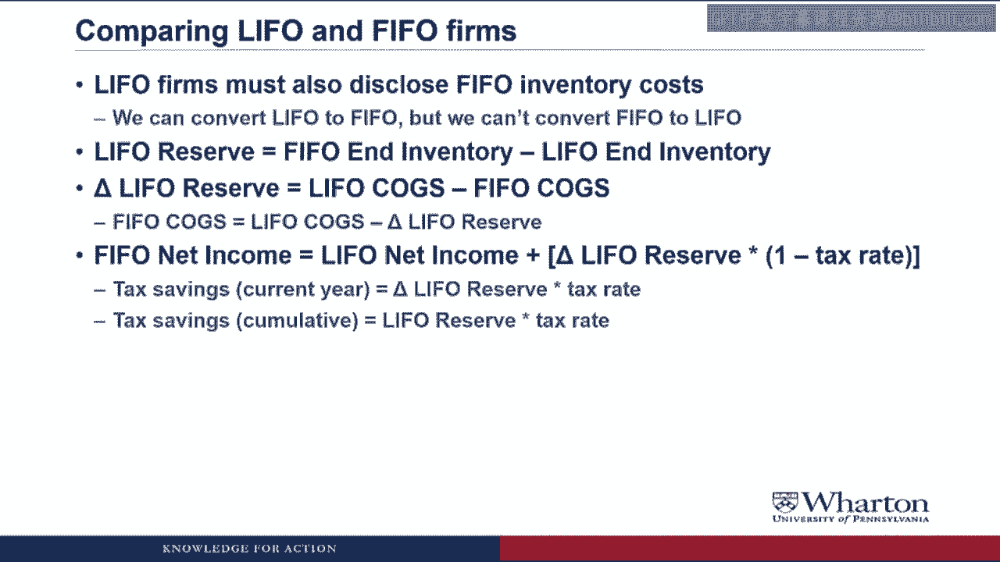
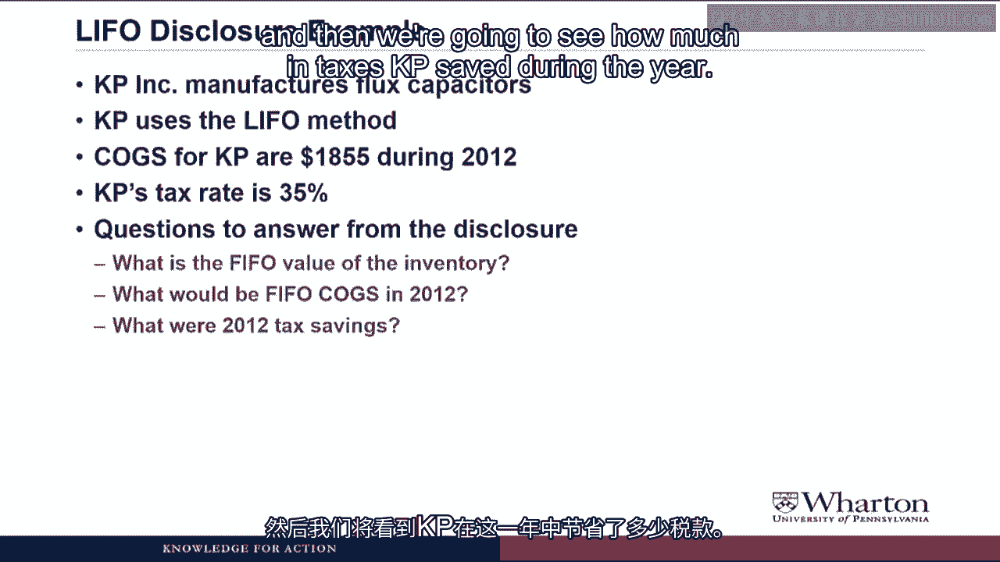
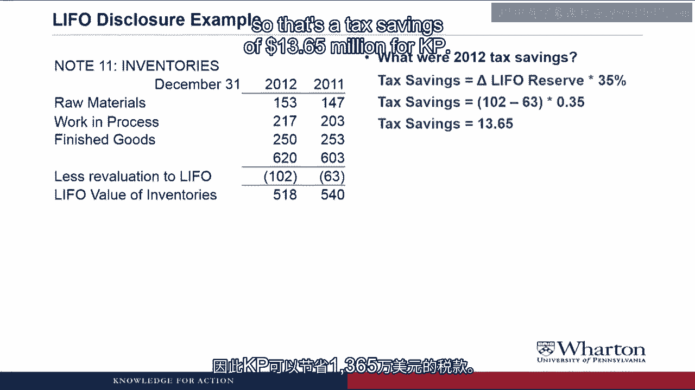

# 沃顿商学院《商务基础》｜Business Foundations Specialization｜（中英字幕） - P164：21_存货披露示例11 14.zh_en - GPT中英字幕课程资源 - BV1R34y1c74c

Hello and Professor Brian Boucher and welcome back。

In this video we're going to take a look at a disclosure of a company that uses LIFO。

One of the things that you may have to do at some point is compare a firm that uses。

LIFO to a firm that uses FIFO。 If you do that you need to convert the LIFO firm to a FIFO basis to make any kind of reasonable。

comparison between the two because the ending inventory and the cogs are so different between。

the two methods that you really can't compare them without adjusting the LIFO firm to the。

FIFO basis。 So let's see how that happens。 Let's get started。

To facilitate the comparison of LIFO and FIFO firms， LIFO firms have to disclose what their。

inventory costs would be under FIFO。 Another way we can convert all of the results for the LIFO firm to a FIFO basis。

And that's the only direction we can go。 There's no way that we can convert a FIFO firm to LIFO。

If you think about it it would be a pretty daunting task because a company that's always。

done first and first out would have to go back and look at its entire history of inventory。

purchases to redo it under last in first out。 But if you're doing it last in first out it's fairly easy to transfer those results to。

first in first out。 So what we're going to get into this disclosure is something called the LIFO reserve。

The LIFO reserve is the difference between what the ending inventory would be under FIFO。

first in first out and what the inventory is under LIFO which is what they disclose on。

the balance sheet。 To adjust the income statement we can use the fact that the change in the LIFO reserve。

is equal to LIFO COGS minus FIFO COGS。 So what we're trying to figure out for the LIFO firm is what its COGS would be under。

FIFO。 So that means that FIFO COGS would equal LIFO COGS which is what was disclosed in the income。

statement minus this change in LIFO reserve。 And then translating that to net income the FIFO net income is going to be LIFO net income。

plus the change in LIFO reserve times one minus the tax rate。

We have to multiply the change in LIFO reserve times one minus the tax rate to get an after。

tax version because with net income we're looking at an after tax number。

And notice that when we're dealing with COGS we subtract the LIFO reserve but with net。

income we add it because COGS is an expense whereas net income is revenue minus expenses。

And the last things I have up here are tax savings during the current year are the change。

in the LIFO reserve times the tax rate and the tax savings cumatively over the whole。

LIFO firm would be whatever the balance in the LIFO reserve is times the tax rate。

Sorry， I zoned out for a second。 What is that triangle thing and when would we ever have to do this again？

Yeah， I think I zoned out myself while reading the words on that slide。

Page of formulas is not fun and I think if I had spent even more time trying to explain。

the intuition it would have made it even less fun。

So to answer your question the triangle is the Greek letter delta which means change。

You will have to use formulas like this if you're ever looking at a LIFO company and。

want to compare it to a company that uses FIFO。 Basically the inventory method has such a distorting effect on ending inventory and cost of goods。

sold that the only way you could get a reasonable comparison of those firms would be to convert。

the LIFO firm to FIFO which we're going to do right now in an example。

So let's take a look at an example of a LIFO disclosure。

So we're going to look at KP incorporated which manufactures flux capacitors and if you don't。

know what those are you can just pause right now and search on Wikipedia。

KP uses the LIFO method so if we want to compare KP's results to compare their financial。

statements to firms that use the FIFO method we have to switch KP from LIFO to FIFO。

Cost of goods sold for KP were 18-55 during 2012。 Companies tax rate is 35%。

Questions that we're going to try to answer from the disclosure are what is the FIFO value。

to the inventory that allows to compare balance sheet of KP to a balance sheet of a company。

that uses FIFO。 What would be the FIFO COGS in 2012？

So if we want to compare the income statement between KP and a FIFO firm putting KP on a。

FIFO basis will facilitate the comparison and then we're going to see how much in taxes。

KP saved during the year。 So here is the disclosure in the footnotes。

The thing I want to point out before we get into the LIFO stuff is this is what the disclosure。

looks like for the breakdown of raw materials， work and process and finish goods。

So if you remember a couple of videos ago we talked about how manufacturing firms have。

these three buckets of inventory。 Looks like in KP situation their raw materials and work and process are both up。

Their finished goods are down slightly which probably means they're ramping up production。

work and processes up。 They ordered more raw materials so maybe they're anticipating even more sales or more production。

and their finished goods are down which probably means they're having no trouble selling their。

inventory。 So those all indicate that the company is growing well。

Now let's take a look at the LIFO disclosure。 So we want to figure out what the LIFO value of the inventory is。

The formula is that the FIFO inventory is going to be the LIFO inventory plus the LIFO， reserve。

So we see the LIFO value of the inventory at the bottom line 518 and 540。

Less revaluation to LIFO that's the terminology for LIFO reserve。

So in 2012 we take 518 plus 102 to get to 620 and for 2011 we take 540 plus 63 to get， to 603。

Now the LIFO reserve is in brackets and that is representing that it's a credit balance。

and we're not going to get into the journal entries so don't worry about it but it's negative。

because it's reducing 620 minus the LIFO reserve to 518。

But when we look at these equations we just treat the LIFO reserve as a positive number。

So we take 518 plus 102 to get to 620 and as you notice the 620 and the 603 the 518。

FIFO value of the inventory is actually disclosed by KP even though they don't label it as the。

FIFO value。 Now let's look at what FIFO COGS would have been in 2012。

So here the formula is FIFO COGS is LIFO COGS minus the change in the LIFO reserve。

So FIFO COGS is 1855 which is what we saw before it was something that was given with， the problem。

You could also find this from the income statement。 The change in the LIFO reserve is 102 minus 63。

So again we're ignoring the brackets we're just taking 102 minus 63 and we subtract that。

from 1855 to get FIFO COGS of 1816。 So the FIFO COGS are 39 less than the LIFO COGS。

Shall I infer from this example that COGS and the LIFO is always greater than COGS and， to FIFO？ No。

please don't infer that from this example。 The only reason that LIFO COGS are greater than FIFO COGS is that prices have been rising。

If prices of inventory have been dropping then LIFO COGS would be less than FIFO COGS。

So think of it this way， LIFO is last in first out so LIFO is very sensitive to the direction。

of price movement。 If prices are going up LIFO COGS will be higher。

if prices are going down LIFO COGS will be， lower。

Now the last question we want to answer is how much did KP save in taxes in 2012 by using， LIFO？

Now the formula before is that the tax savings are equal to the change in LIFO reserve times， 35%。

Change in LIFO reserve is again 102 minus 63。 That's the 39 that was the difference in COGS that we saw before。

So LIFO gave you higher COGS by 39。 If we take 35% of that that's the tax savings based on that higher expense。

And those tax savings come out to be 13。65。 Now it doesn't indicate here but these numbers are in millions。

So that's a tax savings of $13，650，000 for KP。

Those are some nice tax savings。 Why does the US government allow companies to use LIFO？

It is like letting them cheat on taxes。 Yes， those are some really nice tax savings。

So why does the US government allow it？ Well it's probably because the companies that get those tax savings take some of those。

tax savings and donate them to senators and congressmen that in turn vote to keep LIFO。

on the books。

Sorry that was probably a bit too conspiratorial so just ignore that prior comment。

But there is right now an active discussion about whether companies should get this tax， break。

In fact in the most recent budget proposed by the administration in the US there is a proposal。

to eliminate LIFO as a way to raise additional taxes。

Now there is heavy lobbying against that and the government here has seemed unable to pass。

a budget for years。 We are sort of living off these continuing resolutions。

But it is at least up for debate and it may be that at some point the US government also。

gets rid of LIFO as a way to close this loophole and sort of take away this advantage of companies。

to earn significant tax savings。 So now that I have just mentioned that the US government may get rid of LIFO as well I。

should probably cut my losses and stop talking about it given that it may go away within。

the next year or so。 But anyway that wraps up our look at inventory。

All we have left for the week is our look at the 3M Company， 3M Company Finance statements。

where we will take a look at their accounts， stable and inventory。 I will see you then。

See you next video。 Bye。
