# 沃顿商学院《商务基础》｜Business Foundations Specialization｜（中英字幕） - P165：22_3M公司的应收账款和存货17 50.zh_en - GPT中英字幕课程资源 - BV1R34y1c74c

Hello， I'm Professor Brian Boucher。 Welcome back。 In this video。

we're going to take a look at the accounts receivable and inventory， disclosures for the 3M Company。

But then， since those disclosures are not going to be that exciting， we're also going。

to bring in a couple guest star companies。 We're going to bring in Best Buy。

another Minnesota Company， to take a look at their， disclosure for the Allowance for Bad Dats。

And Honeywell， which used to be a Minnesota Company， now it's based in New Jersey， will。

bring in their financial statements to take a look at their inventory disclosure。 Let's get started。

Let's start with the balance sheet， which is on page 48 of the 3M report。

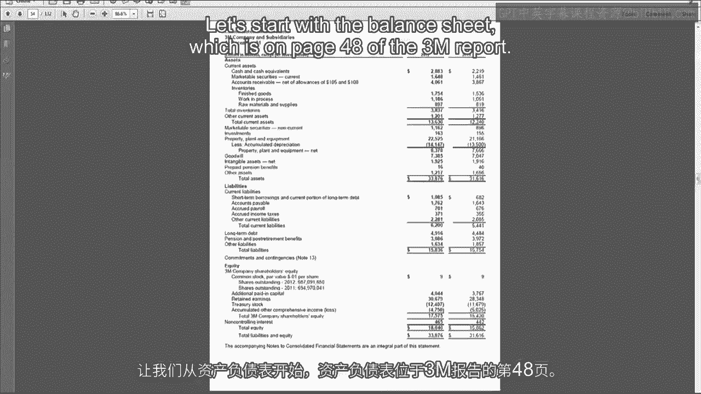

Here they report their accounts receivable， 4061 and 3867。

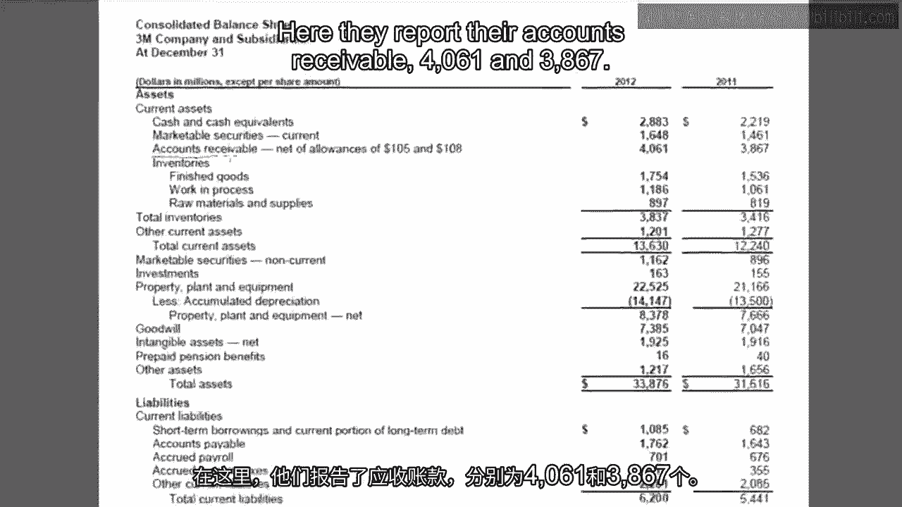

Those are net of allowances， and they give you the allowances right here， 105 and 108。

So one of the things that we calculated in the videos was what percent of the gross accounts。

receivable does the company not expect to collect？

So what's the percentage estimated on collectibles？ And has that gone up or down over time？

So we can do that for 3M。 In 2012 we would take 105 divided by not 4061， but 4061 plus 105。

which is 4166。 We want 4166 because that's the gross accounts receivable。 So 105 divided by 4166。

We could probably all deal in our head。 That's 2。5%。 We could do the same thing for 2011。

We would take 108 as the allowance， divided by 108 plus 3867， which is 3975。

So 108 divided by 3975 is 2。7%。 So 3M's expected on collectibles has gone down slightly from 2。

7% to 2。5%， which is not， surprising because just by looking at the numbers here we can see 108 was a bigger allowance。

but it was on a smaller net balance。 So even though the allowance has gone down at the same time that receivables have gone。

up。 Now we're going to look for more accounts receivable information in a second， but since we're。

here， why don't we go ahead and take a look at inventories。 So on 3M's balance sheet。

they give you the breakdown into finished goods， work in process， raw materials and supplies。

And what we see is each category is growing， consistent with a growing company， so they're。

bringing in more raw materials towards the end of the year than they had at the beginning。

of the year。 They're building up their work in process over the year and they're building up their。

finished goods inventory， presumably in anticipation of future demand。

but we can actually see whether。

that's the case。 So that's what we can see about accounts receivable and inventory on the balance sheet。

Okay， we'll make a quick stop on the cash list statement。

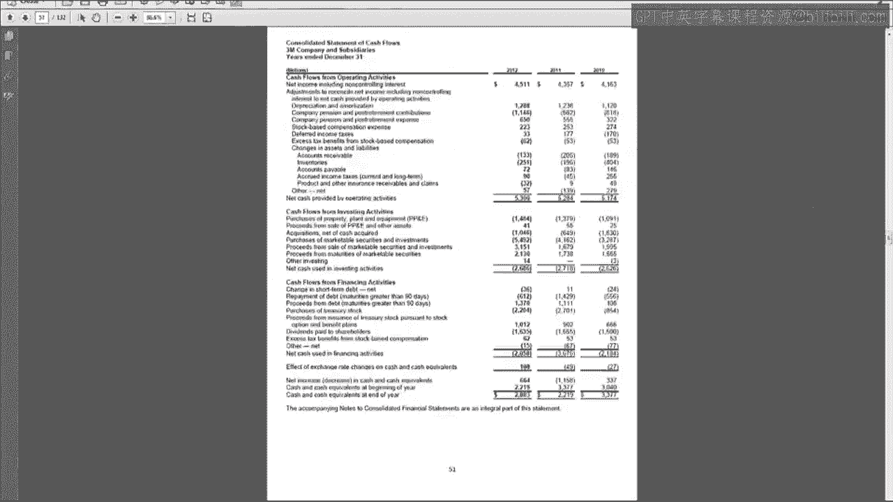

So here we have the change in accounts receivable。 So accounts receivable have gone up。

so that's a negative number on the cash list statement。 But as if you remember。

when we look through the cash list statement， we didn't see any。

provision for doubtful accounts or bad debt expense。

So 3M is using the alternative where this accounts receivable is the change in the net。

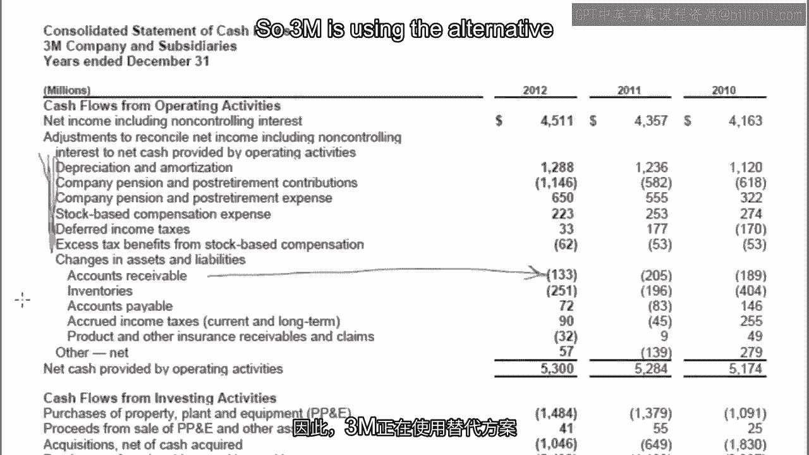

number。 So instead of breaking up bad debt separately and then showing the change in the gross。

they just show the change in the net。 And as we've talked about before。

this change of 133 is not going to match the change that。

we saw on the balance sheet because some of this accounts receivable could have come。

in an acquisition or there could be foreign currency involved。

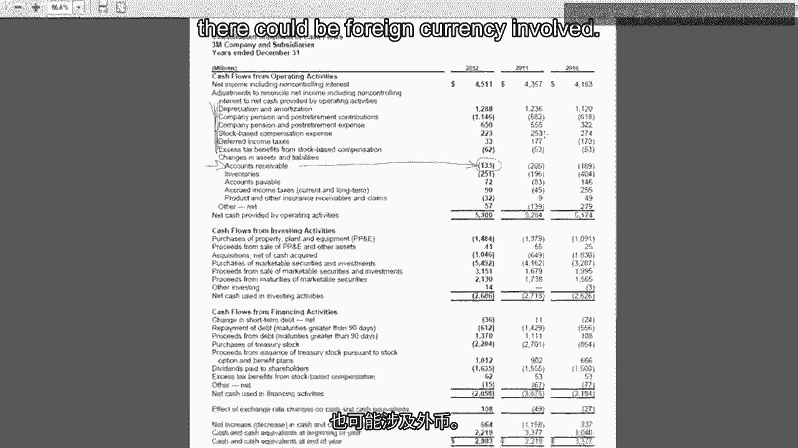

The next part of the financial statements you always want to check out is note one， significant。

accounting policies to see how they do the accounting for accounts receivable and inventory。

If we go to page 53， you'll see a note for inventories。

And 3M says inventories are stated at lower cost or market， which is not a surprise because。

that's the rule。 You always have to carry it at lower cost or market。

And they say cost determined on a first in， first out basis。

So 3M uses FIFO for all of their inventories。 So we're not going to get any of those interesting LIFO disclosures in 3M。

And it also， for this reason， 3M doesn't have a separate inventory footnote because they've。

shown you the breakdown of raw material work and process， finished goods on the balance， sheet。

They're using FIFO so there's no kind of LIFO related disclosures。

So they actually don't have a special footnote for inventories。

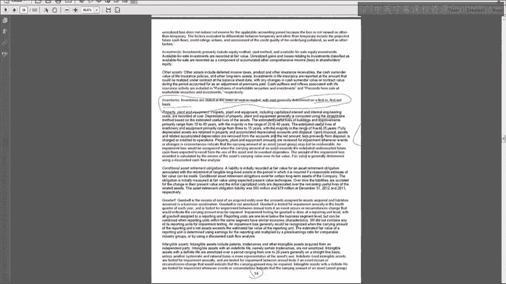

And if we jump ahead to page 55， there's a section for accounts receivable and allowances。

So trade accounts receivable are recorded in voiced amount， but do not bear interest。 That's common。

Maintaining allowance for bad debts， cash discounts， product returns and other items。

So we talked about the bad debts。 We didn't talk about product returns。

If you allow customers to return some of their goods for a full refund， you have to make。

an allowance for that at the time of sale。 The accounting works exactly the same as the allowance for bad debts。

where you would basically， create the contract asset account to keep track of expected product returns。

And then when their returns come in， you would get rid of the accounts or see when。

you get rid of that allowance。 So there's really nothing new to look at there。

It's just changing bad debts to product returns in the product stuff that we've done。

So for allows for doubtful accounts， they say it's based on their best estimate of probable。

credit losses。 They do it based on historical write-off experience by industry and regional economic data。

And they use historical sales returns for the product returns。 Nothing that new or interesting here。

Last place that 3M talks about accounts receivable in inventory is on page 35， which is part of。

the MD&A。 There's a little bit of a mention of working capital in inventory as they talk about their。

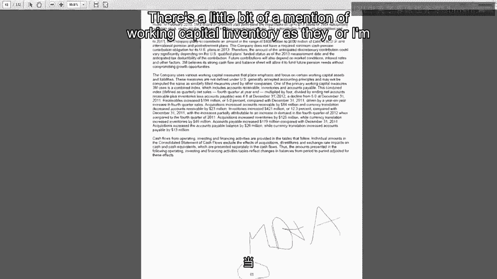

working capital。 They say receivables increased 5% compared to the prior year。

driven by an increase in， fourth quarter sales， so its growth。

They also had some acquisitions that brought in accounts receivable and some foreign currency。

adjustments。 Inventory increased by 12% with increases partially attributable to an increase in demand in the。

fourth quarter of 2012。 I guess they must be building more inventory in response to the demand。

There were also some acquisitions that added to the inventory and currency translation effects。

So the currency translation effects and the acquisitions are why we don't see the balance。

sheet change match the change on the cash flow statement。

And that's all I could find about bad debt and inventory in the 3M report， which means。

there was something very interesting that they left out。

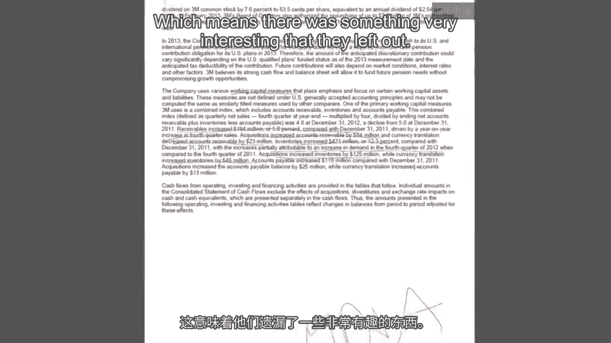

You know what it is？ What's missing is that 3M never discloses in their report what their bad debt expense。

is。 How can they get away with that？ Well there's something called the materiality principle。

which says that if an item is so， small that its disclosure would not change how investors view the company。

then you don't， need to disclose it separately。 For instance。

you never see paperclip expense on an income statement。

Paperclip expense is just lumped in with the SGA expense。

So you can assume in a case like 3M if they're not disclosing bad debt expense， it's very。

small and you could treat it as effectively zero if you're doing some of the calculations。

that we've done during this week。

Now let's take a look at our special guest company Best Buy for how they treat their。

accounts receivable and bad debts。 So on their balance sheet they have a receivables number and notice it doesn't say anything about。

allowances here。 Now when we look at these balances which are 2704 at the end of the year。

2288 at the， beginning of the year。 Those are still net balances。

You just don't know what they're net of because there's no disclosure of the allowance here。

If we go to Best Buy's cash flow statement， up here in the things that we add back we might。

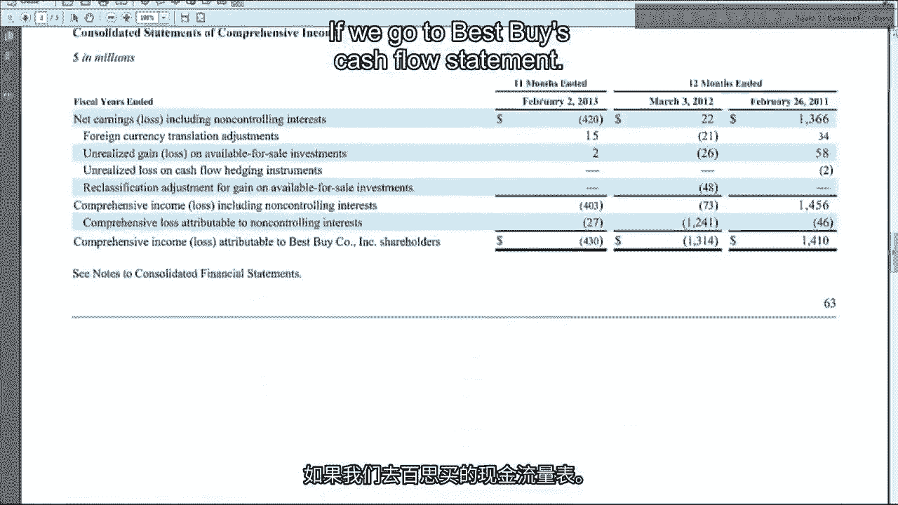

see provision for doubtful accounts or bad debt expense added back， we don't see it。

So they're using the technique where they just take their change in net receivables and。

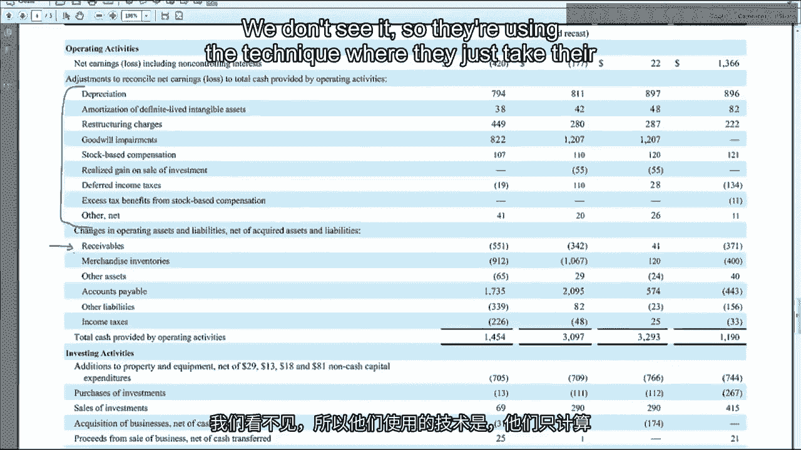

they don't break out bad debt separately。 But then what Best Buy provided was something called schedule 2。

Now this used to be required for all companies but now the SEC says you don't have to do this。

anymore and Best Buy still does it and this is where they put all of their information。

and their allowances。 So notice they have here allowance for doubtful accounts。

they have a beginning balance and， an ending balance。

So this is the spot where they're showing you the allowances that that balance sheet number。

is net of。 So remember the balance sheet number at the beginning of the period was 2288 which means。

that the balance and growth at the beginning of the period was 2288 plus 72 equals 2360。

At the end of the period the net number of the balance sheet was 2704。

If we add 92 we would get 2796 for the gross amount。

One of the things that we can now do though is we can figure out cash collection from。

customers because we have bad debt expense and more importantly the write offs and recoveries。

which is the number that we need to plug into that accounts receivable account to try to。

get at cash collections。 So if we set up a T account what we're going to do is have a beginning balance of 2360。

This is in accounts receivable and by the way if there's anybody taking this class who。

works for Adobe and you can figure out a way in the next update to avoid it catching。

this thing all the time so I have to escape。 Please feel free to add that update that would be awesome。

Anyway so when our accounts receivable we have 2360 beginning balance 2796 as our ending。

balance write offs and recoveries were 14。 We put those on the credit side。

Now this is write offs and recoveries so it's net of that so we don't have to worry about。

finding separate recoveries this is just the net number。

And so what we can do then is plug in sales on the debit side of the T account so hang。

on I'm going to flip back to the income statement for a second。

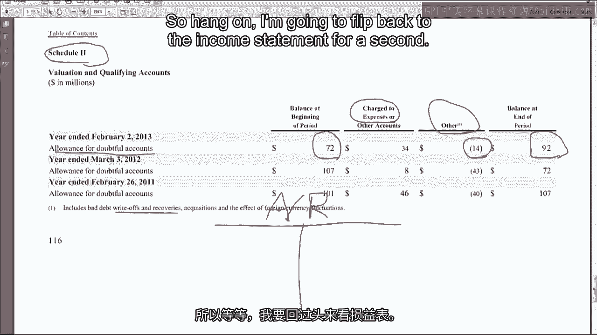

Here's revenue 4505。 So we can put 4505 here on the debit side and then the only thing that we're missing is。

cash collection from customers so we can plug that answer as 44635。

Now if we hadn't been able to find these write offs recoveries we would have been pretty。

close we would have only been off by 14。 You can always you know even if you can't find that you can do it as an approximation。

but this gives you a little bit more exact number on the cash collection from customers。

by best buy。 So if you don't see allowances on the balance sheet one thing to look for in the report。

is there may be a separate schedule which gives you all the details on both the balance。

and the allowance and the bad debt expense which you can then use to do your calculations。

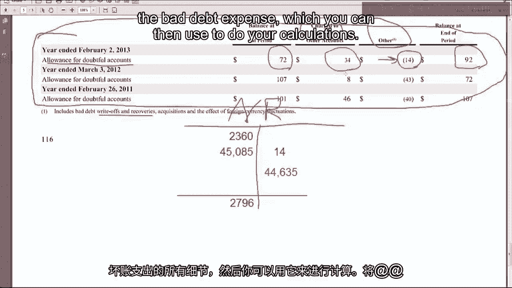

One thing I find interesting comparing best buy to what we saw with 3M is that if you。

calculate the percent of best buys allowance as a percent of gross accounts receivable。

it's about 3。1% in 2011 and 3。4% in 2012 which is not that much bigger than 3M's 2。7% but。

yet 3M is saying it's immaterial and not disclosing it whereas best buy we are getting a disclosure。

I think what's going on here is best buys in the retail segment and I think there's。

probably more demand from investors and analysts to keep up on bad debt expense in the retail。

segment than there is in the manufacturing segment where 3M operates。

So I think there's a category an example where investors must not care that much about。

3M's bad debt expense whereas best buy it is something they want to see even if it's。

small so they can track trends over time or compare to other retailers。

Now let's take a quick look at our other special guest company Honeywell。

So on their balance sheet they disclose inventories 42。35 at the end of the year 42。

64 at the beginning， of the year they don't provide the breakout of raw materials work in process or finish。

goods and if you ever see a manufacturing company that doesn't provide that breakout。

they probably have a separate footnote where they give that breakout later which is what。

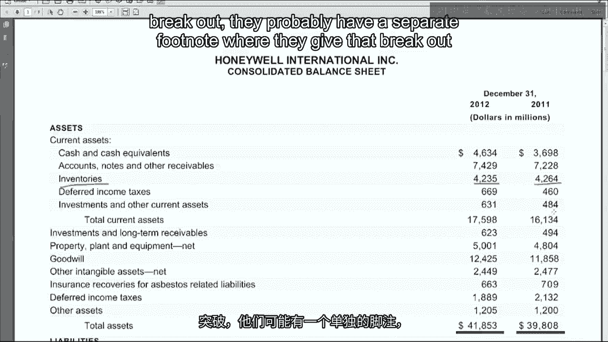

we'll see with Honeywell。 There's a summary of significant accounting policies if we go down to inventories we can。

see inventories are valued at the lower of cost or market no duh they're always valued。

at the lower of cost or market using the first in first out or average cost method so FIFO。

or weighted average and the LIFO method for certain qualifying domestic inventories。

So why does Honeywell use different methods because they're a multinational company and。

inside the US they could use LIFO or these other methods outside the US they don't have。

much of a choice because they can't do LIFO it's either FIFO or average cost and so what。

Honeywell must realize is that they can get some tax savings in the US by using LIFO so。

they use it here for certain inventories but then outside the US they have to use either。

FIFO or average costs。 So if we go to the next page of the excerpts there's a footnote for inventories and here。

it is the breakdown of raw materials work and process and finished goods then we have。

a subtotal reduction to cost basis this is the LIFO reserve and then we have below that。

the total inventory this is what shows up on the balance sheet this is the balance sheet。

that includes LIFO。 Now notice it's not all LIFO but it includes the LIFO valuation of the inventories that。

are on LIFO which means that this number above the reserve is what it would be under。

FIFO or weighted average which is what they also use。

And then down below they say inventory is valued at LIFO amount of 2， 325 and 302 this。

325 is how much of that inventory is carried at LIFO。

So as you can see the vast majority of their inventory is not carried at LIFO it's FIFO。

or weighted average but this LIFO reserve of 197 or you can get the number here it applies。

to that 325 of inventory。 So you can actually see there's been some pretty big price movements because the LIFO。

reserve is a big chunk almost two thirds of the value of this ending balance of LIFO inventory。

which means that they've historically gotten a lot of tax savings in the US by using the。

LIFO inventory。 One last thing is if they had a LIFO liquidation so they sold more LIFO than they produced。

and it helped their cost to get sold that would be disclosed here but if you don't see any。

mention of a LIFO liquidation it means that they didn't have one and so there was no benefit。

to their cost to get sold or earnings due to a LIFO liquidation during the period。

I guess I should apologize to the state of New Jersey I was watching back the intro notice。

that I sneered a little bit when I said New Jersey I actually love New Jersey go there。

every weekend in the summer to enjoy its beautiful shore so I sincerely apologize state of New。

Jersey。 Probably a good time to wrap up this week so that's the end of our week on accounts receivable。

and inventory。 Next week we're going to do some videos on ratio analysis and you'll get a chance to。

do the mid course exam。 I'll see you next week。 [Silence]。
