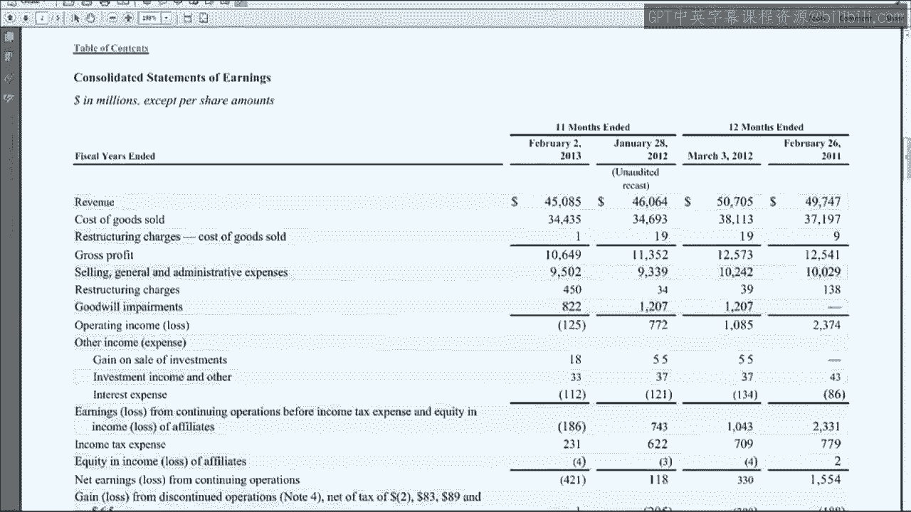

# 沃顿商学院《商务基础》课程｜第165讲：3M公司的应收账款与存货分析 📊

在本节课中，我们将学习如何分析3M公司的应收账款与存货披露信息。由于3M公司的相关披露较为简洁，我们还将引入百思买和霍尼韦尔两家公司作为补充案例，分别探讨其坏账准备和存货的会计处理与披露方式。

---

## 分析3M公司的资产负债表

首先，我们查看3M公司报告第48页的资产负债表。

这里报告了其应收账款净额：2012年为40.61亿美元，2011年为38.67亿美元。

这些金额已扣除了坏账准备。报表在此处直接给出了准备金额：2012年为1.05亿美元，2011年为1.08亿美元。

我们之前计算过的一个指标是：公司预计无法收回的应收账款占应收账款总额的百分比是多少？这个比例是上升了还是下降了？

我们可以为3M公司计算这个比例。对于2012年，我们使用1.05亿美元除以应收账款总额。总额为净额40.61亿美元加上准备1.05亿美元，即41.66亿美元。因此，比例为 **1.05 / 41.66 ≈ 2.5%**。

对于2011年，计算方式相同：1.08亿美元除以总额（1.08亿 + 38.67亿 = 39.75亿美元）。比例为 **1.08 / 39.75 ≈ 2.7%**。

因此，3M公司预计的坏账比例从2.7%略微下降至2.5%。这并不意外，因为从数字上看，虽然2011年的准备金额更大，但其对应的应收账款净额基数更小。所以，在应收账款增长的同时，坏账准备金额却下降了。

接下来，我们查看存货信息。在3M的资产负债表上，存货被细分为产成品、在产品、原材料和物料。

我们看到每个类别都在增长，这与一家成长型公司的情况一致。他们在年末比年初购入了更多原材料，增加了在产品库存，并积累了更多产成品库存，这可能是为了应对未来的需求。

以上是我们从资产负债表上能看到的关于应收账款和存货的信息。

---

## 查看现金流量表

现在，我们快速查看一下现金流量表。

这里显示了应收账款的变化。应收账款增加了，因此在现金流量表上体现为一个负数。但请注意，当我们浏览现金流量表时，并没有看到任何关于坏账准备或坏账费用的单独项目。

这是因为3M公司采用了另一种处理方法：此处的“应收账款”变化是**净额**的变化。他们没有将坏账单独列出并展示总额的变化，而是直接展示了净额的变化。

此外，正如我们之前讨论过的，这133（百万美元）的变化额与我们在资产负债表上看到的变化额可能并不完全匹配。原因是一些应收账款可能来自收购活动，或者涉及外币折算的影响。

---

## 查阅会计政策附注

财务报表中下一个需要查看的部分总是**附注一：重大会计政策**，以了解公司对应收账款和存货的会计处理方法。

翻到第53页，可以看到关于存货的附注。

3M公司声明存货以**成本与市价孰低法**计价，这并不意外，因为这是会计准则的要求。他们同时说明成本按**先进先出法**确定。

因此，3M公司对所有存货使用FIFO（先进先出）法。这意味着我们不会在3M的报告中看到任何与LIFO（后进先出）相关的有趣披露。也正因如此，3M公司没有单独的存货附注，因为他们已经在资产负债表上展示了原材料、在产品和产成品的细分，并且使用的是FIFO法，无需进行LIFO相关的披露。

翻到第55页，有一个关于应收账款和坏账准备的章节。

商业应收账款按发票金额记录，但不计息，这很常见。公司会为坏账、现金折扣、产品退货等项目维持准备金。

我们讨论过坏账。产品退货的会计处理与坏账准备完全相同：在销售时，你需要建立一个合同资产账户来跟踪预计的产品退货；当实际退货发生时，再冲销这个准备。因此，这里没有新的内容需要特别关注。

关于坏账准备，他们表示这是基于对可能发生的信用损失的最佳估计，依据是按行业划分的历史核销经验和区域经济数据。对于产品退货，则使用历史退货率。这里没有特别新颖或有趣的信息。

---

## 管理层讨论与分析中的信息

3M公司最后一次提及应收账款和存货是在第35页的管理层讨论与分析部分。

在讨论营运资本时，他们简要提到了存货。

他们指出，应收账款较上年增长5%，主要受第四季度销售额增长驱动。此外，一些收购带来了应收账款，并存在一些外币折算调整。

存货增长了12%，部分原因是对2012年第四季度需求增长的响应。同时，收购活动和货币折算效应也增加了存货。

货币折算效应和收购活动，正是资产负债表变化与现金流量表变化不匹配的原因。

以上是我在3M报告中能找到的关于坏账和存货的全部信息。这意味着他们遗漏了一些非常有趣的内容。

你知道是什么吗？**3M公司从未在其报告中披露其坏账费用是多少。**

他们怎么能这样做呢？这涉及到**重要性原则**。该原则指出，如果一个项目非常小，其披露不会改变投资者对公司的看法，那么就不需要单独披露。例如，你永远不会在利润表上看到“回形针费用”，它只是被归入销售及行政管理费用中。

因此，可以推断，像3M这样的公司，如果不披露坏账费用，说明该金额非常小。如果你在进行本周的一些计算时，可以将其视为**接近于零**。

---

## 案例研究：百思买的坏账披露

现在，让我们看看特邀公司**百思买**是如何处理其应收账款和坏账的。

在其资产负债表上，有一个应收账款数字，但请注意，这里没有提及任何准备。

年末余额为27.04亿美元，年初为22.88亿美元。这些仍然是**净额**，但你不知道扣除了什么，因为这里没有披露准备金额。

如果我们查看百思买的现金流量表，在需要加回的项目中，我们可能期望看到“坏账准备”或“坏账费用”被加回，但我们并没有看到。

这意味着他们也采用了直接使用**应收账款净额变化**的技术，而没有单独列出坏账。但是，百思买提供了一份名为**附表2**的文件。

过去所有公司都被要求提供此类附表，但现在美国证券交易委员会已不再强制要求。百思买仍然提供了它，并将所有关于准备的信息放在这里。

请注意，这里有“坏账准备”账户，显示了期初余额和期末余额。

这就是他们展示资产负债表数字所扣除的准备金的地方。回顾一下，期初资产负债表上的净额为22.88亿美元，这意味着期初的应收账款总额为 **22.88亿 + 0.72亿 = 23.60亿美元**。期末资产负债表净额为27.04亿美元，加上0.92亿准备，得到总额 **27.04亿 + 0.92亿 = 27.96亿美元**。

现在我们可以做的一件事是计算从客户那里收到的现金，因为我们有了坏账费用，更重要的是有了**核销与收回**的数字。我们需要将这个数字代入应收账款T型账户，以推算现金回收额。

我们建立一个T型账户。期初余额为23.60亿美元（应收账款总额）。期末余额为27.96亿美元。核销与收回净额为0.14亿美元（记在贷方）。这是净额，所以我们无需担心单独找出收回额。

然后，我们可以在T型账户的借方填入销售额。让我们快速翻回利润表查看收入。

收入为450.5亿美元。我们将450.5亿美元记在借方。那么，唯一缺失的项目就是**从客户处收到的现金**，我们可以计算出这个数字为 **446.35亿美元**。

如果我们没能找到这些核销与收回的数据，我们的估算值会非常接近，只相差0.14亿美元。即使找不到精确数据，你也可以将其作为一个近似值。但有了这个数据，你可以更精确地计算百思买从客户那里收到的现金。

因此，如果你在资产负债表上看不到坏账准备，可以在报告中寻找是否有单独的附表，该附表会提供关于准备余额、坏账费用的所有细节，供你进行计算。

将百思买与3M进行比较，我发现一个有趣的现象：如果你计算百思买的坏账准备占应收账款总额的百分比，2011年约为3.1%，2012年约为3.4%。这并不比3M的2.7%高太多，然而3M认为其金额不重要而不予披露，而百思买却提供了披露。

我认为原因在于，百思买属于零售业，投资者和分析师可能更关注零售业的坏账费用趋势，而3M所在的制造业则不然。这是一个例子，说明投资者可能不太关心3M的坏账费用，但对于百思买，即使金额较小，他们也希望看到披露，以便追踪趋势或与其他零售商进行比较。

---

## 案例研究：霍尼韦尔的存货披露

现在，让我们快速看一下另一家特邀公司**霍尼韦尔**。

在其资产负债表上，他们披露了存货：年末为42.35亿美元，年初为42.64亿美元。他们没有提供原材料、在产品或产成品的细分。

如果你看到一家制造公司没有提供这种细分，他们很可能在后面的单独附注中提供，霍尼韦尔就是如此。

在重大会计政策摘要中，关于存货的部分显示：存货以**成本与市价孰低法**计价，使用**先进先出法**或**平均成本法**，并对某些符合条件的国内存货使用**后进先出法**。

为什么霍尼韦尔使用不同的方法？因为他们是一家跨国公司。在美国国内，他们可以使用LIFO或其他方法；但在美国以外，他们选择不多，因为不能使用LIFO，只能使用FIFO或平均成本法。霍尼韦尔意识到，在美国使用LIFO可以获得一些税收节省，因此他们对某些存货使用LIFO；而在美国以外，则必须使用FIFO或平均成本法。

在摘录的下一页，有关于存货的附注。

这里提供了原材料、在产品和产成品的细分。然后有一个“减：按成本基础调整”的小计，这就是**LIFO储备**。其下方是存货总额，即出现在资产负债表上的数字，这个数字包含了按LIFO计价的存货。

请注意，并非所有存货都按LIFO计价，但总额包含了按LIFO计价的那部分存货的价值。这意味着储备上方的数字是如果采用FIFO或平均成本法（他们也使用这些方法）时的价值。

下方说明，存货按LIFO计价的金额为23.25亿美元和23.02亿美元。这个32.5（百万）是指有多少存货是按LIFO计价的。

如你所见，他们的大部分存货并非按LIFO计价，而是采用FIFO或平均成本法。但这个1.97亿的LIFO储备适用于那32.5亿的LIFO存货。实际上，你可以看到价格发生了相当大的变动，因为LIFO储备几乎占到了这部分LIFO存货期末价值的三分之二。这意味着历史上他们通过在美国使用LIFO存货法获得了大量的税收节省。

最后一点是，如果他们发生了LIFO清算（即销售的LIFO存货多于生产的），从而降低了销售成本，这里会进行披露。但如果你没有看到任何关于LIFO清算的提及，就意味着当期没有发生，因此他们的销售成本或收益没有因LIFO清算而受益。

---

我想我应该向新泽西州道个歉。回看视频开头时，我注意到我在说“新泽西”时略带不屑。实际上我很喜欢新泽西，每个夏天都会去那里美丽的海岸度过周末。我真诚地向新泽西州道歉。

现在可能是结束本周内容的好时机。我们关于应收账款和存货的课程到此结束。

下周，我们将进行一些关于比率分析的视频讲解，并且你将有机会完成期中考试。我们下周见。

[静音]