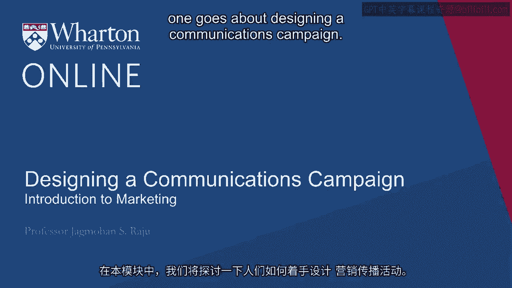
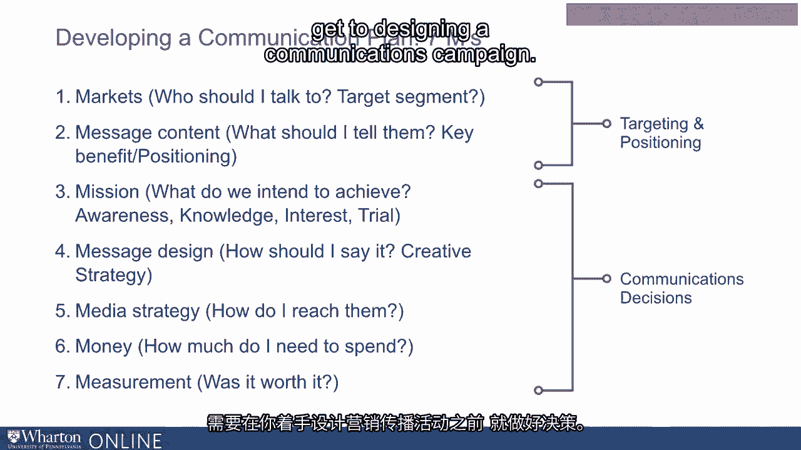

# 沃顿商学院《商务基础》｜Business Foundations Specialization｜（中英字幕） - P17：16_设计交流运动.zh_en - GPT中英字幕课程资源 - BV1R34y1c74c

In this module， we are going to talk about how one goes about designing a communications。

campaign。 Professor Babrakhan in her earlier module spoke to you about what are the various components。

of a go-to-market plan。 She talked about five C's and four P's。

One of the P's of course was product design。 The next one was pricing。

The third one she discussed which again we went into greater detail was about distribution。

The one that we are going to focus on today is promotions。

So what does promotions include in terms of decision making？

One part of promotions is communication strategy。 In communication strategy。

we either use mass or targeted media that could be TV， digital， print。

outdoors and that includes advertising。 It could also。

communications could also include things like product placement and also public， relations。

And then we also have within the field of promotions what we call as personal and interpersonal。

means of communication。 That's through sales force or word of mouth。

Word of mouth can be from consumer to consumer。 It can be offline or online。

We also communicate with the consumer at the point of purchase oftentimes。

We can install promotions online when somebody comes to our website， they see a sticker which。

says this is on sale。 The other way to promote one's products or services is through non-communications means。

And that is either through price discounts or coupons。

In this module we are primarily going to focus on communication strategy and that's through。

mass and targeted media。 But I think it's worthwhile for a moment to just talk about a few of the things that we。

are not going to go into detail that are also useful。 For example。

what do we mean by product placement？ Oftentimes when I ask this question people say it's where you place the product in the。

store。 That's not what product placement is。 Product placement is placing your product or service in a television series or a movie。

like the BMW car in a James Bond movie。 That's what we call product placement。

Now why companies use product placement？ Because there is a belief that anything that looks like advertising is actually less effective。

than something that is somewhat indirect。 So seeing a BMW car in a James Bond movie doesn't seem like usual advertising and there。

is a belief amongst advertisers and communications people that anything that's not in your face。

is actually more effective。 Let's talk a little bit about public relations also。 Public relations。

I think we all know what the word means。 Oftentimes people say public relations is something that's free。

Public relations is not really free。 What is really free in the public relations part is that you don't pay for the media。

which means you don't pay for time and space。 But creating an activity that deserves public relations and media mentions is reasonably。

expensive。 So this is an area that can be managed quite well。 It's very effective。

but it is not an area where you actually pay for either time or space。

Personal and personal communication is a very powerful means of promoting your products。

and services。 This can be done through sales force。 It can also be done through word of mouth。

one customer talking to another and this can， be managed quite well。

Pharmaceutical companies have managed this for years even before online came into existence。

And even today with online， when you actually measure the word of mouth， 80% of word of。

mouth is actually offline person to person and only 20% is today online。

Let's now reflect back on our communications campaign design， which is either through Mars。

or targeted media。 So in this module， we'll focus on a few things a little bit more。

One is what role does communications play in our marketing strategy。 In other words。

for most of you， you might use an advertising agency or a communications， agency。

How do you get the best out of them？ We'll spend some time on how do you actually design a message。

Media planning and budgeting also deserve attention， but in this session， we will not。

talk too much about that。 We'll spend quite a bit of time on measuring the effects of your communications campaign。

and then summarize with some key lessons。 Let's start with an example。

Many of you may have seen the milk campaign that was a very popular campaign。

This was done by the California Milk Board in 1992。 So what did they find？

When they talked to consumers， they basically found most people like milk。

They also felt milk was healthy。 Kids felt milk is cool and fun。

Teens felt milk makes you strong and beautiful， but yet when you looked at the data in terms。

of what was happening to milk consumption， it was going down rapidly。

At a time when people felt good about the product， at a time when people felt it was。

a cool product， yet when you looked at the actual consumption， it was going down， not。

just slowly but quite a bit。 And milk producers were very concerned about this。

So they started looking into what is the cause of the problem and what is the remedy。

As they looked deeper， what they found was people wanted to drink milk， but often they。

didn't have milk at home。 They felt that based on these interviews and focus groups。

that if you could just convince， people to have milk at home， consumption will go up。

And this is true not just for milk。 People have found this in other product categories also。

For example， soft drink companies have found it in their studies that if you have more。

cocola at home， you will drink more of it。 Same way， shampoo。

if you have more shampoo left in the bottle， you will consume more。

So if you look at the amount of shampoo people pour on their hand before they put it on their， head。

it's very closely related to how much shampoo is left in the bottle。

When you have a new bottle of shampoo， you pour more on your hand。 When very little is left。

you pour less。 Of course， less is also just fine， especially for people who don't have that much here。

but， still the consumption of shampoo is related to how much you have at home。

Milk producers found the same thing that if people just had more milk at home， they would。

drink more。 And the idea was then how do you say it in a very creative and a memorable way so that。

people would actually have milk at home。 Many decisions have to be made。 For example。

they had to decide who should they talk to， what should they tell them in。

terms of how they should do， think or feel about milk。 What specifically did we want to achieve？

Was it about increasing consumption？ Was it about getting more people？

How are you going to say that in terms of your message？ What media are you going to use？ TV。

digital， billboards？ How much money are you going to spend？

And then how do you measure whether it's going to be effective or not？

So for each of these questions， these were the planned answers they had in their mind。

And this is on which the communications campaign was based。 So their target audience。

they said it's not about getting new people to drink milk。

There are enough people who drink milk already， but we want them to drink more。

So the target segment here was people who currently drink milk。

Make sure you have enough milk at home。 That was the message content。 Why？

Because they believed that if they just had more milk at home， they would consume more。

The mission of the campaign was increasing milk consumption by one glass per week within， a year。

And they came up with a campaign which we'll talk more about。 Media strategy was TV and print。

They had to decide on a budget。 And they had already put in place measurement and their mission which is we wanted to have。

a certain level of recall in three months。 They came up with a campaign。

Many of you may have seen these ads。 They are also available on YouTube。 You can go and see them。

There is a lot of continuity in this campaign。 It's the same message repeated in many different ways in many different contexts。

Sometimes they use celebrities。 We will talk about that in this module。

And sometimes they just use regular people。 Again， we'll talk about that。

But here is something important to keep in mind。 In any communication campaign。

you have to make these seven decisions。 What are these seven decisions？

And this is what we call as seven M's of a communications campaign。

I hope from your previous module to remember what are the four P's and what are the five， C's。

Now we have the seven M's of designing a communication campaign。

M number one is who you're going to talk to。 M number two is what should we tell them？

M number three， what do we want to achieve in terms of awareness， knowledge， interest， trial？

How should we say it？ That's how the creative strategy comes in。 The next part is media strategy。

How do we reach them？ And then how much am I going to spend？ And then was it worth it？

So for the purpose of this session， we are not going to spend too much time on media strategy。

and money。 We are going to spend more time on the other M's because I think those are the first few。

that you need to get a good handle on。 Also when you open a typical textbook and marketing and you go to the chapter on designing。

a communications campaign， what you will find is that it has only five M's in it。

That doesn't mean that the book is not good enough。

I think the book is trying to send you a signal that the first two M's， who's your target。

segment and what is your key message or your value proposition is a decision that you should。

make well before you get to designing a communication campaign。

Reflect back on what Professor Kahn said in our session about positioning。

What are the three key components of a positioning statement？

Who's your target segment and what are your points of difference？

That's exactly where markets and message content comes from。

This should have been decided well before you get to designing a communications campaign。

So let's start with the first key M which is solely within the purview of a communications。

campaign and that is mission。 [BLANK_AUDIO]。

