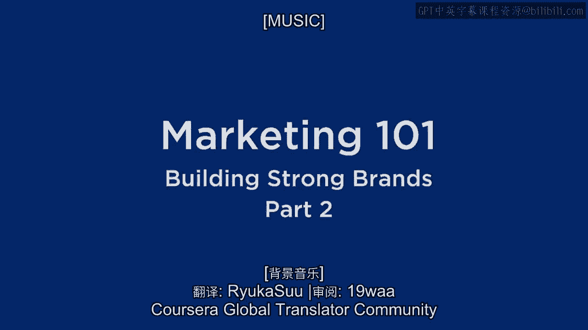
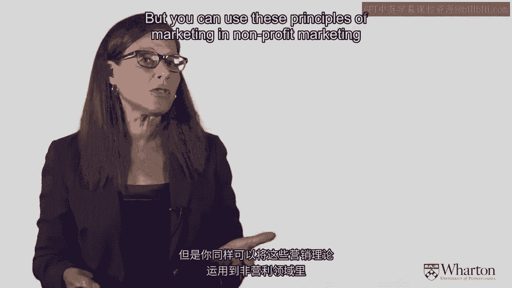
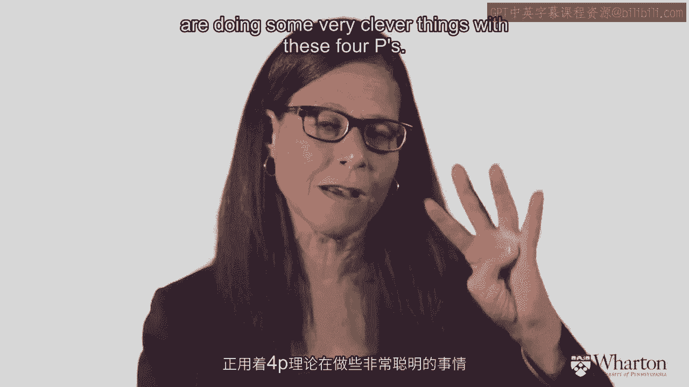
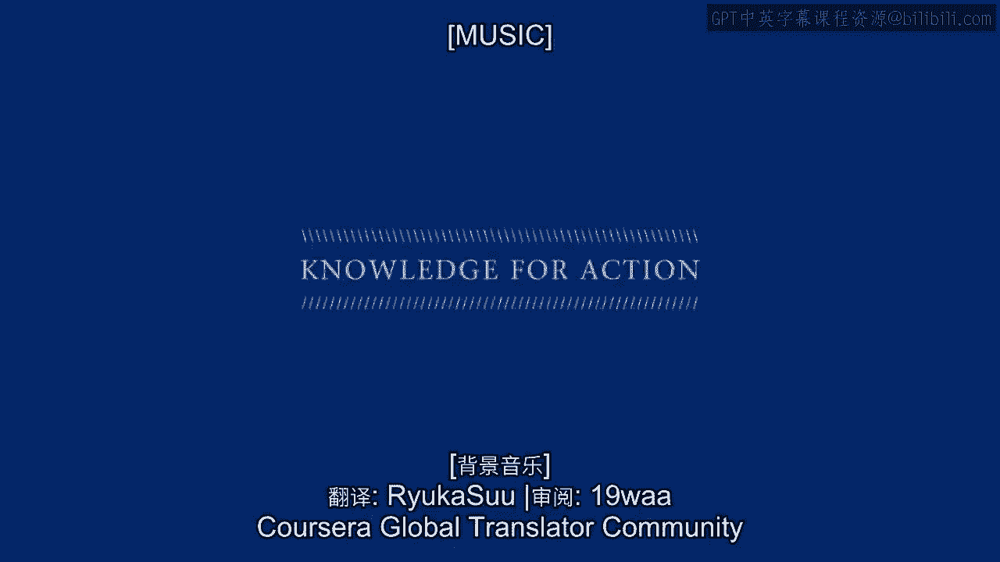
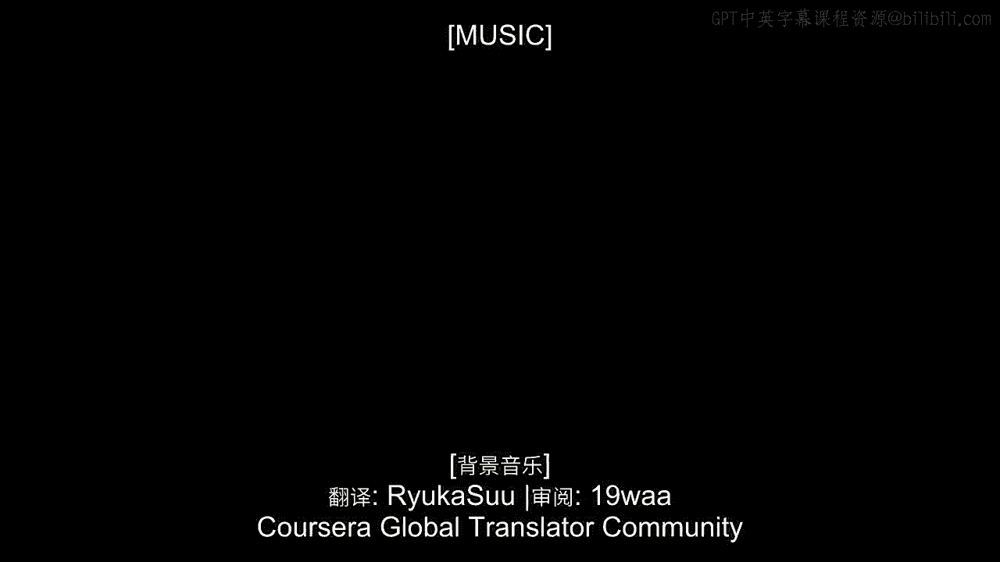

# 沃顿商学院《商务基础》课程｜第1课：营销101 - 建立强大品牌（二）📚

在本节课中，我们将要学习市场营销的三个核心原则，以及用于实践这些原则的四个基本工具。我们将通过商业和非营利组织的例子，帮助你理解这些概念如何在实际中应用。

## 市场营销的三个核心原则 🎯

上一节我们介绍了市场营销的基础，本节中我们来看看构成市场营销本质的三个核心原则。

以下是这三个原则的详细说明：

1.  **顾客价值原则**：如果你想向顾客提供产品或服务，并让他们选择你而非竞争对手，你必须提供**真实且真诚的顾客价值**。
2.  **差异化原则**：你必须向顾客提供他们想要的顾客价值，但同时必须**比竞争对手做得更好**。因此，你必须使你的产品或服务与众不同。
3.  **市场细分、目标市场选择与定位原则**：在一个以顾客为中心的市场中，你不可能为所有人提供价值并盈利，这过于困难。因此，你需要将市场划分为不同的细分市场，**选择你想要专注的目标细分市场**，并定位你的品牌以满足该目标市场的需求。

## 实践原则的四大工具：4P营销组合 🛠️

了解了核心原则后，我们来看看用于实践这些原则的具体工具，即经典的4P营销组合。

以下是构成4P营销组合的四个要素：

*   **产品**：这是卖方投入到交换中的东西。
*   **价格**：这是买方投入到交换中的东西。
*   **促销**：这是卖方向买方传达产品益处的方式，可以是广告、销售推广等。
*   **渠道**：这是卖方将产品交付给顾客的方式，可以是实体店、在线商店或下载等分销方法。

## 非营利组织中的营销应用：以献血为例 🩸

市场营销原则不仅适用于商业世界，同样可以应用于非营利组织。让我们以美国红十字会鼓励献血的案例来分析4P的应用。

在这个案例中，交换关系发生了变化。美国红十字会希望获得的是**血液**，而这实际上是顾客（献血者）付出的“价格”。那么，他们的“产品”是什么呢？

美国红十字会提供的“产品”是**鼓励人们更愿意献血的方案**。例如：
*   对一些人，产品是“帮助拯救生命”的崇高感。
*   对另一些人，产品是一张写着“我今天献血拯救了生命”的贴纸。
*   对其他人，产品可能是献血后提供的橙汁和饼干。
*   对于高中生，一个有效的“产品”是**允许他们因献血而缺课**。

**促销**是他们向公众传达献血益处的方式。**渠道**决策则是他们如何将“产品”（献血机会）交付给顾客，这里他们采用了创新的“献血车”模式，主动去到顾客所在的地方。

这个例子展示了如何以有趣且创新的方式运用这四个营销工具。

## 总结 📝

本节课中我们一起学习了市场营销的三个核心原则：**顾客价值**、**差异化**以及**市场细分、目标市场选择与定位**。同时，我们掌握了实践这些原则的四大工具——**产品、价格、促销、渠道**，即4P营销组合。最后，我们通过美国红十字会的案例看到，这些营销基础概念同样能有效地应用于非营利领域。理解并灵活运用这些原则和工具，是制定有效营销策略的关键。