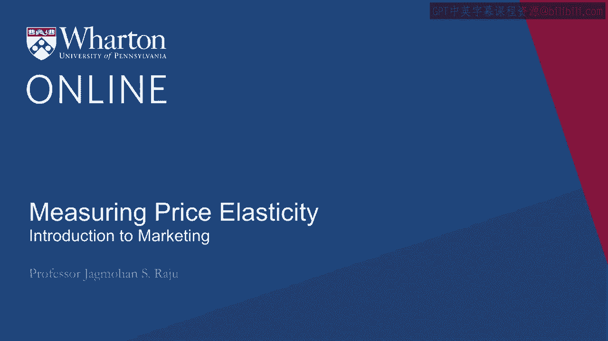
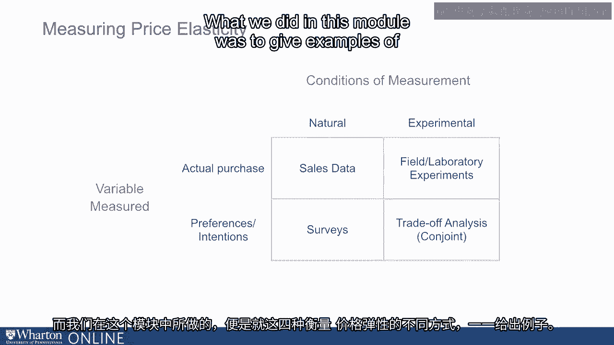

# 沃顿商学院《商务基础》｜Business Foundations Specialization｜（中英字幕） - P22：21_测量价格弹性.zh_en - GPT中英字幕课程资源 - BV1R34y1c74c

In this session， we shall talk more about how do you actually formally measure price elasticity。

Earlier we discussed sort of drivers of price sensitivity。

What are the situations where consumers are more or less price sensitive？

Now let's talk about how do you actually go about measuring price elasticity。

So let's take note of one thing。 Earlier I was using the word price sensitivity。

Now I'm going to use the word elasticity。 So why am I using the word elasticity and how do we define elasticity？

So elasticity is defined in a very specific way。 Is defined as what is your percentage change in demand when you change your price by 1%。

So it looks very complicated。 So the first question you can ask is why worry about percentage change in price and percentage。

change in demand。 Why not just talk about change in demand divided by change in price。

That could also be defined as elasticity but we don't do that。

Why do we use percentage change in demand and percentage change in price？

So there are two advantages of doing this and there are others too but let's focus on， those two。

The first important benefit is let's say you are looking at soap。

If you measured the quantity of soap in bars of soap you'll get one number。

If you measured it in tons of soap you'll get another number。

So if you just use change in demand and change in price you'll get a different answer depending。

on whether your demand is measured in tons or in bars of soap。

Same way if your price is measured in dollars versus euros you'd get a different answer。

We don't want that。 We want the measure of elasticity to be not dependent on the units in which we measure。

demand or the units in which we measure price。 So if you use percentage it's unit less。

If you use percentage demand it's also unit less。 So that's one advantage。

One advantage is because it is not specific to units you can also make good comparisons。

across industries and across firms。 You can say demand for gasoline is more or less elastic than say demand for soap or demand。

for orange juice。 So you can make comparisons across industries because it's not specific to a particular unit。

in terms of tons or dollars。 So across industries comparisons become easier and more meaningful。

Now that we've defined elasticity let's look at another concept which is elastic or， inelastic。

People often use the phrase demand for my product is elastic。

Others might say demand for my product or my service is inelastic。

What do we mean by it being elastic or inelastic？ What we are really talking about is the effect of price changes on revenues。

Let's say I were to increase my price by 1%。 If I increase my price by 1% the question we ask ourselves is what will happen to revenues。

If your demand is very elastic then you increase your price your unit sales will go down quite。

a bit your revenues will actually go down。 If your demand is inelastic and you increased your price by 1% then your unit sales are not。

going to go down as much and your revenue will increase。 So let's look at in specific terms。

I increase my price by 1% because I increase my price let's say my unit sales go down by， 2%。

What will happen to my revenues？ They will go down。 Why？

Because I increase my price by 1% but unit sales went down by 2%。

What is it or another condition where I increase my price by 1% but unit sales only went down。

by 1/2% percent。 Now my revenues will go up。 Why？ Because the increase in price was 1% the unit sales were only decreasing by 1/2% so my revenues。

will go up。 So what is the break even point？ The break even point is going to be 1 which means if my demand goes down by exactly 1%。

then my price goes up by 1% then my revenues will not change but if my demand goes down。

by more than 1% then my revenues are going to go down。

Now let's talk a little bit about how we measure price elasticity more formally。

Now there are thousands of ways to measure elasticity。 How do you put some structure on this？

The way to put some structure on this is ask ourselves what are we measuring and then how。

are we measuring it。 So we could be measuring actual purchases focusing on what people actually are buying。

or we could be focusing on people's intentions to buy。

On the other side we look at conditions of measurement。

Are we measuring price elasticity in natural setting where consumers habitually buy or。

are we controlling the setting using some experimental methods。

So if you combine the variables we measure along with conditions of measurement we broadly。

get four different ways to measure price elasticity。

So let's look at the very first one on the top left。 Actual purchases in a natural setting。

This is what we call as sales data。 We can get sales data from our products that are already on the market。

We can get sales and price data and then we can do something with it to figure out elasticity。

We'll talk more about it。 Alternatively we could in a very natural setting conduct a survey and ask people about their。

intentions to buy。 We could conduct some experiments and then finally we could do some even fancier analysis。

like trade off analysis or con joint analysis by the way con joint analysis was developed。

at the warden school by one of our senior colleagues Paul Green along with Professor， Jerry Wendt。

So it's a warden home grown product and we'll talk about this a little bit。

So let's look at each of these boxes in a little bit more detail。

Let's look at the example where we conduct surveys。

Let's say I have a new online news service and I want to estimate price elasticity。

So one of the things I could do is I could look at 600 representative potential uses。

of this product。 I could split them into six sub samples of 100 each and to each of these sub samples I。

describe in some detail what this new product is and then ask them whether they'll be buying。

this or not or using it or not。 So but the way I do it is to each of these six groups I give them a different price。

So everything else about the product is described in exactly the same way but to one group I。

say the price is $10 will you buy it to another group I say the price is $11 will you buy it。

and the next group I say 15 and then for each of these groups I count the number of yeses。

and then I plot them on a graph。 If you look at this graph you count the number of yeses it's higher at 10 lowest at 15。

I can look at this and I say I have a demand function which relates price to demand and。

from this I can compute elasticity。 So that's one way。

Now clearly as you listen to me you must have said there are many weaknesses of this method。

and yes there are but before we look at weaknesses let's look at some of the strengths。

It's quick it's not as expensive and of course there are many weaknesses。

One of the biggest weaknesses people often don't say don't do what they say they will。

do and this in marketing we call as the intentions behavior link。

There are ways to strengthen the intentions behavior link we are not going to cover this。

in this module but there are definitely ways to do that。

The method also does not explicitly account for competitor prices。

There's another important weakness especially in a service setting or a repeat purchase setting。

You ask the question will you buy this product？ You didn't ask the question how often will you buy it？

How long will you buy it？ Because your total revenues are not going to depend on whether people are going to just。

try this service but it's also going to depend on how long they are going to buy it。

How long they are going to use it and as Professor Feda said what is the customer lifetime value？

So that's one method。 Another alternative could be we launched this service in the marketplace。

we observed it， for a few weeks and we changed prices during that time and when we changed prices we observed。

different sales so now we have hard sales data。 Once we have these data we could plot these data or we could estimate some statistical。

models to estimate price sensitivity。 For example we could run a regression on sales against price and see what is the formal。

relationship and from that we could estimate price sensitivity。

We could conduct some field experiments。 For example we could change prices in one setting compared with another price in another。

setting and look at the difference。 So a very nice example of a field experiment is from a research paper published by one of。

our own faculty members at Wharton， Professor Steve Hooke and some of his colleagues。

He did this experiment when he was at Chicago and they co-opted a very well-known retail。

store in Chicago called Dominics。 If you happen to be from that area you may be familiar with this store。

This store had 90 odd stores and they split them into three groups about evenly。

For one of the groups they lowered prices by 9% for the second group they increased prices。

by 9% and the third group they kept the same。 And the third group is often referred to in experiments as the control group。

So what were the results？ Well the results were very intriguing。

For the stores where they lowered the price by 9% the unit sales went up by 3%。

For the stores where they increased the price by 9% unit sales went down by 4%。

So let me ask you what was the price elasticity observed based on what we covered？

We lowered the price by 9% sales went up by 3%。 What was the definition of price elasticity？

Percentage change in demand divided by percentage change in price。 Percentage change in price is 9%。

Percentage change in demand 3%。 Elasticity minus one third 3 divided by 9。 Why is it minus？

Because when you are raising price sales are going down and when you are lowering prices。

sales are going up。 So elasticity observed in the stores where we lowered the price by 9% was one third。

What does that mean？ Was the demand elastic or inelastic？ And the answer is it was inelastic。

When we increased the price by 9% how much did sales go down by？

They went down by 4% from 100 base to 96。 Then you see 4 divided by 9 is less than 1 which means we raised the price by 9% unit。

sales went down by 4%。 Again your revenues would have gone up。

So in both these cases we observed that the demand is relatively inelastic。

So what would be the conclusion from the grocery store managers perspective？

Well one conclusion could be because my demand is inelastic I can raise prices。

My revenues will go up。 That looks like a nice conclusion but you have to be a little bit careful。

Why do you have to be a little bit careful if consumers are able to compare prices more。

easily then maybe these effects will no longer remain valid。

So if another competitor store were to emphasize that Dominics has raised prices。 They highlight it。

they make it more accessible to the consumer， make consumers more sensitive。

Then maybe some consumers may shift stores but what do we find usually is consumers are。

quite sticky when it comes to the stores they buy from and maybe that's one of the reasons。

you are seeing low price elasticity in these settings。

So that's one way to measure elasticity is to conduct a field experiment。

The last method we are going to talk about is trade off analysis or conjoined analysis。

So I will just give you a sense of what this method is to give you an idea of how this。

is done and then of course there are more formal ways of doing it。

There are companies that specialize in conducting this。

You may talk to one of those or read more about it in a book。

So let's look at the following example。 Let's say we have six restaurants A， B， C。

D and E and F and we have these restaurants， are defined on two different characteristics or two different sort of attributes。

One is the quality of their food and other is the atmosphere or the ambiance。

So the food quality can be either excellent， good or fair and the ambiance is either intimate。

candlelight or bright lights。 Now with these three food quality and two types of ambiance we can create six different types。

of restaurants。 So I have done this in a very purposeful way。

Now let's say I ask one of the consumers or potential buyers， you know tell me which。

is your most preferred restaurant and let's say this person says is the most preferred， restaurant。

Then I ask them the next question。 Because A were not available which is the next restaurant you will pick。

Let's say this person says B and then I tell them if B is not available which one will， you pick。

They say C。 In effect what I'm trying to do is ask them to rank order these restaurants。

Now let's look at another customer。 Let's say ask them which is your most preferred restaurant。

They say A。 I ask say A is not available which one do you pick。

They say C and I say that's not available which one do you pick and they say E。

Now if you look at A B C versus A C E would you not agree with me that you learned something。

about these consumers。 What did we learn？ Consumer number one cares mostly about the food quality。

Consumer number two cares much more about ambiance than food quality。

Now this is just to give you an idea that we are able to judge from these choices in a。

very purposeful way。 Does the customer care more about food quality or ambiance？

We can then quantify it also more formally as to how much more do they care about food。

quality versus ambiance。 Now let's think about one of the variables instead of being food quality could be price。

So then we can say how much does the person make a trade-off between price and food quality。

and that will allow us to measure price sensitivity。

So looking back there are four broad ways of measuring price elasticity and these four。

broad ways come about from what do we measure and how do we measure。

Are we measuring people's actual purchase behavior or are we measuring their intentions， to buy it。

In terms of how we are measuring are we measuring it in their natural setting and then are we。

measuring it in a controlled experimental setting。

So this 2 by 2 table that we discussed gives you four broad different ways and what we。

did in this module was to give examples of each one of those four different ways of。

measuring price elasticity。 Thank you。 [BLANK_AUDIO]。
