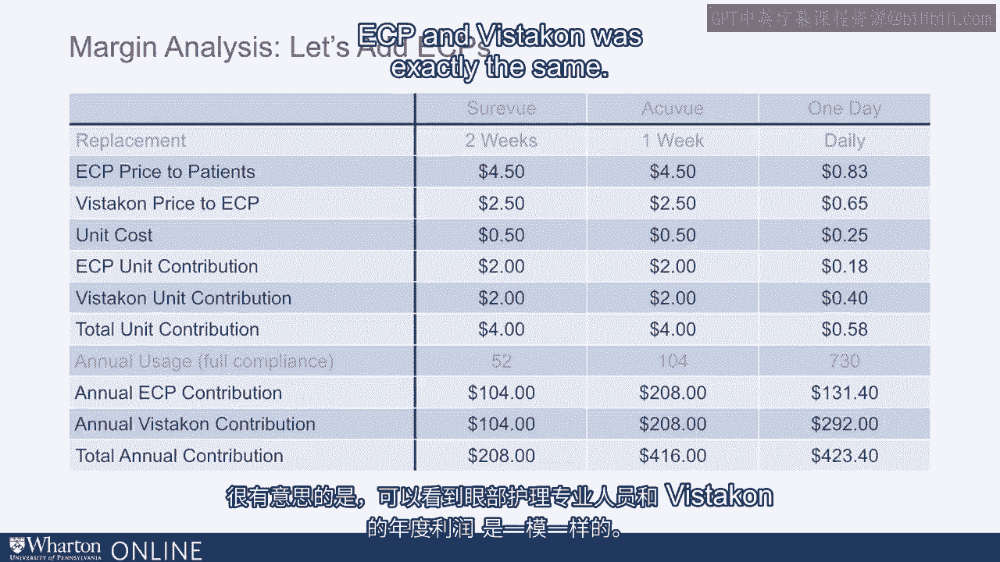
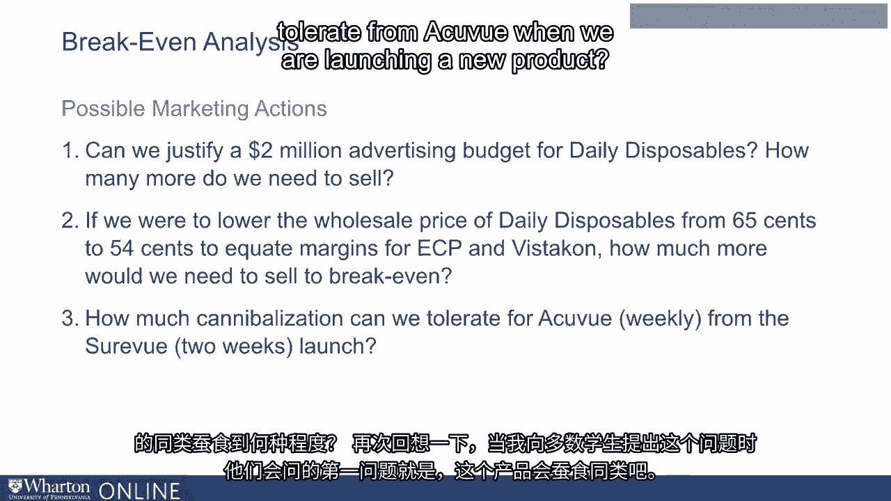
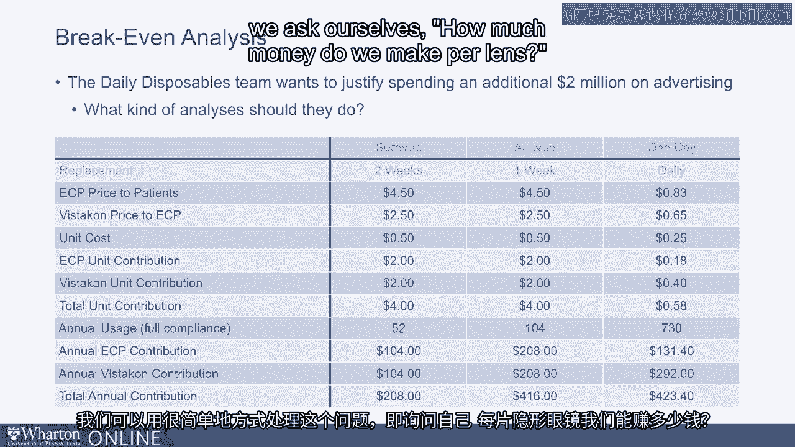
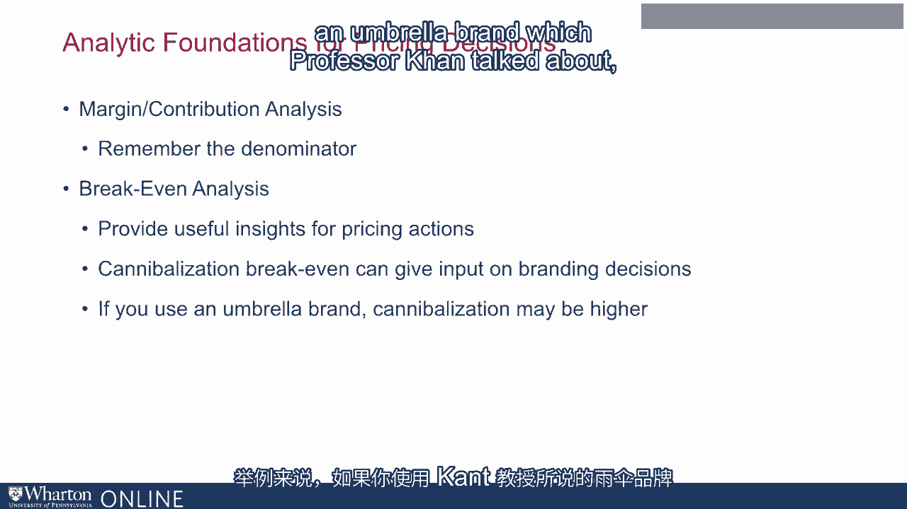

# 沃顿商学院《商务基础》｜Business Foundations Specialization｜（中英字幕） - P24：23_定价的分析基础.zh_en - GPT中英字幕课程资源 - BV1R34y1c74c

In this lecture， we will discuss some basic analytic foundations for pricing decisions。

And we will focus on three key topics。 One， we call margin and contribution analysis。 Second。

breakeven analysis and the third concept is economic value to the customer。

So let's start with margin analysis and let's do it in the context of a mini case。

And this case comes from a company called Wistecon。

So Wistecon is a subsidiary of Johnson & Johnson and they were the first to launch disposable。

lenses。 And the first lens they launched was called HECU view， which was produced by a very unique。

proprietary technology and it costed about 50 cents per lens。

Patients were advised to wear these lenses for one week and then dispose them away and。

then next week insert another pair of lenses in their eyes。 Soon after they launched HECU view。

for a number of reasons， some IKEA professionals suggested。

that patients remove these lenses and clean these lenses each night and replace them after。

two weeks。 Which was not exactly what Wistecon had suggested。

But in response to this particular usage pattern， Wistecon decided to launch a new product called。

Shor View， which was specifically designed for this type of usage， which is two week， usage。

They priced it the same as AkuView， which is $2。50 to IKEA professionals and who charged， then $4。

50 to end users。 At the time of this， Wistecon was thinking of launching a very different type of lens。

disposable lens， which they called as one day AkuView or daily disposables。

This would be a product that would be daily wear， single use， truly disposable lens that。

offered both convenience and reduced health risk。 And these lens costed Wistecon about 25 cents to manufacture and they were priced at 65。

cents to the IKEA professionals。 And then the plan was to sell it to the customer at about 83 cents。

So let's think through this planned launch of one day AkuView and ask ourselves what。

issues should Wistecon be concerned about as they launch this new product to complement。

their existing product line of AkuView and Shor View。 So typically when I pose this question。

I get several answers， but the one answer on， top is will the new product cannibalize existing products？

The other responses I get is will consumers really want it？

Another answer here is will channel partners or IKEA professionals want to support it？

And then there are operations and production side issues。 Can we produce so many units？

Do we have the supply chain and the distribution network to support it？

So all these are important issues， but let's see how many of these we can address by doing。

simple margin analysis。 So let's start with that process of margin analysis。

If you look at the margin for each of the three products， so let's start with Shor View。

the price to the patient is 450， the price to the ECP is 250， unit cost is 50 cents， so。

Wistecon's contribution is $2。 If you look at AkuView， it's exactly the same。

But if you look at the one day which is the daily disposable， it's 83 cents to the patient。

65 cents to the ECP and the unit cost is 25 cents， which means it has 40 cents margin to， Wistecon。

So a question worthwhile asking at this stage is based on these margins， which of these three。

products is most profitable？ People when they look at this。

students or executives invariably they'll say， "Presraju， the most common answer is one day。

That's what I hear。"， And when I probe further， I ask why are you coming up with one day when $2 is actually。

more than 40 cents？ And I think they rightly say， "Look， it's not the margin per lens。

It's margin per consumer， which is each customer is going to buy many more of the daily disposables。

than they are going to buy Shor View。"， So that is a good way of thinking。

So let's look at that a little bit more carefully now as we go deeper into this。 So $2。

which is the margin per lens for Shor View， we multiply that by 52。 Where do we get 52？

It's replaced by weekly， which is 26 weeks。 You have two eyes， so you're usually 52 lenses。

So 52 times 2 is $104。 And then for AccuView， again， the per lens is $2。

multiply that by 104 because you're， changing it every week。 Two eyes， 52 times 2 is 104。

You get $208。 But then you multiply the 40 cents margin on one day， which is the daily disposable。

Multiply that by $730， you get $292。 So clearly once you look at it on a per-consumer basis。

you find that the daily disposable is， more profitable。

This is where now the real discussion begins。 I asked under what conditions would actually show you be more profitable even when we look。

at these data。 This is not an easy question。 But as we think about it。

the answer comes in the following way。 If you were told that you can make only 100，000 lenses。

which ones will you make， then the， answer would be you will make only show views。 Why？

Because from those 100，000 capacity， you can make $2 per lens and there'll be 200，000。 But with 100。

000 capacity to manufacture， you'll be able to satisfy very few customers。 And on each customer。

you'll make only $292。 So if your capacity were limited， then suddenly。

show view looks more profitable。 So the next question is。

what capacity are we talking about when we are thinking of， $292， $208 versus $2。40？

And the answer there is you're assuming that the number of customers you have is fixed。

and you're going to be able to change each customer from one lens to another lens。

So if your number of customers is fixed or limited， then clearly the daily disposable。

looks profitable。 But if your number of lenses you can make is fixed。

then show view is more profitable。 So let's now put this in some perspective。

We all worry about when we compute margins， we all worry about what is the numerator。 By numerator。

I mean， is it $2， $2， $1。2， $2。40， $40。 $41 is it $292 or $293？

What I urge you to do is also think about the denominator。 Should it be margin per lens？

Should it be margin per customer？ And what does that depend on？

It depends on what is your key resource or your binding constraint。

If your key resource happens to be or your binding constraint happens to be production， capacity。

then you should be looking at margin per lens。 If your binding constraint happens to be the number of customers you can access。

then， you should be looking at margin per customer。 So think about it， a traditional retailer。

when you ask them how do you compute your， margins。

they say we compute margins per square foot of shelf space。 Why do they do that？

They do that because for a traditional retailer， shelf space is their critical resource。

They can't change that in the short run。 But now if you ask a law firm or a consulting firm。

they don't say we compute margins per， square foot of office space。

Why do they not compute margins per square foot when a retailer does？ Well。

because office space is not their key constraint。 Their key constraint is the number of consultants they have。

So they compute revenue per consultant hour in deciding which opportunities are more interesting。

or more attractive。 So let's reflect on this。 We all worry about the precision by which we compute margins。

which is I often refer to， as the numerator。 What is strategically more important actually is the denominator。

Should it be margin per lens， should it be margin per customer， should it be margin per。

square foot or should it be margin per consultant hour。

It all depends on what is your key resource。 So if you do not do that right。

everything else goes wrong because if you are computing。

margin per lens when customer is your key constraint， then you are most likely to make。

wrong decisions。 So keep a focus on the right denominator。 So in this particular case。

we assume going forward that there is no capacity constraint。 So for Wisticon。

the key constraint is actually the number of customers。

So now let's start looking at another question that comes up in the discussion which is， will。

the IKR professionals like this product？ So now let's start looking at the margins of the IKR professional。

As you look carefully in the table， what do you find？ What you find is for the new product。

the IKR professional is going to make $131。40 per， customer。

Compare that with what they were making for AccuView。 For AccuView。

they are making $208 per customer。 And for sure， we of course they were making less which is $104。

So once you look at the channel margins or the margin to your channel partner， I think。

you can conclude that there is a good likelihood that your IKR professionals will not be as。

interested in this product。 But then I think a deeper discussion might lead us to say。

what if it is cheaper for them， to sell daily disposables？

If it's cheaper for them to sell daily disposables， then maybe $131。40 is sufficient。

But the answer to that is it's probably harder for them to sell daily disposables。

They'll have to stock more， they'll involve more working capital and more space。

But it is not likely to be easier to sell daily disposables than it is to sell either。

one week or biweekly lenses。 Also look at profit sharing。

When we look at the table for the earlier two products， SureView and AccuView， it's very。

interesting to see that the annual contribution for ECP and Wistecon was exactly the same。

Which means whatever was the total size of the pie， they were splitting it equally。

But now we look at daily disposables， their plan is to actually split the pie unevenly。

What does that mean？ It means most likely it's not just about lower margins to the channel。

it's also about fairness， or lack of fairness。 Why？

Because now you're not going to split the pie evenly。 Let's say if you were to split the pie evenly。

which is change the price in such a way that， the two products now。

all three products are shared 50/50 between you and the channel partner。 How do you get to that？

Well you have to lower the price to the ECP at 54 cents instead of 65 cents。 Once you do that。

you get 211， 211， 211， 270， 211， 270。 Now all channel margins are equal between Wistecon and ECP。

But then what you see is this product is really not that great。 Why？

Because it makes just a little bit more than what they were making on the weekly product。

What do we conclude from this？ What we conclude from this is a good thoughtful margin analysis can peel the onion and help。

us identify A is the new product really better than our existing products。

B if we look at the margins more thoughtfully and include our channel partners also， then。

we can understand their incentives or lack thereof。

And then finally we can also look at what the retail price to the customer is going to， be。

And of course in the daily disposable case it's going to be higher than it was for show。

view and active view。 So we have to worry about consumer response also。

So simple margin analysis of the type we did lays open many interesting insights that。

one has to keep in mind has been launches new products or prices them appropriately。

So what is margin analysis？ It's simply a table of costs and prices for every member of the value chain。

The person who's taking the idea to market channel partners and users for every relevant。

product within the product line and often across competitors。 What it does？

It reveals everyone's incentives in a purchase transaction and a careful examination allows。

us the discovery of potential problems such as cannibalization and channel conflict。

And it also provides useful input for subsequent analysis。

Now let's move to the next concept which is break even analysis。

And again this is extremely useful in making pricing decisions。

It's also extremely useful in making other business decisions。

And here we are going to talk about three different types of break even analysis。

The first one we are going to talk about is let's hypothesize that the ACKVUE team or。

the daily disposable teams in this case is planning to spend $2 million advertising budget。

How do they justify such a budget to their senior management？ Second。

we already discussed this partly， what if they were thinking of lowering the wholesale。

price from 65 cents to 54 cents in order to satisfy the IKL professionals？

How much more would they have to sell to break even？

And the third break even concept we are going to focus on which again is very critical is。

how much cannibalization can we tolerate from ACKVUE when we are launching a new product。

So again recall when I posed this question to most of our students， the very first thing。

they ask is this product will cannibalize。 So we look at all these three very carefully as we go forward。

Let's start with the first one， the $2 million advertising。

What kind of analysis can the team do to either justify it or to realize whether it's worthwhile。

or not？ We do this in a very simple way。 We ask ourselves how much money do we make per lens？

Well the answer is we make 40 cents per lens。

Again remember it's 65 cents minus 25 cents is 40 cents。 So each lens we sell we will make 40 cents。

We are planning to spend $2 million in advertising。

So $2 million divided by 40 cents is 5 million lenses。

That means we will have to sell 5 million more lenses in order to be able to justify。

a $2 million expense on advertising。 That's a nice analysis but I don't think it's good enough。

To make it even better I think you need to translate this into not lenses as the denominator。

but again consumers as the denominator。 So if we translate it into consumers as the denominator。

each consumer lets assume if， we can get them stays with us for about a year in which year they will consume about。

730 lenses so 5 million divided by 730 is 6，849 new users。 What does that mean？

The $2 million of advertising will pay off if we can get 6，849 new users。

This I believe is a better way to present your results rather than saying I need to sell。

5 million more lenses。 Advertising does not affect lenses it affects users。

So again keep in mind the choice of the denominator when you justify your recommendations to the。

committee， to the senior management。 Try to use the right denominator it helps you convey your message better。

So this is break even of type 1 which is you are thinking of spending some money on advertising。

Similar analysis can be done if these two million were to be spent on advertising to。

improve the quality of the product how much more we would have to sell。

Now let's go to the next type of break even analysis which is reducing price。

So we considered this case earlier if Wisticon wanted to have equal margins to both the ECPs。

as well as themselves they would have to reduce the whole sale price from 65 cents to 54 cents。

So the question then we ask ourselves is that's great it will make our ECPs happier but how。

much more will we have to sell if we reduce the price from 65 cents to 54 cents and how。

would we analyze that。 Let's do this slowly step by step。 At 65 cents our margin is 40 cents。

Why 65 minus 25 is 40 cents。 If we are proposing a new wholesale price of 54 cents our margin will be 29 cents。

How do we get 29 cents？ How much more we would have to sell at a margin of 29 cents relative to a margin of 40 cents。

to break even。 What we have to think about this is the following。

Let's suppose we were selling 100 lenses at 40 cents。

How much money we would make it will be 100 times 40 cents。

And the question is how much do we have to sell at 29 cents to break even。

So that will be 100 times 40 is equal to this unknown number times 29 cents。

So what is this unknown number it will be 100 times 40 divided by 29 which is 137。9 which。

means we need a 37。9% increase in unit sales for us to break even if we are thinking of。

lowering the price from 65 cents to 54 cents。 The next question is is this possible。

How does this help？ What we could do is we could do a small test market in a small region where we lower the。

price from 65 to 54 and see whether we get a boost of at least 37 to 38 percent if we。

do at least it's worth considering further。 Let's think of another possibility。

What if we did this analysis and the answer turned out to be 200 percent which is we need。

to increase our unit sales by 200 percent。 Then maybe there is no need to probe further because you know from past experience that。

that is unlikely to happen。 So this break even analysis gives you some interesting guidelines of what to do next。

and also helps us rule out some really dominated alternatives in certain cases。

Now let's look at the third type of break even analysis which is what we call as cannibalization。

break even。 Whenever cannibalization is often the first comment that comes up whenever we ask the question。

in this particular case or other cases when a company is adding a new product to the product， line。

But now reflect back is cannibalization really a concern in this case？

It's truly not because in this particular case this new product gives us $292 per customer。

whereas the previous ones were giving us either 208 or 104。

So cannibalization is really not an issue here why because we would like all our customers。

to move from a product that gives us $104 per customer to $292 per customer。

So even though early on this is the first comment that comes up when you think a little。

bit deeply cannibalization is really not a concern for daily disposables。

But for us to study the concept of cannibalization which we'd like to do because it's an important。

concept let's look at another event from this very case study。

This company at some point in time launched SureView when it already had AccuView on the， market。

So let's use that as an example。 AccuView gives us $208 per customer whereas SureView gives us 104。

How do I know what level of cannibalization can I tolerate from SureView before it becomes。

unprofitable？ How do we think through this carefully？ So this is one way to consider this。

Let's say we have a sample of 100 customers who are currently buying SureView。

So we have them in front of us。 How much money are we making from these customers？

And the answer is 100 times 104。 Why 104？ Because they are buying SureView。

Let's say we ask each of these customers what were they buying before they bought SureView。

And we go one by one。 Let's say we do this hypothetical exercise where we ask each one of them what were they。

buying before they bought SureView。 And the first one says I was buying AccuView。

The second one says I was buying AccuView。 The third one says I was buying I was using glasses。

What is the maximum number of AccuViews we can hear before we say SureView is not profitable？

In other words， what is the maximum draw SureView can have from AccuView before we deem it unprofitable？

Let's call this number max。 Then how do we arrive at this max number？

How much are we making today from these 100 customers？ It's 100 times 104。

SureView to be profitable this 100 times 104 has to be greater than this max we can tolerate。

times 208。 Why 208？ Because these people were earlier buying AccuView and we were making 208 dollars from each one。

of them。 So the max has to be less than 100 times 104 divided by 208 which is 50。

That means we can at most tolerate 50% cannibalization from AccuView if we were launching SureView。

If the cannibalization is more than 50 then SureView is going to lead to lower profits。 Why？

Because it's drawing more customers from AccuView than we can handle。 Exactly at 50 it's equal。

So now let's put this in some perspective。 More generally than break even cannibalization is equal to the margin on the new product divided。

by the margin on the existing product。 In this particular case it's 104 divided by 208 which is 50%。

Let's ask another question。 What if we have more than one product？

In this particular case the company just had AccuView and they are launching SureView。

What should we use in the denominator if we have more than one product？

One possible answer is we can use the weighted margin on existing products in the denominator。

That's an approximation but it's a good enough approximation is better than using one product。

So let's reflect back on what we have covered in this lecture。

We covered margin or contribution analysis and in this particular case the one thing I。

do not want you to forget is remember the importance of the denominator。 We have finance people。

accounting people who spend a lot of time and a lot of effort。

in precisely determining what the numerator is。 Is it 208 dollars？ Is it 209 dollars？

Is it 42 cents？ Is 43 cents？ But if you have the denominator wrong everything else is wrong。

Why does the retailer use dollars per square foot of shell space and why does the consulting。

company use dollars per consultant are？ They use it because that is their critical resource for the retailer the critical resources。

shell space and for the consultant it's consultant hours。

So make sure you have the denominator right。 Just look at this example。

Had we used lens as the denominator we would have concluded that daily disposable is less。

profitable but when you use customer as a denominator we conclude that daily disposable。

is actually the most profitable product for the company。 But break even analysis。

These provide very useful insights for pricing decisions。

Cannibalization break even can give us input into branding decisions also。

For example if you use an umbrella brand which professor can't talk about cannibalization。

may be higher because the two it will be very visible to the customer that both products。

come from the same brand。 So these analysis margin analysis and break even analysis help us make better pricing decisions。

but I would go step further and say they help us make better business decisions。 Thank you。

[BLANK_AUDIO]。
