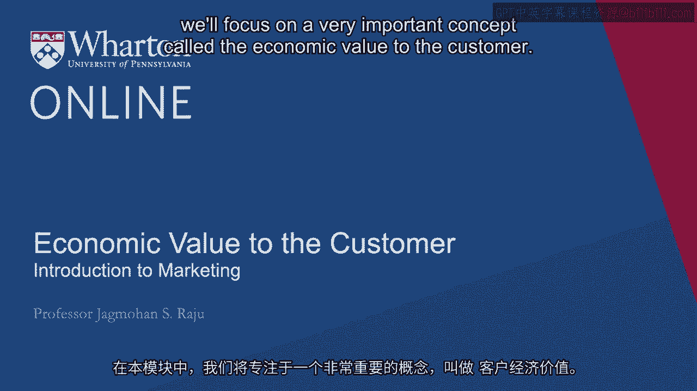
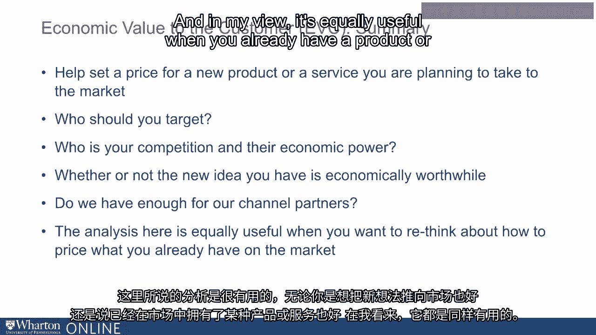

# 沃顿商学院《商务基础》｜Business Foundations Specialization｜（中英字幕） - P25：24_客户的经济价值.zh_en - GPT中英字幕课程资源 - BV1R34y1c74c

In this module， we will focus on a very important concept called the economic value to the customer。

In short， we often refer to this as EVC also。 This concept can be very useful on a number of things。

One， it helps us set a price for a new product or a new service that you are planning to take to the market。

It is also useful to identify whether or not this new idea。

new product or new service you have is economically worthwhile。

It can be used also very effectively to decide who or which type of customers you want to target。

You may recall Professor Kahn spoke about segmentation and targeting。

And we can use economic value to the customer to help make these decisions in a sound manner。

It also helps us identify who your true competition is and what is their relative economic power。

It also is just as useful about helping you rethink about how to price what you already have on the market。

So let's start with a small case study。 This is a very popular case study。

It was written by me and it is used extensively at Vartan。 And it uses my own personal example。

So we used to have a swimming pool in our house and every winter I used to worry about what to do with the pool。

The pool was about 20，000 gallons and it was in my backyard and every winter the water would get dirty。

And then next spring I will have to clean up the water。

run the filter for many hours and I didn't like that。 So what I did was something simpler。

Every fall or late fall I used to just drain the entire water of the pool and then refill it again in this spring。

The problem with this method was that my suburb has very strict laws regarding water disposal。

So I can't just throw the water on the street。 So I have to have a township truck that comes and takes the water away。

And this township truck charges roughly one dollar per thousand gallons of swimming pool water。

And then come next spring when I have to refill the pool I have to get fresh water which I think I just put the tap on。

And that is about a dollar for each hundred gallons。

You know there are many times I have thought about not refilling the pool but if I did that my kids would never talk to me again。

So I have to refill it。 I gathered many years ago that there was a new product on the market that was very easy to use。

All you do is drop the tablet in the pool water and put your safety cover on which I had to do anyway whether I drained or not because if I don't have the safety cover on my guests would fall into the pool。

So I just took the spring。 The idea was to just take the cover off next spring and the claim from the inventor of the new tablet was that the pool will be sparkling here and clear in the spring just as it was the day I closed it。

So I think the question to ask is we have a new innovation that will help Professor Raju do his job faster。

better。 How much would he be willing to pay for this little tablet？

So this is where economic value to the customer comes in as a very handy tool。

So let's look at Professor Raju's cost of draining the pool。 So it's dollar per thousand gallons。

20，000 gallons so that's 20 dollars。 Then refilling the pool is a dollar per hundred gallons that's 20。

000 gallons which is 200 dollars。 So you put the two together it's $220。

Now let's start thinking a little bit more about what this 220 means and what is its economic significance。

If the tablet is priced more than 220 and somebody comes to me and says its price is 240。

what am I likely to say？ Most likely what I'll say is that the current method is cheaper。

I'm not interested in this new idea。 If the product happens to be priced at less than 220。

I'll probably show some interest。 But if it's priced exactly at 220， I'm going to say in my mind。

I'm indifferent between the existing technology， which is throwing the water away and refilling。

I'll call that as a method of working or a technology and the new technology which is using the tablet。

So what is the meaning of economic value to the customer？

What it means is trying to identify a price at which the customer is indifferent between their existing method of doing things。

and the new idea that is being proposed。 So as far as the tablet is concerned。

its economic value to the customer which in this case happens to be me is exactly 220 dollars。

assuming we have done everything correctly。 So what can this be used for？

Can be used now for many things。 It's a very useful input on pricing decisions。 For example。

we already discussed this。 This is the maximum price I might be willing to pay and so this is the maximum price。

The innovator of the tablet or the inventor of the tablet will be able to charge。 Now。

if the maximum is not good enough to make your financials work。

now we are thinking about the inventor of the product。

Then the new product you have is probably not worth taking to market。

So it helps in a go-no-go decision and we'll talk about this quite a bit later also。

Now let's think about another issue that this can be very useful for which is who are your best customers and who you should target。

Again， this is going back to Professor Kahn's session on segmentation and targeting。

Using the analysis we just did， can we identify who will be willing to pay more for the new tablet based on our analysis？

So when I ask this question from my students and also senior executives。

the first answer I get always is those who have bigger pools。 Well， that is true。

If the same tablet works for 30，000 gallons also， then the homeowner who has a 30。

000 gallon pool will be willing to pay more。 Assuming they are of the same type。

then instead of 220 it will become 330。 But then there is a next question when it comes to segmentation and targeting。

which is how will you find out who has a bigger pool。 And when I ask this question。

most of my students remain silent because pools are in the backyard。

And if I am this inventor of this new tablet， how would I know who has a bigger pool or a smaller pool？

Sometimes a clever student will say， "Professor， I can look at Google Maps and see who has a bigger pool。

"， But at least we know it's not easy to identify who has a bigger pool and who has a smaller pool。

especially when you are new in the market。 So I think it's very important to recognize that while size of the pool is a good segmentation variable。

identifying who has a bigger pool and who has a smaller pool is very hard。

So conceptually it's a good segmentation variable， but in practice it will not work as well。

So now let's think of a second answer。 Those who live in areas with the cost of water disposal or fresh water is high。

Now that will be easier to identify because going back to our session on segmentation。

this will be segmentation based on geography。 Certain zip codes will have a higher cost of disposal。

Certain zip codes may have zero cost of disposal。 So this is very easy to identify。

So now we can now segment customers based on geography based on the cost of water disposal or the cost of fresh water。

So it gives us an idea as to how to segment the market and then also decide who to target。

There is another possible answer that I often get when I ask this question。

And students will often say， "Professor， why don't we target those who are more environmentally conscious？

"， So my response always is， how do we define who is more environmentally conscious？

And the economist answer to that is for those whom the market price of resources does not truly reflect their societal costs are people who are environmentally conscious。

That's a very nice and a succinct definition。 But then I ask my students。

how would you know who is more environmentally conscious and who is less environmentally conscious？

Do environmentally conscious people live in certain types of homes？ Do they wear a green t-shirt？

And usually the response is， "Professor， yeah， it's a good idea to go after environmentally conscious people。

but it's very hard to identify who is who。"， So in summary。

the computation of EVC also gives us some insights into how to segment the market and who to target。

And the key decisions in develop， these are all key decisions in developing a good go-to-market plan。

Another area that we can focus on in this very domain is trying to combine what Professor Fader talked about。

which is customer lifetime value and the concept that we discussed just now。

which is economic value to the customer。 Let's think of the following 2x2 table。

You can have customers who have a low CLB， Professor Fader talked about some of those。

and customers who have a high CLB。 And he talked about some of those also。

Now we just learned this concept， economic value to the customer。

Some customers may value the tablet higher， some customers may value the tablet lower。

So now we have this 2x2 gives us 4 possible scenarios。

So let's identify these scenarios and see their managerial usefulness。

I think the obvious one is the ones in the low-low box。

The low-low box is these people are not interested in us。 Why they are not interested in us？

Because they don't value our product。 And they are also not interesting to us。 Why？

Because they have a low customer lifetime value。 These may be people who use the tablet once every 5 years。

They also don't value the tablet。 So these are obviously customers we will not target。

Now look at the bottom right box。 These are the people who are interested in us and also interesting to us。

Why are they interested in us？ Because they have a high economic value to the customer。

They value our product and services higher。 And why are they interesting to us？

Because their customer lifetime value is higher。 These will be obviously the segments to go after。

This will be the best segment to target。 But now let's look at the 2 cross-diagonal boxes。

Low customer lifetime value but high customer economic value。

These people are interested in us but costly to deal with。 Why are they costly to deal with？

Because they have a very low customer lifetime value。 They probably don't buy us frequently。

They ask a lot of questions。 They need a lot of help。 But they do value our product。

So their economic value to the customer is high but the CLV is low。

And then look at the lower left side。 The lower left side is interesting but not interested in us。

Why are they interesting？ Because they have a high customer lifetime value。

And why are they not interested in us？ Because they don't value our product。

Maybe they have smaller pools or they rather do their work themselves。

So I think this combining of customer lifetime value concept。

that Professor Fader described very vividly and nicely combined that with this concept of economic value to the customer that we just discussed。

I think you put these two together。 It gives you very deep insights into your customer base。

of the types that we typically don't think about。 Which is two variables interested in us or interesting to us。

And when you combine these two， I think it really gives you deep insights about your customer base。

And we use this extensively in deciding which customer groups to target and which ones not to target。

Now let's ask another question。 What else can we use EVC or economic value to the customer for？

We can also use it to identify who our true competition is and what their response might be when we launch a new idea。

So let's say we are thinking of the person who invented this tablet。

And you ask the question who will this person compete with？

And the typical answer you will get is other people who make such tablets or those who might make such tablets in the future。

That's a good answer but I don't think it's a great answer。 I think we can do better。

And a better answer begins by redefining what is competition。 A broader in my view。

if not a better view of defining competition is who all will suffer if we succeed。

So let's think about that。 If our new tablet becomes successful and people like Professor Raju start to use it。

who will lose business？ Well， the first person who lose business is companies that take the water away。

companies that haul the water away。 Why？ Because now people like Professor Raju will not have companies haul the water away because all they do is put the little tablet。

Water companies that supplies water will also have lower business because now their billings will go down。

So whenever we take a new idea to market or a new product to market。

value shifts from one industry to another。 And the concept of economic value to the customer helps us identify where will the value migrate from。

It's not about one tablet competing against another tablet。

It's the launch of a tablet takes money out of certain other industries。

And once we identify where the value is going to migrate from。

we know they are going to respond in some way to prevent that from happening。

So we can expect some response for those who lose if we win。 And this， I believe。

gives us a broader understanding of who our competitors are。 These are people who lose when we win。

Again， economic value to the customer gives us some insights into where value gets migrated from。

We talked a little bit about making go-no-go decisions using economic value to the customer。

Let's get back to that in a little bit more detail。

We can define the value of an idea by estimating the value it creates for the company。

Let's assume for the moment that all customers are exactly like me。

Then each will be willing to pay a maximum of $220 for the tablet。

If we were told that the cost of making this tablet is $240 per tablet and you put $220 next to $240。

it's not rocket science to conclude that this is not a very useful idea because it costs $240 to make。

but the maximum that a customer is going to be willing to pay is $220。

But what if we were informed that the cost of making this tablet is only $20？

Then the company has created or the innovator has created a value which is $200。

which is 220 minus 20。 Now this is the value we can now put to work and more on this as we go forward in terms of improving pricing decisions。

So let's say the economic value as we computed is 220， the cost is 20。 In this chart。

I have drawn 220 at the top and 20 at the bottom。 And let's say we are hypothesizing a price of $100。

If we are hypothesizing a price of $100 and we put 100 on this chart， what insight does it give us？

Well， it tells us that we are giving the customer $120 incentive to switch from whatever they are doing today to this new method of working。

And the inventor of the tablet is going to get a margin of $80。 Where am I getting $80 from？

It's 100 minus 20。 And where am I getting 120 from？ It's 220 minus 100。 Remember。

it costed him $220 to keep the pool fresh by spring。 Now if the price of the tablet is 100。

he is going to save $120。 Now if we shift the price higher or lower。

let's say we increase the price to 140。 What are we really doing？

What we are doing is balancing the incentive given to the customer against the margin for the inventor of the product。

So in this particular framework， price becomes a sharing rule。

A rule by which we decide how much of the created value is shared between the inventor and the customer。

And it's a very useful way of thinking about making good pricing decisions。

We could now bring our channel partner in the analysis。

If the inventor of the tablet is not going to go to people like Prose Raju directly。

but maybe go through a store， a swimming pool store， then we have to keep their interest in mind。

Let's say we charge a price of $70 to our channel partner。

and the channel partner then charges a price of $100 to the end user。

The channel partner is going to make $30。 Is the $30 margin per tablet good enough for the channel partner？

Well， how will we answer that question？ What are his or her other alternatives？

What can he sell that will give him $30， maybe more than that？

If there are many things that he can sell that will give more than $30， then $30 is not enough。

But it helps us identify each person's incentives。 And then the next question we ask ourselves is。

have we created enough value or has the innovation created enough value to keep all three parties happy？

Our channel partner， our end user， would they be interested in switching to us？ And also ourselves。

is it enough of a margin to us？ If the difference between the cost and the EVC is not very high。

then it's unlikely that all three parties are likely to be happy。

And the innovation is not likely to succeed。 So in summary。

what do we learn from economic value to the customer？ And what can it be used for？ First。

it helps us set a price for a new product or service that you're planning to take to the market。

Number two， an equally important decision， if not more important， is who you should target。

Remember， Professor Kahn spoke about segmentation and targeting。

We can use EVC to actually bring that to life and help us make these decisions in a sound manner。

It also helps us identify who your true competition is and their economic power。

And then correspondingly， whether the new idea you have is economically worthwhile。

Do you have enough for our channel partners？ That's another area that this concept can help us answer a few questions。

And the analysis here is useful whether you are thinking of taking a new idea to market。

And in my view， it's equally useful when you already have a product or a service on the market。

and you want to rethink about how to price what you already have there on the market。 [ Silence ]。

