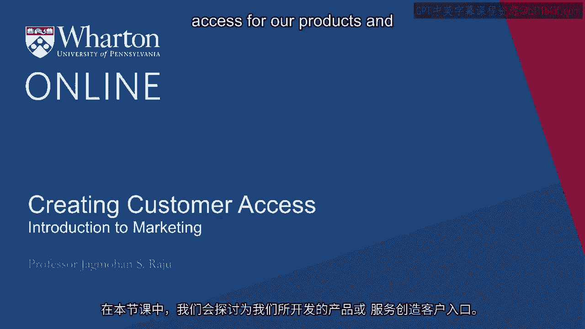
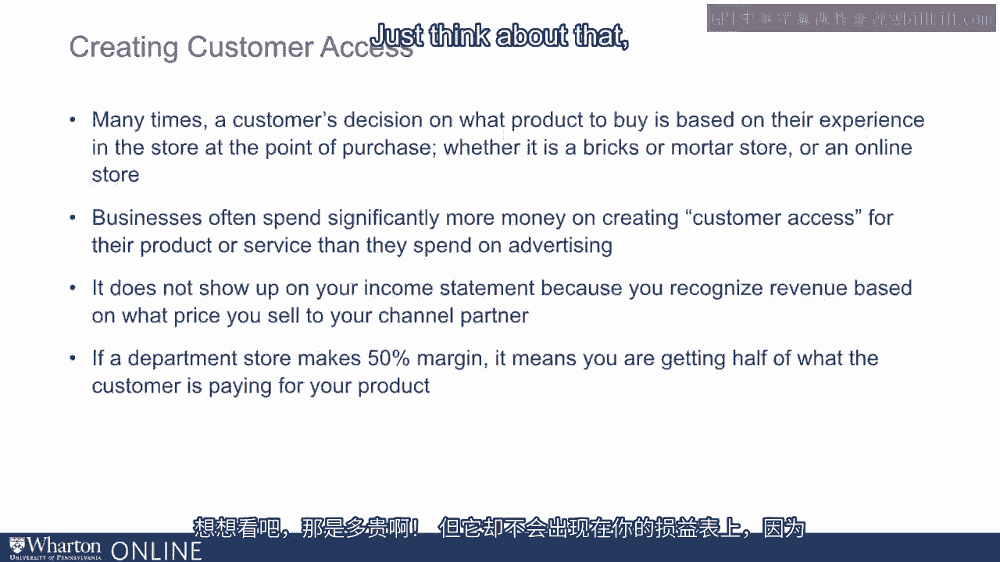
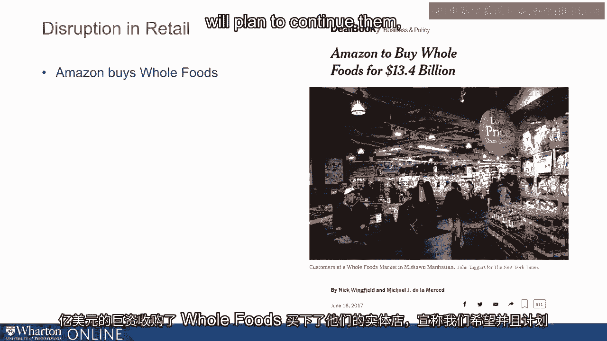
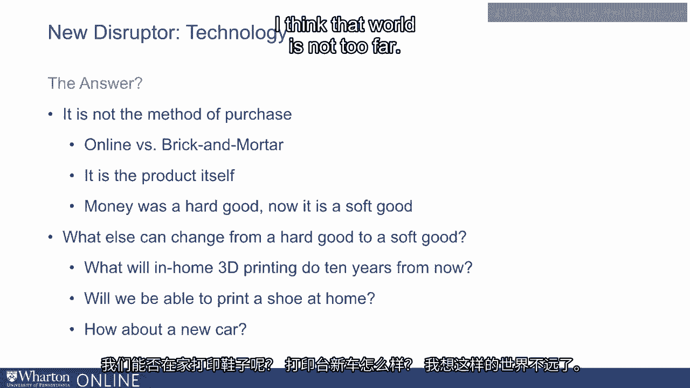

# 沃顿商学院《商务基础》｜Business Foundations Specialization｜（中英字幕） - P26：25_创造客户便利.zh_en - GPT中英字幕课程资源 - BV1R34y1c74c

In this lecture， we will talk about creating customer access for our products and services。

that we've developed。 When we develop a go-to-market plan。

there are four areas where we need to make key decisions。

What will our product and service look like， what features and benefits it will have。

how will we price it， how will we promote it through advertising and price discounts。

and then finally， place。 What we mean by place， broadly speaking。

is making sure your product or service is accessible， to the customer at the right place。

at the right time， and of the right type and quantity。 In old-school marketing。

this was referred to as distribution channels or just channels。 Why is this important？ By this time。

you know how to understand your customer， develop a great product or service。

based on that customer input， created a great brand as Professor Khan spoke about， and communicated。

the value through your advertising campaign and even priced it appropriately。

But what if your customers are not able to find it？ All that you have done may not matter。

Many times， a customer's decision on what product to buy is also based on their experience。

in the store at the point of purchase， whether it's a bricks and mortar store or an online， store。

It's also important to recognize that most businesses often spend significantly more。

money on creating appropriate customer access for their product or service than they spend。

on advertising or promotions。 In many cases， it's been studied extensively that you are spending three to four times as。

much on creating customer access。 So it's expensive。

Some companies are spending 40 to 50% of their revenues on creating customer access。

And what's interesting is that most companies don't even know the cost of it because it。

does not show up on your income statement。 Think of a company like Unilever。

Your revenues are recognized based on how much you sell to your distributors and the。

distributors then sell the product to the end user。

What you recognize is the price at which you sell to your channel partner or your distributor。

The difference is what they charge the end user。 So if you think of a standard department store。

they make 50% margin。 It means you are getting half of what the customer is paying for your product。

Just think about that。

How expensive that is。 And it is not even showing up on your income statement because it's really you not recognizing。

that channel margin because that's from the income statement of the channel partner。

How we create customer access or what we call traditionally creating a distribution channel。

can also be a great source of competitive advantage and a disruptor in the marketplace。

Many businesses have been disrupted。 Many industries have been disrupted nearly because somebody else came up with a better。

distribution channel to access the customer。 If we look at this concept of disruption and especially if we look at retail and you look。

around us， so many changes that are happening in 2017 for which we have some data。 Nearly 9。

000 bricks and mortar stores closed in the US。 So as the rest is out of business。

Circuit City has gone well known department stores， that many of us left such as Philines， Hex。

Merwins， Masha Fields are all gone。 Righted close 600 stores， sports authority 460 stores。

Even companies like Walmart are closing stores， Macy's is closing 100 stores。

But when you also compare it with other things， Warby Parker。

I glass retailer has opened approximately， 100 retail locations。

Casper that we'll talk about in more detail later is opening 200 stores。 Amazon。

the big killer of bricks and mortar retail just bought whole foods for 13。4 billion。

and bought their bricks and mortar stores and we'll hope we'll plan to continue them。

and use them to the best of their capability。 So I think all this makes us wonder that if online is the place to be。

why are companies， opening physical stores？ What's really going on？

How do we make sense of what is happening here？ And let's also not forget that some of those being disrupted today were actually the disruptors。

You can go back to the 1980s and late 1980s when Toys R Us， Circuit City and Sports Authority。

were once deemed as category killers。 They were the innovators of the day。

Department stores were an innovation that went on to change the very face of detail and。

how customers bought products and services。 Harding and Howell to the best of my knowledge in 1796 in London was the very first department。

store。 Macy's opened in 1878 in New York and Selfridges opened in 1909 in London。

These were the innovators of the day and disruptors of their times and some are still around。

In order to understand all this， I think we need to get to basics and start with foundations。

of how we understand distribution channels and creating customer access。

So let me start by giving what often people call as an old school tutorial on channels。

that is still just as relevant。 In order for any of us to buy a product or a service。

two things are important。 We need to have access to。

One is what we call as relevant information needed to make the purchase and we'll talk。

more about this in a minute。 And the second is I should be able to execute my purchase through the right logistics。

Now the skill of the provider and the importance to the buyer of information logistics drives。

optimal channel structure。 So let's think through this a little bit more。

What do we mean by information？ What do we mean by logistics？ So let's think about information。

First piece of information I need to know is why should I buy this product or service？

Why should I pay so much for a new idea？ How will it work？ How will I use it？

We call this primary information。 And then there is what we call as comparative information。

Why should I buy from you and not someone else that is comparative information？

Every customer needs this in order to decide whether or not to buy a new product or a service。

And the second part is logistics。 There are many components of logistics。

Convenience and accessibility。 How far will I have to travel to buy it？

I am hungry now or I need diapers for my young child。 How much will I have to travel to get those？

Will I have to buy 24 bottles of one a day vitamins with each having 120 capsules？

Can I buy just one instead of having to buy so many？ How long will it take for me to get it？

Time between order and receipt of goods is important。

Who will I go to if the snow blower I just bought doesn't work？

Who will I ask if I have a problem in assembly？ A part is missing or broken。

Where will I get it from？ All this falls under logistics。

So we can see a consumer when they are making a decision to buy a product or a service。

They need to have information about its value， its price， how it works， but also needs to。

make sure that the product is accessible at the right time， at the right place， in the。

right quantity and of the right type。 Now how do we put together all of this in a reasonable。

easy to understand framework？ It requires making a few sort of starting assumptions as we call it。

Traditionally one can start by assuming that a manufacturer， somebody let's say who makes。

shoes say Nike is in a better position to provide information about their shoe。

Why is this shoe more interesting than another shoe？

But intermediary say a retailer of a shoe is probably better at providing logistics。

Now these are starting assumptions and over time these assumptions change and with that。

frameworks will also change。 Now different products and services may have different levels of information requirements。

and logistic requirements。 Some are high， low on both sides。 So for example。

if a hospital is purchasing a radically new equipment for say proton therapy。

they require a lot of information on whether to buy， which one to buy， but the lead for。

logistics is low because they are going to buy it once and never again。

It's not like they are going to buy this every day， every month， so the product has to be。

available to them at the right time。 It's a one time purchase。 On the other hand。

if the same hospital is going to adopt a new drug that will be used， extensively in the hospital。

say it's an antibiotic that will be used extensively for many patients， at many different times。

then the need for information is high。 Why should they adopt this new antibiotic？

But also they are going to have to purchase it extensively repeatedly。

So the need for logistics is also high。 Think of another situation where either us as the warden school or a hospital is going。

to replace table lamps that are sitting on a desk。

While table lamps are not that complex of product， we are going to buy it maybe once every few。

years。 So the need for information is also low and the need for logistics is also low because。

low because it's infrequently purchased。 On the other hand。

think of buying a surgical supply for a hospital， which is used extensively。

but I bought it many times before。 So I really don't need to know too much about it because I've already purchased it before。

but I need to make sure it comes to me at the right place at the right time， so I'm not。

out of stock。 So in this case， the need for information is low， but need for logistics is high。

Now depending on various combination， we can set up different types of customer access， structures。

So for example， if the need for information is high and the need for logistics is low。

it's a one-time purchase， we can go direct to the customer。

And that's what happens most of the time is these companies have their own salespeople。

they go have interactions with the hospitals and then directly install the equipment。

On the other hand， if it's a new drug that is going to be adopted by a hospital or a。

set of physicians， then of course the pharmaceutical company sales reps will go。

convince the doctor， in the hospital why this drug makes sense， why it should be adopted。

But then the hospital does not buy the drug directly from the pharmaceutical company。

There are many intermediaries who do that for us。 So we'll call that system a pull system。

why do we call it pull？ Because the job of the company is to actually create the demand for the product and then。

the product is then purchased from ancillary and wholesalers。

So this is a framework that we often use to design what we call as structure customer。

access or channel design decisions。 Now this is the traditional view of thinking。

What has happened over time is something different。

But let's first focus on this to understand how disruptions can happen within this framework。

So what this framework argues for is that a particular product or a service， the nature。

of the product or the service determines whether you need high logistics or low logistics or。

high information or low information。 Once you have that。

then disruption occurs by reallocation of functions。 So I'll just give one example。

Furniture is a complex product。 We buy it once in a while。

It requires high level of information and also high level of logistics。 But what did IKEA do？

What IKEA said was you can come to IKEA and pick up the furniture but you will install， it yourself。

you will assemble it yourself。 So they outsource the assembly and installation to the end user。

That does not mean that installation and assembly was no longer needed。

People often think of disintermediation as saying something is not needed。

The delivery and installation and assembly we still needed in a furniture is just that。

who did it changed。 Earlier a furniture company did everything themselves。

Now IKEA outsourced it to us。 And in the process， we paid less for the furniture。 Why？

Because we are doing part of the activity ourselves。

So in some ways logistics was spun off to us partly。 Not everything but partly to us。

And so IKEA was able to sell the furniture at a lower price to us。 You can look at the other side。

Apple stores now have consultative selling in house or online instead of relying on。

value added resellers。 So what Apple did was actually bring in some of the activities that the value added resellers。

did in their own house and in the process change the business model。

So I think what this framework says is disruptions can happen through reallocation of activities。

or functions but activities or functions do not go away。

And then the channel margin should be a function of what activities is being done。

If a channel partner does more then you have to pay them more。

If you are doing more then you can pay them less。 Now in today's world when we step back a little bit there are other disruptions that are。

possible。 And one of the key disruptors here is technology。

So let me think about technology a little bit more broadly than we typically think about。

And typically we think about technology in retail and distribution channels we think of。

online buying that we can order something online。 But technology is much bigger than that。

And the impact on customer access is far deeper。 Let's think of three industries。 Books。

music and let's say money。 I ask my students which of these three industries has been most disrupted by technology。

And the typical answer I get is books， Amazon started as a book seller but now it's much。

bigger and books have been disrupted。 But oftentimes that's not the right answer。

Why have these three industries been disrupted the most？ It's not because we can buy books online。

It's really because today all these three products which were earlier hard goods。

The hard goods I mean book is a hard good。 It's a physical product has been converted to a soft good。

What do we mean by a soft good？ Book is now a soft product。

You can download it on your computer or on your iPad or on your Kindle。

Think about what music was many years ago。 If you were rich enough， you were a king or a queen。

the musician came and played music， for you and all the poor people may be sat on the side and if the wind blew in their。

direction they could hear the music。 But then music gets codified into a tape。

Then it gets codified into a record。 Some of you may still remember seeing a record。

They are coming back because they apparently have still better quality。

Then it went from a record to a tape， sorry a CD。 And now what is music？

Music is basically bits and bytes and now it's become a soft good。

Money at one point in time was gold。 Then we got paper。

then from paper we went to plastic and now what is money？ Most people say it's just a number。

It's sitting in your account and sometimes you know it and sometimes you don't。

So what technology has done in all these three industries is convert a hard good to a soft， good。

When a product changes from being a hard good to a soft good， that's when disruption happens。

And in my view， the biggest disruption has been for money。

Money today is transacted very differently than money used to be transacted many years， ago。

If you think of books， still many many people read regular books。 They prefer to read regular books。

Very few people want to have cash。 Many countries have gone cashless。

Many industries have tried to go cashless。 So this is an example of disruption of technology where a hard good got converted to a soft good。

So the answer is really not the method of purchase。 It's not online versus bricks and mortar。

It's the product itself。 What else we can ask ourselves can change from a hard good to a soft good？

What will the world look like 10 years from now？ What will in-home 3D printing do 10 years from now？

Will we be able to print a shoe at home？ How about a new car？ I think that world is not too far。

People are arguing that within the next 20 years， many products that are what we consider。

as hard goods today will become soft goods that people will be able to just print at home。

with additive manufacturing。 I can only visualize what customer access will look like when that happens。

So I think it's really important to understand the role of technology in this area more broadly。

than just online versus bricks and mortar。 Thank you。 [BLANK_AUDIO]。

