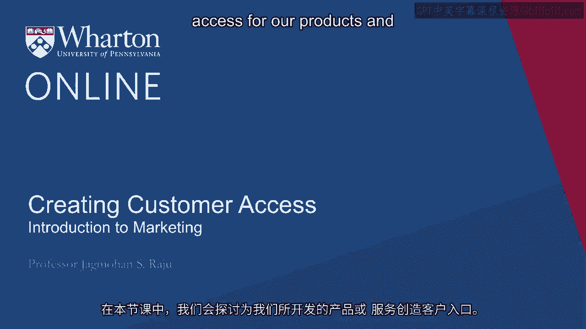
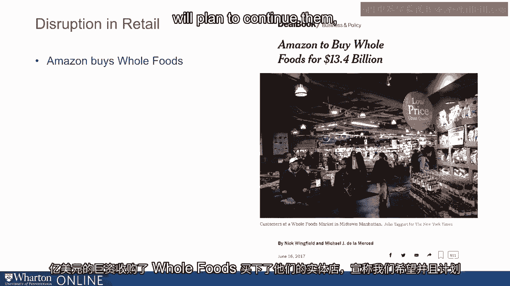

# 沃顿商学院《商务基础》｜第26课：创造客户便利 🛒

在本节课中，我们将探讨如何为已开发的产品和服务创造客户便利，即确保客户能在正确的地点、正确的时间，以正确的类型和数量获取它们。

---

## 概述

当我们制定市场进入计划时，需要在四个关键领域做出决策：产品与服务、定价、促销以及渠道。本节课将聚焦于“渠道”，即如何确保客户能够便利地获取你的产品或服务。我们将探讨其重要性、成本、传统框架以及技术如何颠覆这一领域。

---


## 为何客户便利至关重要？

上一节我们讨论了如何通过广告和定价来沟通价值。然而，如果客户无法找到你的产品，之前的所有努力都可能付诸东流。

客户在购买点的体验，无论是在实体店还是在线商店，常常直接影响其购买决策。

此外，许多企业在创造客户便利上的花费，远高于广告或促销支出。研究表明，这部分支出通常是广告费用的三到四倍，有时甚至占到公司收入的40%至50%。

一个关键点是，这部分成本通常不会直接体现在公司的损益表上。以联合利华为例，公司的收入基于其销售给分销商的金额确认。分销商再以更高的价格卖给终端用户。例如，一家标准百货商店可能享有50%的利润率，这意味着你只能获得客户为产品支付价格的一半。



**公式示例：**
```
制造商收入 = 终端用户支付价格 × (1 - 渠道利润率)
假设渠道利润率为50%，则制造商收入仅为终端售价的50%。
```

---

## 渠道作为竞争优势与颠覆力量

如何创造客户便利，或者说建立分销渠道，本身可以成为强大的竞争优势，甚至是市场的颠覆者。

许多行业正是因为出现了更好的客户触达渠道而被颠覆。以零售业为例，2017年美国有近9000家实体店关闭。然而，与此同时，Warby Parker开设了约100家零售店，Casper计划开设200家，而亚马逊则以134亿美元收购了全食超市的实体门店。

这引发了一个思考：如果线上是未来，为何这些公司还在开设实体店？为了理解这些现象，我们需要回归基础。

---

## 传统渠道框架：信息与物流

为了理解这一切，我们需要从分销渠道和创造客户便利的基础开始。任何购买行为都依赖于两个核心要素：**信息**与**物流**。

*   **信息**：指做出购买决策所需的相关知识。
*   **物流**：指执行购买所需的物理流程和便利性。

供应商提供这两项能力的技巧，以及买家对其的重视程度，共同决定了最优的渠道结构。

以下是关于信息和物流的具体组成部分：

**信息需求包括：**
*   **主要信息**：我为何要购买这个产品或服务？它如何工作？我如何使用它？
*   **比较信息**：我为何要从你这里购买，而不是从别人那里购买？

**物流需求包括：**
*   **便利性与可及性**：我需要走多远才能买到？
*   **产品形式与数量**：我能只买一个，还是必须批量购买？
*   **交付时间**：从下单到收货需要多久？
*   **售后服务**：如果产品出现问题，我该找谁？

---

## 设计渠道结构：一个决策框架

根据产品对信息和物流需求的高低不同，我们可以设计不同的客户便利结构。传统上，我们假设制造商（如耐克）更擅长提供产品信息，而中间商（如零售商）更擅长处理物流。

不同产品和服务对这两者的需求组合各异：

1.  **高信息需求，低物流需求**：例如，医院购买一台全新的质子治疗设备。他们需要大量信息来决定是否购买、购买哪一款，但购买频率极低（一次性）。通常采用**直销**模式。
2.  **高信息需求，高物流需求**：例如，医院决定采用一种将被广泛使用的新抗生素。既需要大量信息来说服医生，又需要频繁、稳定地供应。通常采用**拉动系统**：制药公司销售代表说服医生（创造需求），然后产品通过批发商等渠道供应。
3.  **低信息需求，低物流需求**：例如，学校或医院更换台灯。产品不复杂，购买频率低。渠道成本通常较低。
4.  **低信息需求，高物流需求**：例如，医院采购常用的外科耗材。因为经常购买，无需太多新信息，但必须确保库存充足、及时供应。

**代码示例：渠道决策逻辑**
```python
def recommend_channel(information_need, logistics_need):
    if information_need == "high" and logistics_need == "low":
        return "直销 (Direct Sales)"
    elif information_need == "high" and logistics_need == "high":
        return "拉动系统 (Pull System)"
    elif information_need == "low" and logistics_need == "low":
        return "低成本渠道 (Low-Cost Channel)"
    elif information_need == "low" and logistics_need == "high":
        return "高效物流网络 (Efficient Logistics Network)"
    else:
        return "需进一步分析"
```

---

## 颠覆如何发生：功能再分配

在这个框架下，颠覆的发生往往不是消除了某项功能，而是对功能（信息提供或物流处理）进行了**再分配**。

*   **宜家案例**：家具购买需要高信息（了解款式、质量）和高物流（运输、组装）。宜家将**组装和安装**这部分物流功能外包给了消费者自身，从而降低了售价。
*   **苹果案例**：苹果将原本由增值经销商提供的**咨询式销售**服务纳入自家零售店或在线渠道，改变了商业模式。

渠道利润的分配应基于其承担的功能活动。合作伙伴做得越多，你支付的就越多；你自身承担得越多，支付给渠道的就越少。

---

## 技术的深层颠覆：从硬产品到软产品

在当今世界，技术带来了更深层次的颠覆。这不仅仅是线上购买与实体购买的对比。

最大的颠覆发生在当技术将“硬产品”转化为“软产品”时：
*   **书籍**：从纸质书（硬产品）变为电子书（软产品，比特和字节）。
*   **音乐**：从现场演奏、黑胶唱片、CD（硬产品）变为数字流媒体（软产品）。
*   **货币**：从黄金、纸币、塑料卡片（硬产品）变为账户中的数字（软产品）。

**当产品从硬产品转变为软产品时，真正的颠覆就发生了。** 这可能才是音乐和货币行业比图书行业受到更大冲击的原因。

展望未来，家庭3D打印等增材制造技术，可能在未来10-20年内将更多“硬产品”（如鞋子、汽车零件）转化为可在家“打印”的“软产品”设计文件。届时，客户便利的形态将发生根本性变革。

---

## 总结


本节课我们一起学习了创造客户便利的核心概念。我们了解到：
1.  客户便利（渠道）是市场进入计划的关键一环，成本高昂且常被忽视。
2.  一个传统的分析框架基于产品的**信息需求**和**物流需求**来设计渠道结构。
3.  颠覆常通过渠道功能的**再分配**实现，而非功能消失。
4.  技术最深远的颠覆在于将**硬产品转化为软产品**，这彻底改变了产品被交付和消费的方式。


理解这些原理，有助于你在快速变化的市场中，构建或调整有效的客户触达策略。