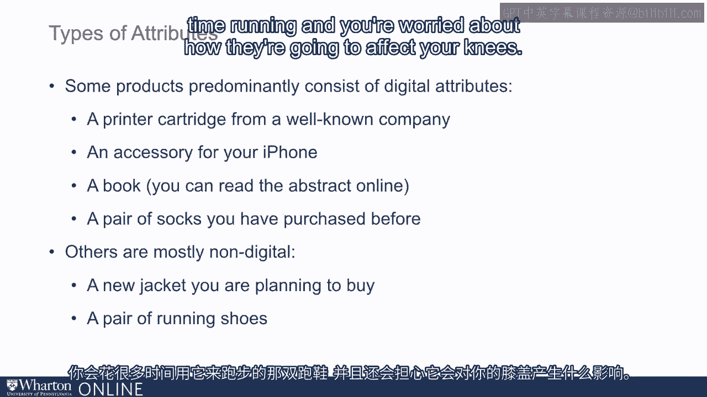

# 沃顿商学院《商务基础》｜Business Foundations Specialization｜（中英字幕） - P27：26_信息交付的颠覆.zh_en - GPT中英字幕课程资源 - BV1R34y1c74c

In the previous lecture we talked about how technology disrupted money， books and music。

mainly by changing a hard good into a soft good and in that way changing the logistics。

Now let's talk a little bit about how disruption happens in information delivery。

If we think about our day-to-day purchases， every product or service that we buy is a。

bundle of attributes or benefits。 Some of these benefits researchers have called as digital attributes or digital benefits。

and others have been classified as non-digital attributes。

So what do we mean by digital and non-digital attributes？

Think about Professor Raju buying a new iPhone。 There are so many digital attributes。

The price of the product， the warranty， the screen size。

I can go to the website and see what the size of the screen is， how long is the warranty。

what's the price of the product， we'll call all these digital attributes。

Then there are non-digital attributes。 The feel and touch of the screen。

the real brightness of the colors， the speed with which， one can open or close apps。

So the non-digital attributes you can see are a little bit different than digital attributes。

Digital attributes are easy to convey using online channel or even catalogs in old days。

For non-digital attributes， the customer prefers to touch and feel the product。

Now some products are predominantly consisting of digital attributes。

Say a printer cartridge from a well-known company， an accessory for my iPhone， a book。

whose abstract I can read online or a pair of socks that I purchased before and I'm sure。

you can come up with many more examples like that。

And there are other products that are mostly non-digital。 A new jacket that you're planning to buy。

a pair of running shoes that you're going， to spend a lot of time running and you're worried about how they're going to affect your。

knees。 Your choice of a channel can depend on whether the product has mostly digital or non-digital。

attributes。 For non-digital product experience is important。

so there is a need for bricks and mortar。 Like trying a new pair of basketball shoes。

Go look at the Nike store these days。 See how an outdoor grill actually works as opposed to claiming that it'll cook burgers。

very nicely。 Sleep or a mattress for at least 15 minutes as consumer reports recommends。

Depending on your product and service， whether it has more digital or non-digital attributes。

you can think of whether you should use online channel or a bricks and mortar channel。

But here again， there is creativity that's important。

There are creative solutions that companies have used to manage non-digital attributes。

in an online world。 So let's look at an example of R。B。 Parker。

A company started by Wartan students a few years ago。 This industry is very large。

over 60 billion dollars and the margins in this industry were， extremely high。

There are different types of providers。 People who provide only glasses。

people who provide fashion goods， people who have insurance， or have retail stores。

all these fell under one group called Laxortica。 They owned everything。 Therefore。

they were able to command high premiums， high price cost margins。

So Wartan Parker comes out and says， "We'll offer a eyewear online。"。

What's the problem with eyewear online？ Most of us who buy a pair of glasses want to try it out。

Now these people can't afford to open retail stores at the time they started。

So how did they beat the non-digital attribute issue？ They said， "Why don't you try these at home？"。

So what did they do？ They said， "You can try five pairs at home depending on whether you like or not。

You can keep one， send the others back。"， So what they're trying to do is using their online world but yet offer the customer an。

ability to try the product through in-home experience。

So they started with that but now more recently they've opened their own stores。

In fact， I referred to this earlier。 They've opened over 100 stores。

But this is one way of making sure that a company predominantly in online world takes。

care of the non-digital attributes of the product。 Mattress Industries is another example。

It's a very large market dominated by two major companies。

The very little growth in the industry， people don't replace their mattresses that often。

It's driven primarily by new home formation。 The adoption online was very limited because it's an unpleasant shopping experience but。

more importantly， you don't want to buy a mattress online because you can't experience。

whether it's going to be hard or soft or medium。 You need to actually go sleep on it。

That's what consumer reports suggest is at least spend 15 minutes sleeping on the mattress。 In fact。

we are in the process of buying a new mattress。 I read consumer reports。

It strongly recommended me to go buy to this， to go to the store and sleep on the mattress。

for 15 minutes on each side， one side， other side on the back。

Now that's an example of a product with very high non-digital attributes。 So what did Casper。com do？

Well， it's a retail online retail store。 But they let you try at home for close to 100 days。

What that does is it removes the anxiety。

It creates a product which has non-digital attributes。 You don't deny it。 You don't fight it。

You say it to the customer， "Okay， you try it。 If you don't like it， we'll actually go pick it up。

You don't have to send it back。"， It started in 2013 and it's now valued at 750 million。

As we look at other opportunities in retail， it's important to understand the effect of。

repeat purchase on digital and non-digital attributes。

Repeat purchase reduces the weight a customer puts on non-digital attributes。

Once you purchase the product， next time in many cases， the touch and feel becomes less。

critical because you already know。 So think about socks。

When I'm buying a pair of socks the first time from a new company， I want to get a sense。

of how soft they are， whether they'll stay up or they fall down。 But once I purchase them。

then I know how they feel。 So I can always repeat by the socks from online retailer。

So there are opportunities online in products that are primarily purchased again and again。

Think about flowers。 Can there be a product that is more touch and feel than flowers？

But yet we buy flowers online。 Why？ Because we know that once we bought it from flowers。

com or one of these stores， we know， what kind of products they deliver and then we are comfortable sending them again。

We know what kind of flowers they send， even though ideally I would like to go and touch。

and feel these flowers。 It's really not worthwhile because I'm sending them again and again。

Thank you。 [BLANK_AUDIO]。

