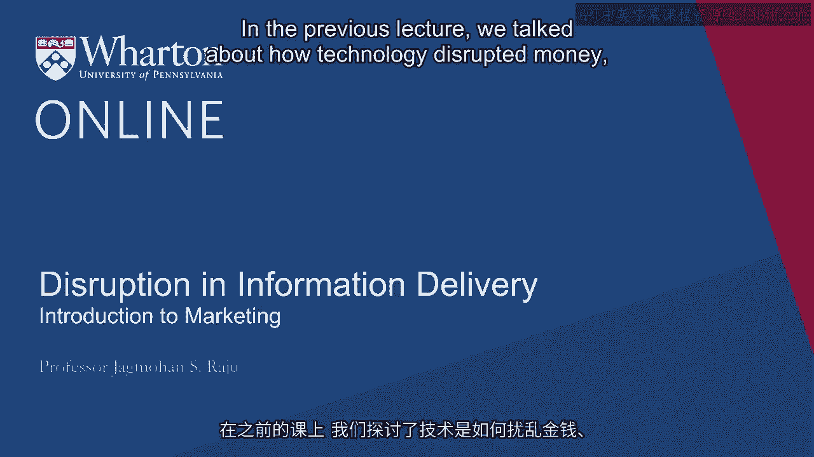
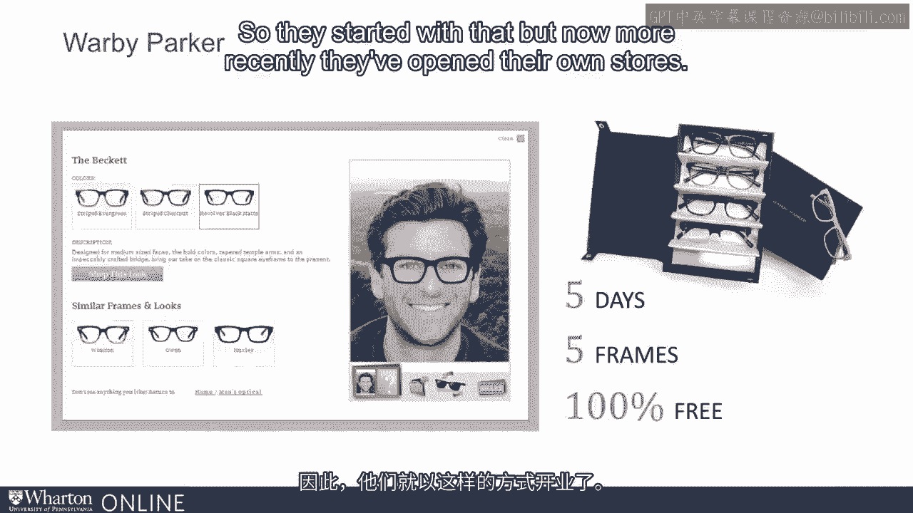
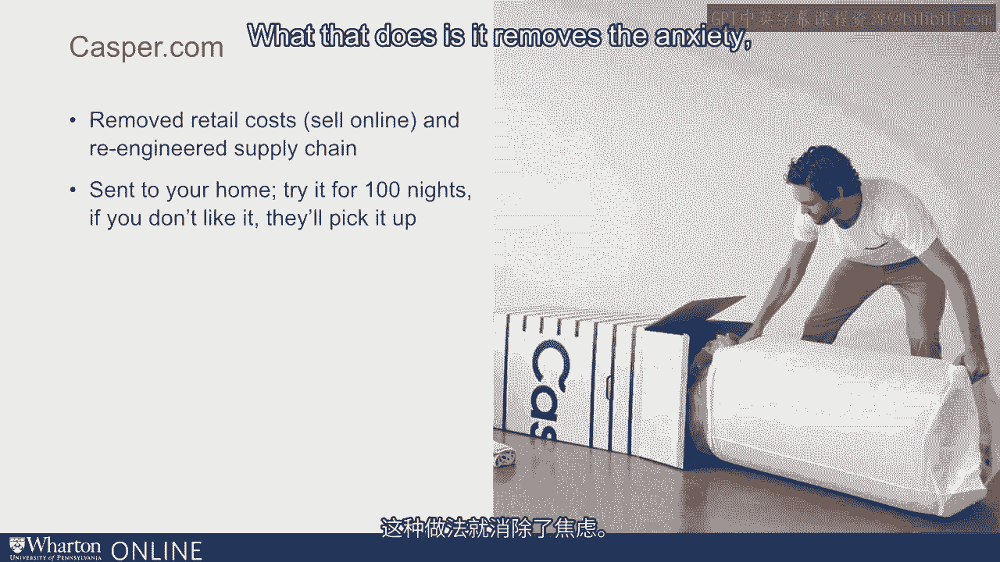
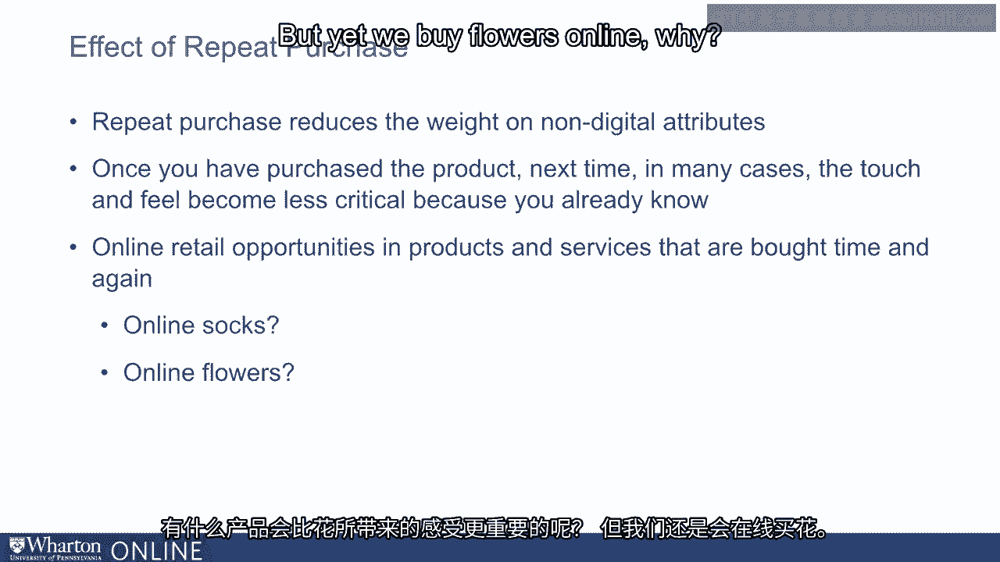

# 沃顿商学院《商务基础》课程 P27：信息交付的颠覆 📡

在本节课中，我们将探讨技术如何颠覆信息交付领域。我们将学习产品的**数字属性**与**非数字属性**，并了解企业如何通过创新策略来克服在线销售非数字属性产品时面临的挑战。

---

上一节我们讨论了技术如何通过将实体商品转化为数字商品，从而颠覆了货币、书籍和音乐行业的物流模式。

本节中，我们来看看颠覆是如何在**信息交付**领域发生的。

## 产品的数字与非数字属性

我们日常购买的每一项产品或服务，都是一系列属性或利益的组合。研究人员将其中一些属性称为**数字属性**，另一些则归类为**非数字属性**。

那么，数字属性和非数字属性具体指什么呢？

以拉朱教授购买一部新iPhone为例。它包含许多数字属性，例如：
*   产品价格
*   保修期限
*   屏幕尺寸

我可以访问网站查看屏幕尺寸、保修时长和产品价格，这些都属于**数字属性**。

同时，产品也包含非数字属性，例如：
*   屏幕的触感
*   色彩的真实亮度
*   打开或关闭应用程序的速度

可以看出，**非数字属性**与数字属性有所不同。数字属性易于通过在线渠道（或过去的商品目录）传达。而对于非数字属性，顾客则更倾向于亲自触摸和体验产品。

## 属性构成与渠道选择

有些产品主要由数字属性构成。例如：
*   知名品牌的打印机墨盒
*   iPhone配件
*   可以在线阅读摘要的书籍
*   曾经购买过且熟悉的袜子

你可以举出更多类似的例子。

另一些产品则主要是非数字的。例如：
*   你计划购买的新夹克
*   你打算长时间穿着跑步、并担心其对膝盖影响的跑鞋。

渠道的选择可以取决于产品主要是数字属性还是非数字属性。对于非数字产品，体验非常重要，因此需要实体店的存在。例如：
*   试穿一双新的篮球鞋。可以去看看如今的耐克店。
*   亲眼看看户外烤架的实际工作效果，而不是仅仅听信其宣传。
*   按照《消费者报告》的建议，在床垫上至少躺15分钟体验。

根据你的产品或服务是数字属性居多还是非数字属性居多，你可以思考应该使用在线渠道还是实体渠道。

## 在线世界的创新解决方案

然而，这里再次体现了**创造力**的重要性。一些公司已经运用创新的解决方案，在在线世界中管理非数字属性。

让我们看一个**沃顿派克**的例子。这家公司由沃顿商学院的学生在几年前创立。眼镜行业规模庞大，超过600亿美元，且利润率极高。市场上有不同类型的供应商：只提供镜片的、提供时尚产品的、提供保险的、拥有零售店的。所有这些都隶属于一个名为**Luxottica**的集团。他们掌控一切，因此能够要求高溢价和高价差。

沃顿派克出现并宣称：“我们将在线提供眼镜。”在线销售眼镜的问题是什么？我们大多数购买眼镜的人都想试戴。而这家公司起步时无力开设零售店。

那么，他们是如何解决非数字属性问题的呢？他们说：“何不在家试戴呢？”他们具体做了什么？他们允许顾客在家试戴五副眼镜，根据喜好选择一副留下，其余退回。他们试图在在线世界中，通过提供**居家体验**，让顾客能够试用产品。

他们以此起步，但最近也开设了自己的门店。事实上，我早些时候提到过，他们已经开设了超过100家门店。这是确保一家主要在线运营的公司也能照顾到产品非数字属性的一种方式。

## 另一个案例：床垫行业

床垫行业是另一个例子。这是一个由两家大公司主导的巨大市场。行业增长缓慢，人们不常更换床垫，其需求主要由新家庭组建驱动。在线采用率非常有限，因为购物体验不佳，但更重要的是，你不想在线购买床垫，因为你无法体验它是硬、软还是适中。你需要真正躺上去试试。这正是《消费者报告》所建议的——至少在床垫上睡15分钟。事实上，我们正在购买新床垫的过程中。我阅读了《消费者报告》，它强烈建议我去商店，在床垫上每侧躺15分钟，正面、反面、背部都试试。

这是一个具有极高非数字属性产品的例子。那么**Casper.com**做了什么？它是一家在线零售店，但他们允许你在家试用近100天。这样做消除了顾客的焦虑。它承认产品具有非数字属性，不否认也不对抗，而是告诉顾客：“好的，你试试。如果不喜欢，我们会去取回，你无需寄回。”该公司始于2013年，目前估值已达7.5亿美元。

## 重复购买的影响

在审视零售业的其他机会时，理解**重复购买**对数字和非数字属性的影响非常重要。

重复购买会降低顾客对非数字属性的重视程度。一旦你购买了产品，在许多情况下，下一次购买时，触摸和感觉变得不那么关键，因为你已经了解。以袜子为例，当我第一次从一家新公司购买袜子时，我想感受一下它们有多柔软，是否会滑落。但一旦购买过，我就知道它们的触感了。因此，我可以始终从在线零售商那里重复购买袜子。

所以，对于那些主要需要反复购买的产品，在线渠道存在机会。想想鲜花。还有比鲜花更需要触摸和感觉的产品吗？然而我们却在网上购买鲜花。为什么？因为我们知道，一旦从flowers.com或类似商店购买过，我们就了解他们交付的产品质量，然后就能放心地再次订购。我们知道他们会发送哪种鲜花，尽管理想情况下我愿意去触摸和感受这些鲜花，但因为我反复购买，亲自去体验并不值得。

---

本节课中，我们一起学习了产品**数字属性**与**非数字属性**的区别，以及它们如何影响销售渠道的选择。我们探讨了企业如何通过提供**居家试用**等创新方案，在在线世界中克服非数字属性带来的挑战。最后，我们了解到**重复购买**会降低顾客对非数字属性的依赖，为在线销售某些类型的产品创造了机会。理解这些概念，有助于在数字时代更好地制定商业策略。