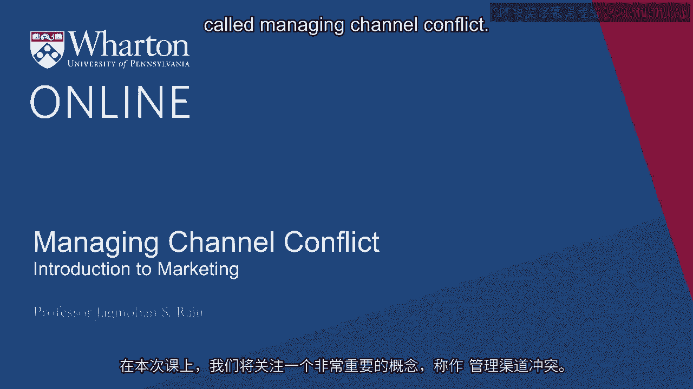
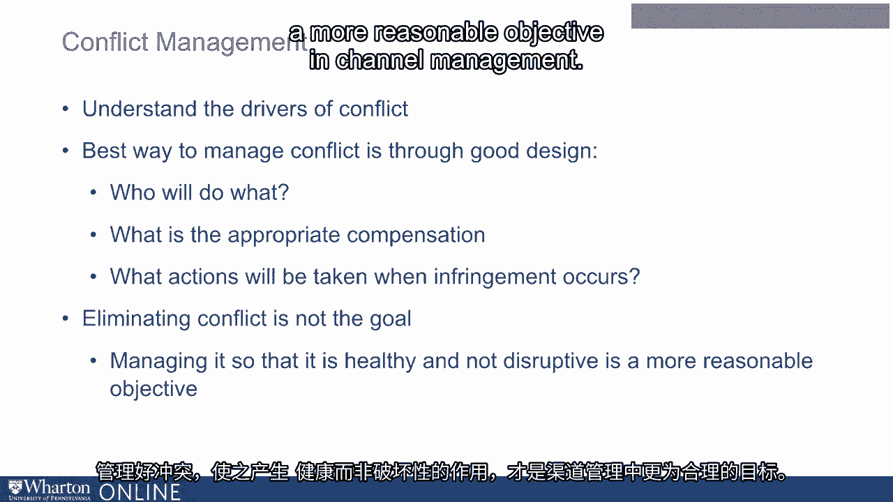

# 沃顿商学院《商务基础》｜Business Foundations Specialization｜（中英字幕） - P28：27_管理渠道冲突.zh_en - GPT中英字幕课程资源 - BV1R34y1c74c

In this lecture， we will focus on a very important concept called managing channel conflict。

Anytime you have a partner who helps take your products or service to the market to， the consumer。

there are opportunities for conflict。 And it is good to understand when this conflict occurs and how you can mitigate it。

There are two types of conflict that are possible。

The first one is between us and our channel partners。 We often refer to that as vertical conflict。

And the second is a possible conflict among star various channel partners that then perturbs。

the channel as a whole。 So think of vertical conflict。 Some years ago。

Costco decided not to carry Coca-Cola in its stores。 That's a conflict between Coca-Cola。

the company and Costco its retailer。 Horizontal conflict comes in different shapes and sizes。

But broadly speaking， a dominant form of horizontal conflict that we need to think about is what。

we call as free-riding。 This is problems amongst your channel partners。

Typically free-riding occurs when a low-service low-price retailer hurts a high-service high-price。

retailer。 So a consumer can go to a high-service high-price retailer。

They are high-price because they provide the higher service。 Get educated about the product。

get all the information about the product， and then go， to a low-service store to buy the product。

A typical example of that we refer to as showrooming。 So Best Buy， for example。

argued that they were the showroom for Amazon。 So people came to Best Buy。

they studied all these high-end televisions， see how the picture。

was or amplifiers and other audio equipment。 They experienced it there。

understood what they were going to buy， but then clicked the， button。

went to Amazon and purchased it from there。 Amazon responded back by coming up with the concept of what we call as web rooming。

which， is I have so much information on the web about various products and services。

We'll come to the website， look at these products， try to understand them， compare them with。

other products， we have comparison engines， but then because they need it tomorrow， they。

go to your store and then buy it right away and take it home because they want to watch。

the Super Bowl the very next day and we can't deliver the next day， at least at that time。

they couldn't。 So I think these are both examples of what we call as horizontal conflict。

either show， rooming or web rooming。 How do we manage such conflict？

I think the first thing for all of us to do is to understand what are the underlying drivers。

of conflict。 The best way to manage conflict in my view is through good design of the channel。

Be clear on who will do what， whose job is it to provide information， whose job is it。

to provide logistics and then what is the appropriate compensation for their activities。

And also put up right away and up front what actions will be taken when infringement occurs。

Eliminating conflict is not the goal， managing it so that it's healthy and not disruptive。

is a more reasonable objective in channel management。

[BLANK_AUDIO]。

