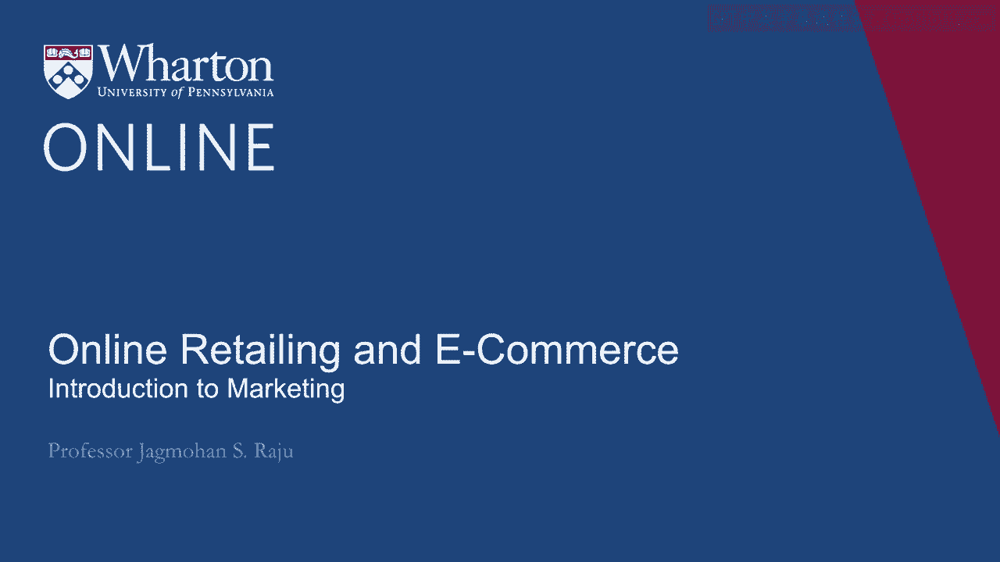
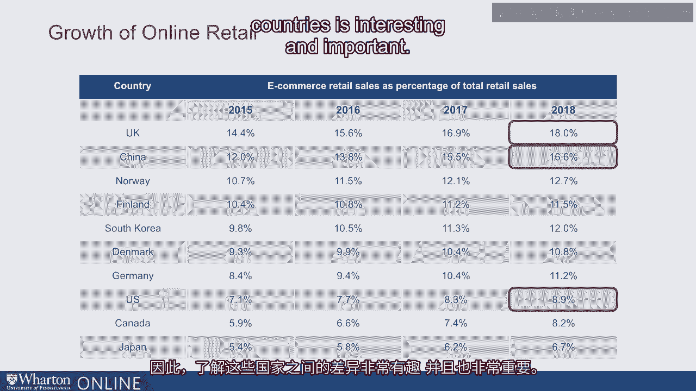
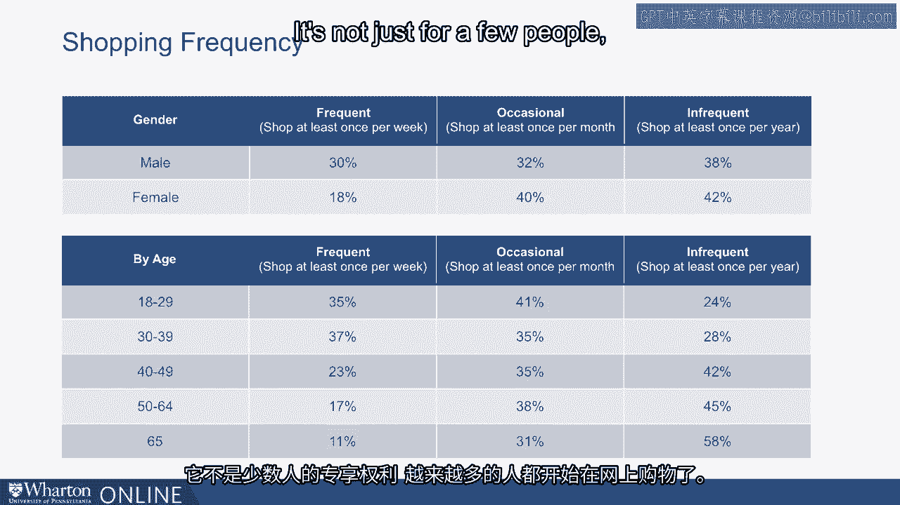

# 课程29：网上零售与电子商务 📈

在本节课中，我们将探讨网上零售与电子商务领域，这是一个近年来持续快速增长的领域。我们将从数据入手，分析全球趋势、消费者行为，并深入理解推动这一增长的核心概念，例如产品的数字与非数字属性。最后，我们将讨论线上与线下零售之间的竞争与融合。

---

## 全球电子商务概览

首先，我们来看一些数据。自2014年以来，全球电子商务销售额持续增长。数据显示，2014年电商销售额占全球零售总额的5.9%，到2018年已增长至8.8%。许多观点认为，这个数字可能被低估了，一些估计认为电商销售额已占全球总销售额的10%。

需要说明的是，这些数据通常指常规零售销售，不包括银行转账或机票交易等所有线上交易。

---

## 国家间的差异

不同国家之间存在有趣的差异。以中国和美国为例，2018年，中国在线零售额占总零售额的16.6%，而美国为8.9%。这表明，从在线销售占比来看，中国远高于美国。

实际上，在中国，现金支付已变得非常困难，几乎所有支付和大量商店销售都已转移到线上。有趣的是，英国的在线零售占比与中国相当，甚至更高。理解这些跨国差异既有趣又重要。

---

## 美国市场的消费者行为

我们今天的重点将主要放在美国市场。

观察人们在线购物的频率，会发现一些有趣的差异。请注意，以下数据考察的是“在已经进行在线购物的人群中”的购物频率。

以下是不同性别和年龄组的在线购物频率分布：

*   **男性**：每周至少购物一次占30%，每月一次占32%，每年至少一次占38%。
*   **女性**：在线购物频率略低于男性。

这些数据并非比较谁购物更频繁，而是展示在线购物者内部的频率分布。将所有行数据相加，总和为100%。

从年龄差异来看，年轻人更频繁地进行在线购物并不令人意外。但这并不意味着老年人不进行在线购物。即使在65岁以上的人群中，也有58%的人每年至少进行一次在线购买。

这一切都表明，在线购物已变得非常普遍，不再是少数人的行为。

---

## 浏览与购买的渠道差异

进一步观察消费者如何在线购买，可以揭示一些背后的趋势。

以下是不同设备在电商流量和销售额中的占比：

*   **个人电脑**：贡献了约54%的电商流量，但产生了接近77%的零售额。这意味着在个人电脑上的转化率更高。
*   **智能手机**：贡献了33.7%的电商流量，但仅产生10.7%的零售额。这表明人们倾向于用手机浏览，但在购买时可能会切换到个人电脑。
*   **平板电脑**：其表现介于个人电脑和智能手机之间。

因此，个人电脑目前仍是主要的购买转化渠道。智能手机更多用于浏览，但随着智能手机体验的改善和用户习惯的改变，这些数字未来可能会发生变化。

---

## 电子商务增长的核心驱动力

现在让我们探讨一个更广泛的问题：为什么会出现这种向电子商务转移的趋势？原因有很多，例如便利性、易用性，也有人认为是价格更低。但让我们更深入地理解其根本原因。

当购买新产品时，我们的首要任务是获取更多产品信息。在营销术语中，我们将每个产品视为一系列属性、利益或特征的集合。

以笔记本电脑为例，其属性包括屏幕尺寸、内存、是否触屏以及键盘手感等。我们可以将这些属性分为两类：

*   **数字属性**：如屏幕尺寸和内存。这些是可以用数字描述的特性，消费者通过浏览网站或去实体店都能获得相同程度的了解。
*   **非数字属性**：如键盘或触摸板的手感。这些属性需要亲身体验才能感知。

不同产品由不同比例的属性构成：

*   **以数字属性为主的产品**：例如知名品牌的网球。消费者熟悉品牌，了解其硬度等，无需打开包装触摸就能决定购买。这类产品更容易转移到线上销售。
*   **以非数字属性为主的产品**：例如汽车。尽管可以在网上查看发动机尺寸、车型等信息，但消费者通常希望试驾以感受座椅舒适度、驾驶平顺性等。这类产品向线上转移的难度较大。

然而，还有一个重要因素会改变这一局面：**重复购买**。

当我首次购买某个产品（如特定品牌的袜子或衬衫）时，我需要去实体店感受其非数字属性（如手感、合身度）。但一旦我购买并使用过，这些非数字属性对我来说就“转化”为了已知的数字信息。

因此，当我需要再次购买同一产品时，我可以很放心地在线上完成复购。首次购买可能在实体店完成，而后续复购则转移到线上。

**这种“非数字属性随时间转化为数字属性”的过程，是推动电子商务销售额长期增长的一个主要驱动力**。因为我们购买的许多产品都是重复性的，首次购买体验使得后续线上购买变得容易且舒适。

---

## 线上与线下的竞争：展厅现象与网络展厅现象

现在，让我们谈谈线上与线下零售之间的竞争。这对于开设线上或线下商店的经营者都是一个需要关注的有趣话题。

消费者可能在线下实体店体验产品（感受所有数字和非数字属性），然后去线上以更便宜的价格购买。这种现象被称为 **“展厅现象”**。

为了减少展厅现象的影响，实体店可以采取价格匹配策略，或在店内提供独特的商品选择。百思买曾非常担忧展厅现象，其应对策略是大力改善自身的在线商店。

相反的模式也存在，即消费者在线搜索产品信息，然后去线下实体店购买。这被称为 **“网络展厅现象”**。

像亚马逊这样的公司如何应对网络展厅现象呢？它们可以通过提高配送速度、降低配送成本、提供捆绑配送服务、优化退货政策或提供更丰富的商品种类来应对。因为如果消费者担心线下商店缺货，他们可能更倾向于直接在线购买。

因此，无论是线上还是线下商店，都需要关注来自“展厅现象”和“网络展厅现象”的跨渠道竞争，并采取相应策略应对。

---

## 迈向全渠道零售

当前的发展趋势正引领我们走向 **“全渠道零售”**。

许多线上零售商开始设立实体店，如Warby Parker。同时，许多线下零售商早已建立了线上商店，例如我们之前提到的百思买，以及沃尔玛和梅西百货。

同时拥有线上和线下渠道，创造了所谓的 **“多渠道零售”**。不同消费者可能偏好不同渠道，而品牌同时覆盖这两个渠道。

**全渠道零售** 与 **多渠道零售** 的区别在于，品牌如何整合这两个渠道。像星巴克这样的品牌，创造了集成的多渠道体验，实现了真正的全渠道零售。顾客可以线上下单、线下取货，或线下体验、线上购买，两个渠道无缝衔接。

展望未来，全渠道零售不再是一种选择，而是线上商业和实体商业取得成功的一项必要条件。

---

## 总结

本节课中，我们一起学习了网上零售与电子商务的全球趋势，分析了消费者行为在不同设备和人口统计中的差异。我们深入探讨了推动电商增长的核心概念——产品的**数字属性**与**非数字属性**，以及重复购买如何将非数字属性转化为数字属性，从而促进线上复购。我们还了解了线上与线下零售之间的竞争模式（**展厅现象**与**网络展厅现象**），并认识到整合线上线下体验的**全渠道零售**已成为未来成功的关键。