# 沃顿商学院《商务基础》｜Business Foundations Specialization｜（中英字幕） - P3：2_战略营销.zh_en - GPT中英字幕课程资源 - BV1R34y1c74c

[MUSIC]。

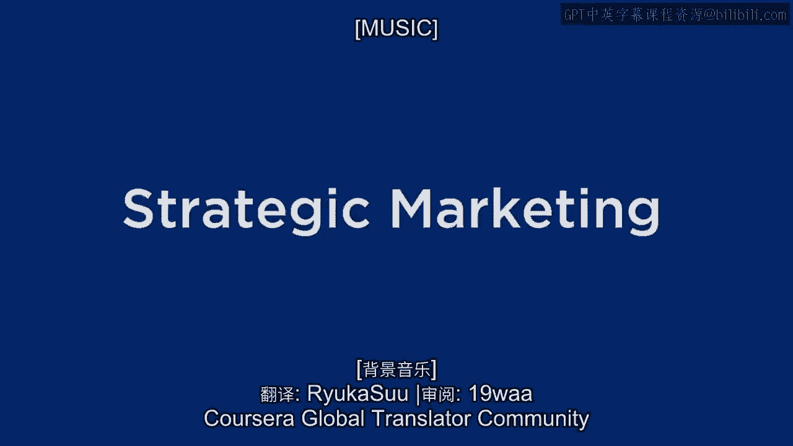

So in this section， what I want to focus on is an introduction of a framework that I think you'll find very useful。

For figuring out how to think competitively to become a leader in your market。

And what I'm going to go over is based on a book that was written by Tracy and， Vereseman。

it's called Market Leadership。 And it's based on their framework， although I've adapted it some。

And the framework， or what I'm going to think of it as kind of a graph or。

the strategic tool is based on a set of principles。

These principles have to be true and you have to believe in them in order for。

this framework to work。 And they're very strong principles。 They're very strong assumptions。

I don't think they're that controversial， but they're not vague。 They really are very strong。

And in order for this technique to work， you really need to abide by them。

And the first one is that you have to know your markets。 Now， before I mentioned。

most businesses are now in customer focus marketing。

That is the type of marketing most businesses are doing。

Because most businesses are very competitive， they're global。

There's a lot of competition out there。 And the only way they're going to win in their marketplace is to focus on the。

customer。 So that's a very important principle in this framework。 It says。

in order to use this framework， we are going to assume that you know what， your customers want。

And furthermore， you know how your competitors are likely to react。

And so what you're trying to do is what I mentioned， that principle of， differentiation。

you're trying to find a way to provide customer value better than， the competition。

And the only way you can really deliver this is to know your markets。 And you can't just guess。

You have to do market research and you have to really understand what your。

customers want and how your competition is likely to react。 So that's the first principle。

The second principle， and this is where it's pretty， it's a pretty defined and， pretty。

it's a definite assumption that's being made。 And the assumption says。

and what I've written here is customers have the final， say。

And what that means is the customers are going to choose what they want。

But the assumption is a strong assumption because we assume that the。

customers go through this decision process。 They look at all the data and all the values and all the attributes and。

all the products in the market and there's so much information out there that。

they can't consider everything。 And so what they do is they kind of chunk a bunch of different things together。

into kind of three bundles。 And the three bundles are one is all sorts of operations factors which。

includes price and cost but delivery， service， reliability， all those kind of。

things are considered operational things。 The other bundle is product features are designed。

So product attributes， style， innovation technology and they put that in， another bundle。

And the third bundle is whether or not it meets my needs。 So is it customized to meet my needs？

And what the customers have the final say says is that customers look at these， three。

they kind of classify the products into these three bundles and。

they kind of give them a score on each one of these three dimensions。

And then they decide which one of those dimensions is the most important to them。

And they pick the product that's the best on one of those dimensions and。

good enough on the other two。 So it says you can't be pretty good in all three of them because then the。

customer won't pick you。 But the customer is going to pick something not that's kind。

if they care about， price， they're not going to pick something that's kind of a good price。

They're going to go for the lowest price。 Or if they care about design。

it's not going to be something that's kind of， good design。

They're going to go for the very best design that they like the most。

Or if they care about how much it meets their own needs。

they're going to go for something that meets their needs the best。

As long as the product delivers satisfactorily or good enough on the other， two dimensions。

So that's a very strong assumption。 But if you think about it。

it kind of approximates the way customers make， decisions。

If you believe that assumption that the customers have the final say and。

they choose the product that delivers the best on the bundle of attributes they。

care the most about， that suggests that if you want to be the first in the markets， that you serve。

you better be the best at something and good enough at the other， two things。

And that should be your market strategy。 And once you decide on which type of thing you're going to be the best at。

the market leader at， then that has implications for the way you structure your， business。

the way you prioritize resources， the way you allocate resources。

the type of people you hire into your company。 It has all sorts of implications for your business organization so。

that you can deliver total value and total quality and guarantee the customer。

satisfaction on this dimension。 So those are the assumptions。 Now before I show you the framework。

I have to introduce one other concept。 And this concept is what I'm going to call their value。

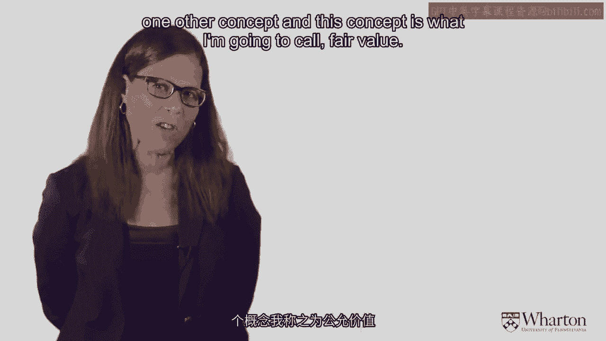

And what I have on the screen here is a value map。

And you have on the vertical axis relative cost to the customer and。

on the horizontal axis relative benefits。 And what the map says is that if you offer more benefits。

customers are willing to pay a higher price。 If you charge a lower price。

customers will expect fewer benefits。 As long as what you offer appears to be there。

If you offer something inferior and it's not fair value， then customers won't buy that。

So you won't make it in the market。 You'll be canceled out of the market because you're not offering a fair value。

And what the framework says is that you need to offer fair value on two of。

those bundles but offer something better than fair value on one of the bundles。 On the bundle。

you're going to be the leader of。 So if you can imagine a marketplace where everybody's trying to deliver fair value and。

somebody's delivering something superior value， think about what's going to happen。

in that marketplace in a very competitive market。 Somebody comes out， let's say Apple。

comes out with a better design。 And so the iPad comes out and it's a much better design。

It's fair price on these other axes but their tablet is better than everything else。

What happens in the marketplace？ And what happens is everybody tries to copy and mitigate the advantage。

And so what happens is what perceived to be fair value， that fair value line is not a static line。

It's constantly moving up， moving to the lower right， as the market gets more and more competitive。

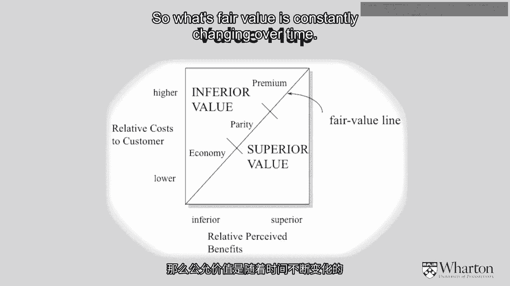

So what's fair value is constantly changing over time。

So although I say what you need to do in this framework is to deliver the best at。

something and stay fair value on the other two bundles。

the problem is fair value is not a static concept。

It's constantly changing as a function of competitive reaction。 So with that said as background。

here's the framework。

And here are the three bundles。 One of them is operational excellence， the others。

performance superiority。 That's the bundle that delivers on product design and style。

And third is customer intimacy， which says give the customers what they want。

You're intimate with customer needs and， you try to deliver something that's responsive to their needs。

And so the three cross hatches here are fair value lines。

Now I had them draw on symmetrically on this axis， but， it doesn't have to be symmetric。

What you need to do if you want to use this framework is in your marketplace。

figure out what are the product attributes that relate to， operational excellence in your market。

And define that dimension so， that you understand what operational excellence is in your market。

You have to do the same thing， what are the product attributes that matter to， the customer。

they design， technology， whatever it is， what are those attributes and define that dimension。

And then you have to figure out how much customization is there in your。

market and define that dimension。 That's the first thing you do。

The second thing you do with this framework is anticipate where fair value is。

This is the trickiest part of this framework。 What are customers expectations on each。

think of these as axes like an X， Y and Z axis。 And where is the reference point or。

the fair value line on each of these axes points？

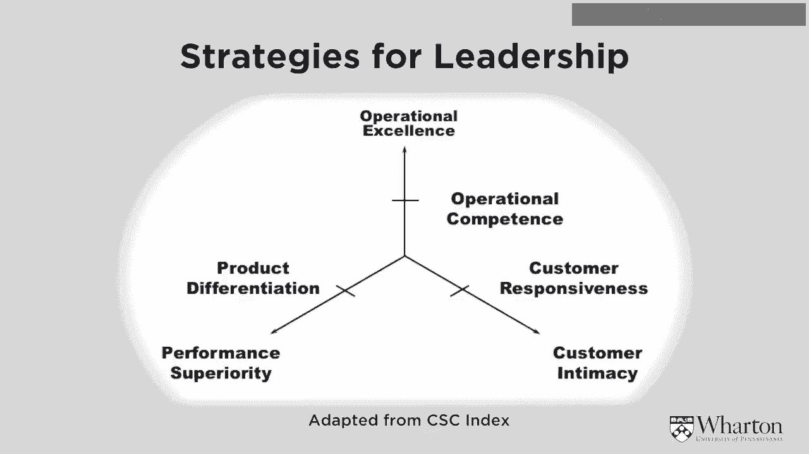

Sometimes people think about fair value as the average of what everybody offers。

Sometimes fair value， nobody offers。 Like for example。

I would say in the airline business people expect an operational， excellence。

constant on time arrival。

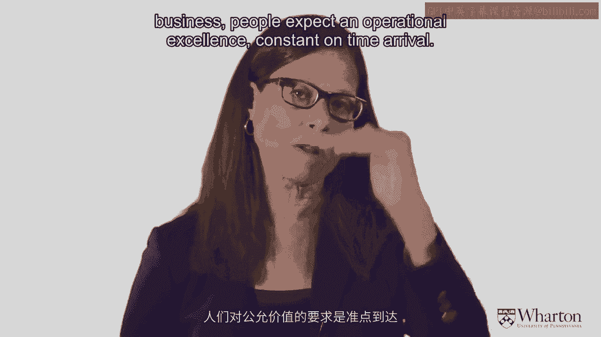

And we know very few airlines deliver to that fair value。 But that is what I think people expect。

And I would say most of the competitors in the market are below fair value。

Sometimes everybody's above fair value。 In some mature markets。

people don't care about some of the bells and。

whistles that come out。 And everybody's delivering at least what they need and some people more。

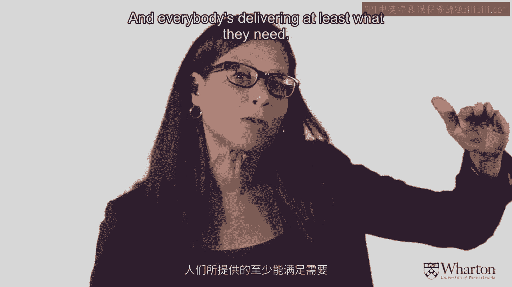

but people don't even care about that。 So figuring out exactly where fair value is on each of these axes is a very tricky。

thing and you need market research to do that。 Once you figure out where your fair value is on these。

the next part is to plot where your company is delivering on each of these。

axes relative to fair value。 Are you above fair value in operations？

Are you meeting fair value or below fair value on each one of these axes？

Then you figure out where your competition is on each of these axes。

And then you start playing the market strategy game。 You think about a short term strategy。

a long term strategy， and， you figure out what should you be doing right now in order to beat the competition。

And what you're ultimately looking for in a long term strategy is to be the best。

at one dimension and good enough on the other two。 That's the long term strategy。 In the short term。

it might be that， let's say， your long term strategy is to be， customer intimate。

but you're not at fair value in operations。 So in the short term。

you might be looking to hit fair value in operations， but in the long term。

you're looking to be the leader in customer intimacy。

And once you decide what your leadership strategy is。

then that has implications for everything you do in your firm。

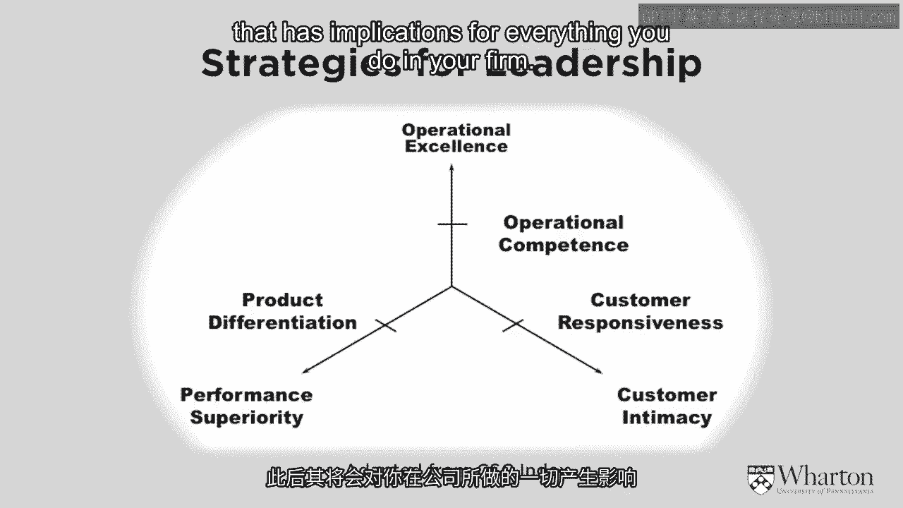

So for example， if you're an operational company and。

that's what you want to be your leadership strategy。

that tends to be a very hierarchical strategy that with allocation of resources。

prioritized to information technology， etc。 If you're a performance superiority company。

that tends to be more of an R&D company。 You tend to hire kinds of people that are very innovative。

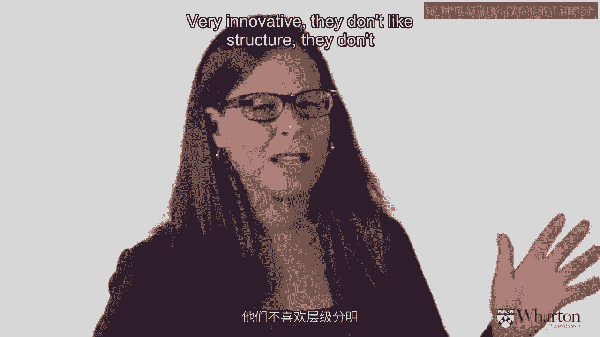

They don't like structure。 They don't like top down organization。

You really need to give them a lot of free reign。

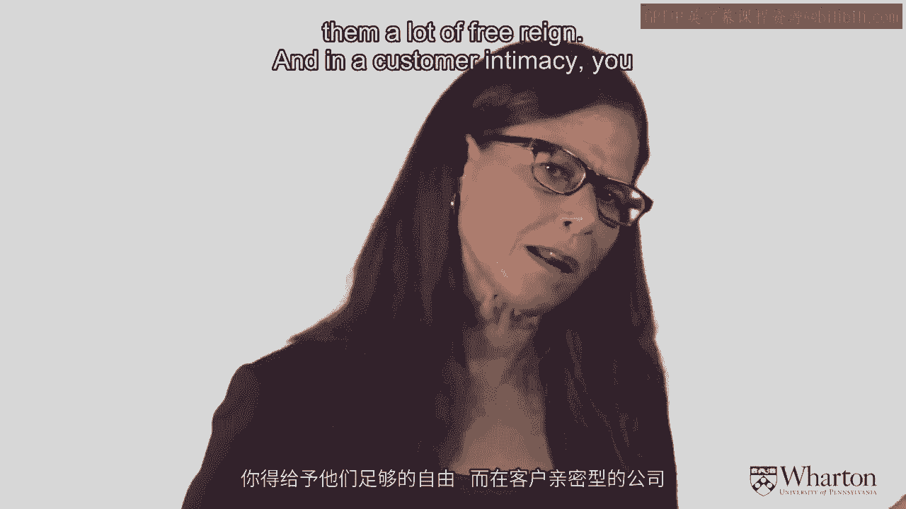

And in the customer intimacy， you really have to focus on prioritizing， market research。

customer knowledge。 And you kind of have a consulting， a yes culture。

You have to let the customer come first。 So once you decide on your leadership strategy。

it has a lot of implications for the rest of the firm。

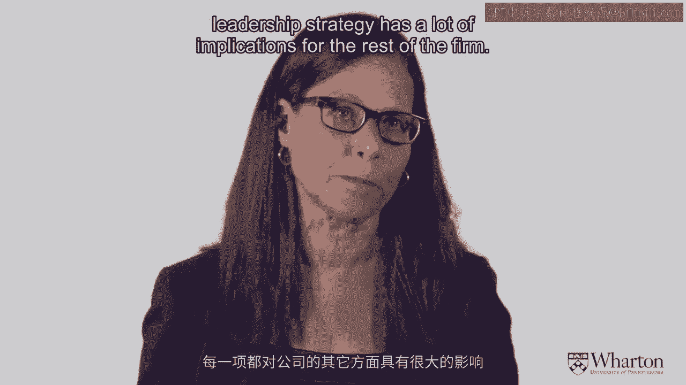

[MUSIC]。

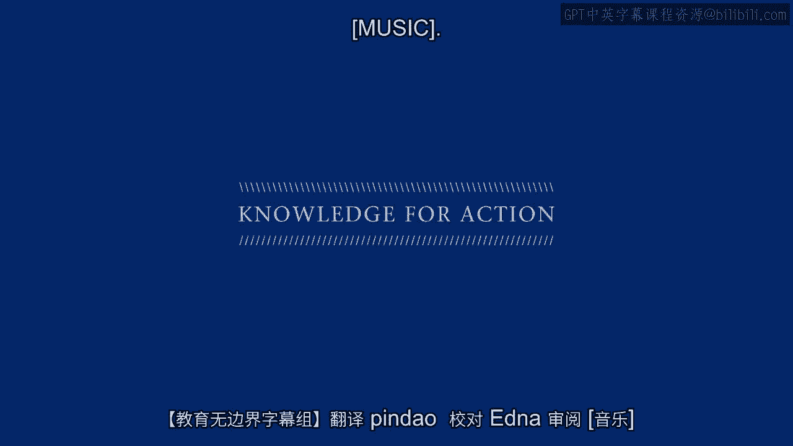

