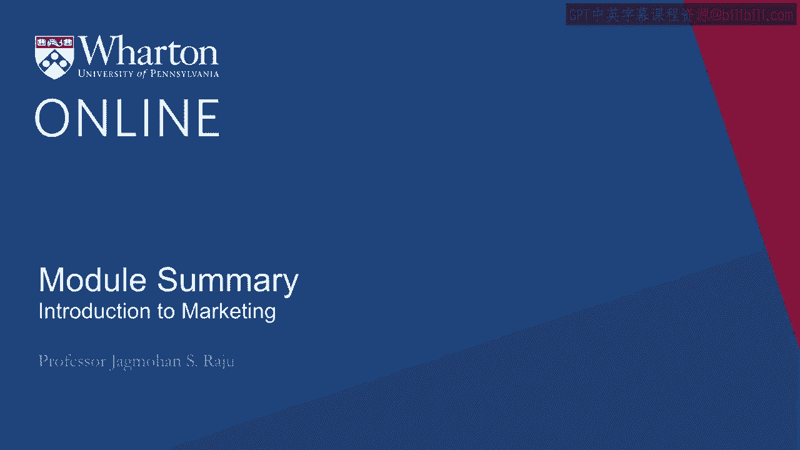
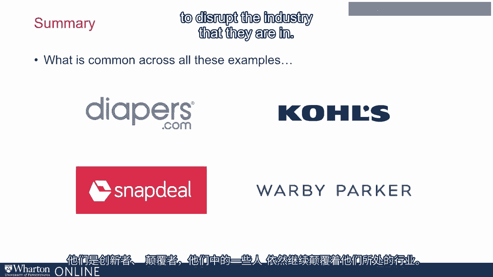

# 沃顿商学院《商务基础》课程总结：构建有效的客户触达渠道 🎯

在本节课中，我们将总结关于如何为你的产品或服务构建正确客户触达渠道的核心要点。确保客户能够方便地获取产品，是商业成功不可或缺的一环。

---

## 客户触达的重要性

上一节我们探讨了营销组合的各个要素，本节中我们来看看为何客户触达渠道本身如此关键。你可能拥有出色的产品、策划了精彩的广告活动、建立了强大的品牌并设定了合适的价格。但如果客户不知道去哪里购买、何时购买，或者产品无法以便利的方式获得，那么一切努力都将白费。产品只会滞销，无法产生任何积极成果。

因此，请务必根据我们所学的知识，审慎、恰当地处理好这一环节。

---

## 渠道决策的特点与成本

渠道决策不仅是营销的关键部分，还具有几个显著特点。首先，它通常成本高昂。**产品价格的30%至40%** 往往被渠道环节所占据，相比之下，公司在广告上的预算投入通常不超过10%。

其次，这是一个相对永久性的决策。我们可以更换广告活动，但改变分销渠道却非易事，必须经过非常周密的思考。

---

## 创新与颠覆的机会

此外，渠道领域也充满了创新和颠覆的机会。许多新的商业理念和公司正是通过颠覆现有的分销渠道而创立的。

所以，请务必牢记：你将如何触达你的客户？

---

## 成功构建渠道的关键步骤

以下是设计和构建有效客户触达渠道时需要遵循的几个关键步骤：

1.  **确保信息与物流**：确保客户能获得正确的产品信息和所需的物流支持。
2.  **审慎分配职能**：仔细规划渠道中的各项职能。明确哪些由你自己完成，哪些由渠道合作伙伴完成。
3.  **设计一致的利益机制**：你的报酬机制是否与你分配给自身及渠道伙伴的活动相匹配？
4.  **预见并管理冲突**：最好在设计阶段就预见可能的冲突并加以处理，这比事后管理要有效得多。

---

## 案例启示与总结

我常以四个商业案例作为本讲的结束，并向学生提问它们的共同点。答案多种多样，但正确的答案是：这四家企业都是由沃顿商学院的学生创立的。他们是创新者和颠覆者，其中一些至今仍在持续革新其所在的行业。

对这些沃顿学生而言，这是在渠道领域创新并赚取可观利润的绝佳方式。我认为，在这个领域的创新与颠覆，对于像你们一样的许多企业家和商业人士来说，同样是创造财富的巨大机遇。

---

本节课中，我们一起学习了客户触达渠道的极端重要性、其高成本与长期性的特点，以及它作为创新突破口的关键价值。记住，一个伟大的产品必须配以同样出色的“上市之路”，才能最终赢得市场。