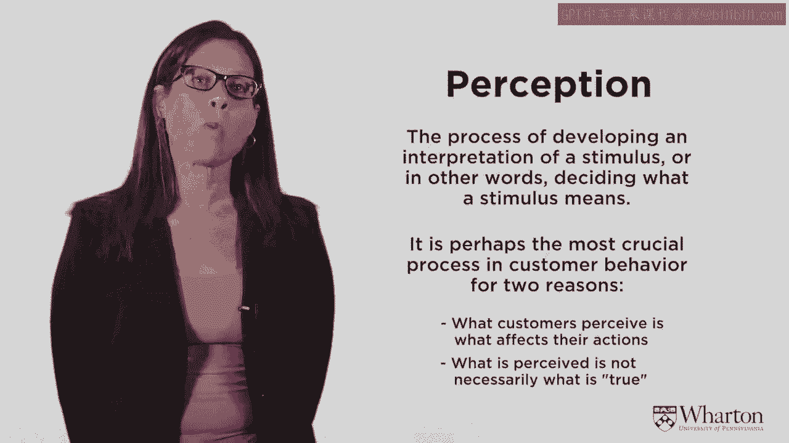

# 沃顿商学院《商务基础》｜Business Foundations Specialization｜（中英字幕） - P32：31_品牌交流.zh_en - GPT中英字幕课程资源 - BV1R34y1c74c

[MUSIC]。

So today， we're going to talk about brand messaging and communications。

We're not going to start at the strategic level， but。

we're going to go a little bit further down into the implementation and tactical level。

And talk again about the way the consumers perceive your brand messaging and marketing。

So let's first start out with what are perceptions。

Perceptions is probably one of the most important aspects in consumer behavior。

in an understanding consumer behavior。 What is a perception？

The perception is the process of developing an interpretation of a stimulus。 Or in other words。

deciding exactly what the stimulus means。 This is really。

really an important crucial area in consumer behavior for two reasons。 First。

whatever customers perceive is what affects their subsequent actions and， behavior。 And second。

and this is what's interesting， what they perceive is not necessarily what's true。

Why is that？ Well， the process of perception is constructive。

People construct their interpretations on the fly。 And this process is inherently biased。

It contains， the process of perception comes in several different stages。

The first two stages are the stages of attention and exposure。

Before you can form any kind of perception， you need to be exposed to the stimuli。

And you need to pay attention to that stimuli。 Pay attention to what's salient to you。

And we know that that process is very biased。 You only expose yourself to things。 Well。

there's sometimes there's accidental exposure， but when you're consciously exposing。

yourself to things。 Many times it's a function of what you believe， what your prior beliefs are。

Let me give you an example。 Say you think that a part of town is not safe。 Well。

you won't go to that part of town。 You'll stay away from that part of town。

So you won't expose yourself to something you don't think is safe。 As a result。

you never have ability to change your perception of that area of town because。

you don't collect new data。 So we know that exposure can be selective。 Similarly。

even if you are exposed to something， if you don't pay attention to it， again， it。

can affect your perceptions。 And we know that there's two kinds of attention。

There's voluntary attention and involuntary attention。

So involuntary attention is something like big bang， and you pay attention to it regardless。

of whether you had intended to。 But for voluntary attention， that again is selective。

So we have the possibility of selective exposure and selective attention。

That means you're not collecting data on things that might be able to change your perception。

So that's the first stage of bias。

The second stage of bias is once you are exposed to something and pay attention to it， well。

then you have to interpret it。 And we know that you interpret data subject to what you already believe。

So for example， most people know if you watch a presidential debate， it's important to have。

representatives who interpret what happened in the debate from both parties because we， know。

a priori， that interpretations are going to vary based on their prior beliefs。

And that's the same thing for any kind of consumer behavior。 You're exposed。

pay attention to certain stimuli， but you interpret it subject to your， prior expectations。

As a result of this， perceptions are frequently biased and they don't necessarily represent。

what's true。 So what's the overview of the perceptual process？

There are sensory inputs that the marketer puts out。 We're going to talk about it。

brand communication， there's advertising， there's packaging， all， sorts of different sensory inputs。

And then you are exposed to them or you're not。 And sometimes the exposure， as I mentioned。

is in a bias way。 And then even if you are exposed to these inputs。

and you're exposed to thousands of marketing， cues every single day。

but how many of them do you pay attention to？ So first there's the issue of exposure。

then there's the issue of whether or not you pay， attention to it。 And finally。

there's the issue of interpretation。

Let me give you an example here。 This is a psychological test。 It's called a Stroop Test。

And what I want to show you is that your perceptions， and I just explained to you your。

perceptions could be biased。 But your perceptions affect your subsequent behavior。

It's almost an automatic reaction。 You have a certain perception。

And then you automatically respond to that。 And it's very hard to control that。 Even if you think。

well， I understand that my perceptions might be biased and therefore。

I'm going to try to do something to control that so I don't react inappropriately。

But these perceptions are automatic things and it's very hard to block their effect。

So let me just give you a little test here。 I'm going to show you several words on the screen。

And what I want you to do is tell me the color of the font。

So there's going to be four words and I'm going to just put them up on the screen and。

to yourself tell me the color of the font。 So here are the words。 There's the second one。

The third one。 And the fourth one。 Now by the fourth one you probably got what was going on。

I mean the first one maybe you were a little bit surprised and you saw that the word was。

blue but the color of the font was red so the answer was red。

By the fourth one you understood the pattern but it was still hard to break it。

You couldn't stop yourself from reading the word and reading the word affected your subsequent。

behavior。 It slowed you down。 That's actually the purpose of the Stroop test。

It's a stress manipulation。 It makes people feel a little bit uncomfortable because of that dissonance。

If I put the words up where the words match the color of the font the task is much simpler。

So here's four words where the color matches and you can see it's much easier much faster。

to say the words。 This is the same thing in the way marketing。

I'm going to show you that color has an effect。 Brand name has an effect。

And you cannot block this effect。 It affects your subsequent perceptions and subsequent behavior and it's an automatic reaction。

that's difficult to stop。 So let me just give you here's an example。

If I told you this is Luscious Chocolate and I show you a picture of it in the shape of。

a cow pie it's very hard to stop that first initial feeling of "Oh I don't want to eat， this。"。

That disgust feeling。 And you know that it's good chocolate but the shape has an involuntary effect on you。

And that's a very important thing to understand。 So marketers need to understand how these things affect your perceptions and your subsequent。

behaviors because as I say these are automatic reactions。

There's some visual illusions you may have seen these before。

I can show you these two lines on the screen。 I will tell you you can measure them。

They are exactly the same length。 However， one looks longer than the other and you just can't stop that feeling。

Even though I tell you they're exactly the same length and I can prove it to you you still。

have the perception that the one on top is longer。 Here's another example。

here's an example of how your prior expectations influence your， perception of the stimulus。

So if I ask you what is this that I put on the screen， you'll answer differently if。

I show it to you this way versus when I show it to you this way。

And so that shows you what you perceive that stimulus is。

It's a function of your prior expectations。 Here's another one that we know and this one I'm going to take a little bit closer to。

the beginning。 There's a perception bias that's called the proximity bias。

And what the proximity bias says is that things are close to each other。

You assume they're more similar。 So if I ask you which lines are similar to each other。

most people will say the two lines， that are clustered together are similar。

So that they'll cluster the two lines that are close to each other rather than say the。

two bold lines or the two thin lines because you make this inference of things that are。

close to each other must belong together。

And you can see this in the supermarket， in stores， say in the salad section where there's。

vegetables marketers may put or grocers may put salad dressing near those salads。

There's an implicit assumption that if the product is near another product， they belong， together。

That's a perception that physical distance affects whether things are similar or belong， together。

In the mall stores that are close together are seem to be more similar。

And there's a lot of use of this particular bias。

Another one is a similarity bias。 Things that look alike， people assume have the same quality。

So this is the underlying theory behind， say， store brands。

If a store brand makes itself look very similar to the national brand， you assume the quality。

is the same， even though you haven't tested it， you don't know if that's the case， you're。

making an assumption of perceived quality based on this process of similarity。

And so these perceptual inferences are very， very strong at influencing your perception， of quality。

the way you consume the product， the way you experience the product， the price。

you're willing to pay， et cetera。 And it's a very。

very important consumer process for marketers to understand。

It's particularly important in branding。 So we know that if you take a glass of cola or a bottle of cola and you slap on a brand。

say the Coca-Cola brand， people will have different perceptions about that product than。

if the brand wasn't there。 With the Coca-Cola brand on it， people will think it tastes better。

they're willing to， pay a higher price， they'll make all sorts of other inferences。

even if the product's， exactly the same， once we put a brand on it。

it changes the perceptions of the product。

And people think， I'm not subject to that。 I know I can judge certain products by the quality。

I'm not influenced by brand names。 And we know from experiment after experiment after experiment that that's just not true。

People are very much influenced by the brand name that's put on the product independently。

of the product quality。 It's the same way in the Stroop test。 You just can't stop it。

Once you see that brand name， you have certain perceptions， you make certain inferences about。

that brand name and those perceptions are translated to the product。

We know that brand is such a powerful brand， as we mentioned before。 It has so much influence。

the Coca-Cola brand name has been estimated to be worth $70 billion， as an asset。

Just putting that brand name on a product will change， as I said。

Price premiums people are willing to pay， the quality， et cetera。

When you know that that brand is worth so much， many times people look for ways to leverage。

the brand for growth。

So for example， you know Coca-Cola is associated with the Cola soft drink。 In 1982。

Coca-Cola took that brand name and put it on a brand new product at the time。

that no one had tasted before， a diet soft drink。 They call it diet coke and automatically。

even though that product was not on the market， before， people assume it has a better taste。

It's a higher quality product and again they're willing to pay a higher premium price for。

that product。 This is a brand new product but the perceptions of it are so high because of the brand name。

that's stamped on the can。

(soft music)， (logo chiming)。

