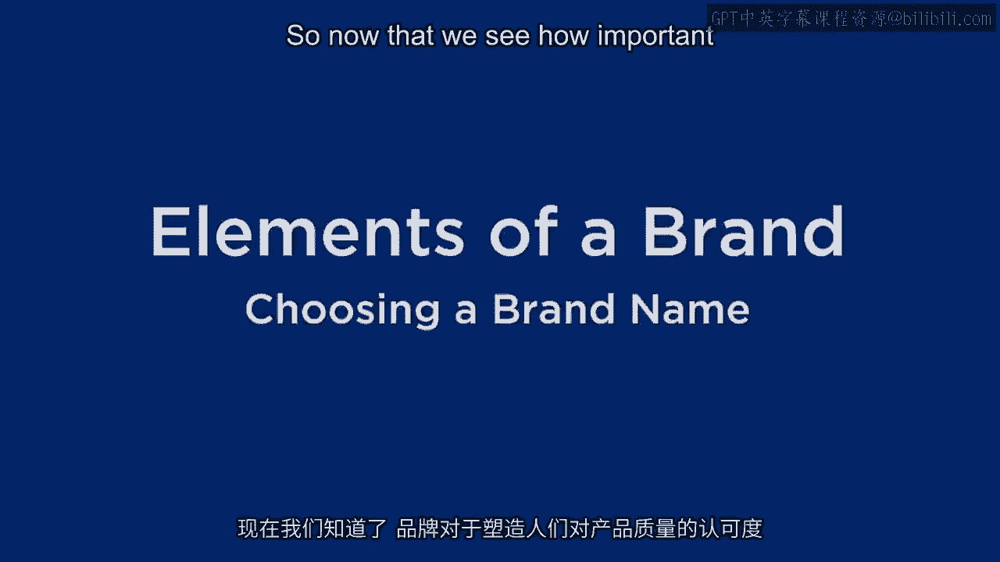
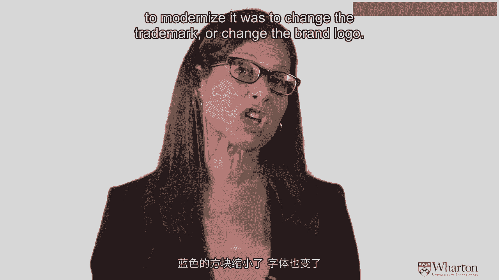
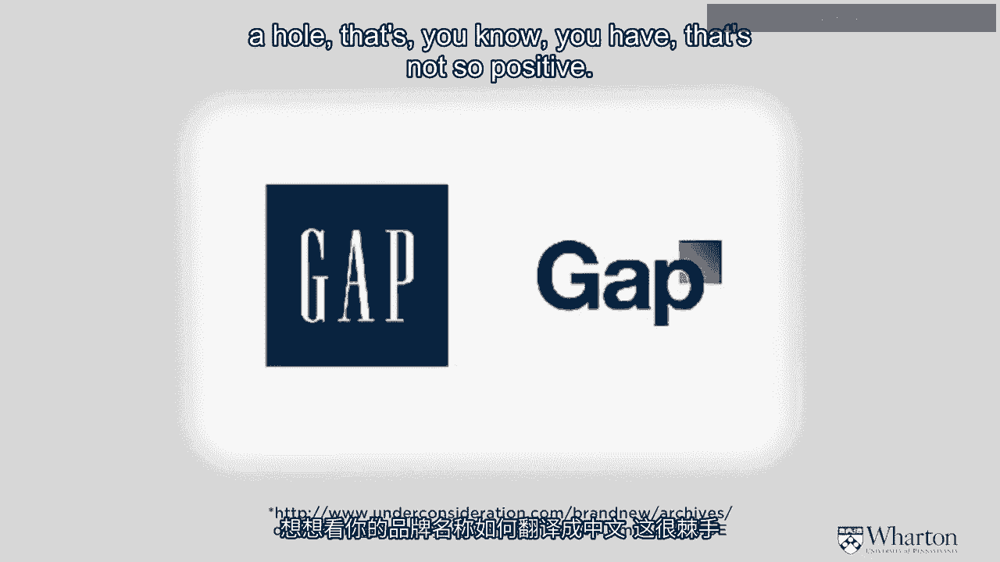
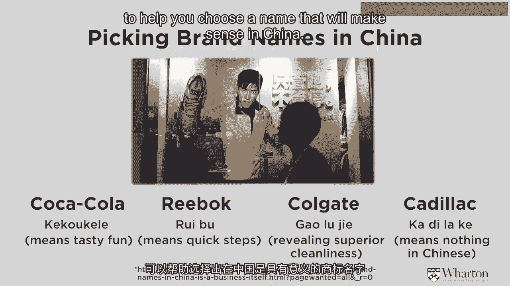
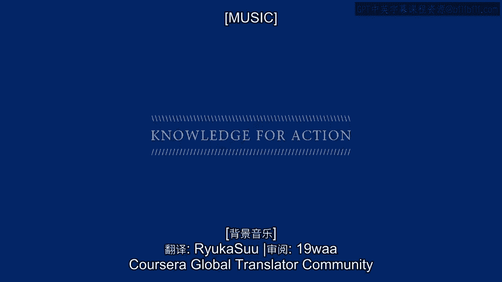

# 沃顿商学院《商务基础》｜第33课：品牌要素 - 选择品牌名称 🏷️

在本节课中，我们将学习品牌的核心组成部分——品牌要素，并重点探讨如何选择一个成功的品牌名称。我们将了解品牌要素的种类、选择标准，并通过实际案例来分析品牌名称的重要性及其在不同文化背景下的挑战。

---

## 品牌要素概述

上一节我们介绍了品牌如何塑造质量感知。本节中，我们来看看构成品牌的各个具体要素。

品牌要素是用于识别和增强品牌认知度的各种组件。精心选择的品牌要素有助于建立强大、积极且独特的品牌联想。

以下是主要的品牌要素类型：
*   **品牌名称**：品牌的基石与核心。
*   **品牌标识与符号**：如图形、徽标。
*   **品牌角色**：如吉祥物或虚拟形象。
*   **包装**：产品的容器与外观。
*   **品牌口号与广告歌**：简短的宣传语或音乐。
*   **品牌色彩**：与品牌紧密关联的颜色。

在选择这些要素时，必须考虑两个关键问题：
1.  所有要素是否能协同工作，为产品或服务创造一个统一的独特身份？
2.  如果人们单独看到某个品牌要素（脱离产品本身），会产生怎样的联想？

---

## 选择品牌要素的标准

在深入探讨每个要素之前，我们先来了解选择优秀品牌要素的通用标准。

以下是评估品牌要素优劣的几个关键维度：
*   **可记忆性**：易于识别和回忆。
*   **有意义性**：能够描述产品属性、利益或用户群体，并能说服顾客。
*   **美观性**：富有视觉吸引力，能激发丰富的视觉或语言联想。
*   **可保护性**：既要有法律上的可注册性（如商标），也要在视觉上难以被模仿。
*   **适应性**：能够与时俱进，适应消费者品味和竞争环境的变化。
*   **可转移性**：能够延伸应用到公司未来可能推出的新产品上，并能在不同文化中被理解和接受。

每个品牌要素在塑造整体感知时扮演着不同角色，各有其优缺点。我们的目标是战略性地运用它们，以达到平衡并产生最大的整体影响力。它们必须协同工作，形成一个独特且一致的品牌形象。

---

## 各类品牌要素的优缺点

现在，让我们具体分析一下不同品牌要素的利弊。

*   **品牌名称**
    *   **优点**：是品牌的锚点，至关重要。
    *   **缺点**：一旦建立，更改起来非常困难和昂贵。例如，Aflac（美国家庭人寿保险）和GEICO（政府雇员保险公司）最初的名字并不理想，它们后来通过引入鸭子（Aflac）和壁虎（GEICO）的形象来增强记忆。

*   **标识与符号**
    *   **优点**：如耐克的“对勾”或麦当劳的“金色拱门”，能吸引注意力、传递情感、强化品牌身份。
    *   **缺点**：可能过时、含义模糊，或在跨文化时产生不同解读。

*   **品牌角色**
    *   **优点**：如米老鼠，能迅速吸引注意，有效传递品牌个性（如有趣、面向儿童）。
    *   **缺点**：可能过时或受文化限制，并非所有品牌都适合。

*   **口号与广告歌**
    *   **优点**：能通过更多文字和音乐传递含义，如耐克的“Just Do It”。
    *   **缺点**：可能难以翻译，音乐品味因人而异，有时会令人厌烦。

*   **包装**
    *   **优点**：对塑造产品品质感知有极强的影响。研究表明，消费者常通过包装来判断产品质量。
    *   **缺点**：存在渠道控制问题。制造商设计包装，但零售商可能无法以理想的方式（如正确的朝向、温度）呈现给消费者。

---

## 深入探讨：品牌名称的选择

品牌名称的重要性远超消费者层面，它影响着员工士气、公司增长潜力和投资者信心。一个强大的品牌名称能吸引人才、助力业务拓展，并影响投资决策。

品牌名称有多种类型，以下是一些常见类别：
*   **描述性名称**：直接描述产品或服务，如 **Lean Cuisine**（意为“清淡美食”）。
*   **隐喻性名称**：象征某种理念，如 **Nissan Infinity**（无限）。
*   **人名名称**：基于创始人或相关人物，如 **Ford**（福特）、**Ralph Lauren**（拉夫·劳伦）。
*   **抽象名称**：单词本身有含义但与产品无直接关联，如 **Apple**（苹果）、**Camel**（骆驼）。
*   **变异词名称**：听起来像真词但不是，如 **LuLuLemon**、**Spotify**。
*   **组合词名称**：由两个词组合而成，如 **Facebook**（脸书）。
*   **自创词名称**：完全新造的、无意义的词，如 **Exxon**（埃克森）。

现代成功的品牌名称案例：
1.  **Virgin**（维珍）：名称新颖、大胆，带有趣味性，成功延伸至多个行业。
2.  **Priceline**（价格线）：描述性极强，清晰传达了其业务核心（定价）。
3.  **Google**（谷歌）：源于拼写错误，但已成为一个文化符号。其品牌强大到可以不断变化标识设计（如节日涂鸦）而仍被轻易识别。

当前趋势：许多初创公司选择自创词作为品牌名（如 **Miblio**， **Kaggle**），部分原因是为了获得一个独特的网站域名（URL）。

---

## 品牌名称的挑战与案例

选择品牌名称并非易事，有时微小的改动也会引发巨大波澜。

**Gap换标事件**：Gap公司曾试图将Logo从经典的**蓝色方块衬白字**，改为**白底衬黑字且字体不同**的新设计。新Logo一经推出，在社交媒体上遭到了消费者的强烈反对。一周后，公司被迫撤回新标，恢复旧版。

后续研究揭示了失败原因：
1.  **视觉冲突**：新Logo中，蓝色方块部分遮挡了字母“P”，削弱了单词的完整性。人们先处理视觉信息，这造成了干扰。
2.  **字体改变**：旧版全大写字母（**GAP**）更像一个品牌标识，而新版首字母大写后接小写（**Gap**）更像一个普通单词“gap”（意为“缺口”），带来了负面联想。
3.  **情感反应**：消费者对新设计产生了本能上的负面情绪。

这个案例表明，品牌要素的微小变动可能深刻影响消费者感知。

---

## 品牌名称的全球化挑战

在全球化背景下，品牌名称的跨文化适配至关重要，尤其是在像中国这样庞大的市场。

将品牌名翻译成中文主要有几种策略：
*   **保留原文字**：一些奢侈品牌如 **Chanel**（香奈儿）、**Louis Vuitton**（路易威登）保持其原语言书写。
*   **音意兼顾**：寻找发音近似且含义积极的中文字符。
    *   **Coca-Cola**：最初直译的字面意思不佳，后改为“可口可乐”，既音似又寓意“美味快乐”。
    *   **Reebok**：译为“锐步”，音似且意为“敏捷的步伐”。
*   **重意轻音**：选择符合品牌形象但发音不近似的字符。
    *   **Colgate**：译为“高露洁”，强调“卓越的清洁”，但发音与原文相差较远。
*   **纯音译**：只追求发音相似，字符本身无具体含义。
    *   **Cadillac**：译为“凯迪拉克”，字符本身无特定意义。

因此，进入新市场时，必须谨慎处理品牌名称的本地化，有时需要借助专业机构的帮助。

---

## 总结

本节课中，我们一起学习了品牌的核心构成——品牌要素。我们首先了解了品牌要素的类型及其协同工作的重要性，然后深入探讨了选择品牌要素的六大标准：可记忆性、有意义性、美观性、可保护性、适应性和可转移性。

我们重点分析了**品牌名称**这一关键要素，探讨了其不同类型、重要性，并通过**Virgin**、**Google**等成功案例以及**Gap换标**的失败案例，理解了名称选择的复杂性。最后，我们审视了品牌全球化，特别是进入中国市场时，在名称翻译上面临的音、意、文化协调的挑战。

记住，一个成功的品牌名称不仅仅是标签，它是品牌资产的核心，需要在创立之初就进行战略性思考，并为其长期发展预留空间。