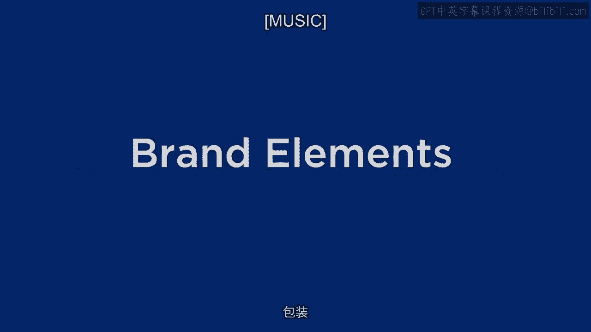
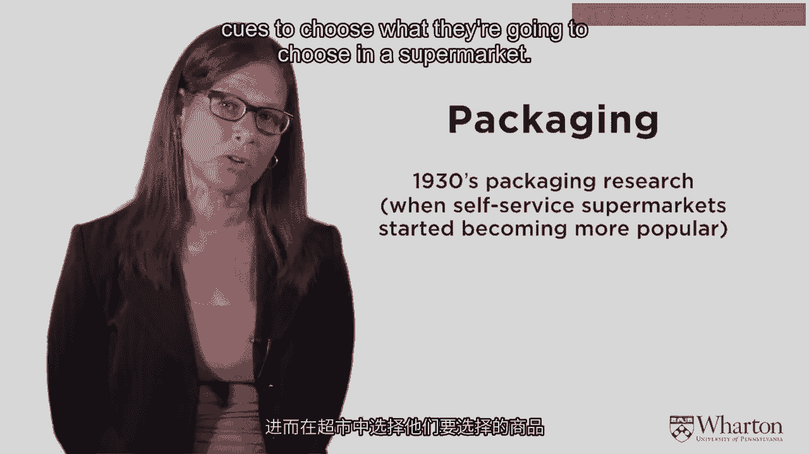
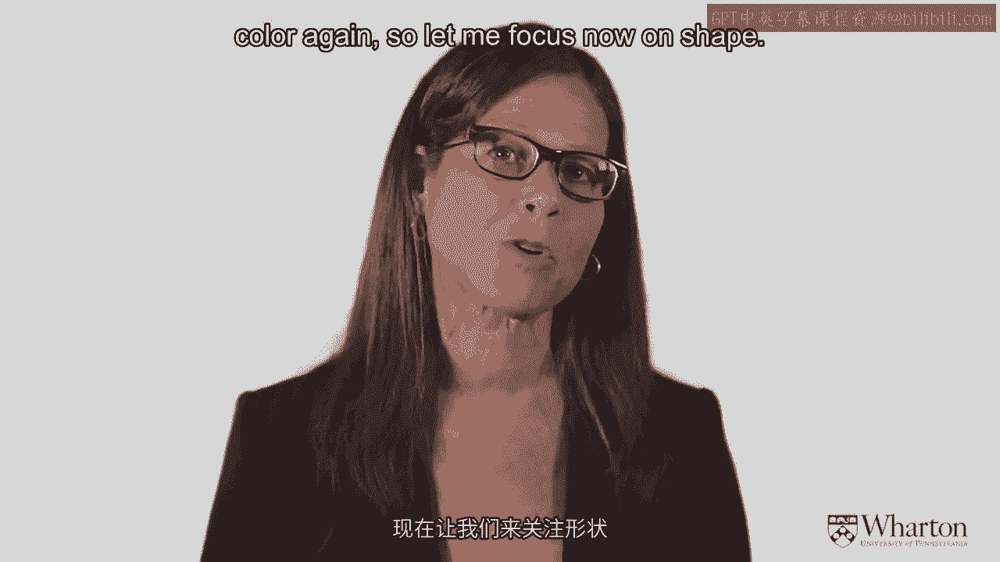
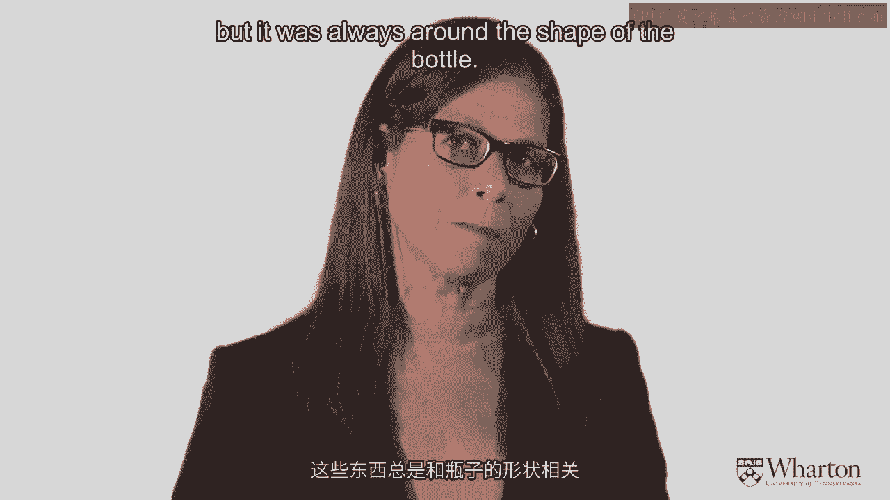
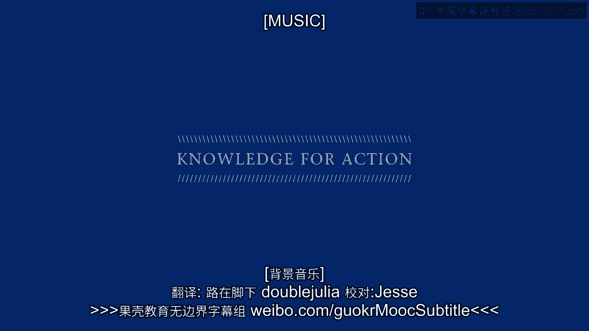

# 沃顿商学院《商务基础》｜Business Foundations Specialization｜（中英字幕） - P35：34_品牌要素-包装.zh_en - GPT中英字幕课程资源 - BV1R34y1c74c

[ Music ]。

>> Okay， so let's talk about packaging。 Packaging， as I said。

has very strong effects on perceptions， and it's a very interesting category。

So let's kind of look at packaging。 We started learning a lot about packaging here in the US in the 1930s。

and what happened in the 1930s was that the grocery store was moving。

from the person behind the counter where you would go to a grocer。

you'd go to a butcher or bakery and you talked to somebody behind the counter。

and they were moving to self-service supermarkets。

So that the consumers were going to go up and down the aisles。

of the supermarket by themselves and pick out products without any help。

When this started happening， it was very clear that the packaging the product was。

in was going to matter a lot。 And so the question was how will people use packaging cues。

to choose what they're going to choose in a supermarket？

And so one of the early famous experiments was done with detergent。

and they put the same detergent in two different boxes。

because what we were testing here was the differences in the packaging。

And in one package they had a design that had circles。

and in the other package they had a design that had triangles。

and they wanted to see which one people would choose。 And it turned out it was very reliable。

People preferred the detergent that was in the box with circles。

So then they let people take both of these detergents home。

Now remember the detergent in both boxes was the same。 What was different was the package。

And so the consumers took both packages home。 They much preferred the package with the circles on it。

And they used the detergent from both boxes and then were asked。

which detergent did you like better。 And this is what was really surprising。

Not only did they like the package better with the circle。

but they believed that the detergent in the box， with the circles worked better。

That was astonishing at the time。 People couldn't believe it because it was exactly the same detergent。

So they redid the study a few times with larger sample sizes， and consistently got the same result。

That was the beginning of understanding， that the package absolutely influences the perception of the product。

And now today if you look at tie for example still has those circles。

on its product even when it goes in different countries， things will change in the package。

but you will still see those circles which we know were really preferred。

by consumers for choosing the detergent。 And they're in that bright yellow that really pops out at you。

So packaging is very interesting because it can influence， at the point of purchase。

It helps you choose what you're going to choose。 But as these experiments showed you。

it continues to have an influence， at the point of consumption。

So it not only gives you a reason to choose when you're purchasing。

but it also influences your perception of the product experience itself。

And there are multiple objectives in a package。 You can identify the product。

You can present some kind of information。 The package can be used to protect the product。

It can be used to store the product。 It can aid in consumption。

It can give you more information on how to use the product appropriately。

So the package not only using perceptual cues， the packaging not only uses a lot of color。

but the packaging is also pretty informative。 I've talked a lot about color before。

And so you have to know that packaging aesthetics are --， and the function are very， very critical。

The colors are used to help grab consumers' attention， in a sea of competing messages。

And it also though has to be used so that you want to buy the product again and again。

So you want to choose the variations of colors and designs。

so that they'll make for an impactful package。 But you have to， as I mentioned earlier。

know your distribution channels， because you don't necessarily control the way the package is ultimately distributed。

And there are certain -- you might do some really cool things with your package。

and then the retailer doesn't necessarily abide by the way you want those --。

that package is exhibited。

And that's just the reality and you have to think through that when you're doing it。

Let me go over some iconic packages， and how they really changed customer perceptions。

and really helped build market share。 I've talked about color and color is extremely important。

So let me say that colors on packaging can really do the same kinds of things。

but I'm not going to be redundant and mention color again。 So let me focus now on shape。

So one of the new products that came out， Calvin Klein came out a number of years ago。

tens of years， decades ago， I think actually， was one of the first products that came out with a fragrance。

that was designed for both men and women。 It was unusual in that case。

And a lot of the ads showed -- very designy ads and they showed models。

that the gender was kind of ambiguous。 And so it was a very interesting campaign。

and they really wanted the product to be seen as etching。

And so if you look at this package of the CK clone that they came out with。

you can see that edginess in the package。 The shape of the clone was in the shape of a flask。

which is an interesting thing for a clone。 You know。

it's not usually the shape of a product you think for a clone。

And you can also see that they used asymmetry in their logo。

which again really gave this notion of edginess。 And a lot of times when people choose fragrance。

this is one thing we know for sure， they're not really experts at choosing different scents。

And so the packaging in the brand name is very influential。

in what people choose as the fragrance they like。 Another famous。

famous shape of a bottle was absolute。 This was one of -- this campaign I don't think is being used anymore。

but it was used for about 10 years。 It's one of the most famous print campaigns around。

And the whole print campaign was predicated on the shape of the bottle。

So vodka a lot of times people have difficulty telling different baccas apart。

That's not to say they're not different， but some people have difficulty time。

especially after the tenth drink。 And so the bottle really， really is important。

The brand name in the bottle is establishing brand loyalty。

The absolute bottle was interesting because most of spirit bottles have a longer neck。

because bartenders or people use a product。 They hold the neck to pour。

So actually this wasn't as easy a bottle to use， but it's because it was so distinct that the shape of the bottle was so important。

And they really， really focused on the shape of the bottle and the ads。

The ads went through different stages。 Some of the ads just showed the bottle。

Some of the ads showed other things in that shape。

Like I remember a famous one where they had an LA ad。

and they had the swimming pool in the shape of an absolute bottle。

And they did a lot of -- they used celebrities， they used artists。

they did a lot of creative things， but it was always around the shape of the bottle。

Another iconic shaped bottle is Coca-Cola。 So Coca-Cola， as I mentioned， is a very， very。

very strong brand name。 But part of that brand imagery comes not only in their logo。

and their red color in their famous polar bear ads and other types of ads they have。

but also in the shape of their six and a half ounce bottle。

That was their first product and it was a very distinctive shape。

that people could tell it was a Coca-Cola from all the other soft drinks out there。

When the bottle went from glass to plastic， originally when Coca-Cola came out。

with their plastic bottle， they lost their unique shape。 And that was a decided disadvantage。

And so they managed to figure out how to recreate their iconic glass shape in plastic。

And I remember I was a marketing professor when they did this and they sent out。

to marketing professors an empty bottle or an empty plastic bottle of Coca-Cola。

in their iconic shape because they were so happy that they had managed。

to reproduce this in this new medium because they understood how important that was。

And another very famous bottle， of course， is the Heinz Ketchup bottle。

I've been told this is in the Smithsonian and I'm not sure that's true， but it could be。

because it's a museum piece people recognize the quality of the ketchup because of the shape。

of the bottle。 And this again kind of like the absolute bottle is pretty interesting because that shape。

in that glass bottle makes it difficult to get the ketchup out of。

So it's not even a product that helps the product use the product。

It actually gets in the way of using the product and yet still it really。

really defined the quality of that ketchup by the shape of the bottle。

So shape is extremely important at causing， at creating brand imagery and brand identity。

And shape also can be in and of itself an excuse for a new product。

One of the most successful new products in the soft drink industry was the refrigerator pack。

They did some market research and they found out that if the cans of soda were in the back。

of the refrigerator people did not consume it as much。

So if they wanted people to consume the product they needed some mechanism to bring the cans。

to the front of the refrigerator so people could drink it。

And that these refrigerator packages were designed that way。

And that package design single handedly increased market share for the companies。

that started doing it。 It was a very successful new product introduction and it didn't have anything to do。

with the actual product but just the packaging。 And similarly。

Hunt came out with a package for getting ketchup out。 That's easier。

And so you turn the product upside down it's easy to get the ketchup out。

And again that was a successful packaging innovation。 [ Music ]。

[BLANK_AUDIO]。
