# 沃顿商学院《商务基础》｜Business Foundations Specialization｜（中英字幕） - P37：36_品牌重新定位.zh_en - GPT中英字幕课程资源 - BV1R34y1c74c

[MUSIC]。

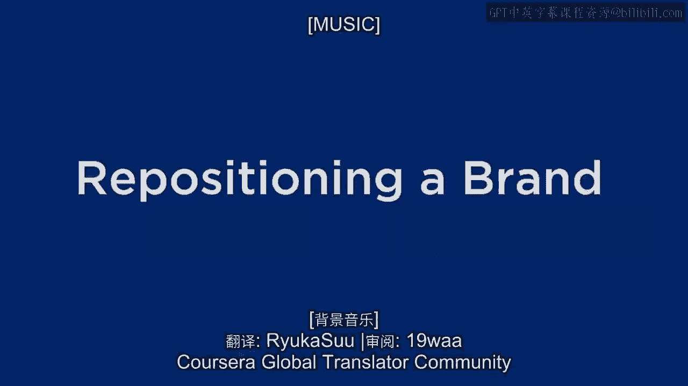

So we've talked about lots of things with regard to brands。

We've talked about the initial positioning of a brand。

We've talked about how to create brand elements that go together to create a brand image。

And one of the things I've been emphasizing throughout the whole sessions is that。

a brand has to be updated。 A brand has to stay modern。 A brand has to adapt。

And so a very important part of branding is to think about how to reposition a brand。

You have an initial start， but maybe the times have changed， maybe the customer base has changed。

And you have to think about how can you keep this brand fresh？ How do you reposition a brand？

So we're going to talk about that now。 And it's this notion that the brand equity must be actively managed over time。

If you wait until a brand is out of date， it's much harder than to reposition the brand。 So ideally。

the best way to keep a brand fresh is to constantly think about it。

And might tweak it here and there。 Think about it all the time so that it stays fresh。

That would be the best way。 Brand meanings must be reinforced。

But sometimes they need to be adjusted just a little bit。

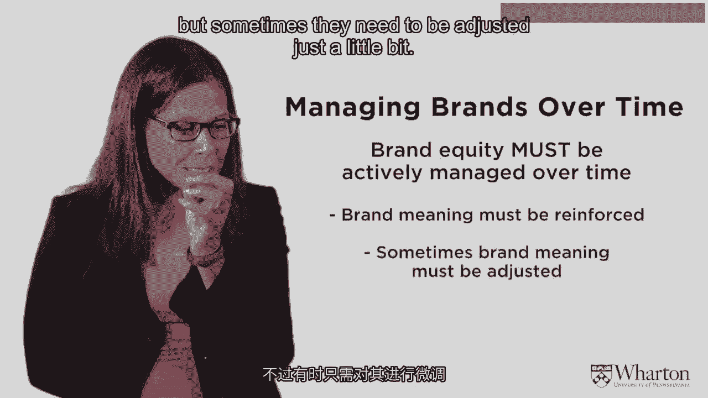

And new sources， new ways of identifying the equity should be identified。 Why does this happen？

Well， I can think of at least five reasons and there's probably more reasons than that。

But let's go over some of these。 One reason for a brand repositioning is that the initial positioning that you came up with。

wasn't right。 It was poorly conceived。 And you might know this because you thought this was really cool and。

customers were going to be interested but actually you didn't see the interest you， anticipated。

Or the sales are just not what you thought。 And one of the reasons is the brand is poorly conceived。

That being the case， you got to reposition the brand。

Another reason is maybe you have a perfect positioning for， a particular target audience。

But that audience is hard to reach， isn't profitable。

It was a really good idea for a really good customer segment but it wasn't a good。

business opportunity。 And so therefore you may need to reposition the brand。

Another reason may be because it just gets out of date as I mentioned over and， over。

One of the things about being a marketing professor is that things change。

You got to constantly change。 You got to keep up with things。

And so your old marketing approach might become obsolete。 Then you have to change it。

The other thing could be it might just lose its edge。 It made sense at one point。

It's just kind of old and now people want to do something new。

And it isn't really that it was wrong or that people's taste change so much。

It's just that it seems old and tired。 And so you need to do something to make it fresh。

And another idea， along those same lines is tired。

So one is more that it becomes old fashioned and the other is it just becomes old hat。

But those are similar ideas。 It just gets old。 There isn't nothing wrong with it but you really want it to be new。

And by the way， one of the really big things that happens is people go out and。

make purchases sometimes because they have needs。 And sometimes they make a new purchase just because they want something different。

something new。 And if the brand seems same old， same old。

that's not enough of a reason to go out and， make a new purchase。

So these are some of the reasons that are needed for a brand change。

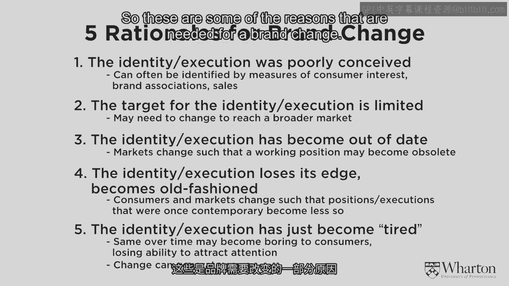

There are others。 When you think about repositioning a brand。

the biggest thing you have to think about， is consistency， consistency， consistency。

So except for that one example where I told you about Google。

where they go out of their way to do things that are a little bit different each time。 Most brands。

when they do this reposition， they have to have a position that's。

consistent with the old position or at least close enough to the old positioning。

So consumers believe it。 If it's really radically different。

people won't make the connection necessarily。 There's some examples where that can work。

But most of the time， the best way to reposition a brand is to do something that's。

consistent with the brand DNA。 And so let's think about。

there's some psychological theory that can go back， behind this so I can show you why this happens。

Why consistency is generally so important。

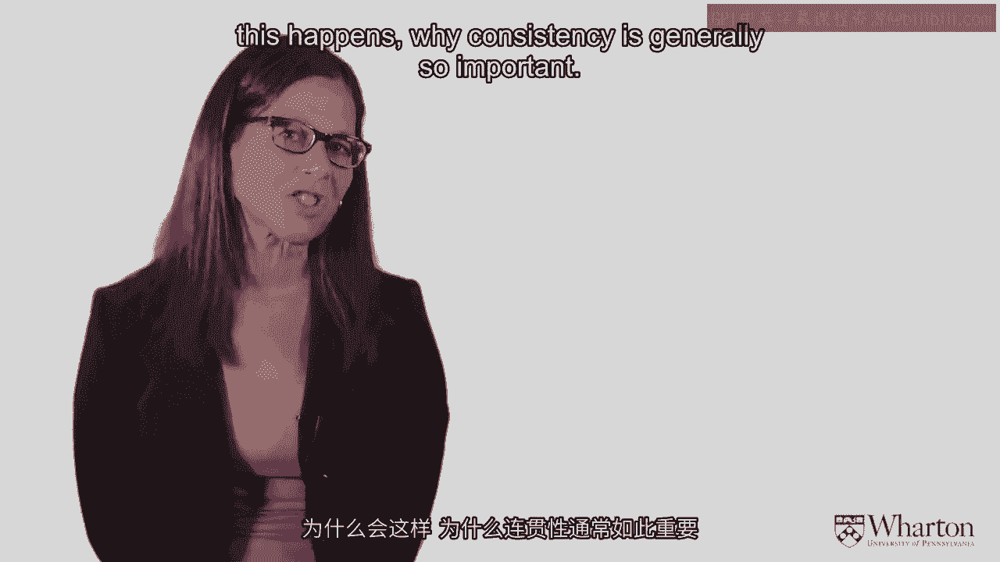

And this is some very old research that was done on understanding why people smoke。

And it had to do with people's attitudes towards smoking。 So this is a psychological theory here。

So let's assume I'm me， I'm myself。 And let's say I smoke。

And let's say that I know that smoking causes cancer， cancer causes death， and I don't want to die。

Now if that's the case， how do I justify that I smoke？ Because there's this inconsistency。 I'm me。

I like myself， I don't want to die。 I think smoking causes cancer。 Something doesn't work。

And so what psychologists found out was that people rationalize or they do something to。

one of the links of this chain so that it is consistent。

And that's the way they can justify their behavior。

Because people like to be consistent with themselves。

So what are the ways different people kind of rationalize to allow themselves to smoke？

Well one resolution is you say， okay， I smoke， I don't want to die of cancer， I don't believe。

the data。 And so this is the kind of thing where I said you have this bias selective interpretation。

I was mentioning presidential campaigns。 There's experiments that show。

you show the same data to smokers and non-smokers and they， will interpret it differently。

So people frequently interpret the message or the data consistent with what they already， believe。

This is a theme that I've mentioned all along。 So this is a pretty well known way to rationalize the behavior。

Another way to do it is to say， no， no， I believe the data， it's pretty conclusive。

Smoking causes cancer， I really don't want to die from cancer。

So what you do is kind of lie to yourself。 And you say， you know， I don't really smoke。

I only smoke when I drink， I only smoke on vacation。

And so it doesn't really count and therefore I have no inconsistency。

People do this with diets all the time。 They make all sorts of rules。 When I'm on vacation。

food isn't fattening。 If it's a little bit burnt， I can eat as much as I want。

And there's all sorts of rules that people make。 That's that resolution where you kind of figure out a way that you can feel good about yourself。

The third resolution to this particular one says， okay， I know I smoke， I know it causes， cancer。

but you know what？ I'm going to die anyway。

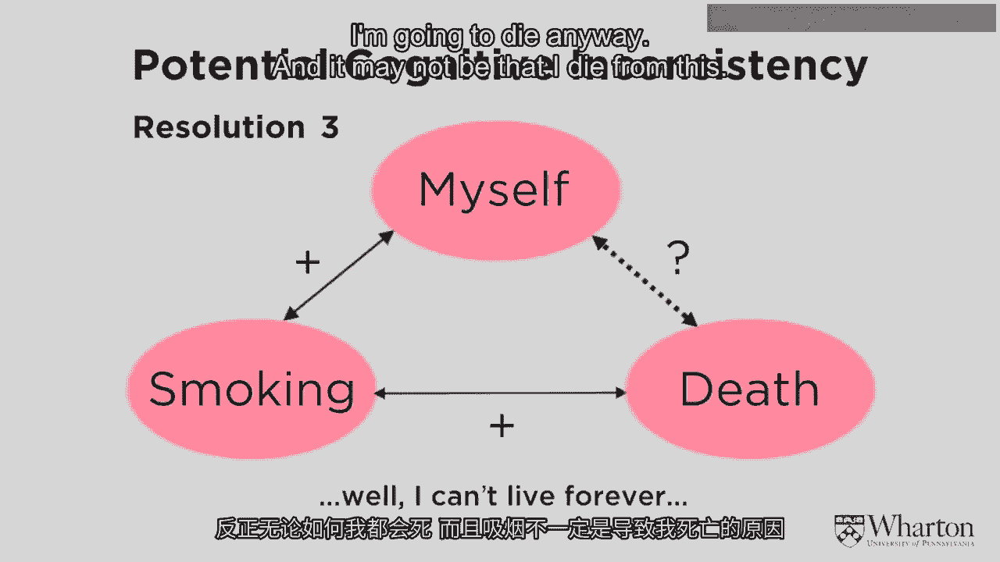

And it may not be that I die from this。 All of these are consistent。

And that is a very important concept for marketers。

So if you're putting out a message when you're trying to reposition your brand that isn't。

consistent， consumers will reject it and will look for a way to rationalize the message。

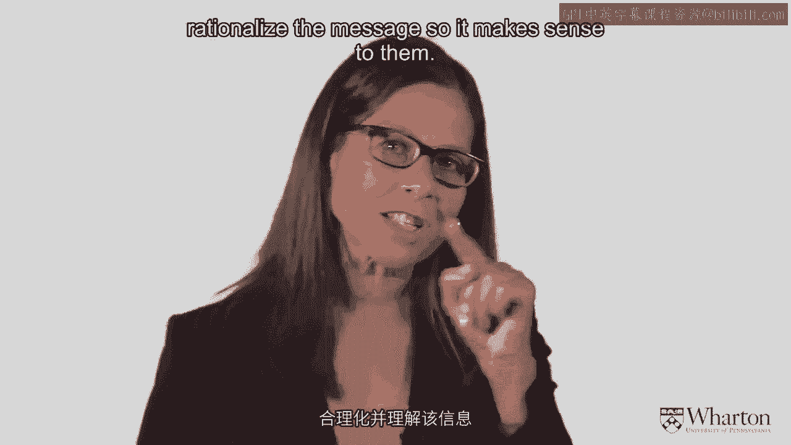

so it makes sense to them。 It's a consistency theory。

There is a drive to maintain consistency within your thinking systems。

And what you do is if it's not consistent， you change whichever one is the weakest so。

that it is consistent。 So what's the famous example？ It's with Osmobile。

Osmobile was known as a car that was associated with that， with my father。

Now one thing that's probably obvious， but let me just say it here， cars are for young， people。

Cars are powerful performance。 People like young people cars， energy cars。

They don't like old people cars， okay？ So the notion that Osmobile was associated with my father was a turn-off to younger people。

Osmobile understood that。 That was obvious。 And so what they tried to do was they came out with a new ad。

new excitement， new car， to say， "No， no， we're not a funny-done car。 We're an exciting car。

This is a car for young people。"， What happened here？ There's cognitive dissonance here。

The problem is the association with dad in Osmobile was extremely strong。

The association that my dad is not exciting was extremely strong。

So the weak link here was that Osmobile cannot be an exciting car。

And that was a very strong inconsistency they couldn't fight。

It was so strongly associated with my father and fathers are so not exciting that people。

just did not believe the new ad。 It was obviously hurt even more by the ad。

And the slogan at the time was， "This is not your father's Osmobile。"， And anybody knows。

as soon as I say， "This is not my father's Osmobile，" what you're。

doing is reinforcing that it's exactly my father's Osmobile。

So this is known as one of not a good campaign。 Most marketers will say。

"You just didn't get this right。"， And you know， there was another problem here。

Think about the brand name。 It is literally called an old mobile。

That is all of this is not good and it was such a hard thing to change and to reposition。

that they actually took the car off the market， which was kind of astonishing because Osmobile。

had very， very high brand awareness， but they just could not get themselves added this。

cognitive inconsistency。 So this is a very important thing。

A better way to do it is to not wait until it's so hard to change that it's impossible。

and you have to take the product off the market。 A better way to do it is to gradually change these associations in small ways so that people。

can still maintain that brand familiarity and believe the repositioning。 So you can do it。

and I mentioned this earlier， you can do it by kind of updating the symbols。

Or maybe you can start to change the brand name and I can show you how you can show change。

the brand name slowly to reflect the evolving identity。 Or you can use different slogans。

So all of these elements that we talked about before can be subtly tweaked in order to reposition。

the brand as you need to to keep it modern。 And you can also do it if you're going to use the brand to stretch the brand to go into。

new products。 And so you might want to broaden the brand meaning so that it's more flexible and adaptable。

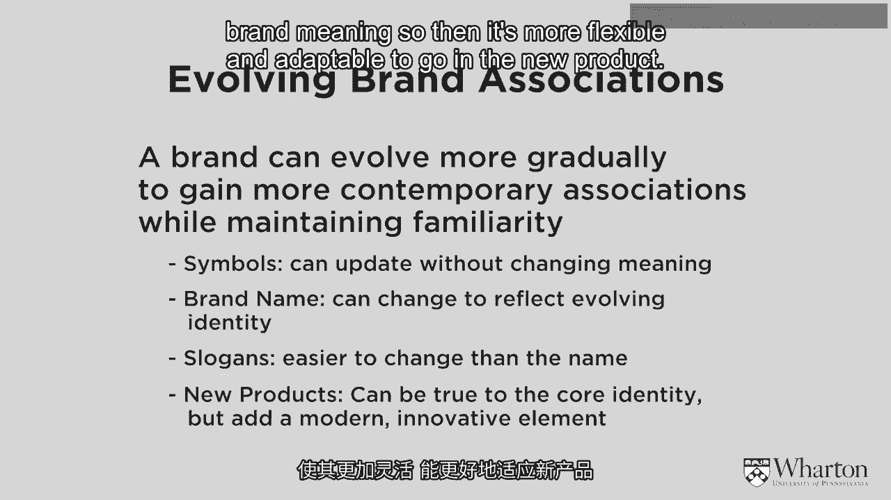

to go into new products。 There are two ways to do this。

One of the ways is called the just noticeable difference。

And what this says is that you make these little tweaks very subtle from point to point to point。

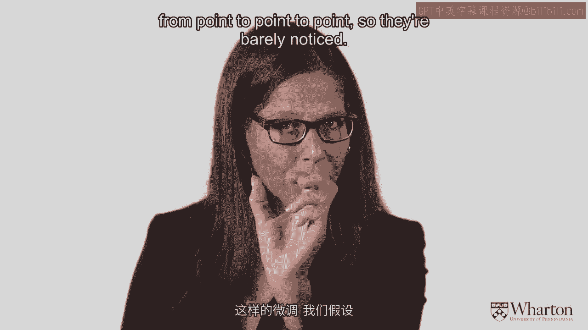

So they're barely noticed。 You do this say every year。 If you look over 20 years。

the difference from the first one to the last one is very， very hot。

And so there's a lot of packaging examples which we can show you where just with tiny。

little tweaks each time you still believe it's the same product。

But if you look from one version to a version 65 years later， you'll see a radical difference。

and the brand stays modern。 Many consumer package goods do this kind of just noticeable difference positioning。

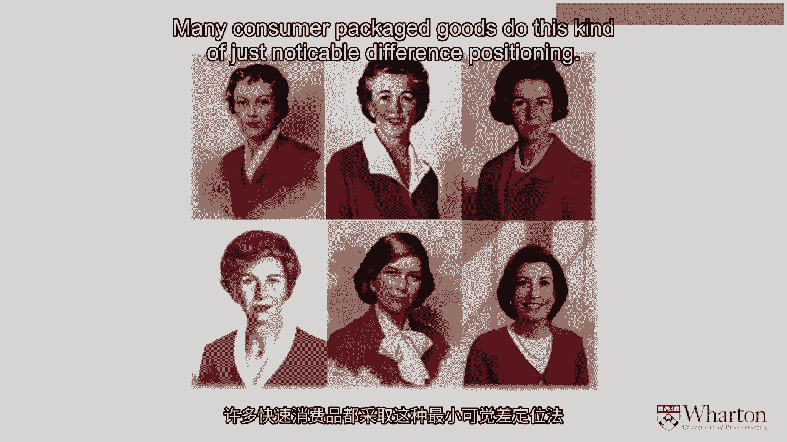

Another way to do it is what's called the butterfly effect。

And what this says is that I'm going to move from one to another in a big jump。

You are going to notice that it's different。 It's not a just noticeable difference。

It's a bigger difference。 And the reason I'm going to do this is to keep it modern and new。

Because for some categories like cosmetics， like clothing， and it's the notion of clothing。

the idea of keeping it modern and keeping it fresh is part of the reason to buy。 And in that case。

I don't need the change from one to another to just be subtle。

I can make it so that it is kind of a little bit exciting and more modern， but it doesn't。

necessarily need to。 But it's more modern， but it still stays within believability。

And that's called the butterfly effect。 So it's not so extreme that I don't think it's the same thing。

but it is noticeable。 And so these are two different ones and we can show you a number of different examples。

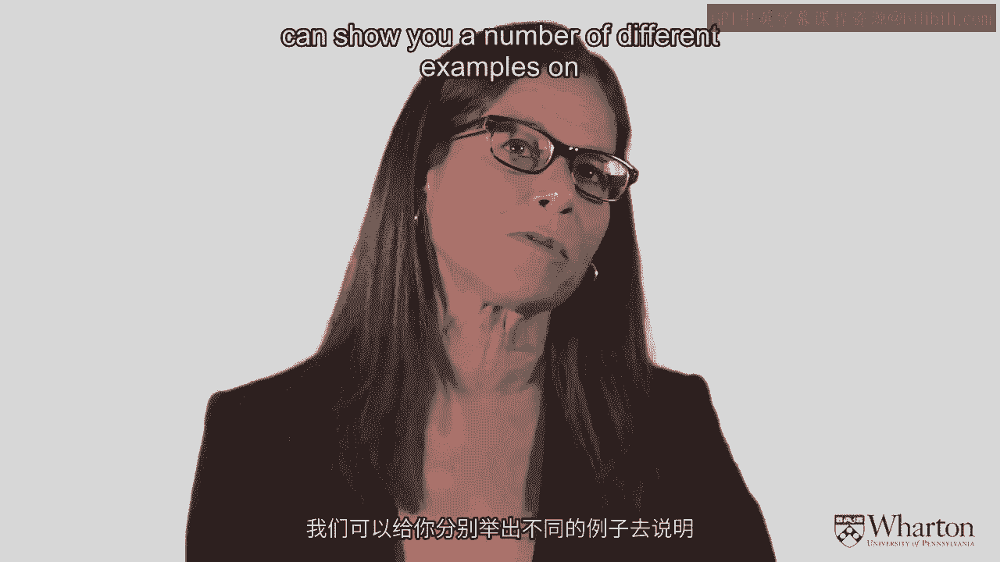

on those two different ones。 Okay。 And then I can show you some examples of evolving trademarks。

There's the Jolly Green Giant that was kind of out of date and they made a new Jolly Green。

Giant that was fitter， more athletic， taller， stood up straighter， and looked more like a， modern。

I guess， giant。 Then there was， please don't squeeze the Charman。 And they updated that packaging。

updated that spokesperson to look more modern。 These are subtle changes。 There was another change。

Charlie the Tuna。 I mentioned him earlier。 Very fun animated character。

kind of got a little out of date， and they made him more。

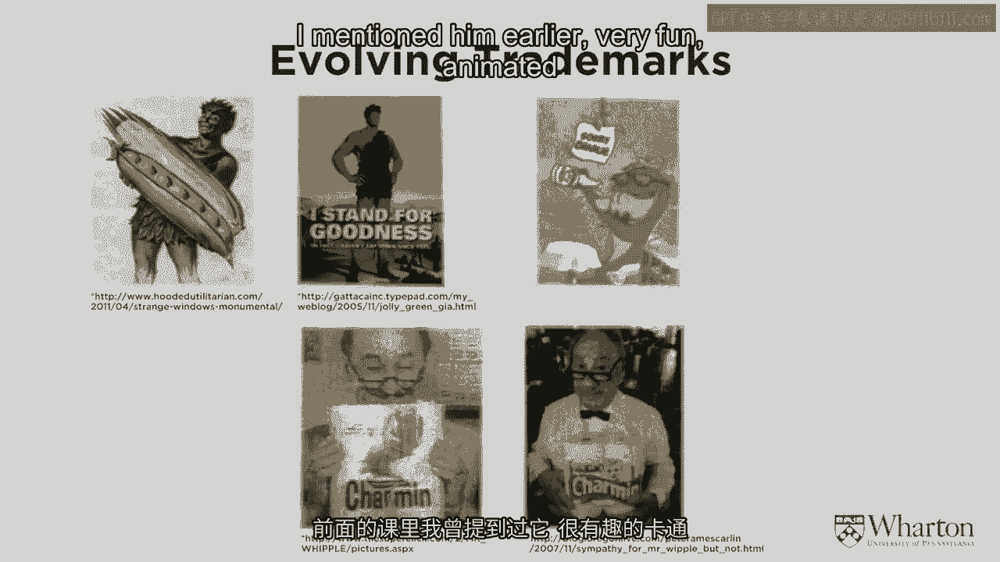

modern and changed the colors a little bit， changed the perspective of him and just kind。

of made him a hippo guy。 More recently， there was a transformation on the hamburger chain， Wendy's。

And again， I know a little bit more about the market research that went into this。

There was a lot of changes here。 One of the changes here is they got out their slogan。

their slogan that used to be part of， the sign was old fashioned hamburgers。

Wendy's menu has got to be broader now。 They do more than just hamburgers。

So one of the things they pulled out was that slogan。 They changed their typeface。

They went from an old fashioned typeface to a more modern typeface。

They did find when they did the market research that the character， this Wendy character， which。

was Dave Thomas is the founder of Wendy's， it was his daughter at the time。

She's not identified with that Wendy character and they liked that Wendy character。

So they kept the character， but they made her， she used to be in a little circle and she。

used to be contained in the circle。 Now she's kind of bouncing out of the circle。

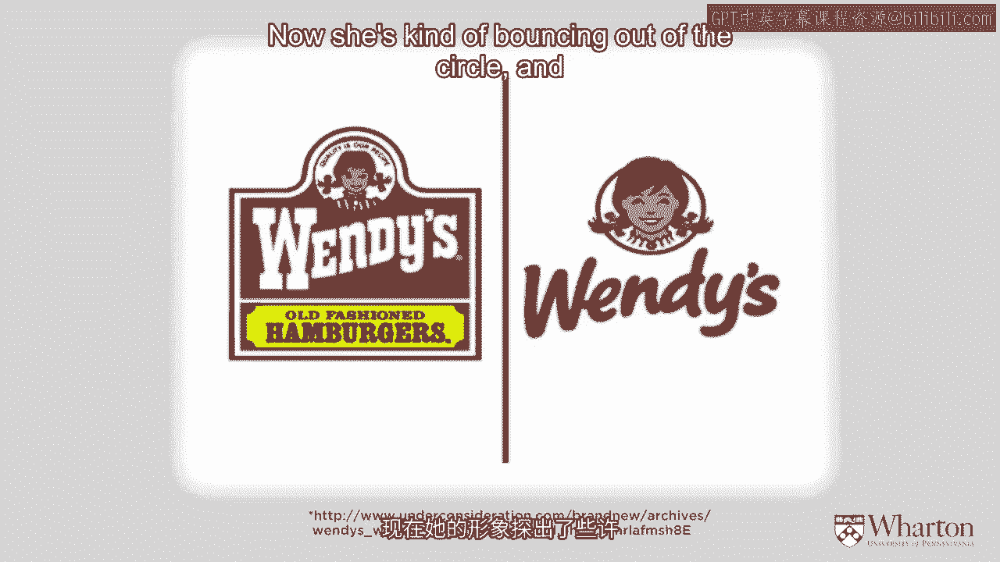

And so all of that made the logo seem more modern， more expansive。 You know。

lots of things are possible that you can get in a Wendy's now。 And with these subtle changes。

it's still very much identified as a Wendy's。 You can keep the brand， you can keep the brand modern。

but connected enough so that it doesn't。

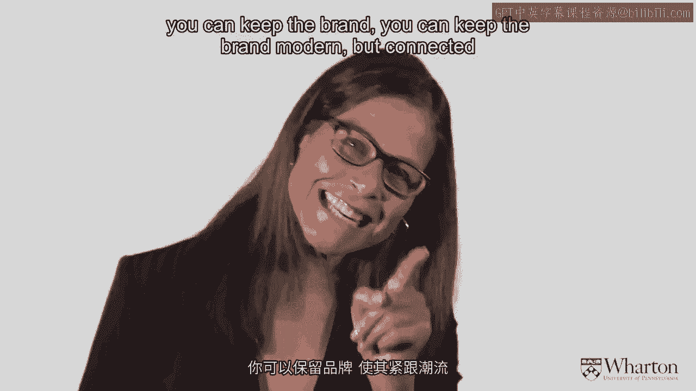

people still know it's Wendy's and it's not a surprise。

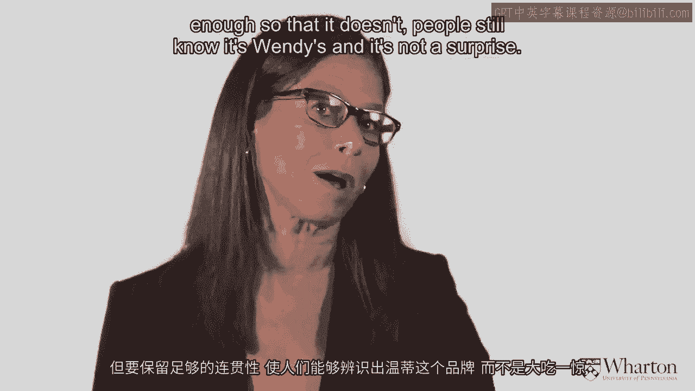

The other kinds of ways that people have named is actually to change the brand name。

So Boston Chicken was the original name of the chain of restaurants that provides dinner， food。

Obviously Boston Chicken suggests that they're just selling chicken。 And so they。

and they sell way more than chicken。 So they change their name to Boston Market。 And in that case。

what they're doing is trying to broaden the flexibility of the brand。

Weather Channel found out that they were going to make a lot of their revenues， not off TV， anymore。

but off apps and different kinds of ways of saying weather。

So they changed their name from the weather channel to weather companies。

And Starbucks very famously changed their name from Starbucks Coffee to just their image。

They just have the image of the mermaid now。 They not only got rid of coffee。

but they kind of got rid of Starbucks。

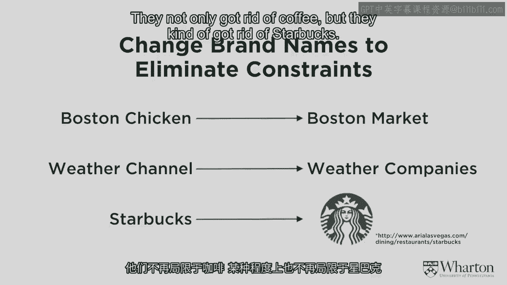

But people still know it is Starbucks by that image。 So what's the best way to do it？ The one。

a brand that's really done a very good job of keeping themselves modern is BMW。

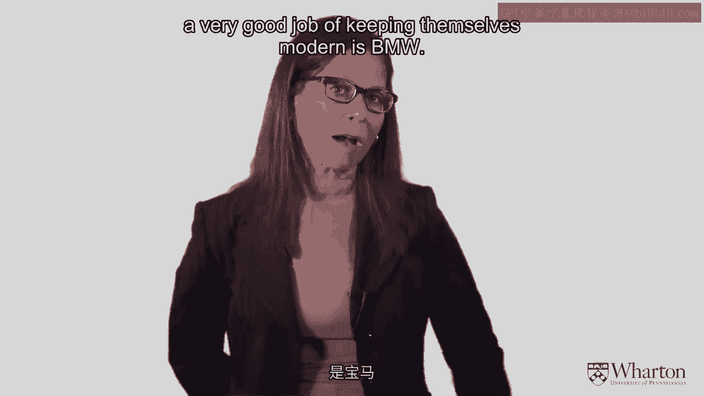

BMW could have been in the same situation as Osmobile because it was a product that your。

father drove。 BMW was a lot of associations。 It was a certain type of car。 It was a German car。

It was an expensive car。 And it was a car driven by the baby boomers。 At one time。

all of this was good。 In fact， BMWs were called beomers。

They were thought of as driven by the baby boomers。 But these things get old。

It could have been that the car was seen， the car design was seen as not practical。

Being a lot of money was seen as wasteful。 The baby boomers got old and they're stuffy。

And German could be seen as stodgy。 So although the association started out as positive。

if they're not carefully cultivated， they could turn negative。 How did BMW cultivate it？

They did it through a lot of sponsorships。 They not only were very careful with their advertising。

They mean performance， which is something that can stay modern。

But they also changed their design of the cars。 They had BMW sunglasses。

They sponsored high performance bikes。 They sponsored golf tournaments。

They associated their brand name with young and powerful and good imagery。

And so their associations never did turn negative and they stayed a very positive association。

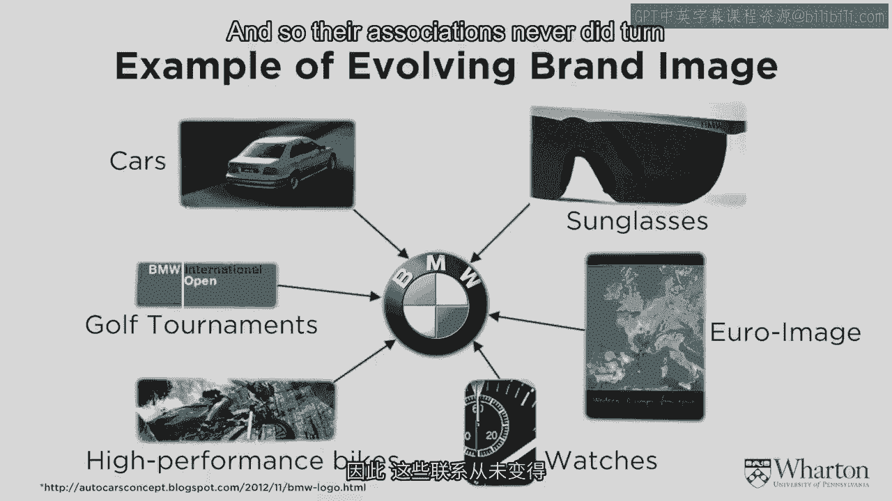

Bud Wazabir is dumb that also。 This could be your father's beer。

Your father drank Bud just as much as you do。 But Bud stayed very young with their sponsorship。

with their advertising， with their clever advertising， with all of those kinds of things。

their slogans， et cetera。 And that's a way to do it by constantly positioning your product subtly。

sometimes just noticeable， sometimes a little bit bigger difference， like a butterfly effect。

but always within the。

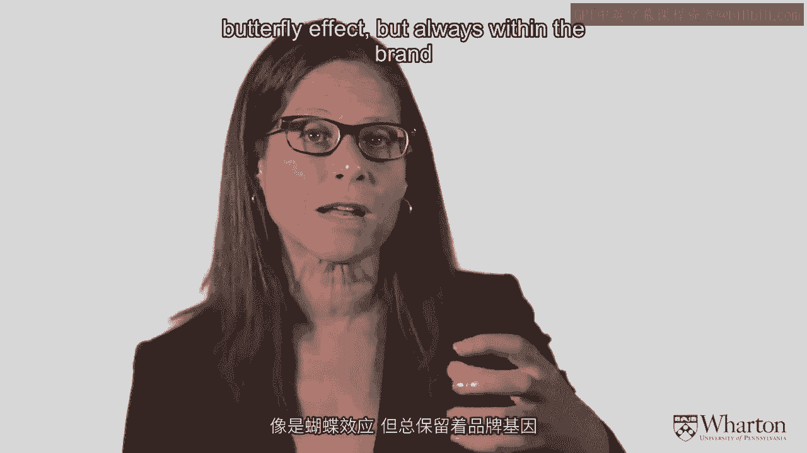

brand DNA so that people believe the changes。

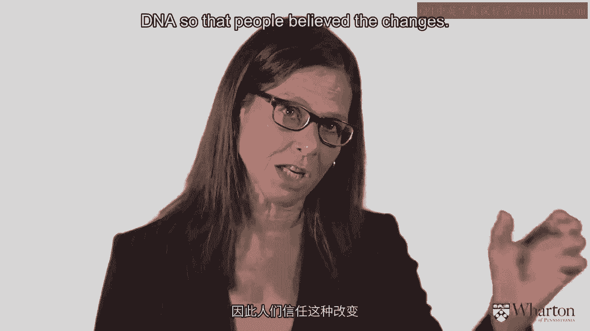

So major points here。 Consistency over time is very valuable in building strong brands。 You do。

it's kind of a fine line。 You do need to keep your brand modern。

but if you do something that threatens the consistency， chain that I was talking about。

people won't believe it。 So it's got to be something that is consistent with the brand DNA but is constantly moving。

it forward。 When you think about all the brand elements， you want them all to work in harmony。

to communicate， brand identity。 And it's important to change when it's necessary， but be careful。

Because if you do things that are too big a change or that the customer won't accept。

it just won't work。 If you really want to do a good job in keeping your brand modern。

you really have to understand， the brand mantra， the brand DNA， the brand positioning。

your target segment。 These are the things we talked about in the beginning。

You have to understand what the points of parity are， what the reference frame is。

You have to really understand what the point of differentiation is， what is strong about。

your brand， what is positive about your brand， and what is unique。

And you have to be consistent with that kind of brand image as you make these adjustments。

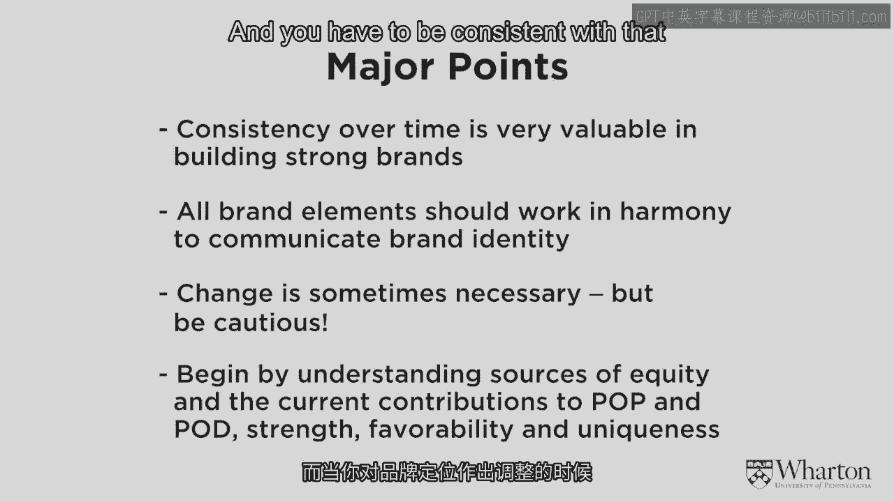

[MUSIC]。

