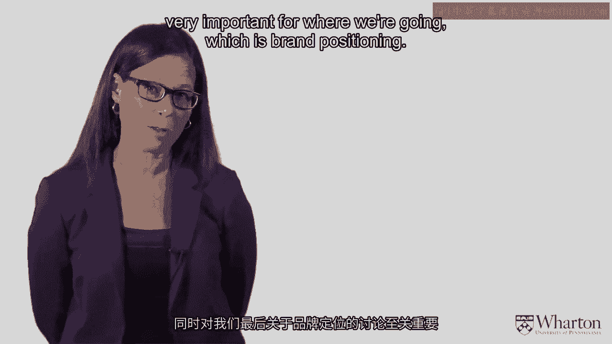
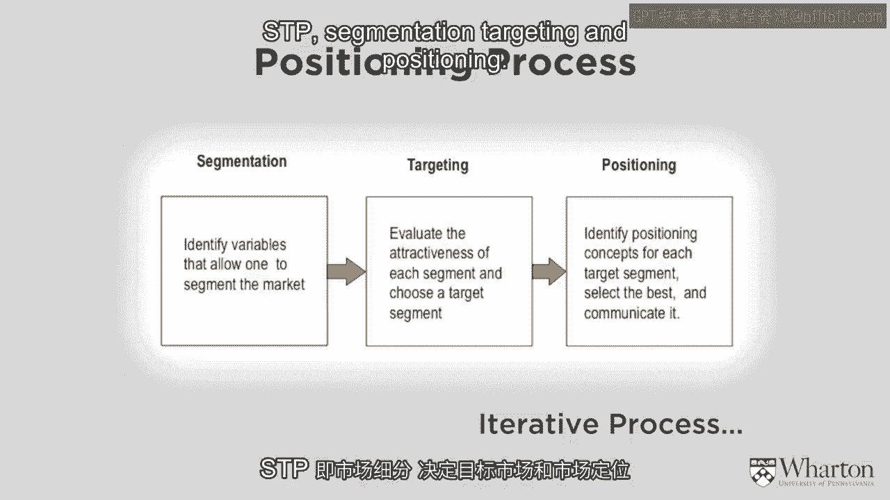
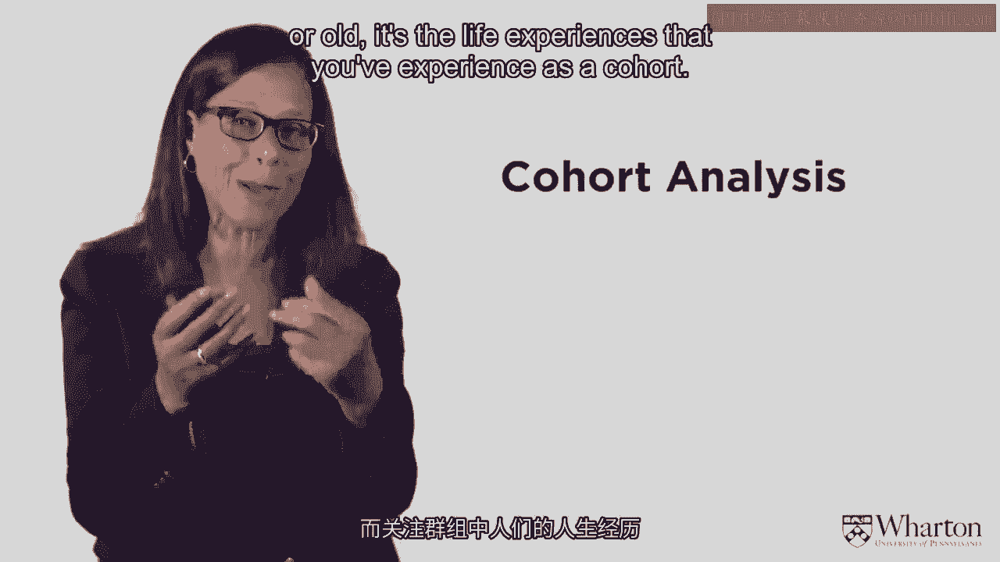
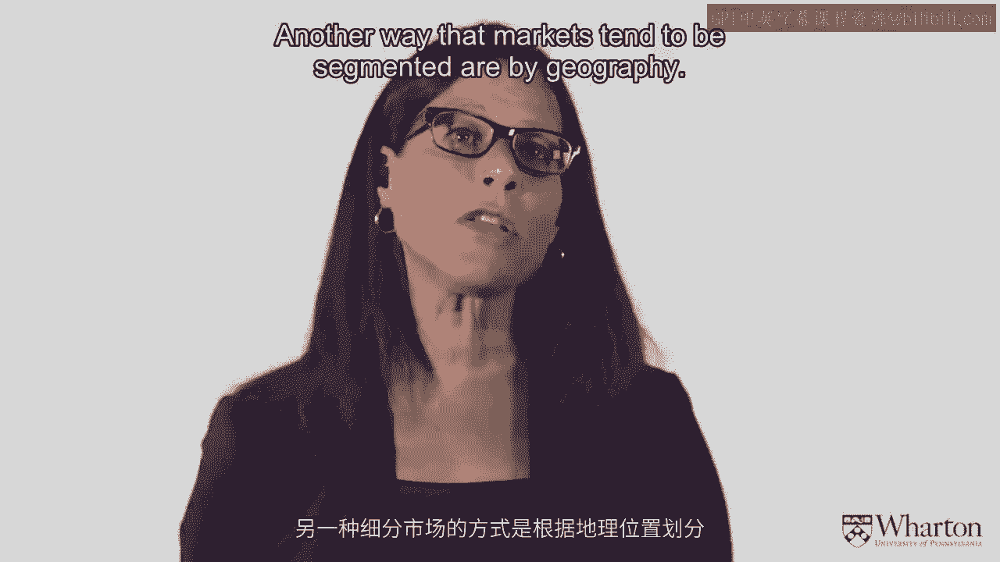
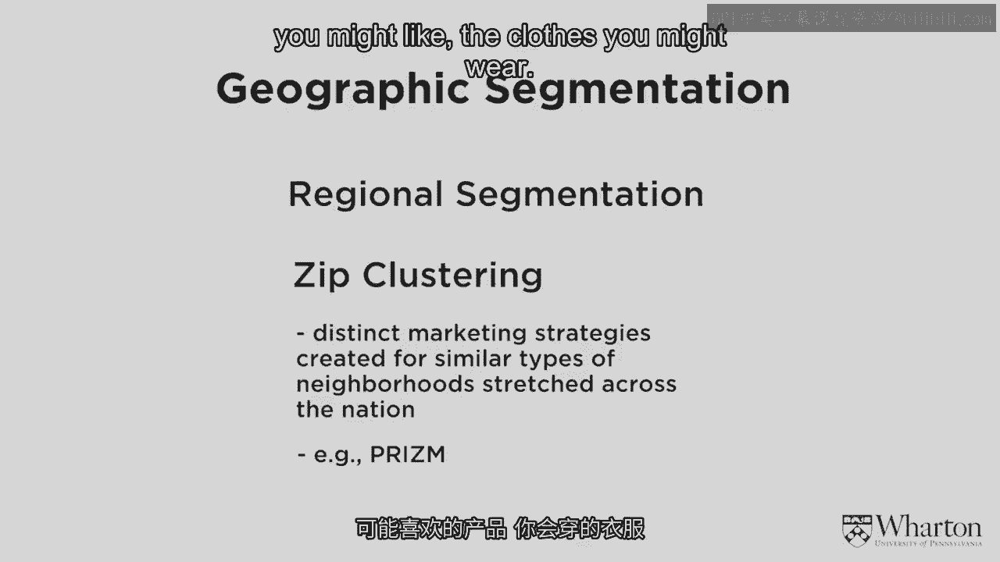
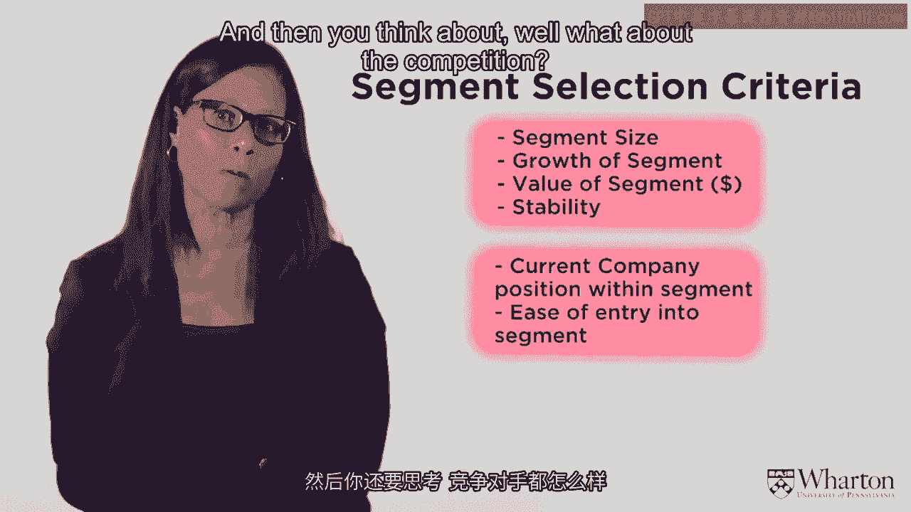
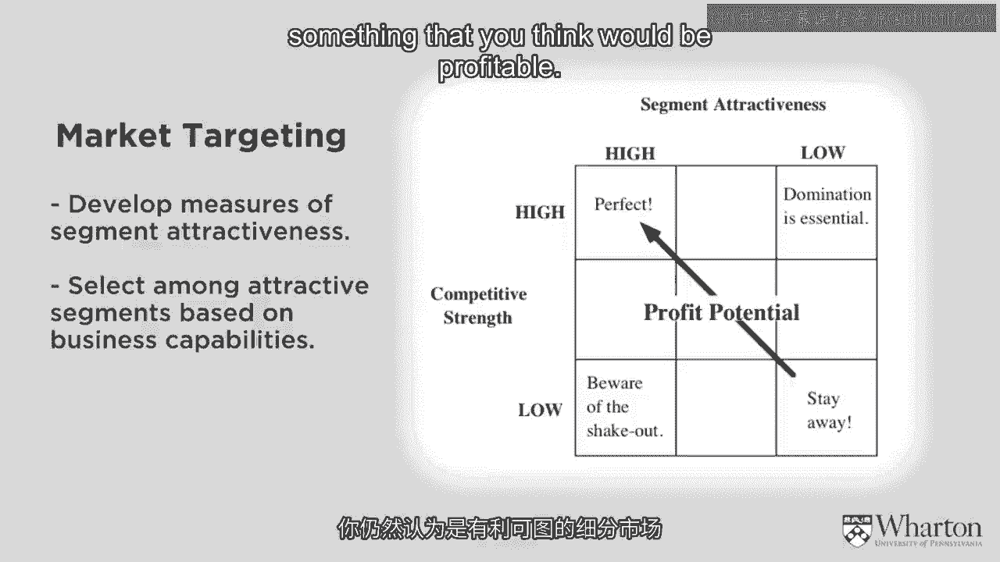
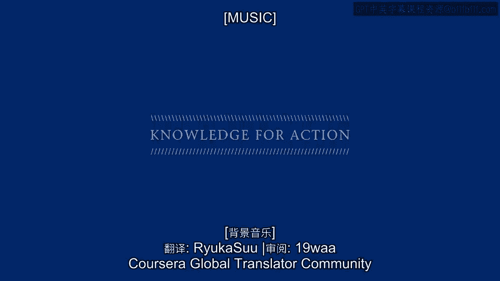

# 沃顿商学院《商务基础》｜Business Foundations Specialization｜（中英字幕） - P4：3_细分和目标定向.zh_en - GPT中英字幕课程资源 - BV1R34y1c74c

[MUSIC]。

So in this section， what we'd like to talk about is that concept I mentioned earlier， segmentation。

segmentation and targeting。 And this is a critical idea for marketing and very important for。

where we're going， which is brand positioning。

It's called the STP framework， segmentation， targeting and， positioning。

And when we get to positioning， that's when we first start getting to branding。

which is where we're headed。 So the positioning process says you start with segmentation with S of STP。

And segmentation says that you identify variables that， allows one to segment the market， okay？

So we're going to figure out different schemes for。

how to break up the market into different market segments。 The second part， the T is targeting。

You would evaluate the attractiveness of each of these segments and， you choose a segment to target。

And the third piece is positioning。 Once you get your target segment， you position your brand and。

your product to meet the needs of that target segment。 STP， segmentation， targeting and positioning。

So let me just give you the idea of why this is so important to have。

segmentation targeting and positioning。

And what I'm putting up on the background now is a slide that shows you。

the importance values two different segments have for roof tiles。 So on this graphic。

you can see the yellow segment。 Doesn't think price is that important。

They don't care about whether or not it's a low price， but。

they do care about how attractive the tiles look。 And they really care about how durable the tiles are。

On the other hand， the blue segment， they care a lot about the price。 They want a low price。

They don't really care that much about how it looks and。

they don't care that much about how long the tiles last。 If you did not segment this market。

the optimal thing to do would be to give average value to everything。

And what you would do therefore is not please anybody。

The average value here would be not a low enough price for。

the people who care about low price and not enough durability for。

the people who care about durability。 In some sense， I think of that as the lukewarm tea。

You can have hot tea and ice tea and if you give average， it's lukewarm tea and nobody's happy。

So one of the reasons to segment the market is if you don't。

you tend to try to reduce costs and go to the average value and， you're not meeting anybody's needs。

Going back to that concept of customer focused marketing。

if I want to give you exactly what you want， I need to segment the market。

And what you'll see is there's a heterogeneity or differences in preferences。

And then I need to choose or target which one of these segments I want to。

deliver to and deliver value to that segment。 And for example， in this case。

if I delivered durable tiles to the yellow segment。

they would be willing to pay a higher price for that and I could be very profitable。

But if I went to a lukewarm thing， I might not sell to anyone。

So segmentation means I divide the market up into market segments。 In fact。

let me just define it formally here。 Market segmentation is the process of dividing up the market into distinct subsets。

Where any subset could conceivably be selected。 And then you pick one of those market segments to be your target and。

you reach or you deliver to that customer segment。

that market segment with a distinct marketing mix。 Remember what the marketing mix is？ The four P's。

product， place， promotion， and price。 And what that says is when I'm looking at these different segments。

they may want different products。 It may make sense to advertise to them differently。

It may make sense to price differently。 It may make sense to deliver at a place decision or。

distribute to them differently。 And so that's the definition of market segment。 Very。

very critical idea in marketing。 So the question is how can I divide up the market？

And you might understand the idea that I'm going to go after market segments。

And I'm going to choose one of them and， then I'm going to give a unique product package or marketing mix to one of those segments。

Maybe you understand that concept。 But then the question is well。

what are the different ways to segment the market？ And there are actually lots of different ways。

The most common way that people most usually think about is to divide up。

the market on characteristics of the customer。 So intuitively you might think about demographics。

Well， men and women like different things。 So let's make a female product and a male product。

Or old people like things that are different than young people。

Or rich people have different needs than poor people。

So one of the segmentation schemes that people frequently think about are。

characteristics of the customer。 Another one though。

which doesn't really focus on characteristics of the customer， says well。

people like different things than products。 They focus on different benefits。 So in running shoes。

some people care about comfort。 Some people care about aesthetics。

Some people care about technology。 And so it might make sense to divide up the market or segment the market on。

the benefits that people seek。 A third way to think about it is how do people purchase？

Maybe they purchase online。 Some people purchase online。 Some people like to go to physical stores。

Some people like to use their phones。 Or some people purchase very frequently。

Some people only purchase once a year。 Some people like to switch around。

Other people like to be loyal。 All of these are different characteristics that you can use to segment the market。

Let me just give you a few examples of some of the interesting ways that people。

have segmented the market just to give you some ideas。 One of the ones。

people talk about demographics。 So they talk about old versus young， male versus female。

city dwellers versus， country dwellers。 Another thing that-- and I'm sure you've heard of this。

You may not know it by this term。 Another way to think about it is cohort analysis。

And what cohort analysis says， it's not really whether you're young or old。

It's the life experiences that you've experienced as a cohort。

And in particular， it's very important what happens when you're coming of age。 Right around 14， 15。

16， 17， 18， those kind of-- those things that hit you at that time， of your life are critical。

And they frame you as a generation。 And so this is the idea you've heard probably of baby boomers。

That's a cohort。 Baby boomers were born。 There's two cohorts of baby boomers。

There's ones that are born about 1950 and then the ones that are born about 1960。

And those-- that cohort of baby boomers all come of age at a certain time。

Certain things happen when they come of age。 And they react as a generation。

Generation X is another cohort。 And what you're hearing about nowadays really is generation Y。

People who are coming of age now， these are the kids who are in college。 They think of generation Y。

millennials。 And why do we really focus on the current generation？ Who's in college now？

What's that current generation？ Marketers are very interested in the generation as they come of age when they're in college。

or when they're this age。 Because many times you make purchases at this age and then you're loyal to those brands。

over time。 So it's-- marketers feel like it's very。

very important to get in those people's consideration， sets right at this time。

And so they spend a lot of time studying the cohort of today。 And today's cohort is generation Y。

Generation Y is very different from all the other generations。 First of all。

it's a generation that was completely brought up on the computer。 They think about free content。

They think about the social environment。 They're totally comfortable social network。

Everything's wireless。 They think about things being designed exactly for them。

They're totally used to customization。 This is a generation。

electronic generation that's quite different from their parents， and from generations beforehand。

And you really need to understand generation Y or the millennials in order to market to， them。

What they don't like is mass marketing。 They don't like any kind of restricted access。

They don't like things that are going down the beaten path。 They like new。 They like different。

They like customized。 Millennials are big shoppers。

But many times they co-purchase with their parents。

Some of the millennials still live with their and are supported by their parents。

They think about information electronically。 They are not readers of paper newspapers。

They don't care about print anymore。 They're very。

very comfortable multitasking and co-creating with the product。 They're very connected。

And the millennials tend to be socially responsible。

So if you're segmenting the market by cohorts and you decide to target the millennials。

you would have to design a targeted product or position your brand in a specific way to。

meet the needs of the millennials。

Another way that markets tend to be segmented are by geography。

It turns out that people who are similar tend to live together in the same neighborhoods。

And there are different ways to segment。 There's a segmentation scheme called PRISM that actually defines the entire country based。

on these geographic clusters。 And they're not defined necessarily about where they are。

So you could have a geographic cluster with some characteristic sets in California。

And people who live in New York may be in that same cluster。 So people who live， say。

in Beverly Hills， California may be similar to people who live， in Scarthdale， New York。

And those two may be in the same cluster， even though they're separated by 3，000 miles。

So the PRISM clustering or ZIP clustering says， if you tell me your ZIP code， and I'm。

giving you a United States example， but this kind of notion of geographic segmentation is。

true around the world。 People who are similar tend to live in neighborhoods that are similar。

And so you tell me where you live。 I have some ideas of the kinds of things you might like。

the products you might like， the， clothes you might wear， the media you may attend to， et cetera。

And what we find out， and we'll talk about later on in one of the other parts of this。

program when David Bell comes and talks to you， that it turns out that where you live。

physically also affects your online behavior。 So location is a very。

very important variable in thinking about segmentation。

And there are lots of maps that can divide up， say， the New York City， for example， into。

a block by block by block segmentation scheme and show different consumer behavior by blocks。

in New York City。 That's how tight the segmentation geographic segmentation can be。

Once you define your segmentation variables， then you need to select a target segment。

And so what makes a segment attractive？ You need to balance the attractiveness of the segment with your capability to deliver。

to that segment。 And you need to constantly monitor whether the actual buyers that you're targeting are。

matching what you think that they should be doing。 So how do you pick this segment？

You determine the attractiveness of the segment。 How big is it？ How much growth is there？

How much money do they have to spend？ How stable is it？

All of these are signs of an attractive segment。 Then you think about， well。

how good are you at meeting the needs of that segment？

What's your current position with respect to that segment？

How easy is it for you to address the needs of that segment？ And then you think about， well。

what about the competition？

How many people are going after that segment？ What's the strength of the competitors？

So are there potential competitors coming in？ And what you want to do is pick the most attractive segment where you have a differential。

advantage over the competition。 That's the best target segment for you to consider。

And so what you're looking for is you're going to divide the segment。

This is a graph that shows you。 You can have low to high segment attractiveness。

You can have low to high competitive strength。 And the best segment to go after or to target would be the most attractive segment where。

you are strongest relative to the competition。 That's perfect。

Sometimes you can't get the perfect segment。 And so you may choose something that's a little bit less attractive but still something。

that you think would be profitable。 [MUSIC]。

