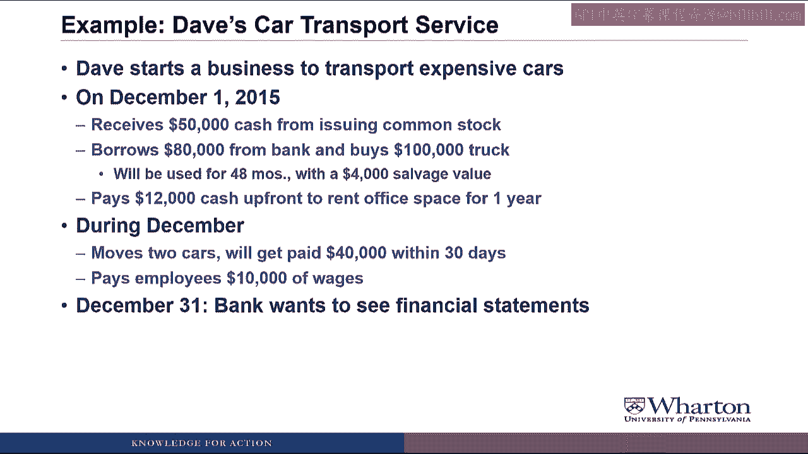
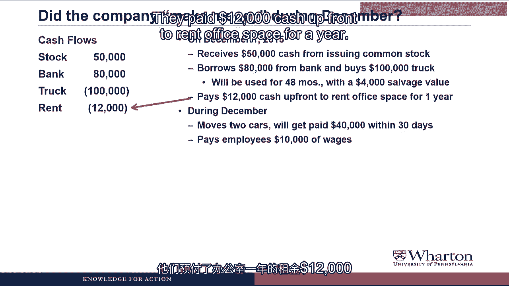
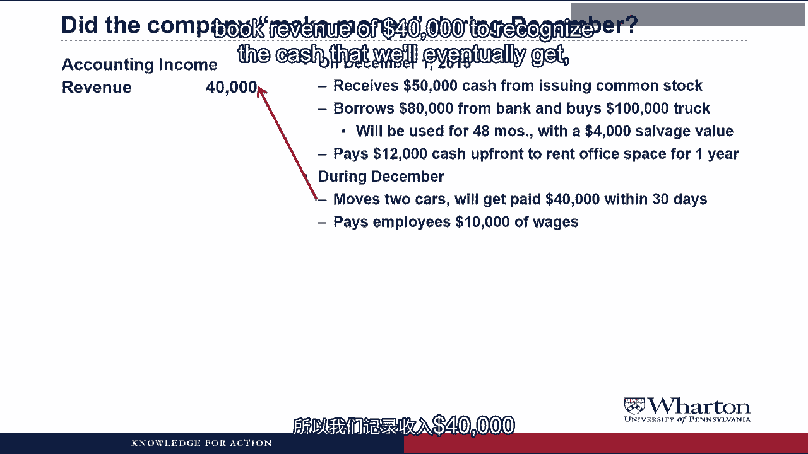
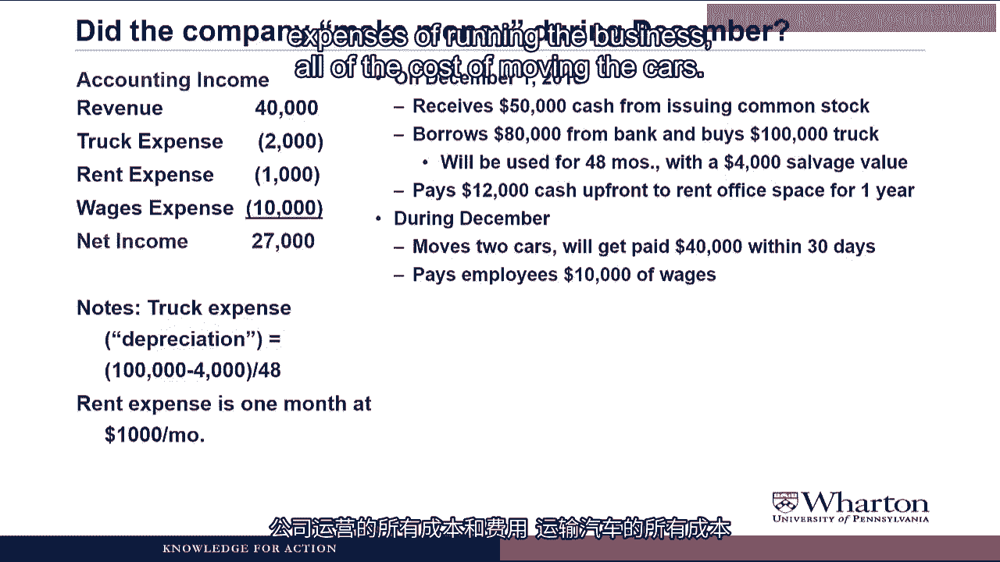
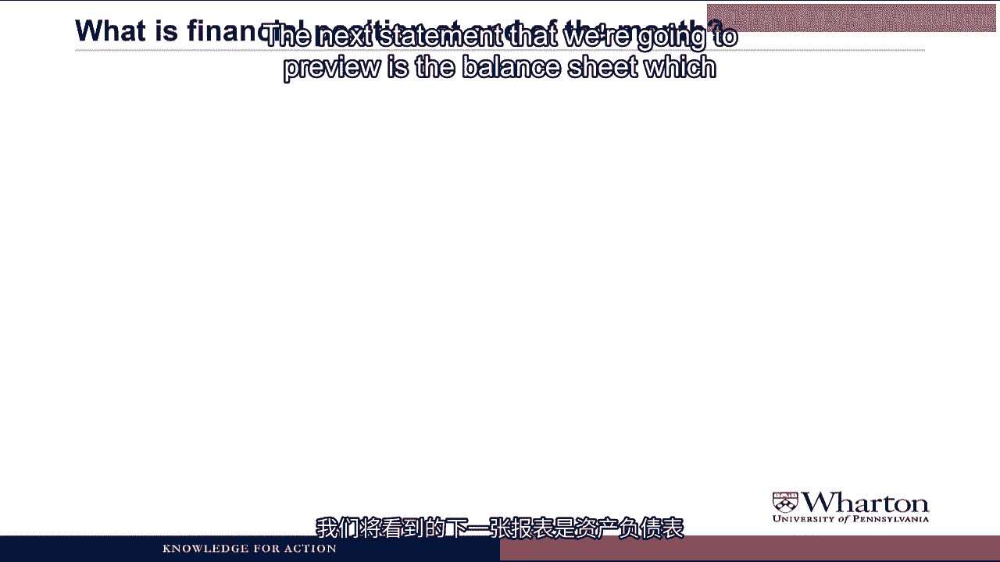
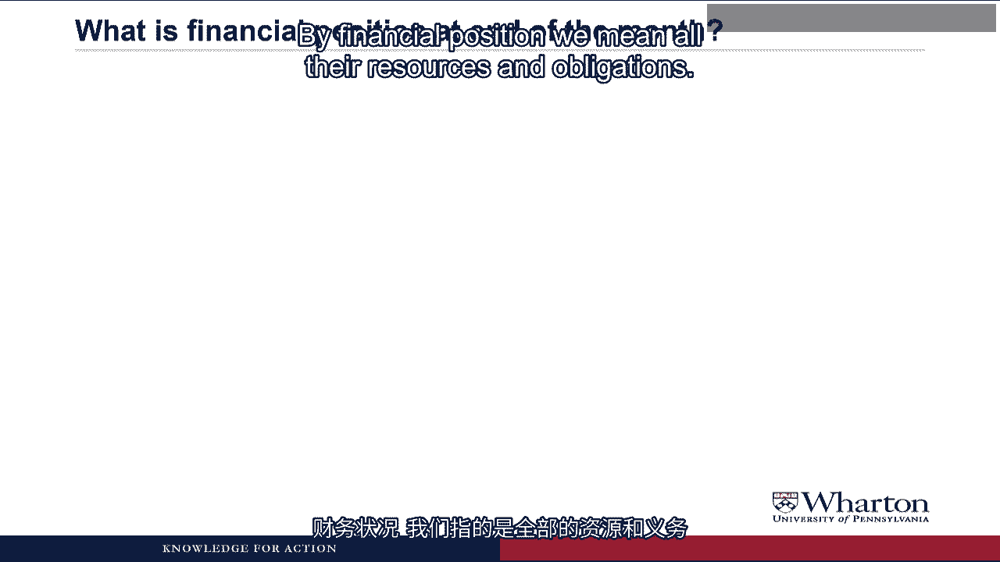
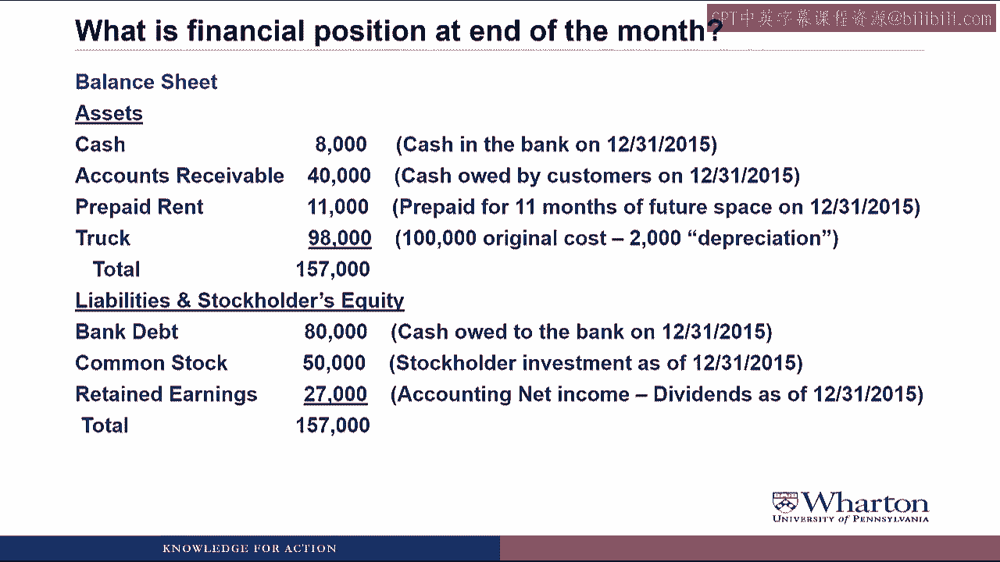

# 沃顿商学院《商务基础》｜Business Foundations Specialization｜（中英字幕） - P49：1_1 1 2 财务报告示例.zh_en - GPT中英字幕课程资源 - BV1R34y1c74c

Hello， I'm Professor Brian Boucher and welcome back。 In this video。

we're going to take a look at what the financial statements can tell us， about a business。 To do so。

we're going to look at a very simple business with just a few transactions to see。

how those transactions would affect the required financial statements。

I'm going to throw a lot of concepts at you in this video， but it's meant to be an overview。

We're going to go through all of these concepts again later on in the course。 Let's get started。

The example we're going to look at is Dave's car transport service。

So Dave starts a business to transport expensive cars。

On December 1st， 2015， he receives $50，000 cash from issuing common stock。

He also borrows $80，000 from a bank and will buy a $100，000 truck。

The truck will be used for 48 months with a $4，000 salvage value。

Excuse me， Professor。 The land is salvage value。 Just hold on a little bit。

We'll get to that a little later。 Dave also pays $12。

000 cash upfront to rent office space for the next year。

During the month of December， Dave's company moves two cars。 The clients will pay them $40。

000 within 30 days。

Dave also pays his employees $10，000 of wages。

Now it's December 31st and the bank wants to see some financial statements。

The bank wants to see financial statements because they want an answer to the question。

Did the company make money during December？

Now there's a number of different ways that we could try to answer this question。

The first way would be to just look at all the cash flows。

So if we take the facts and look at the cash flows， Dave's company received $50，000 cash。

from issuing stock， borrowed $80，000 from the bank and bought $100，000 worth of truck。

They paid $12，000 cash upfront to rent office space for a year。

They paid wages of $10，000 during December and they did not collect any cash from customers。

during the month。 So if we add it all up， they had a net cash inflow of $8，000。

But as it turns out， this is a really bad way to figure out whether the company made。

money or not for December。

What is wrong with that？ This is how a teenager would do accounting。

You get an allowance from your parents， borrow some money from your parents， spend a bunch。

of money， end the month with money in the bank， it's a pretty good month。

But this doesn't work so well for companies。 All the company would have to do to post better performance in the system would be to borrow。

more money or sell more stock。 A better way to look at cash flows would be to separate them into whether they come from。

operating the business or investing for the future or financing for the long term。

Let's try organizing the cash flows by the source or use of the cash。

So let's start with cash flows from operating the business。

This would be cash that was paid for the rent， the cash that was paid for the wages。

We didn't actually collect anything from customers。

So the net cash flow from operating the business was a cash outflow of $22，000。

Then we could look at cash required to invest in the business for the long term。

So the company spent $100，000 cash to buy a truck， which resulted in a total cash outflow。

from investing activities of $100，000。

And then finally we can look at cash used to finance the business。

So the company received $50，000 in cash initiative and common stock。 They borrowed $80。

000 from a bank， which was a net cash inflow from financing activities。

of $130，000。 We still get the same bottom line of $8，000。

but now we've organized the cash flows based。

on whether we're operating the business， investing in the business or financing the。

business。 And this is exactly what the statement of cash flows will look like。

It's going to report the cash transactions for the company over a period of time， like。

the month of December， split up into operating activities， which are transactions related。

to providing goods or services or other normal business activities， investing activities。

which are transactions related to the acquisition or disposal of long-lived assets， and financing。

activities which are transactions related to owners or creditors。

Another way to try to answer the question of whether the company made money in December。

is to look at accounting income。 Money income tries to look at business activities rather than cash going in or out。

For example， we actually did move two cars during December。

Even though we haven't got paid cash yet， we're likely to get paid cash， so why not。

book revenue of $40，000 to recognize the cash that we'll eventually get from providing。

the service of moving the cars。 Even though we paid $100，000 for a truck。

we're going to use that truck over four years。

So why not allocate the cost of the truck over the four years？ So we have a $100。

000 truck with a $4，000 salvage value。

Savage values how much we think the truck will be worth when we're done with it。

So let's take that $96，000 of value that we're going to use up， divide it by 48 months。

and recognize a $2，000 expense of using the truck each of the next 48 months。

We paid $12，000 cash up front to rent office space for a year， but we've only been in there。

for one month。 So why not just show one month of expense $1，000 rather than the full $12。

000 of cash。

that we paid up front。

We paid $10，000 of cash to employees for wages。 That was all due to work they provided this month。

so we'll show that all as a wages expense。

That gives us something called net income。

Net income is a measure of whether we priced our service， moving cars， high enough to cover。

all of the costs or expenses of running the business， all the costs of moving the cars。

And this is what the income statement is going to tell us。

It's going to give us the results of operations over a period of time using this notion of。

a cruel accounting where recognition is tied to business activities not to cash flows。

We'll have revenues which are increases in owners' equity from providing goods or services。

and we'll talk more about what owner's equity is in a little bit。

We'll have expenses which are decreases in owner's equity which are incurred in the process。

of generating these revenues。

It's the cost of doing business。 The bottom line or the difference between revenues and expenses is going to be called。

net income， which is also called earnings or net profit。

And it's important to note that it does not equal the change in cash because it's giving。

you a measure based on business activities not purely cash flow。

This does not make any sense。 What is this depreciation stuff？ We didn't spend $2，000 on a truck。

We spend $100，000。 Okay， just give me a few videos。

It'll take a little bit to explain all this to you。 Just hang in there。 Fine。

So there are two different statements for this month's results。 Which one is better？

Which should we use？ I once heard that Cash is king。 I am going to only use the cash flow statement。

No no no no。 We'll talk about this more but you definitely want to use both statements because they tell。

you different things。 Let's take a look at how these two statements provide different pictures of what happened。

with the company。 So starting with revenue that tells you that you moved cars during the period and you're。

eventually going to get paid $40，000 from customers whereas the zero in the cash flow。

statement says that you actually didn't get any cash this period。

For the truck， the cash flow statement tells you that you spend $100，000 cash on a truck。

The accounting income says that the cost of the truck used up this period to generate。

revenue is only $2，000 because we're spreading it over the whole time that we're going to。

use the truck。 For rent， our cash flow statement said we paid $12。

000 cash this period for rent but our accounting。

income says that we only used up one month of that。

We still have $11，000 that we haven't used up that we'll use up over the next 11 months。

Sometimes the expenses and the cash flow are the same as in the case of wages here but as。

you can see from the cash from operations and the income you're getting very different。

pictures。 Cash flow from operations of negative $22。

000 says that you spent more cash than you had come。

in based on these operating activities。

The net income though says that you priced your service high enough to cover all the。

costs of providing the service which even though didn't get you cash this period should。

lead to positive cash flow in the future。

The next statement that we're going to preview is the balance sheet which provides the financial。

position of Dave's car transport company at the end of the month。

By financial position we mean all the resources and obligations。

So the resources are what we call assets。

So what are the assets or resources of Dave's company？ Well they have $8。

000 of cash in the bank at December 31， 2015。

They have something called an accounts receivable of $40，000 that's the cash owed by customers。

on December 31st and that's an asset because it's going to eventually turn into cash when。

you collect from the customers。

Another asset is prepaid rent。 Remember that Dave paid $12，000 for years of rent。

One month has been used up but they still have 11 months of prepaid rent。

This is an asset because they can occupy the space for another 11 months without paying。

any additional cash。

And then of course there's the truck which is an asset of $98，000 that's the original。

cost of at $100，000 minus that $2，000 that we depreciate it。

We'll talk more about this later on。 So it gives us total assets or resources of $157，000。

Now we can look at all the obligations or claims on these resources which are the liabilities。

and stockholders equity。 Dave owes the bank $80，000 at December 31， 2015。

That's a liability called bank debt。

There's $50，000 of stockholders investment as of December 31。

This is a stockholders equity called common stock。

And then there are retained earnings of $27，000。 Many earnings represent all of the net income or accounting income that's been created over。

the life of the company minus any dividends that have been paid out which we'll talk about。

later。 And when we add it all up the obligations are the same as the resources of $157，000。

And this is characteristic of the balance sheet which always has to balance hence the， name。

I am truly lost。 When is this video going to end？ I'm sorry I know I've thrown a lot of new concepts at you in this video but don't worry。

we're going to go over everything again in more detail。

So just hang in there and there's only a couple more slides and we're done。

So as I was saying this financial statement is called the balance sheet。

It's going to report the financial position of the company， its resources and obligations。

on a specific date。 We've got assets which are resources owned by the business that are expected to provide。

future economic benefits。 Stakeholders are claims on those assets by creditors or non-owners that represent an obligation。

to make future payments of cash， goods or services。

Stakeholders equity or owner's equity are claims on the assets by the owners of the business。

Those come from two sources， contribute a capital which arise when you sell shares and。

retained earnings which arise when you operate the business。

We're going to talk about these a lot more in the next few videos。

The last statement is the statement of stockholders equity and we're going to get to this later。

Hopefully that gave you a good overview of what the financial statements are trying to， tell us。

We are now going to start looking at the financial statements in more detail starting in the。

next video with the balance sheet and the balance sheet equation。 I'll see you then。

See you next video。 。 [ Silence ]。
