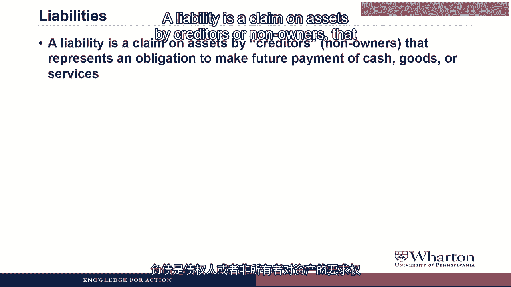
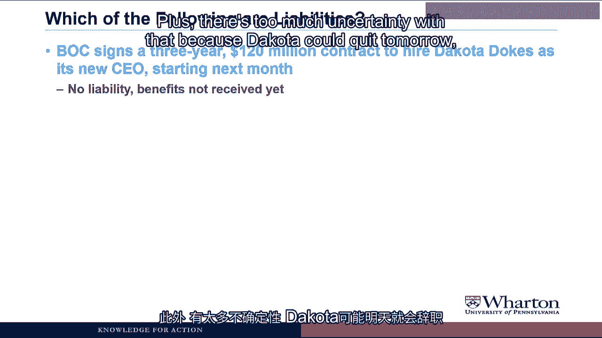
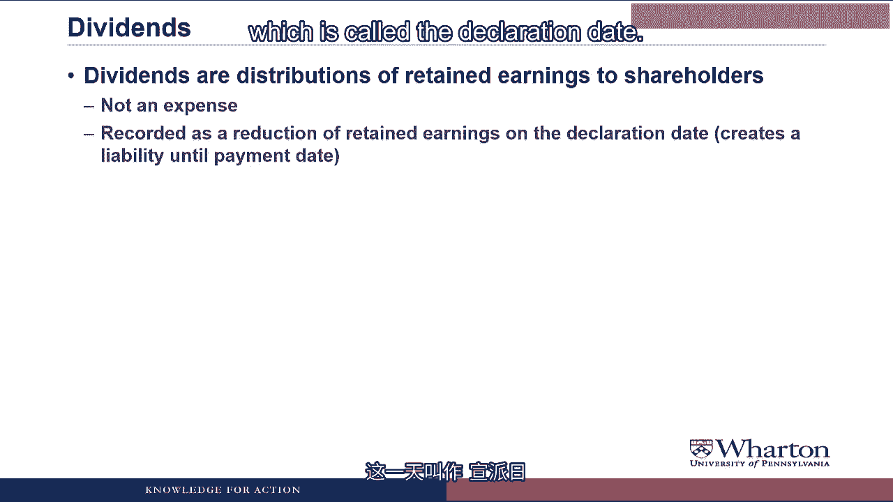

# 沃顿商学院《商务基础》课程 P51：3.1.2.2 资产、负债与股东权益 📊

在本节课中，我们将深入探讨资产负债表等式，详细讲解资产、负债和股东权益。我们将为每一项提供精确定义，并分析哪些情况可以记录它们，哪些情况不能。

---

## 资产的定义与确认标准 💼

资产是预期能提供未来经济利益的资源。这意味着它要么能产生未来的现金流入，要么能减少未来的现金流出。

确认一项资产需要满足两个标准：
1.  它必须是在过去的交易或交换中获得的。
2.  其未来利益的价值能够以合理的精确度进行计量。

例如，我们购买一辆卡车，这辆卡车就是一项资产。我们在交易中获得了卡车的所有权，其利益的价值等于我们购买卡车所支付的价格，因此两个标准都满足。

---

## 资产判断练习 🧠

以下是判断资产的一些例子。对于每一项，请思考它是否是资产。如果是，请给出账户名称和金额；如果不是，请说明不符合哪个标准。

**1. BOC向客户销售了价值10万美元的商品，客户承诺在60天内支付现金。**

*   **判断：** 这是资产。
*   **账户名称：** 应收账款。
*   **金额：** 10万美元。
*   **原因：** 我们通过交付商品完成了一笔交易，并获得了客户支付现金的承诺。这笔应收账款可以在未来60天内转化为现金，其价值（客户欠我们的发票金额）可以合理估计。

**2. BOC签署合同，承诺在未来一年内每月向DEF交付价值10万美元的天然气。**

*   **判断：** 这不是资产。
*   **原因：** 尚未发生任何过去的交易或交换。所有的现金、商品或服务交换都将在未来发生，因此目前不能确认资产。

**3. BOC购买了价值10万美元的化学品作为原材料，在交付时支付现金，并获得了2%的折扣。**

*   **判断：** 这是资产。
*   **账户名称：** 存货。
*   **金额：** 9.8万美元。
*   **原因：** 我们在市场交易中获得了化学品，其利益的价值是已知的（即我们实际支付的价格）。注意，价值是9.8万美元，而不是10万美元，因为我们按实际支付的价格入账。

**4. BOC为其办公楼支付了1200万美元的年租金，目前已使用一个月。**

*   **判断：** 这是资产。
*   **账户名称：** 预付租金。
*   **金额：** 1100万美元。
*   **原因：** 我们通过支付获得了在未来12个月内使用办公楼的权利。其利益的价值是我们支付的金额。但注意，由于我们已经使用了一个月，未来的利益只剩下11个月，因此此时资产的价值是1100万美元。

**5. BOC以10万美元购买了一块土地。经纪人说这很划算，因为土地可能值15万美元。**

*   **判断：** 这是资产。
*   **账户名称：** 土地。
*   **金额：** 10万美元。
*   **原因：** 存在市场交易，我们获得了所有权。利益的价值假定为我们支付的价格，即10万美元。我们忽略经纪人关于土地价值的看法，因为那不是市场交易中的支付价格，我们使用更客观的实际支付金额。

**6. 一家营销公司建议BOC，其品牌名称价值6300万美元。**

*   **判断：** 这不是资产。
*   **原因：** 我们从未在过去的交易或交换中获得该品牌。此外，品牌的价值也无法以合理的精确度计量。会计倾向于可靠性和客观性，在没有市场交易确认其价值的情况下，不会将其计入财务报表。

---

## 负债的定义与确认标准 📝

负债是债权人或非所有者对资产的索偿权，代表未来支付现金、商品或服务的义务。

与资产类似，确认一项负债也有两个标准：
1.  该义务是基于当前或过去已收到的利益或服务。
2.  支付的金额和时间是合理确定的。

本质上，第一个标准要求存在某种交易或交换，使你收到了某些东西并因此产生了义务；第二个标准要求你能计量该义务的金额。

例如，我们从银行借款。我们有义务偿还银行，因为我们收到了现在使用这笔钱的好处。支付的金额和时间是合理确定的。因此，向银行借款满足两个标准，是一项负债，称为“应付票据”或“应付抵押贷款”。

---

## 负债判断练习 🧠

现在，让我们用同样的方法练习判断负债。

**1. BOC从供应商处收到价值30万美元的原材料，并承诺在60天内付款。**

*   **判断：** 这是负债。
*   **账户名称：** 应付账款。
*   **金额：** 30万美元。
*   **原因：** 我们在交易中获得了原材料的好处，这产生了向供应商付款的义务。义务的金额（发票金额）是合理确定的。

**2. 根据本季度运营情况，BOC估计欠美国国税局300万美元税款。**

*   **判断：** 这是负债。
*   **账户名称：** 应交所得税。
*   **金额：** 300万美元（估计值）。
*   **原因：** 政府允许我们经营业务，我们获得了在该国经营的好处，这产生了纳税义务。虽然具体金额未知，但我们可以根据现有信息进行合理估计。

**3. BOC签署了一份为期三年、价值1.2亿美元的合同，聘请Dakota Dokes下个月开始担任新CEO。**

*   **判断：** 这不是负债。
*   **原因：** 没有基于当前或过去已收到利益的义务。在Dakota实际为我们工作之前，不存在负债。即使存在，负债也只针对他/她已工作但未获报酬的时间。我们不会为整个三年合同记录负债，因为我们尚未收到全部利益，且金额存在太多不确定性。

**4. BOC尚未支付员工在最近一个工资周期内赚取的100万美元薪水。**

*   **判断：** 这是负债。
*   **账户名称：** 应付职工薪酬。
*   **金额：** 100万美元。
*   **原因：** 员工已为我们工作，我们获得了其服务的好处，因此产生了支付报酬的义务。应付金额是合理确定的。

**5. BOC以10%的利率从银行借入50万美元的一年期票据。**

*   **判断：** 这是负债。
*   **账户名称：** 应付票据。
*   **金额：** 50万美元。
*   **原因：** 我们收到了银行50万美元的好处，因此产生了还款义务。应付金额（本金）是合理确定的。注意，此时利息还不是负债，因为借款刚刚发生，如果立即还款则无需支付利息。利息负债会随着时间推移和未支付而累积。

**6. BOC被一群客户起诉，声称其产品有缺陷。诉讼要求赔偿600万美元。**

*   **判断：** 这不是负债。
*   **原因：** 虽然存在基于过去已收到利益（销售了有缺陷的产品）的潜在义务，但支付的金额在达成和解或审判前仍不确定。由于这种不确定性，我们此时无需记录负债。

---

## 股东权益 🏛️

股东权益是清偿债权人索偿后，对资产的剩余索偿权。换句话说：

**股东权益 = 资产 - 负债**

它也被称为所有者权益、净资产或账面净值。

与资产或负债不同，股东权益没有单独的计量标准。如果你正确计量了所有资产和所有负债，那么股东权益就是剩余的部分。

股东权益有两个主要来源：

1.  **实收资本：** 来源于向公众出售股票。
    *   **普通股：** 记录股票的面值部分。
    *   **资本公积：** 记录收到的超过面值的部分。
    *   **库存股：** 公司从投资者手中回购自己股票时的称呼。

2.  **留存收益：** 来源于企业经营。
    *   留存收益是自公司成立以来，净利润（收入-费用）减去已支付股利的累积额。

**关于股利的说明：**
*   股利是向股东进行的留存收益分配，**不被视为费用**。
*   在董事会宣布股利之日（宣告日），我们将其记录为留存收益的减少。
*   如果宣告日未立即支付现金（通常如此），则在支付日之前，会产生一项对股东的负债（应付股利）。

---

## 总结 📚

本节课中，我们一起深入学习了资产负债表的核心要素：
*   **资产**是能带来未来经济利益的资源，确认需满足“过去交易获得”和“价值可计量”两个标准。
*   **负债**是未来支付现金、商品或服务的义务，确认需满足“基于已获利益”和“金额时间确定”两个标准。
*   **股东权益**是资产减去负债后的剩余部分，主要来源于股东投入（实收资本）和经营积累（留存收益）。

理解这些概念是读懂财务报表的基础。在接下来的课程中，我们将学习如何运用“借”与“贷”这一神奇工具来准确记录和跟踪所有这些项目。