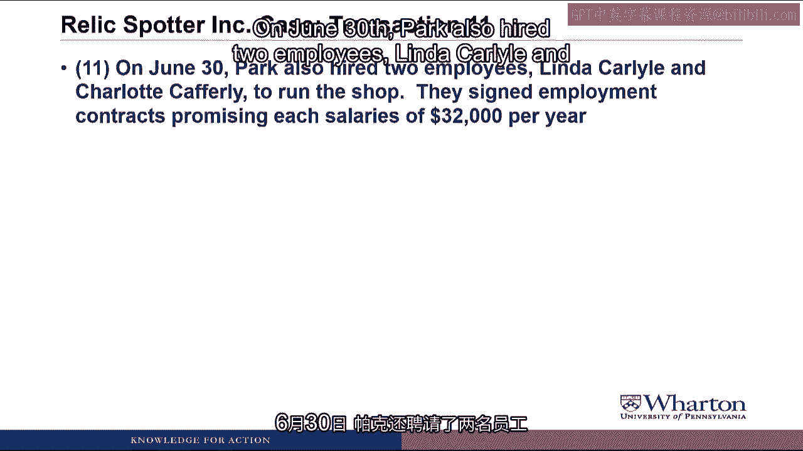
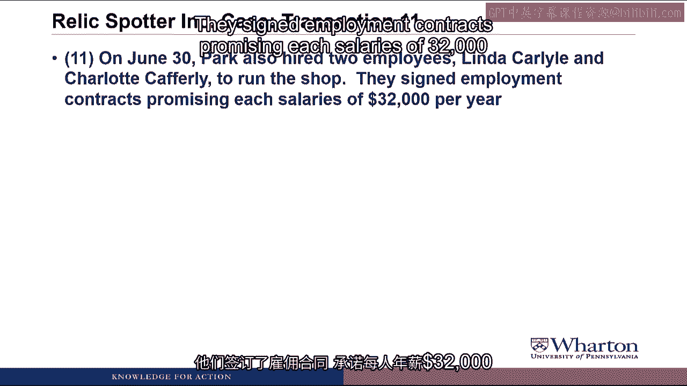
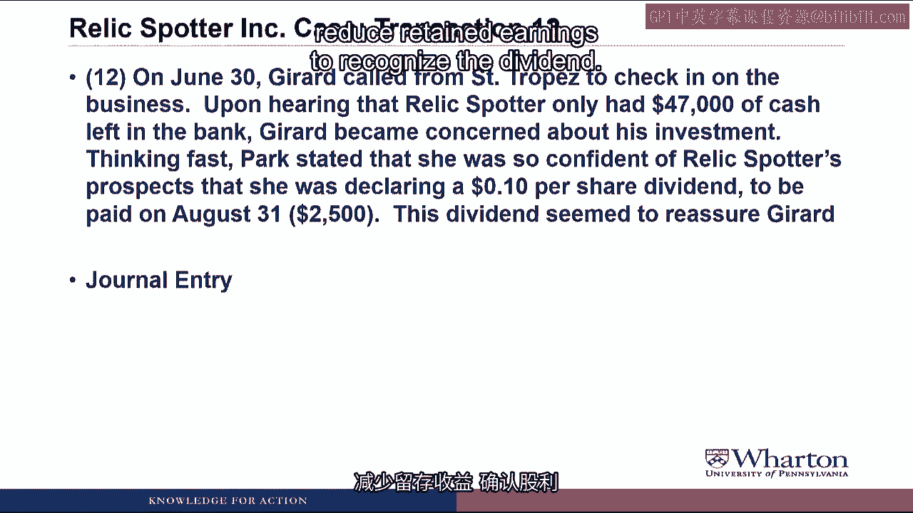

# 沃顿商学院《商务基础》课程 P55 📚：文物寻宝案例（第二部分）会计分录解析

在本节课中，我们将继续学习“文物寻宝”案例的初始交易，并完成第7至第14笔交易的会计分录记录。我们将重点理解每笔交易对资产、负债和所有者权益的影响，并学习如何将其正确记录在T型账户中。

---

## 交易七：赊购存货

上一节我们处理了公司成立初期的投资与采购交易。本节中，我们来看看一笔涉及信用采购的交易。

6月15日，帕克订购了价值2000美元的杂项存货（例如水瓶、能量棒等），货物将于6月30日交付。帕克以赊账方式采购，这意味着她可以在收货后30天内付款给供应商。

以下是这笔交易的会计分录：

*   **借记存货 2000美元**：存货是一项资产，资产增加记在借方。
*   **贷记应付账款 2000美元**：欠供应商的钱是一项负债，负债增加记在贷方。

> **核心概念**：`应付账款`是专门用于记录欠供应商款项的会计科目。

为什么交易日期是6月30日而非6月15日？因为6月15日只是下订单，尚未发生现金、商品或服务的交换。直到6月30日实际收到存货时，才需要进行会计记录。

我们将此分录过入T型账户。这次不涉及现金账户，我们创建一个存货T型账户（借方余额）和一个应付账款T型账户（贷方余额）。

---

## 交易八：购买软件许可

处理完存货采购后，我们来看一笔购买长期资产的交易。

6月30日，帕克支付了2100美元，购买了一份为期三年的地理等高线测绘软件站点许可，用于金属探测器。

对于这笔日记账分录，我们再次涉及现金支付。

*   **贷记现金 2100美元**：现金是一项资产，现金减少记在贷方。
*   **借记软件 2100美元**：我们获得的是软件。因为它能提供超过一年的未来利益（三年使用权），所以它是一项资产。资产增加记在借方。

> **核心概念**：判断一项支出是记为**资产**还是**费用**，关键在于它是否能带来**未来经济利益**。能带来超过一个会计期间利益的支出，通常先记为资产。

我们将此日记账分录过入T型账户，在现金账户的右侧（贷方）再记入一笔，并创建一个新的软件资产T型账户。

---

## 交易九：预付广告费

接下来，我们分析一笔为未来服务预先付款的交易。

6月30日，帕克与一家本地广告公司签订合同，为期一年。她预付了8000美元，用于截至2013年6月30日的广告服务。

在这笔日记账分录中，我们支付了8000美元现金。

*   **贷记现金 8000美元**：现金减少，记贷方。
*   **借记预付广告费 8000美元**：我们获得了一整年的广告服务权，这是一项资产（预付款项）。资产增加记借方。

> **核心概念**：这里的资产`预付广告费`仅代表已预付的广告成本，**不代表**广告可能带来的潜在价值。由于未来收益无法可靠计量，我们只记录实际发生的成本。

我们将此交易过入T型账户，在现金账户贷方再记一笔，并创建一个预付广告费T型账户，借记8000美元。

---

## 交易十：向员工提供贷款

现在，我们来看一笔公司向所有者提供贷款的特殊交易。

6月30日，帕克需要现金来支付用于购买文物寻宝公司股票的帝国银行贷款。她以10%的利率从文物寻宝公司借款5000美元，本金和利息将于2013年6月30日一次性付清。

这笔交易看似复杂，但我们从已知部分开始：文物寻宝公司支付了5000美元现金给丽贝卡·帕克。

*   **贷记现金 5000美元**：公司现金减少，记贷方。
*   **借记应收票据 5000美元**：公司获得了一项在未来收回现金的权利，这是一项资产。资产增加记借方。我们称之为`应收票据`而非`应收账款`，因为后者通常用于记录客户欠款。

> **核心概念**：`应收票据`用于记录正式的贷款债权，而`应收账款`通常用于记录与客户的日常赊销款项。

我们将此笔交易过入T型账户，再次贷记现金，并创建一个应收票据T型账户。

---

## 交易十一：签订雇佣合同

在分析了资产和负债交易后，我们思考一下承诺是否构成会计交易。

6月30日，帕克还雇佣了两名员工来经营店铺。她们签订了雇佣合同，承诺每人年薪32000美元。

我们需要为此编制日记账分录吗？实际上，尚未发生交易。公司尚未向员工支付任何现金，员工也尚未开始工作。仅仅签订合同这种承诺，我们不予会计确认。因此，**没有日记账分录**。

> **核心概念**：确认负债的一个标准是，义务必须基于**当前或过去已收到的利益**。由于员工尚未提供服务，公司并未产生现时义务。

---

## 交易十二：宣告股利

接下来，我们处理一笔涉及所有者权益分配的交易。

6月30日，帕克为了安抚投资者，宣布将于8月31日支付每股0.1美元的股利，总计2500美元。

根据会计惯例，公司在**宣告股利时**即需进行会计处理，尽管现金将在之后支付。

*   **借记留存收益 2500美元**：股利分配减少所有者权益。减少所有者权益（贷方余额账户）需借记。
*   **贷记应付股利 2500美元**：宣告股利产生了支付现金的义务，这是一项负债。负债增加记贷方。

> **核心概念**：`应付股利`是一项特殊的负债，它代表公司对股东的支付义务。宣告日即确认负债和权益的减少。

我们将此过入T型账户，创建一个留存收益T型账户（借记）和一个应付股利负债T型账户（贷记）。

---

## 交易十三：支付供应商货款

在宣告股利后，我们回到更常规的负债清偿交易。

7月31日，帕克向供应商支付了所欠的2000美元。

*   **贷记现金 2000美元**：支付现金，现金减少。
*   **借记应付账款 2000美元**：清偿对供应商的负债。负债减少记借方。

我们将此过入T型账户。在现金账户贷方再记一笔，并借记应付账款账户。此时应付账款余额为零，因为债务已全部清偿。

---

## 交易十四：支付已宣告股利

最后，我们完成股利支付环节。

8月31日，帕克支付了6月份宣告的2500美元股利。

*   **贷记现金 2500美元**：支付现金。
*   **借记应付股利 2500美元**：清偿对股东的股利负债。负债减少记借方。

我们将此过入T型账户，再次贷记现金，并借记应付股利账户。该账户余额归零，表明股利支付义务已完成。

---

## 总结

本节课中，我们一起学习了“文物寻宝”案例第7至第14笔交易。我们重点掌握了：
1.  **信用采购**（交易七）如何同时增加资产和负债。
2.  区分**资本性支出**（资产，如交易八的软件）与**收益性支出**（费用）。
3.  **预付费用**（交易九）作为资产的处理。
4.  公司向个人提供**贷款**（交易十）的记录。
5.  未产生现时经济利益的**承诺**（交易十一）不进行会计确认。
6.  **股利宣告**（交易十二）和**支付**（交易十四）的全过程会计处理。
7.  **清偿负债**（交易十三、十四）的通用模式：借记负债科目，贷记现金。

这些交易为我们理解收入、费用以及利润的生成奠定了坚实的基础。下节课，我们将在此基础上，继续探索公司的运营活动。