# 沃顿商学院《商务基础》课程 P56：3M公司年度报告之旅 📊

在本节课中，我们将跟随Brian Bouscher教授，快速浏览3M公司的年度报告，了解一份真实财务报表的结构与核心组成部分。通过本次概览，你将对后续深入分析具体财务内容打下基础。

---

## 报告封面与致股东信

年度报告以光鲜的封面开始，展示了3M的科学成就及其对社会的积极影响。

翻过封面，我们会看到董事长兼首席执行官致股东的信函。这是管理层对公司过去一年业绩的总结与说明。

报告中通常包含展示业绩增长的图表，初步传递公司运营良好的信号。

---

## 财务摘要与SEC文件

接下来是财务摘要部分。需要指出的是，仅凭摘要无法全面了解公司状况，必须阅读完整的年度报告。

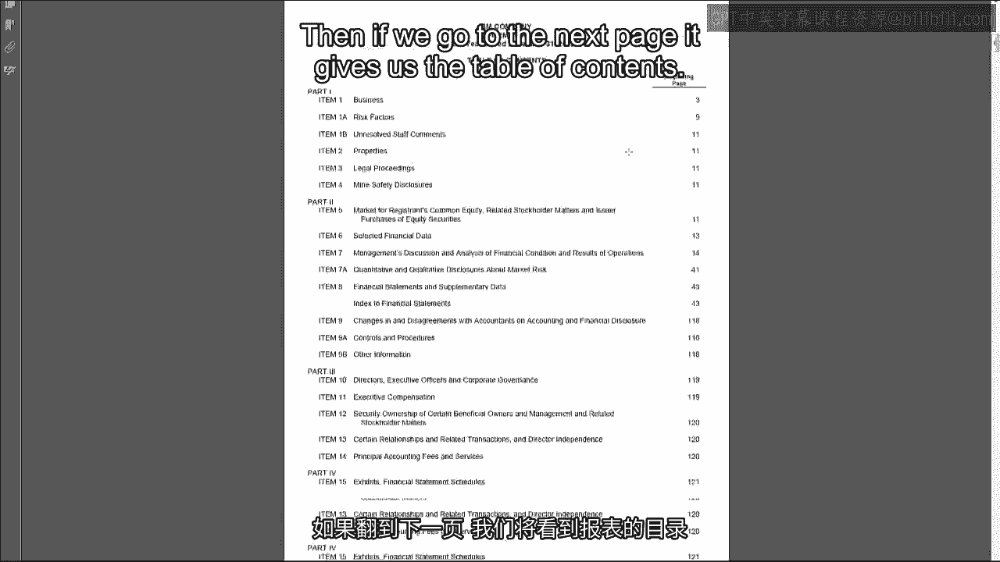

随后报告进入正式的法律文件部分，即提交给美国证券交易委员会的10-K表格。从此处开始，报告内容受到《1934年证券交易法》及SEC的全面监管，具有法律严肃性。

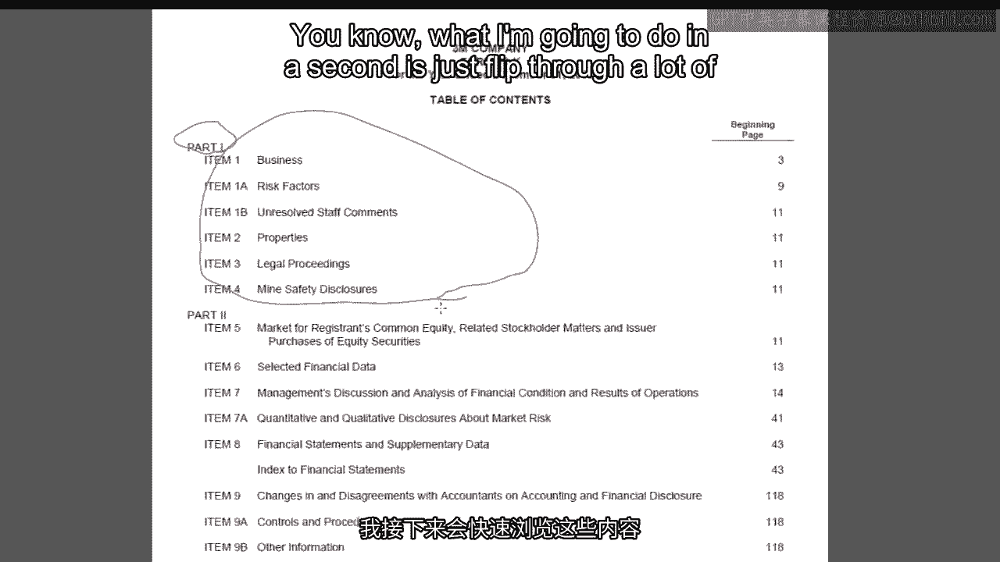

---

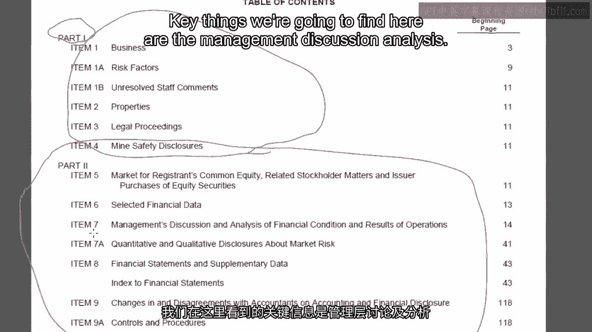

## 报告结构总览

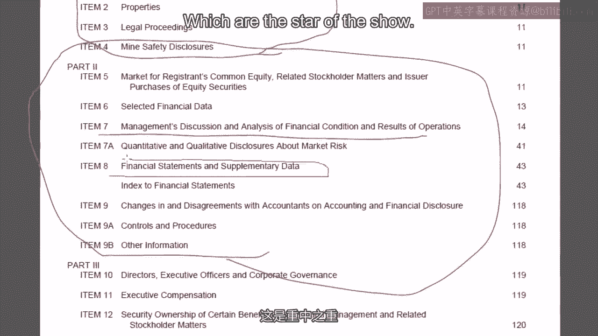

以下是10-K报告的主要组成部分概览：

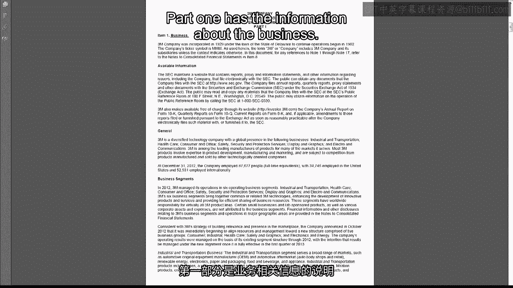

**第一部分：业务描述**
此部分详细介绍了公司的业务情况。

**第二部分：财务信息**
这是报告的核心，包含管理层讨论与分析以及财务报表。

**第三部分：公司治理与代理信息**
涉及董事、高管信息及其薪酬等。

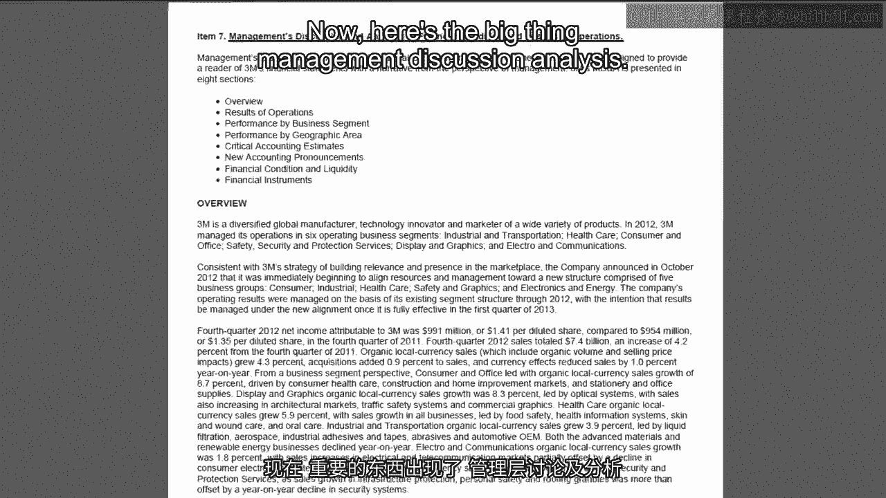

**第四部分：补充资料与附件**
包含财务报表附表及其他文件。

---

## 深入第二部分：管理层讨论与分析

上一节我们介绍了报告的整体结构，本节中我们来看看财务信息部分的核心——管理层讨论与分析。

这部分是管理层向财务报表使用者解释本年度重大事项、数字变化原因的文字说明。其目的是帮助用户理解财务报表。

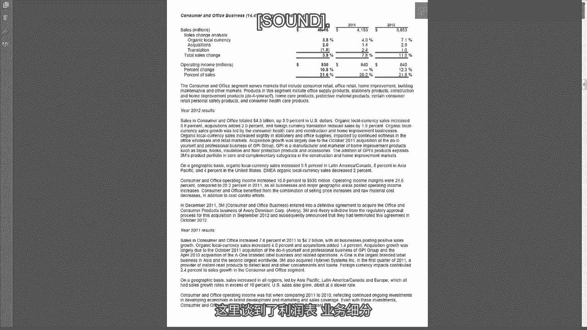

尽管管理层在此提供了详细解释，阅读时仍需保持一定的审慎态度。历史上存在公司在此部分进行虚假陈述的案例。建议的方法是：先独立分析财务报表及附注，形成自己的理解，再与管理层的解释进行比对验证。

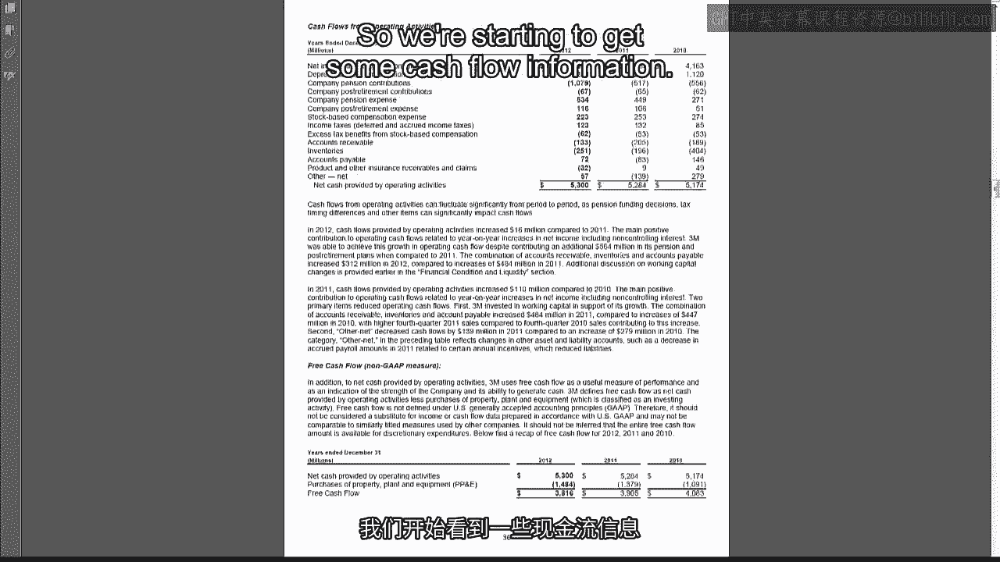

管理层讨论与分析通常涵盖以下详细内容：
*   对利润表的讨论
*   业务分部分析
*   地域分部分析
*   财务状况与流动性分析（涉及现金流信息）
*   市场风险披露

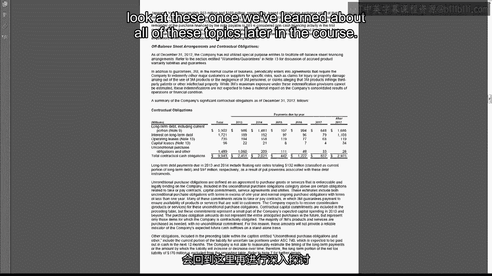

---

## 核心：财务报表与审计报告

在管理层讨论与分析之后，我们终于迎来了“主角”——财务报表。

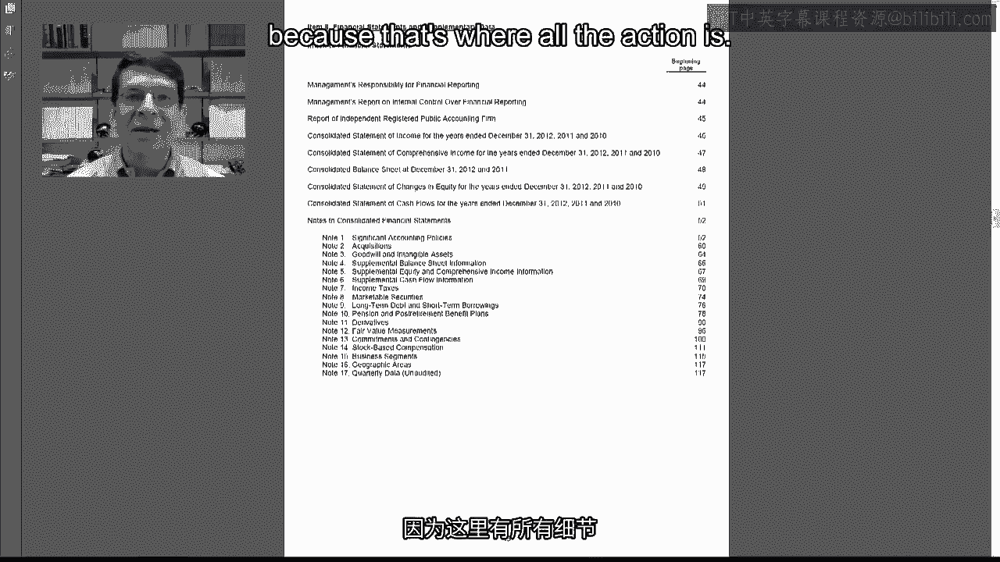

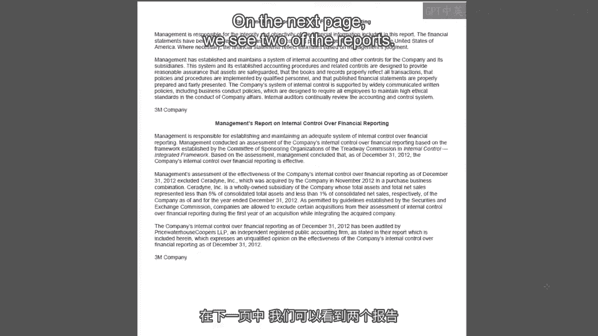

值得注意的是，本报告中包含2页审计报告、6页财务报表主体以及多达**66页的财务报表附注**。这直观地表明，要真正理解公司，必须深入研读附注细节。

审计报告包含两项重要声明：

1.  **管理层责任声明**：声明管理层对编制财务报表及维护内部控制负责。
2.  **独立审计师报告**：审计师发表意见。

需要重点理解审计意见的含义。审计师并非提供**100%准确无误**的绝对保证。其意见的核心是：**我们认为**，财务报表在所有**重大方面**公允地反映了公司的财务状况、经营成果和现金流量，并符合**美国通用会计准则**。

因此，审计提供了合理保证，但报表使用者仍需保持职业怀疑态度。

此外，受安然事件和《萨班斯-奥克斯利法案》影响，报告还包括对内部控制的审计，这部分内容本课程不做深入探讨。

---

## 报表主体与浩瀚的附注

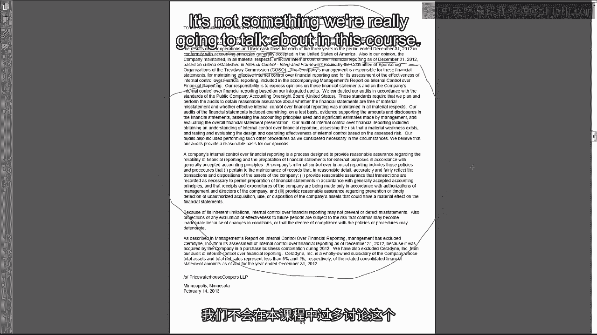

接下来是具体的财务报表，我们将在此后的课程中逐一深入学习：
*   利润表
*   资产负债表
*   股东权益变动表
*   现金流量表

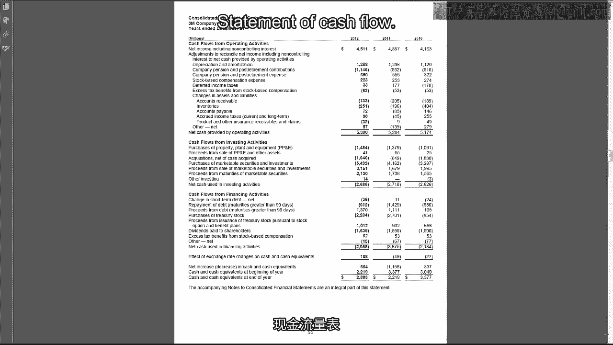

紧随其后的是长达66页的财务报表附注。虽然现在看起来令人望而生畏，但请放心，随着课程推进，你将逐渐掌握阅读和分析附注的能力。

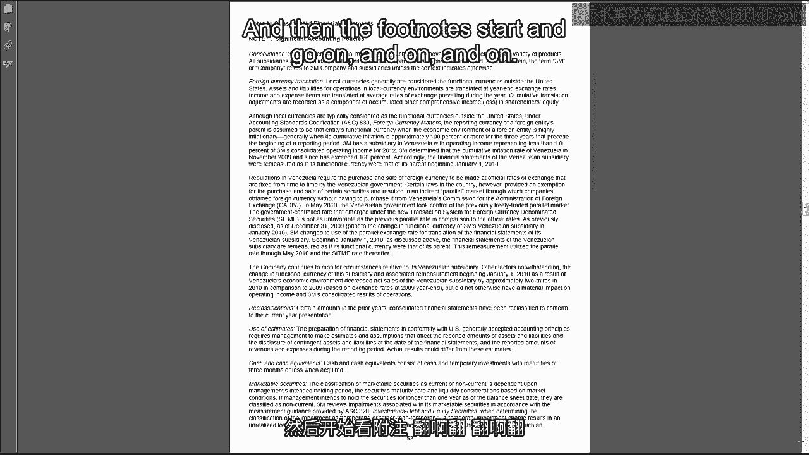

---

## 报告其余部分与课程安排

报告的最后部分（第三、四部分）涉及公司治理、高管薪酬等代理信息以及补充文件。本课程不会重点讨论这些内容。

这份3M年度报告总计124页，相较于当今动辄数百页的报告（例如索尼的279页年报），已属较为精简。

---

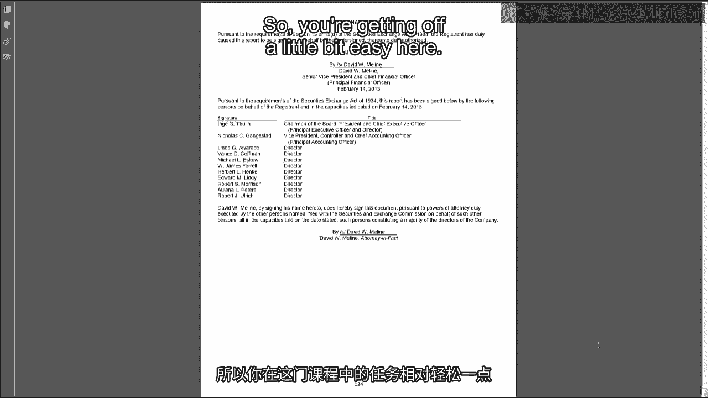

## 总结与预告

本节课中，我们一起快速浏览了3M公司年度报告的整体结构和核心组成部分。我们了解到，一份完整的10-K报告包含业务描述、管理层讨论与分析、经审计的财务报表及大量附注，以及公司治理信息。

正如教授所言，在后续每周的课程中，我们都将回到这份报告，寻找当周所学知识点在3M财务报表中的实际体现。在课程的最后阶段，我们还将选取另一家公司的财务报表进行深度分析，综合运用整个课程所学的知识。

坚持完成基础概念的学习至关重要，虽然接下来仍有挑战，但最终你会发现这一切都是值得的。