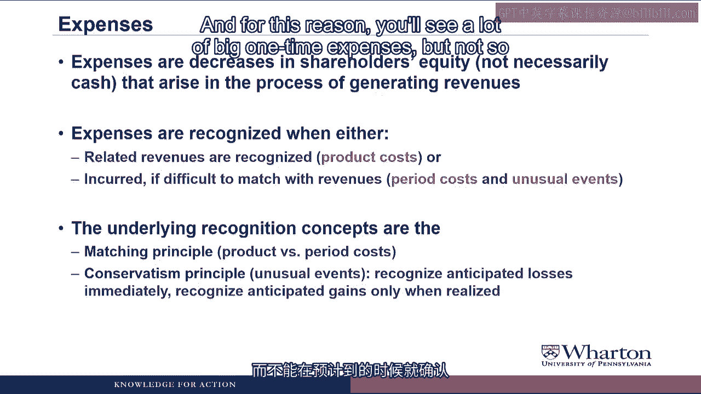
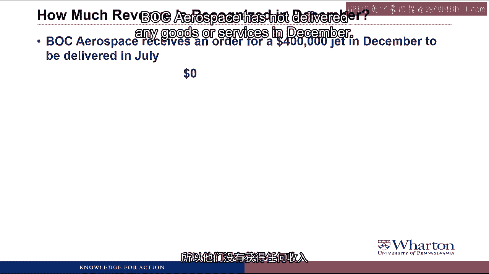

# 沃顿商学院《商务基础》｜Business Foundations Specialization｜（中英字幕） - P57：9_2 1 收入和支出.zh_en - GPT中英字幕课程资源 - BV1R34y1c74c

Hello and Professor Brian Bache。 Welcome back。 In this video， we're going to talk about revenues。

expenses， and the income statement。 This is a fairly important video because we're going to talk in detail about the difference。

between accounting income and cash flows。 Accounting income is determined by something called accrual accounting。

which tries to， measure business activities and gives a very different picture of the company's performance。

than merely cash in or cash out。 Let's get started and see how this works。

As we talked about in the opening video， the income statement reports increases in shareholders。

equity due to operations over a period of time。

Net income is made up of revenues minus expenses。

There's a couple synonyms that are often used for net income。

It's also called earnings and net profits。

All the income statement items are based on accrual accounting principles。

Now notice I said accrual accounting， not accrual accounting， but this in fact is where the。

accounting starts to get cruel because now recognition of revenues and expenses are。

going to be tied to business activities not to cash flows， which makes the accounting。

a little bit more tricky。 Revenues are recognized when goods and services are provided。

not necessarily when the cash。

is received。

Expenses are recognized in the same period as the revenues they help to generate， not。

necessarily when cash is paid。

And so the bottom line is that net income is not the same thing as net cash flow。

So let's look at revenues and expenses in more detail starting with revenue。

Revenues an increase in shareholders' equity from providing goods or services。

There are two criteria that need to be satisfied to recognize revenue。

First， it has to be earned， which means goods and services are provided， and it has to。

be realized， which means that payment for the goods and services is either received in cash。

or something that can be converted to a known amount of cash。

These are called the revenue recognition criteria。 For example。

let's say that we make a sale to a customer， we deliver the goods to the。

customer， and we give the customer an invoice， which has the dollar amount that they owe us。

and a time period in which they have to pay us。

We've satisfied the first criteria because we deliver the goods to the customer， and we。

satisfied the second criteria， realized because even though we haven't gotten cash， we have。

something that can be converted to a known amount of cash， and that's the invoice which。

has the dollar amount on it。 So in this case， we could book the revenue even before we get the cash。

and what we would。

do in this case is create an accounts receivable for what the customer owes us。

Good， but can you give us some examples of when these criteria would not be satisfied？ Why yes。

thank you for asking。 Here's an example where the first criteria， earned。

may not be straightforward。 Let's say you pay $100 to a software company to buy some software for your computer。

For the software company， the $100 is realized because they've collected the cash， but they。

might not book the full $100 as revenue today because it's not all earned。

The reason is that you're paying for not only the code that you receive today， but you're。

also paying for updates or patches that you receive over time， as well as technical support。

that you might receive over time。 So what the software company might do is book $80 of revenue today because that's what they've。

earned by delivering the code。 The other $20 of revenue would only be booked later on as they deliver updates or as they。

provide technical support over time。 And how about the second criterion？

And now here's an example of where the second criteria realized is not exactly straightforward。

So there used to be this CEO who was a turnaround expert。

I'm not going to mention his name because I don't want to get sued， but what he used to。

do is get hired by distressed companies and he would come in and reduce the workforce。

streamline the operations， make aggressive accounting decisions and turn around the company。

very quickly。 And one of his stops， he ended up shipping out a bunch of product to customers that had。

an order of the product right at the end of the quarter。

These shipments allowed the company to book the revenue and meet their earnings targets。

that analysts had set for the company for that quarter。

The justification for booking the revenue was that it was earned because they had delivered。

the goods and it was realized because they gave the customers an invoice。

The problem is that if the customers haven't ordered the product， they're probably going。

to send it right back without paying it。 And so the revenue really hasn't been realized because you don't have something that can be。

converted to a known amount of cash because you don't know the customers have any intention。

of actually paying for the goods that you ship to them。 That sounds illegal to me。 Yes， in fact。

the company I'm talking about got in trouble with the Securities and Exchange。

Commission for this practice。 In fact， well over 50% of the enforcement actions by the Securities and Exchange Commission。

are for violation of one of these two criteria。 So these criteria have a lot of gray area and trying to interpret them。

And if companies are going to get aggressive in their accounting， this is often the first。

place where they get aggressive。

Expenses are decreases in shareholders' equity that arise in the process of generating revenues。

They're recognized when either the related revenues are recognized or when they're incurred。

if they're difficult to match with revenues。

Now here we're talking about two criteria but it's an either/or instead of a both。

And we're really talking about a distinction between something called product costs and。

period costs。 Now you also see unusual events there。

I'll come back and talk about those in a second。

But as an example， think of a company that makes so I don't know video cameras。

For some reason I'm very interested in video cameras these days。

The product costs would be all the direct costs of producing the video camera。

It would include raw materials such as plastic， the metal， the glass for the lens。

It would include all the labor that went into producing the camera。

All the cost of the factory which we call overhead。 All of these are product costs。

These product costs would stay in inventory until the camera sold。

When the camera sold， those costs would leave inventory and become an expense。

So product costs follow the product。

When the product is sold， the cost become an expense。

Now think of all of the other costs of renting a business that makes video cameras。

You have to have research and development people， operations personnel， sales force， marketing。

staff， human resources， top management。

Those people are not directly involved in producing the video camera， but they are costs。

of running the business。 We call all of these costs period costs。

Later， we're going to call them SGA or selling general and administrative costs。

These costs are recognized as expense when they're incurred。

What that means is when the people work for you， you incur the costs and so you recognize。

those costs as an expense at that point。

What if the company used the CEO's car to transport parts from the warehouse to the factory？

Would that be a product cost or a period cost？ Yeah。

in the highly unusual example where a CEO's car would be used to both transport。

parts to the warehouse and to transport the CEO to his golf game， you would have to take。

the cost of the CEO's car and split it between product costs and period costs。

I'll actually come back to this topic when we talk about the income statement in a future， video。

The product cost versus period cost distinction is what we call the matching principle， where。

we try to match expenses to the revenues that they generate。

There's also something called the conservatism principle， which is for unusual events。

This principle says recognize anticipated losses immediately， but recognize anticipated。

gains only when they're realized。

Another way to look at this is it's the anti-human nature principle。

Human nature would be， "Hey， something good's going to happen in the future。 Let's record it now。"。

Whereas something bad's going to happen in the future， let's just wait until it happens。

The conservatism principle forces you to the opposite。

If you anticipate some loss in the future， like an environmental cleanup or settlement。

on a product liability suit or employee severance costs in a restructuring， you don't wait。

until those costs actually happen to expense them。

You expense them right away as soon as they're anticipated。

But if you expect some big gain to happen in the future， like you've signed a new customer。

to a contract and you expect big profits in the future， you actually have to wait until。

those profits come。 You can't recognize them when they're anticipated。

For this reason you'll see a lot of big one-time expenses， but not so many big one-time gains。

It's because the conservatism principle forces you to anticipate future losses， but not anticipate。

future gains。 Hey， I didn't know this was going to get political。

I am going to leave if this turns into a biased political polemic。

I thought the only right versus left debate in the course was debit versus credit。 No no no。

This is not political conservatism。 This is not conservatism as the opposite of liberalism。

This is conservatism as the opposite of aggressivism。 Rest assured。

there'll be no political content to any of these videos， and the only left。

right debate will be debit versus credit。

Now we're going to practice applying these revenue recognition criteria to figure out。

how much revenue should be recognized in the month of December for each of the following， examples。

As always， you'll see a pause button， so if you want to pause the video and guess the， answer。

the pause sign will cue you when you should do that。

Let's get started。

BOC delivers $500，000 worth of washing machines in December to customers who don't have to。

pay until February。

The answer is $500，000。 BOC has delivered the washing machine。

so they've earned the revenue in December。

BOC is given the customer an invoice which has them scheduled to pay in February， so they've。

realized the revenue with both earned and realized BOC gets to book $500，000 of revenue。

in December。 What happens if we never collect the cash？ Do we have to cancel out the revenue？

It still seems dodgy to me that you can record revenue before you get the cash。 Yes。

you are correct that we do have to worry about whether we will collect the cash on this， revenue。

Later in the course， we'll see how companies try to estimate how much of their revenue。

they won't collect in cash， and then at the time of sale， make an adjustment to reduce。

their revenue based on the amount they don't expect to collect。

But that's a complication we're going to get to in a few weeks。 For now。

let's just assume that all of the revenue is eventually collected in cash。

BOC collects $300，000 cash in December for washing machines delivered in October。

The answer here is zero。 Presumably when BOC delivered the washing machines in October。

they also sent an invoice so that。

they could book the revenue of $300，000 in October when those revenue recognition criteria。

were satisfied。 In December， BOC is just collecting the cash on accounts receivable。

They can't book the revenue again or they'd be double booking it， so there wouldn't be。

any revenue in December。

It was all booked in October。 Next， BOC Realty leases space to a tenant for the month of December in January for $20。

000。

all of which is paid for in cash in December。

The answer here is $10，000。 We've received the cash so we know whatever revenue we're going to record meets the realized。

criteria。 But the question is how much have we earned in the month of December？

If BOC is getting paid for December and January， the way they earn revenue is by providing space。

to the tenant for December and January。 BOC is only provided space for December。

so they can only record revenue for December。

which would be one half of the $20，000 or $10，000。

That's the amount that's been earned in December。

BOC Aerospace receives an order for a $400，000 jet in December to be delivered in July。

The answer here is zero。 BOC Aerospace has not delivered any goods or services in December。

so they have earned。

no revenue， which means they can't book any revenue until they actually deliver a jet。

If this is a long-standing customer that promises to pay us， why can't we book the revenue now？

Even if it's a long-standing customer， the revenue recognition criteria still apply。

We have to deliver goods or services before we can record revenue。

It's just one of those conservative， I mean， non-aggressive practices that accountants。

use to increase the reliability or objectivity of the financial statements。 BOC Bank is owed $100。

000 of interest on a loan for December and receives the payment。

in January。

The answer is $100，000。 BOC Bank has earned the interest revenue by providing the money outstanding to its customers。

It's provided a service。

Presumably there's some kind of payment schedule with the customer borrow the money on when。

they should pay so we can consider it realized。

And so BOC Bank can book $100，000 of interest revenue in December even though they won't。

get the cash payment until January。

BOC issues 20，000 shares of stock in December and receives $10 per share， which is $2，000。

per share more than they expected。

The answer is zero。

Companies can only record revenue when they provide goods or services。

They can never， ever record revenue from selling shares of their own stock。

It doesn't matter what the proceeds of the stock issuance were， whether they were more。

or less than expected。

You simply cannot book revenue on issuing your own stock。

Revenue is only booked when you provide goods and services。

Now let's practice with expenses， so for each of these items we're going to try to figure。

out how much expense would be recognized in December。

First， BOC Automotive buys engines worth $2 million in December for cash。

The answer is zero。

BOC has bought engines with cash， but engines are going to be a product cost， so they're。

not going to be expensed until BOC actually sells the cars that they make with those engines。

So at this point， no expense。

BOC Automotive uses the engines to make cars at a total cost of $10 million in December。

The answer is still zero。 Now BOC has used the engine to make cars。

We know how much the cars cost in total， but the cars are still product costs and the cost。

won't become expenses until BOC Automotive actually sells some cars。

Come on now。 The question says the words total cost。 Cost is just another word for expense， right？

In these videos， I'm going to use the term expense very specifically。

Businesses will only refer to things that show up on the income statement。 In contrast。

I'll use the term cost very loosely。 A cost is any cash outlay， whether in the past， present。

or future， that's required， to run the business。 So a cost only becomes an expense when we put it on the income statement。

BOC Automotive sells cars costing $8 million in December for $15 million。

The answer is $8 million of expense in December。 So we can finally recognize expenses because we've sold cars。

The expense will be equal to what it costs to make the cars， which is $8 million。

The $15 million will be the revenue that we earn from selling the cars。

And it's good news in this case because our revenue is greater than our cost， so we've。

made some profit。

BOC Automotive incurs $180，000 in salaries for its marketing staff in December。

The answer is $180，000。 Marketing staff would be a period cost。

We recognize and expanse as we incur the cost of the marketing staff， in other words， as。

they work for us and earn salaries。 We don't try to match the cost of the marketing staff to selling future cars。

like a product。

cost， because we assume that whatever the marketing staff is doing， and sometimes it's。

not clear， it's helping us sell cars this period。

So the matching prince would say， let's match the cost of the marketing staff this period。

to the revenues we generated this period and expanse the entire cost of the marketing staff。

this period。

BOC Automotive pays its auditor $50，000 in December for services to be rendered in December。

and January。

The answer is $25，000 in expenses in December。 Even though we paid $50。

000 cash to the auditor in December， we're paying for work the auditor。

is going to give us in both December and January。 We can only recognize the amount of work they've done in December as a cost。

enhance， and expanse。

If we assume it's roughly divided between the two months， then half of $50，000 will be。

25，000 of expenses。

The other $25，000 will be expensed in January when the auditor provides the work for us then。

Paying for an auditor is a period cost， right？ We pay the auditor $50，000， right？

So there should be $50，000 of expense， right？ Right about auditors being a period cost。

but not so right about the other stuff。 We're only going to expanse the cost of the auditors as they work for us。

BOC paid their auditor $50，000 cash for work the auditor would provide in December and， January。

But BOC only wants to expanse in December the amount of work the auditor did in December。

which is half of that or $25，000。 Remember on the income statement。

we want expenses to match business activities， not cash flows。 BOC automotive pays $1，200。

000 in cash dividends in December。

The answer is zero。

Dividends are never considered an expense because they're not considered a cost of doing business。

We'll never show up on the income statement， they're not an expense。

So I think that gave us some good practice in applying these revenue and expense recognition。

concepts。 We'll get a lot more practice in the next video when we start to look at some revenue。

and expense transactions for a relic spotter。 I'll see you then。 See you next video。 [ Silence ]。
