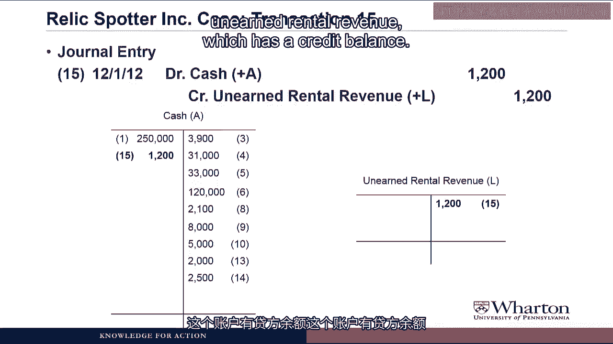
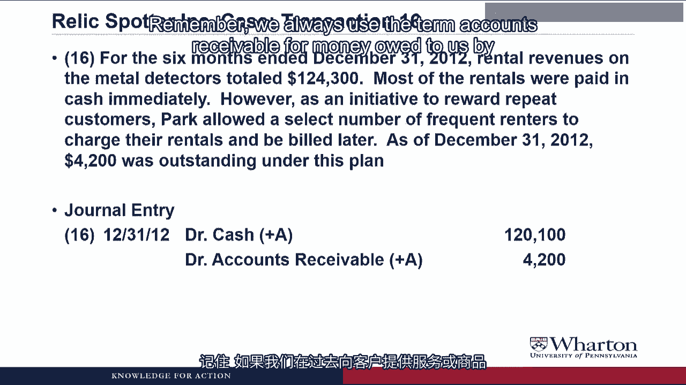
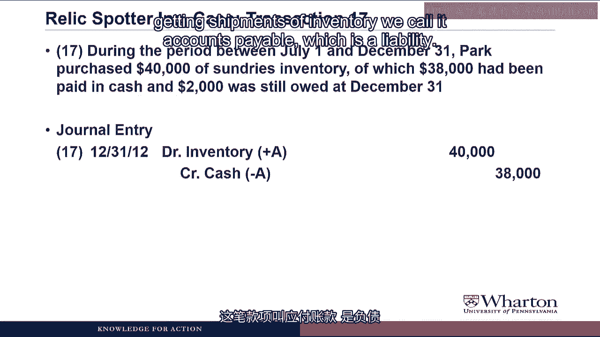
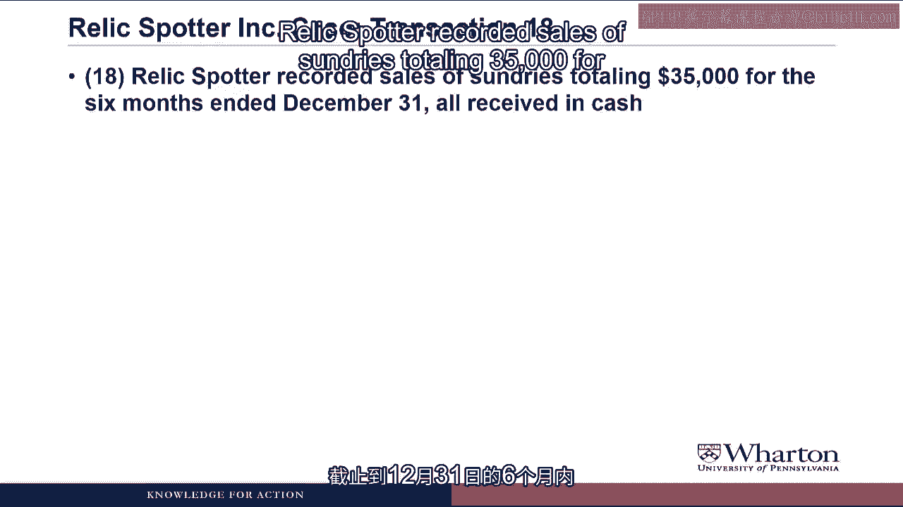
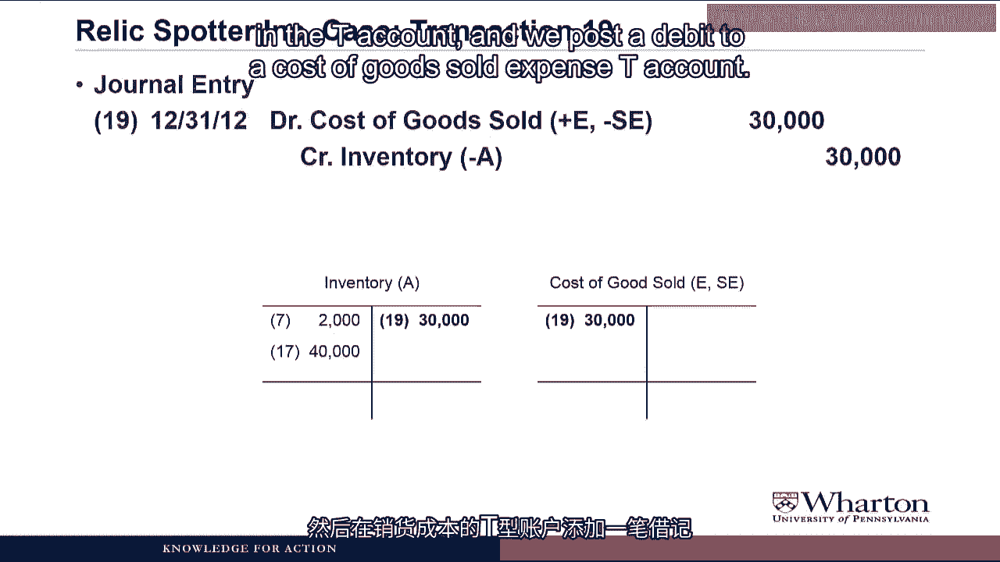

# 沃顿商学院《商务基础》｜Business Foundations Specialization｜（中英字幕） - P58：10_2 2 文物寻宝案例部分 3.zh_en - GPT中英字幕课程资源 - BV1R34y1c74c

Hello， I'm Professor Brian Boucher。 Welcome back。 In this video。

we're going to finally generate some income for Rebecca Park and her relic， spotter company。

We'll go through a number of revenue and expense transactions for relic spotter and。

see how they performed in their first six months of business。 Without further ado。

let's get started。 In a prior video， we did the first 14 transactions for this startup company。

Now we'll resume the case with transactions related to revenues and expenses。

Some of the transactions will be summary entries to record six months' worth of activity。

in one journal entry。 As we did last time， we'll record journal entries and post-a-tea counts for each transaction。

After the transaction， you should pause the video and try to do the journal entry。

Make sure you think about what accounts are involved。 Did the increase or decrease？

Do we debit or credit？ And then resume the video to see the answer and the explanation。

Transaction 15。 In a search for new revenue opportunities。

Park initiated an unlimited rental arrangement。

with the Penn Antiquities Club on December 1， 2012。

Under this arrangement， the club paid relic spotter $1，200 cash upfront for unlimited rentals。

over the next year。

For this transaction， relic spotter is receiving $1，200 of cash。

Cash is an asset。 We increase an asset with a debit， so we're going to debit cash for $1，200。

Now we have to look for the credit。 So we're getting the cash and now we're obligated to provide rentals over the next year。

That obligation is a liability and should be called something like unearned rental revenue。

Liabilities are increased through credits， so we're going to credit unearned rental revenue， for $1。

200。

When do we get to recognize the revenue？ We have the cash。

We have committed to allowing the club to rent units whenever they need them。

Isn't that enough to call this revenue？ No， committing to provide the rentals is not enough to be able to recognize the revenue。

We have to earn the revenue by delivering the service。

And the service here is providing unlimited rentals over time， which means we're going。

to have to wait until time passes before we can recognize the revenue and record this。

on our income statement。 Then we post this to T-accounts。

so we add something on the debit side of cash， so we。

increase cash from this transaction。

And we create a T-account for unearned rental revenue， which has a credit balance。

Transaction 16。

For the six months and December 31， 2012， rental revenues on the metal detectors total。

$124，300。 Most of the rentals were paid in cash immediately。

However， as an initiative to reward repeat customers， Park allowed a select number of。

frequent renters to charge their rentals we build later。 As of December 31， 2012， $4。

200 was outstanding under this plan。

To do the journal entry for this one， we have to recognize that there are three accounts。

involved。 We've got rental revenues of $124，300。

We have an accounts receivable of $4，200。 That's what the customers owe us under the frequent renner plan。

And the rest of it we received in cash。

So the difference between $124，300 and $4，200 is $120，100 of cash that we receive。

Anytime we receive cash， we debit it， so we debit cash for $120，100。

We also have these accounts receivable， which are an asset。

We make assets go up through a debit， so we debit accounts receivable $4，200。

Remember， we always use the term accounts receivable for money owed to us by customers。

based on providing them goods or services in the past。

Now we're looking for the credit part of the journal entry。

And what we have left to do is record the rental revenue。

Revenue accounts are credit balance accounts。

So to increase revenue， we credit rental revenue， which increases revenue and increases stock。

dollars equity by $124，300。

Another way to look at this is that Relics Potter recorded $124，300 of revenue， of which。

$120，100 was received in cash and $4，200 has not yet been received in cash， but hopefully。

will turn into cash soon in the coming months。 Same question as before。

What happens if we don't collect the cash？ It doesn't seem kosher for them to book all that revenue with no guarantee they'll get。

the cash。 Same answer as before。 For now we're assuming that the company will collect all the cash。

but later on we'll see， how companies have to estimate how much cash they won't collect and then make adjustments。

for this on their income statement and in the balance of their accounts receivable。

So just hang on until later in the course。 To post this one。

we add another debit to the cash account， so another increase in cash。

We create an accounts receivable to account with a debit balance and we create a T account。

for rental revenue， which has a credit balance。

Transaction 17。 During the period between July 1st and December 31st， Park purchased $40。

000 of sundry's inventory。

of which $38，000 have been paid in cash and $2，000 was still owed at December 31st。

So for this journal entry we're paying $38，000 of cash。

We credit cash for $38，000 to make the asset go down。

We're receiving inventory。 Inventory is an asset。 Assets go up with debits。

So we debit inventory for $40，000 to recognize the inventory that we've received。

So we're still missing one part of this and that's the $2，000 that we still owe at December。

31。 If you remember from a prior video， when we owe money to a supplier based on getting。

shipments of inventory， we call it accounts payable， which is a liability。

We make a liability go up with a credit， so credit accounts payable $2，000。

Very cool with this one， but thank you for checking。 We need to post this transaction。

so we add a credit entry to the cash account。

We add a debit to the inventory account， so now there'd be $42，000 in inventory and a。

credit to accounts payable。 Now the balance would come back up from $0，000 to $2，000。

Transaction 18。

Relic spot recorded sales of sundry's， totaling $35，000 for the six months end of December， 31。

all received in cash。

The journal entry here is very straightforward。 We're receiving $35，000 of cash。

so we debit cash $35，000 to make that asset go up。

We've made a sale， we delivered sundries， we got cash， it meets both criteria， we get。

to record revenue。 Revenue is a credit account， so we make revenue go up with a credit to sales for $35。

000。

We are not cool with this one。 Where is the inventory？ If we sold sundries。

or whatever you call them， then our inventory should go down。 Excellent question。

This journal entry is only dealing with the revenue part of the transaction， where we record。

the cash and the sales revenue at the selling price。

We'll deal with the inventory part of this transaction in about 15 seconds。

Let's post this to T-accounts， so we post a debit to the cash account and create a sales。

T-account to keep track of revenue from sundry sales。

Transaction 19。 The original cost of these sundries was $30，000。

In this journal entry， we're going to take care of the inventory part of the sundry sales。

transaction。 If we sold sundries， our inventory went down。

Inventory is an asset， we make an asset go down with the credit， so we're going to credit。

inventory for $30，000。

Our debit here is going to be something called cost of goods sold， which is an expense。

This is what we call the product cost when we make a sale。

That original cost of the inventory becomes an expense called cost of goods sold that。

we match with the revenue that we get from selling the sundries。

So we debit this expense cost of goods sold for $30，000， which then will reduce stockholders'。

equity。 Do these last two journal entries always have to go together？ I mean。

any time you record revenue in an entry， do you have to record cogs in another， entry？

Just also tell me why the revenue and the cogs were different dollar amounts。 Yes。

these two journal entries are like the salt and pepper of accounting。 They always go together。

Anytime you sell inventory， you need one entry to record the revenue and the cash we're going。

to collect at the selling price。 And you need a second entry to record the reduction of the inventory and cost of goods。

sold expense at the original cost。 We hope that the revenue is greater than the cost you could sell because it means we've。

been able to sell our product at a markup of our cost。 In other words。

we've been able to earn a profit on our product。 If it's not the case。

well then you don't have to worry about doing these journal entries。

much longer because you won't be in business。 We post this to T-accounts by reducing the inventory account through a credit entry in。

the T-account and we post a debit to a cost of goods sold expense T-account。

Transaction 20。 Finally， I think the word， finally。

may be my favorite word in the accounting language。 Ha ha， let's try that again。

Relics spotters two employees were paid wages of 32，000 total during the six month period。

and parked through a salary of $50，000。

For the journal entry， we paid 82，000 in cash total so we credit cash for $82，000 to reduce。

the cash account。 The debit is going to be an expense for the employees working for us。

Now these employees would be period costs so we're recognizing an expense as they work。

for us。 We're going to debit salaries and wages expense for 82。

000 to recognize this period cost which。

then in turn will reduce stockholder's equity as expenses always do。

Then we post this to T-accounts so yet another credit to the cash account and we create a。

salary as in wages expense T-account with a debit balance。

Now it's the end of Relics spotters fiscal period so we're going to close the books to。

any more transactions with the outsiders。

The next step on the accounting cycle will be to do an unadjusted trial balance which。

makes sure that everything that we've done so far during the fiscal period has been okay。

There have been no math mistakes or transposition errors。

So I'm going to bring up Excel and show you how to do this。

I've been showing you the T-accounts one by one but here's what they would look like all。

on the same page。

You'll notice that there are some T-accounts which have nothing in them yet。

These are things that we're going to work on in a later video when we talk about adjusting。

entries but for all the other T-accounts what you'd want to do is draw a line and come up。

with a balance for each account。

So we have 78，800 in cash， 4，200 in accounts receivable， 103，000 in land and so forth。

Then you carry over all the account titles to another page and create a column for debits。

and a column for credits。 You put in the balance of each account and then just add up the columns。

And you can see that we have 536，500 debits。 We have the same amount for credits so we know that we've done everything correct so far。

because our debits equal our credits。

And now we're ready to go on to the next step in the accounting cycle which will be adjusting。

entries。 Wow， there's nothing more thrilling than watching somebody work through Excel and video。

Sorry about that but that seemed to be the most expeditious way to show this part of the。

accounting cycle。 Plus， if you're going to learn some accounting you've got to do some Excel now and then。

right？ So in the next video we're going to talk about adjusting entries which will get us one step。

closer to putting together financial statements。 I'll see you then。 See you next video。 Bye。
