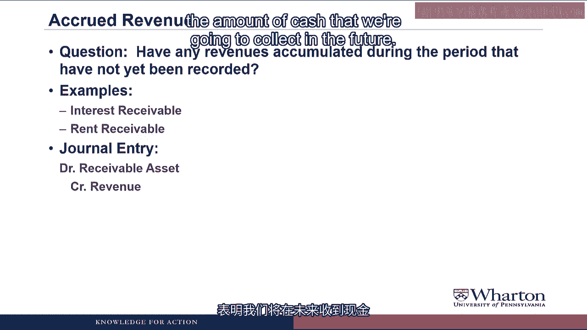

# 沃顿商学院《商务基础》课程 P59：调整分录 I 📝


在本节课中，我们将学习会计循环中的一个关键步骤：**调整分录**。调整分录是内部交易，旨在根据权责发生制原则更新账户余额，以便准确编制财务报表。我们将从概念上理解调整分录，并通过一些例子来具体说明。


---


## 会计循环回顾 🔄


上一节我们介绍了会计循环中，公司在会计期间内分析交易、编制日记账分录并过账到T型账户的部分。


在会计期末，公司会编制**未调整试算平衡表**，以确保到目前为止没有错误。


现在，我们将进入循环的下一步：**调整分录**。


---


## 什么是调整分录？ 🤔


调整分录是**内部交易**，用于在编制财务报表之前，根据权责发生制原则更新账户余额。


所谓内部交易，是指我们不再与外部进行任何交易。这只是会计师坐在办公桌前，通过编制日记账分录来更新账户，以便编制财务报表。


可以这样理解：如果公司的会计年度在12月31日结束，公司其他部门的同事可能在下午5点就离开去参加新年派对了。但可怜的会计师必须留下来，在公司准备年终财务报表之前完成这些调整分录。


调整分录主要有两大类：
1.  **递延收入和费用**
2.  **应计收入和费用**


**调整分录现在会涉及现金吗？**
不会。调整分录从不涉及现金，因为这是纯粹的内部交易。此时企业不与外部进行任何交易，因此没有现金流入或流出。


---


## 第一类：递延费用 💸


当我们的会计师在新年前夜坐在办公桌前，看着销售、市场、运营和人力资源部门的同事开心地离开公司去庆祝时，他需要问自己：**本期是否有任何资产已被消耗，应确认为费用？**


这里涉及的账户通常是**预付类账户**，如预付租金或预付保险费。折旧和摊销也属于递延费用的例子，我们稍后会详细讨论。


以**预付租金**为例。我们在使用场地之前支付了现金，因此创建了一个名为“预付租金”的资产账户。但随着时间推移，我们占用了场地，就必须确认占用期间所产生的租金成本。


因此，我们需要编制一个调整日记账分录：
*   **借记**一项费用（如租金费用），以确认随时间消耗的租金成本。
*   **贷记**预付资产账户（如预付租金），以减少其余额，反映年末时（如果有的话）仍预付的金额。


**分录示例：**
```
借：租金费用
贷：预付租金
```


---


## 第二类：递延收入 💰


当会计师开始收到朋友们发来的各种短信，催促他参加派对时，他必须放下手机思考：**是否有任何负债，因已交付商品或提供服务而得以履行，应确认为收入？**


这里涉及的账户是诸如**未实现收入**或**递延收入**之类的负债账户。

这种情况是，我们在提供商品或服务**之前**收到了现金。现在时间过去，我们已经赚取了收入。调整日记账分录将是：
*   **贷记**收入账户，以确认我们随时间赚取的收入。
*   **借记**未实现收入负债账户，以减少我们的义务，因为我们已经通过在该时间段内交付商品或服务履行了部分义务。


**分录示例：**
```
借：未实现收入
贷：服务收入
```


**为什么这是调整分录？难道不是在交付商品时就知道并记录吗？**
是的，如果我们交付了某些商品，我们可能会在交付时确认收入。但这些例子是关于**随时间提供某种服务**。在这种情况下，我们只需在期末做一次调整分录，来确认整个期间内提供的所有服务，而不是每月、每周或每天做分录。


---


## 第三类：应计费用 📄


当可怜的会计师决定打开电视观看新年摇滚晚会，以便能听到一些他在派对上错过的背景音乐时，他必须问自己：**本期是否有任何已发生但尚未记录的费用累积？**


这里涉及的账户都将是**应付类账户**。


这种情况是，我们**随时间产生了某项费用，但尚未用现金支付**。因此，我们需要编制的调整日记账分录是：
*   **借记**一项费用，以确认该费用。
*   **贷记**一项应付负债，以表明我们有支付该费用的义务。


例如，如果员工已为我们工作但我们尚未支付工资，我们必须：
*   **借记**薪资费用，以确认员工为我们工作的成本。
*   **贷记**应付薪资，以显示我们未来需要支付给员工的负债。


**分录示例：**
```
借：薪资费用
贷：应付薪资
```


---




## 第四类：应计收入 📈


当可怜的会计师看着电视上时代广场的跨年球降落时，他匆忙地问自己：**本期是否有任何已赚取但尚未记录的收入累积？** 以便他能完成最后一组调整分录。

这里讨论的账户将是**应收类账户**，如应收利息或应收租金。

一个例子是，如果我们借钱给别人，时间过去了，他们现在欠我们利息。我们会编制一个日记账分录：
*   **贷记**收入账户（如利息收入），确认他们欠我们的利息。
*   **借记**一项应收资产（如应收利息），以显示我们拥有一项资产，代表未来将收取的现金金额。


这个调整分录使我们能够确认迄今为止尚未确认的收入，并显示我们拥有一项预期在未来收取现金的资产。


**分录示例：**
```
借：应收利息
贷：利息收入
```


**收入怎么可能在你不知道的情况下累积？**
当收入已赚取并实现时，你应该记录分录。为什么这是调整分录？
同样，这些例子是关于**随时间提供服务**，而不是交付特定商品。因此，重要的是在我们编制财务报表时，收入能出现在账簿中。在期末做一次调整分录，比每月、每周或每小时做一次要容易得多。


---


## 折旧与摊销 🏗️


最后，我们将讨论**折旧和摊销**，它们只是递延费用的例子，但内容更丰富，因此我们单独讲解。


折旧和摊销的目的是**将长期资产的原始成本在其使用寿命内进行分摊**。我们希望将资产的总成本与其在使用期间产生的收入相匹配。


回想一下介绍性视频中戴夫的汽车运输服务。戴夫买了一辆卡车，打算使用48个月。我们不是在第一个月就将卡车的成本确认为费用，而是通过折旧在48个月内分摊成本，试图将卡车的成本与我们认为它未来将产生的收入相匹配。


**术语：**
*   **有形资产**（如建筑物、设备、卡车）：这个过程称为**折旧**。
*   **无形资产**（如商标、客户名单）：这个过程称为**摊销**。但过程非常相似，尽管术语不同。


---


### 折旧的会计处理


折旧**并不直接从有形资产账户中扣除**。换句话说，如果你对卡车计提折旧，你不会直接从卡车账户中扣除。


相反，折旧将记录在一个名为**累计折旧**的**备抵资产账户**中。
*   备抵资产用 `(XA)` 表示，它具有**贷方余额**。这意味着备抵资产通过贷记增加，通过借记减少。
*   “备抵”是一个拉丁词，大意是它的余额在资产负债表上的位置与你基于其所在位置预期的余额方向**相反**。
*   资产通常有借方余额，因此通过借记增加。备抵资产则有贷方余额，并通过贷记增加，因为它本质上是记录其对应资产账户的减少额。


在编制财务报表时，累计折旧将从资产负债表上的“不动产、厂房和设备”中减去，得到**账面净值**。


**为什么备抵资产符合资产负债表等式？如果它们是资产，为什么有贷方余额？**
我承认备抵账户这个概念很难理解。可以这样想：备抵账户记录的是特定资产账户的减少额。它几乎像一项费用。费用位于资产负债表股东权益侧的留存收益中，但有**借方余额**。这意味着费用的增加会减少留存收益。事实上，费用就是一个备抵股东权益账户。所以你已经见过类似的概念了。


**为什么不直接从常规资产账户中扣除折旧？**
很好的问题。在我们编制资产负债表的视频中，你会看到报告不动产、厂房和设备的常见格式是：分别列示其原始成本和随时间计提的累计折旧。为了提供这种格式，我们必须在单独的账户中跟踪这个累计折旧。


---

### 摊销的会计处理


摊销**通常直接从无形资产账户中扣除**。所以，如果你要摊销一个商标，你会直接从商标账户中扣除。


然而，如今有些公司拥有相当大的无形资产，它们也开始使用**累计摊销账户**。这只是另一种类型的备抵资产，其会计处理与累计折旧类似。但我认为最常见的处理方式是摊销直接来自无形资产账户。


---


### 如何计算折旧费用？

为了计算每年的折旧费用，几乎每家公司都使用一种称为**直线折旧法**的方法。


**公式：**
```
年折旧费用 = (资产原值 - 预计净残值) / 预计使用年限
```


*   **预计净残值**：是指你认为在资产使用完毕时它还能值多少钱。
*   分子 `(原值 - 残值)` 代表你将消耗掉的资产成本部分。
*   **预计使用年限**：是你预期使用该资产的期间数。


在直线折旧法下，资产寿命期内每年的折旧费用金额是**相同的**。


**还有其他折旧方法吗？为什么几乎所有的公司在财务报表中都使用直线法？**
是的，还有**加速折旧法**，即在资产寿命早期确认较高的折旧，在后期确认较低的折旧。这些方法用于**税务目的**，我们将在课程后期讨论。我的推测是，大多数管理者喜欢使用直线折旧法，因为它能产生平稳的收益。如果使用加速折旧法，你的收益波动会更大，这取决于你是有很多折旧高的新设备，还是有很多处于寿命后期、折旧低的设备。


**谁来确定使用年限和残值？是中央政府机构吗？**
不是。就财务报告而言，没有中央政府机构规定使用年限和残值。管理者应根据他们打算使用资产的时长来选择使用年限，而残值将是他们打算使用时长的一个函数。

为了说明这一点，让我们谈谈两家航空公司。
*   一家主要的国际航空公司，其策略是只飞行相当新的先进飞机。他们会买一架全新的飞机，飞行五年，然后卖给其他人。因此，在选择折旧假设时，他们的使用年限是五年，并且有很高的残值。
*   一家主要的国内航空公司，倾向于将飞机飞行20、30、40年。如果他们要买一架新飞机，他们的策略会是选择20年的使用年限，因此残值会很低。

所以，两家航空公司购买同一架飞机，可能会有不同的折旧假设。但这没关系，因为折旧假设应该与管理者打算如何使用飞机相匹配，而不是与飞机的物理寿命有关。

---

## 总结 📚

本节课我们一起学习了会计中的**调整分录**。

我们首先回顾了会计循环，然后定义了调整分录是用于更新账户余额的内部交易。接着，我们详细探讨了四大类调整分录：
1.  **递延费用**：更新现有资产账户（如预付租金），将已消耗部分转为费用。
2.  **递延收入**：更新现有负债账户（如未实现收入），将已实现部分转为收入。
3.  **应计费用**：确认已发生但未支付的费用，并记录相应的负债（如应付薪资）。
4.  **应计收入**：确认已赚取但未收到的收入，并记录相应的资产（如应收利息）。

最后，我们深入讨论了**折旧与摊销**作为递延费用的特例，解释了其目的、会计处理（特别是使用**累计折旧**这个备抵资产账户）以及**直线折旧法**的计算公式和应用逻辑。

理解调整分录对于根据权责发生制准确编制财务报表至关重要。在下一节课中，我们将通过练习来巩固如何编制这些调整日记账分录。