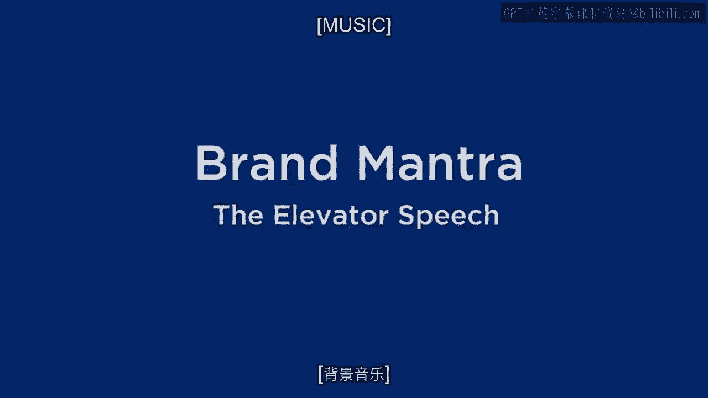
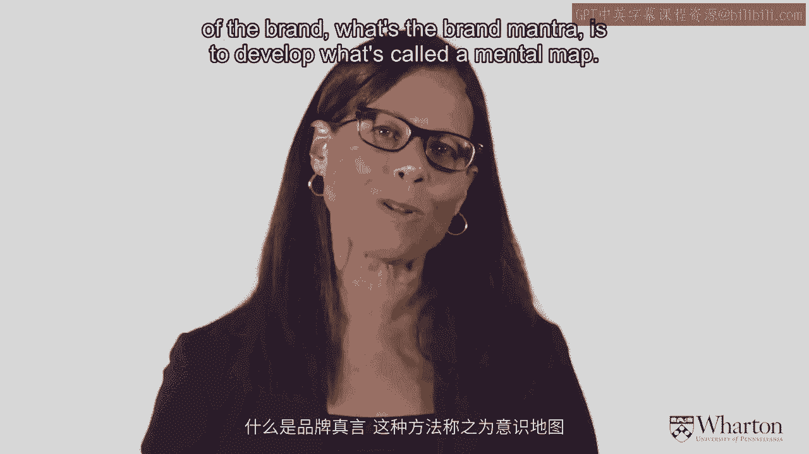
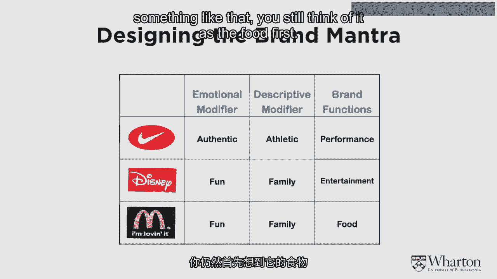
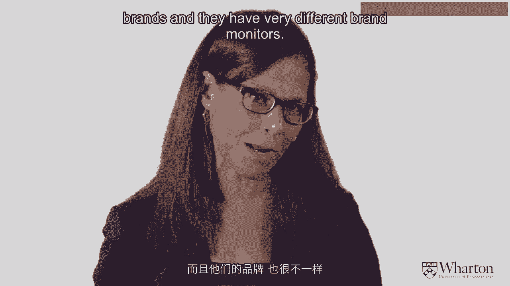

# 沃顿商学院《商务基础》｜Business Foundations Specialization｜（中英字幕） - P6：5_品牌真言-电梯演讲.zh_en - GPT中英字幕课程资源 - BV1R34y1c74c

So we just talked about brand positioning， which is the strategic part of brand positioning。

And if you really think about brands， you'll realize that although you know some great。

crisp brands， it's very hard to get to that positioning。 You can have lots of different， thoughts。

you can have different points， different target segments， different frames of reference。

lots and lots and lots of different choices。 But then you want to hone into the right， choice。

That's the trick of marketing。 To explain marketing， the concepts aren't that， difficult to grasp。

but they are very， very hard to do right。 There's lots and lots， of ways to do marketing wrong。

and only a few ways to do marketing precisely right。

And the next concept that I'm going to talk about is a brand mantra or an elevator speech。

The elevator speech you may have heard of that。 This is the way you define a brand in， 30 seconds。

So we're talking about 30 seconds worth of material。 It sounds so easy， 30 seconds。

But the truth of the matter is to get the right critical 30 seconds， the right brand。

mantra that takes lots and lots of analysis and a lot of wrong turns and a lot of wrong， ways。

If you come up with a brand mantra right away or an elevator speech right away， maybe， you're lucky。

But chances are you haven't given it enough thought。 You really do need。

to think about lots of the different positionings。 So what I'm going to suggest here， what I'm。

going to talk about is relatively easy concept to get。 But it's very hard to do well。 So。

what we want， let me tell you where we want to end up and I'll talk about how we get， to it。

We want to add up with a 30 second speech， as I said， the elevator speech or a， brand mantra。

And a brand mantra may be three words。 But I want to get down to the right， three words。

And so one of the things you do is when you're creating a brand and thinking。

about a brand or thinking about a product， a product category， there's a lot of market。

research that you can do to try to figure out what's going on in customers' hands。 And。

how do they think about the category and how do they think about different brands？ And。

one way you can think about it in order to figure out again what's the essence of the， brand。

what's the brand mantra is to develop what's called a mental map。 And what a mental。

map is a kind of a graphic with circles and arrows and things like that of what the brand， is。

And it's kind of a thought association process。 You ask the consumer what comes to。

mind when you think of the brand。 And then there's lots of different ways to do this。

And I'll just show you one， but there are a lot of different ways。 And you write down。

what the brand is， what the essence of the brand is from the consumer point of view。

what the different associations are and how those associations lead to other associations。

And some people call this mental map。 Some people call them schemas。 And there's a lot。

of different techniques you can do in these mental maps。 You can， the size of the circle。

can be how often that association is named by different people。 The lines that connect。

one circle to another circle can be the strength of those associations。 But essentially what。

you're developing is sometimes it's called a semantic associative network or a mental， map。

You're developing a picture of the thought associations that come up with the brand。

And so what I'm going to show you here is a mental map of McDonald's。 You start out。

with what differentiates McDonald's。 You think about the golden arches， the brand name。 And， then。

and this is just one person's thought process， you come up with things that are。

characteristic of the category。 And so those are the red circles。 So McDonald's makes meals。

It provides services。 It's family food， family fun。 It's good value。 And then the yellow。

circles here are the associations with each one of these points of parity， actually， frame。

of reference characteristics that are unique to McDonald's。 So McDonald's has certain meals。

What are the meals that McDonald's has？ Well， it gives hamburgers。 It has breakfast。 It， has fries。

What are the brands associated with those meals？ Egg McMuffin， a big Mac。 What's the quality？ Well。

it's always consistent。 It's fresh。 It's good tasting。 And this is， one example of a mental map。

There's lots of other ones that you can come up with。 But。

you can see the idea here is that you have circles and lines that connect these associations。

You can do this in a lot of different ways。 You can do it the closest ones to the core。

or the ones that are at top of mind that come up first， the ones that are further away， you know。

come up after a time。 And so there are a lot of things。 But what I'm trying to。

get here is all of the thought associations that come up with a brand。 And then what you。

want to do is do this over several customers and do it in market research stages several。

different ways。 And essentially you want to take all these different abstract phrases。

and concepts that are out there and figure out which are the most important， maybe five， to ten。

which are the very most important。 And so what you're doing is you're starting。

with the mental map or the associations that people have with the brand or maybe with the。

category and depending upon how well known the brand is， you might do it at a category level。

you might do it at a what if level， you might do it at a prototype level， a concept level。

or the brand level。 But you have this big mental map and then you want to hone down that mental。

map to the core brand values which are the five or ten critical brand values that are。

important to that brand。 And from that you then want to reduce those five or ten to the。

key concepts that are going to be the DNA of the brand， the brand mantra。 So the brand。

mantra is defined as the heart and soul of the brand， the DNA， it's the brand essence。

the brand promise。 And it's again goes back to that elevator speech， it's just really。

what people think of as the core of the brand。 It's very important to know this brand mantra。

because everything you do within this brand mantra， all your products that you come out。

with all your new products， all your advertising has to all fit within the essence。 The customer。

is going to know the brand mantra， the employees are going to know the brand mantra， you really。

want， if you have a very very strong brand， it's very crystal clear what that brand is。

and what it means and it characterizes everything that's done under the brand name。 And that's。

very very important。 It's particularly important nowadays as you go online， offline， websites。

phones， your brand is on lots of different things and you really want to make sure that。

the heart and the soul of the brand is consistent across all of these different media， these。

different platforms， these different products。 So what is the essence of the brand mantra？

It has three basic parts。 One part is the brand function。 It describes the nature of。

the product or service。 It describes the type of experiences， the benefits that the brand， provides。

Then there's a descriptive modifier that further classifies or clarifies the nature。

of what the brand is delivering and then there's an emotional qualifier that kind of explains。

exactly what those benefits are and in what way the brand delivers on those。

It's probably easier to give you some examples。 Before I do that though， let me just say again。

what the brand mantra is used for。 It's used internally to guide decisions。 I think already。

mentioned this。 It's what the brand shouldn't， should not be。 By the way， that's a very important。

idea。 A brand mantra not only says what a brand is but as importantly it says what， a brand is not。

And you really want to have almost black and white that idea。 This is， a Nike， this is not a Nike。

that kind of idea。 And it communicates the boundaries of the。

brand。 It has to be short， simple and it should be inspirational。 So now we have the examples。

These are very famous ones。 Nike， they're global brands。 Nike， Disney， McDonald's。 So Nike。

is authentic athletic performance。 They just do it， be real， you know， that's authentic。

It's very much an athletic brand。 It's not just shoes， it's clothing。 But when you think， of Nike。

you think about athletic and it's about performance。 The technique or the ability， to， again。

just do it， that kind of notion。 Disney and McDonald's are kind of interesting。

because they both are about family fun。 And they actually both have a lot of things in。

common but the brand mantra is different。 Disney is about entertainment。 Now that is。

not to say that Disney doesn't have food。 Disney sells quite a bit of food at their parks。

and in different places that they have。 But when you think Disney， you think fun， family。

entertainment。 And even the food comes within that brand mantra of Disney， of entertainment。

McDonald's on the other hand is fun and family but it's food。 And even if you have a McDonald's。

playground or something like that， you still think of it as the food first。 And so although。

these are similar and， you know， in some sense， you can see they're actually also quite， quite。

different。 And I don't think you'd ever get Disney and McDonald's confused。 Even though。

they're going after similar target markets and they're offering similar emotional benefits。

they really are quite， quite distinct， different brands。 And they have very different brand。

mantras。 [Music]， (gentle music)。

