# 沃顿商学院《商务基础》｜Business Foundations Specialization｜（中英字幕） - P61：13_2 4 1 文物寻宝案例部分 4a.zh_en - GPT中英字幕课程资源 - BV1R34y1c74c

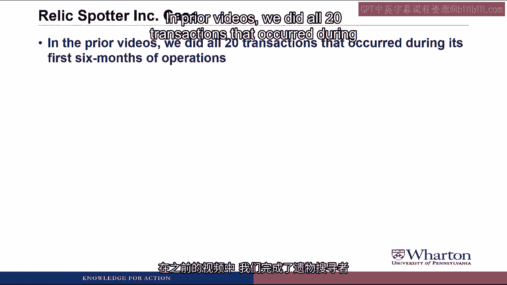

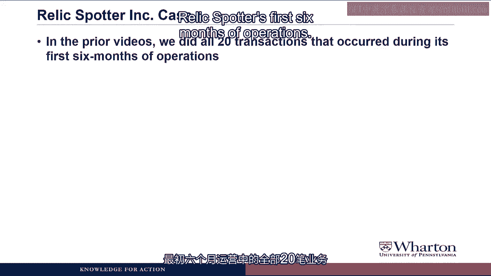


## 课程 13.2.4.1：调整分录应用 - 文物寻宝案例（第一部分）📝

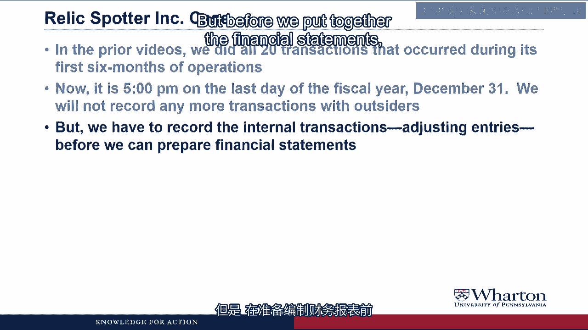


在本节课中，我们将把之前学到的关于调整分录的知识，应用到“文物寻宝”公司的案例中。我们将处理该公司在会计年度结束时需要记录的内部交易，为编制财务报表做准备。


---

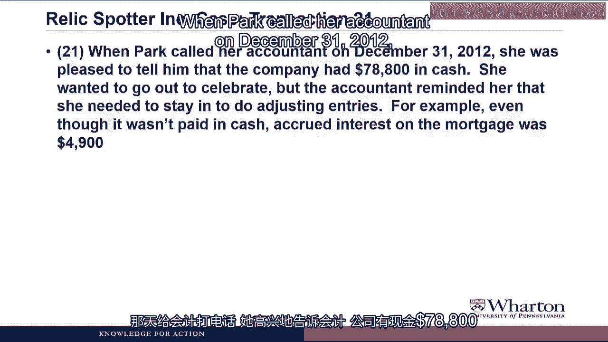


### 案例背景与目标

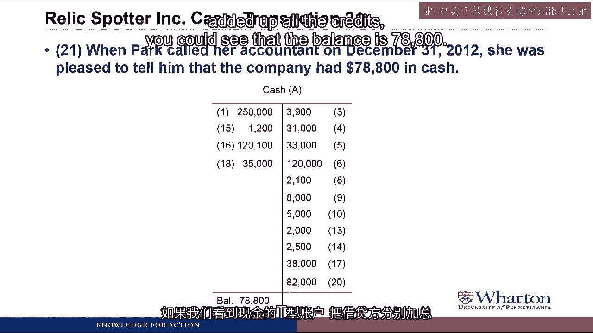

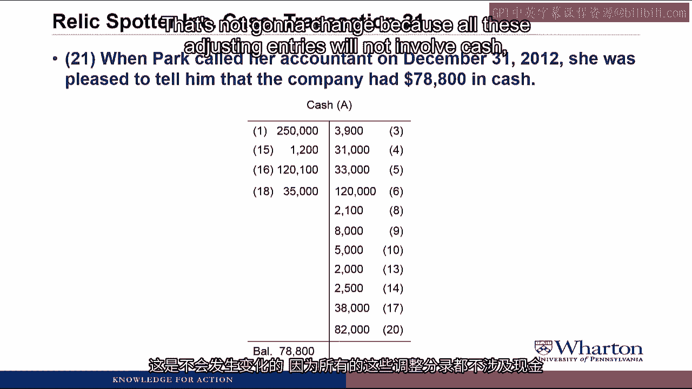

在之前的视频中，我们已经记录了“文物寻宝”公司运营前六个月发生的全部20笔交易。


现在是会计年度的最后一天，即12月31日下午5点。

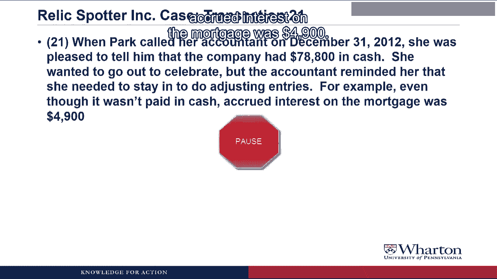

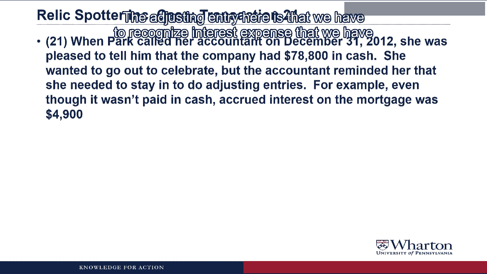

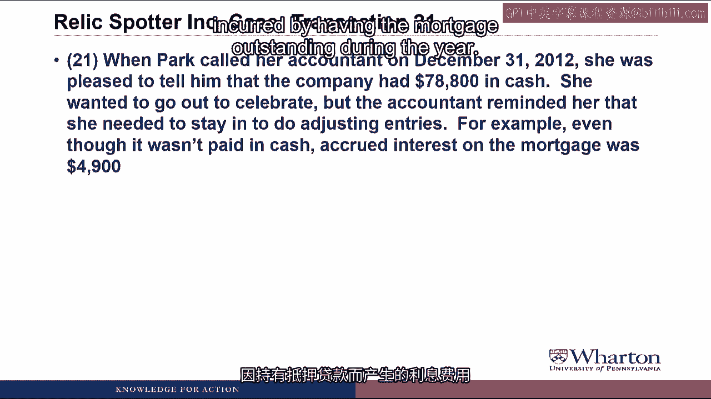

我们不会再记录任何涉及现金收付的外部交易。但在编制财务报表之前，我们必须记录内部交易，即调整分录。


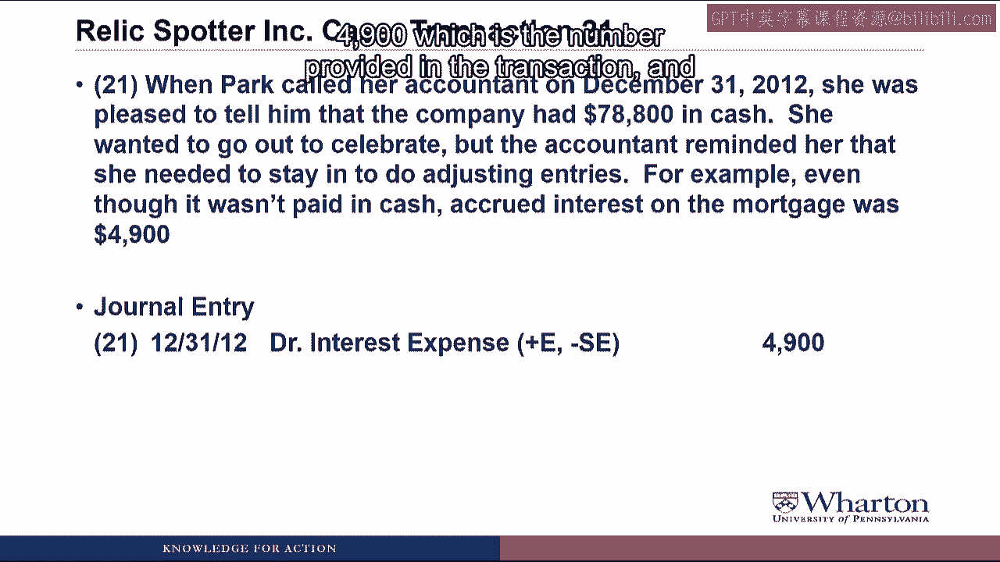

与之前的课程一样，我们将尝试为每一笔必需的调整分录编制日记账分录并过入T型账户。我会在讲解答案前给出暂停提示，以便您先自行尝试。

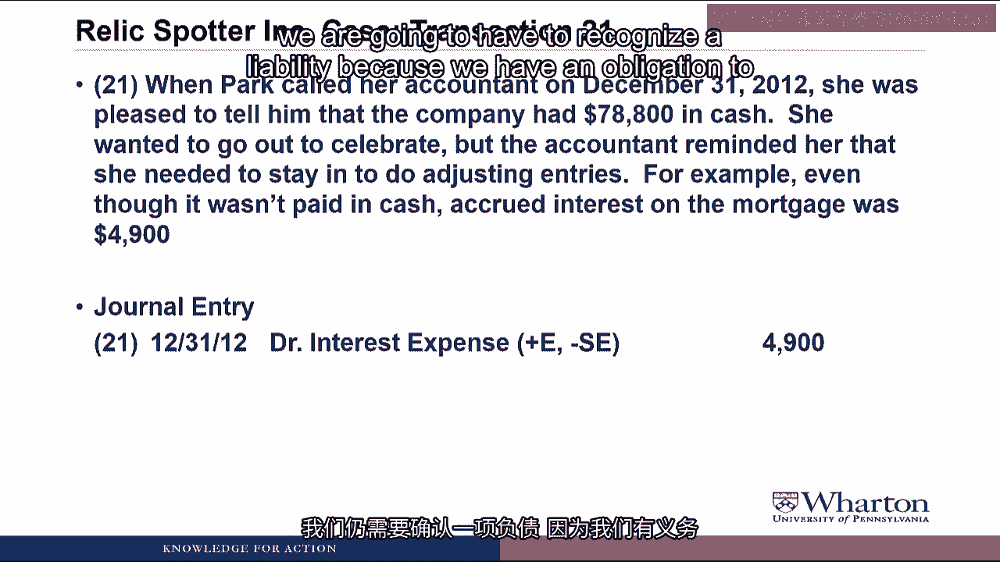


---

### 调整分录 21：应计利息

**交易描述：**
12月31日，帕克查看了公司账户，很高兴地发现公司拥有78，800美元的现金。她的会计师提醒她，尽管没有支付现金，但根据抵押贷款产生的应计利息为4，900美元。


**核心概念：**
应计利息是指在会计期间内已经发生但尚未支付的利息费用。根据**配比原则**，即使现金尚未支付，该成本也应与当期收入相匹配。

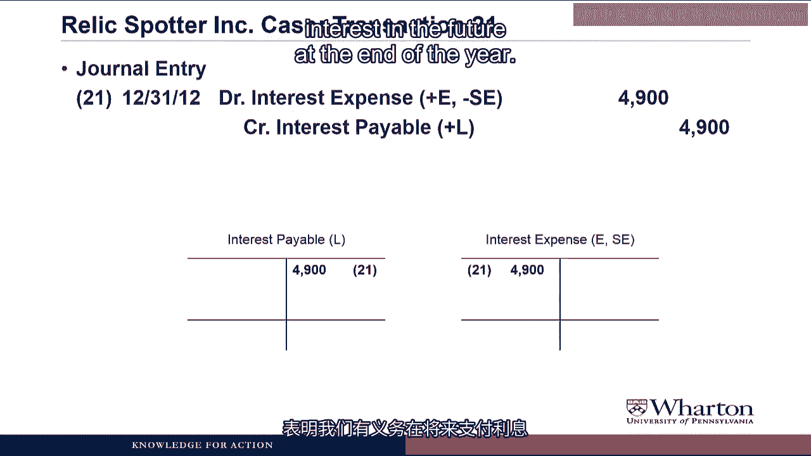

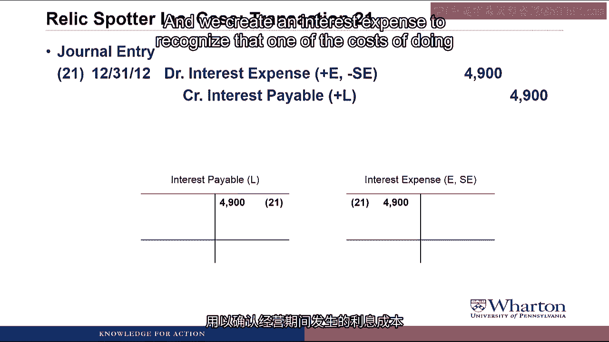

**调整分录：**
我们需要确认在本年度因抵押贷款而产生的利息费用。因此，我们借记“利息费用”账户，并贷记一项负债“应付利息”。


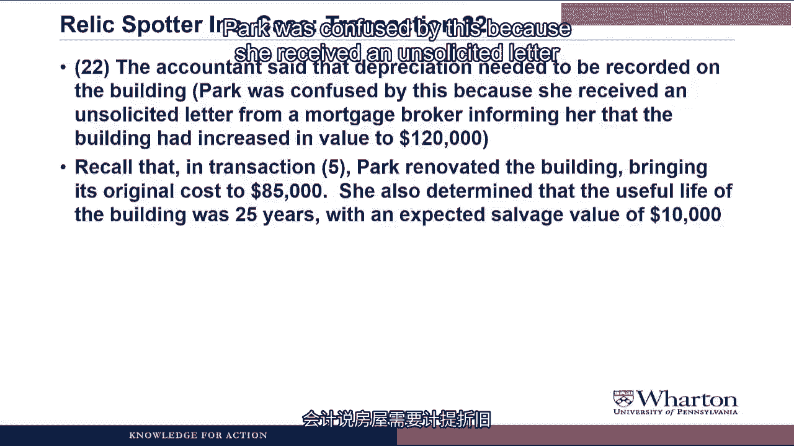

日记账分录如下：
```
借：利息费用 $4，900
贷：应付利息 $4，900
```


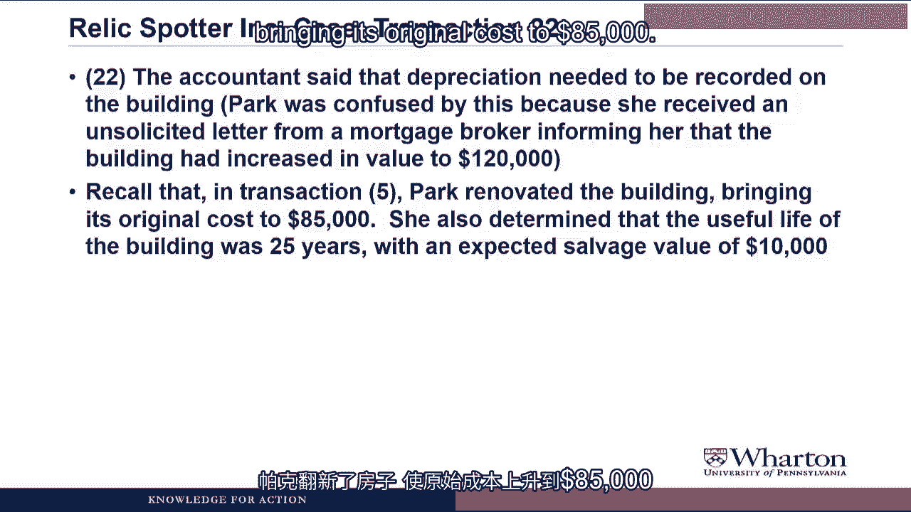

**分录解析：**
*   **借记“利息费用”**：增加费用，减少所有者权益。这反映了使用贷款资金在本期产生的成本。
*   **贷记“应付利息”**：增加负债。这表示公司有义务在下一个期间向银行支付这笔利息现金。

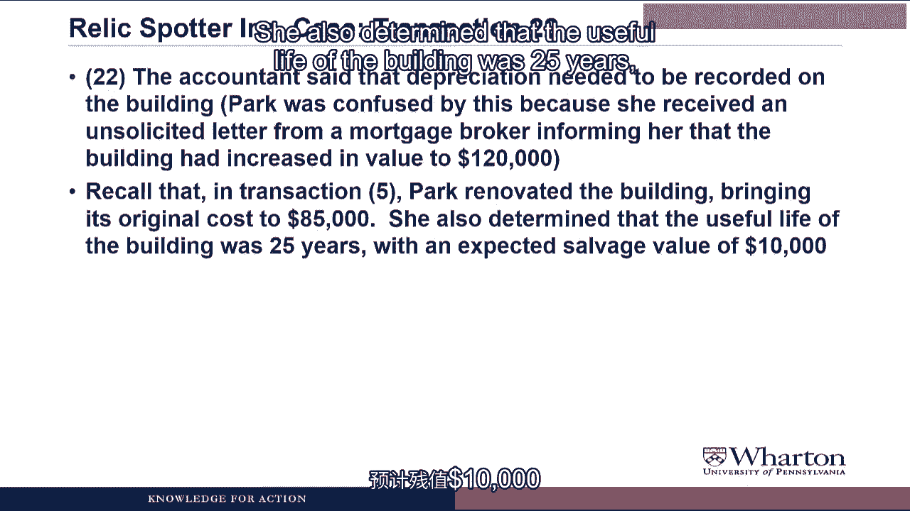


**关于“应计”的解释：**
“应计”意味着累积、增长或增加。贷款已经存在了八个月，因此利息在这八个月中累积（应计）起来。尽管我们尚未用现金支付这笔利息，但必须将其确认为费用，因为资金是在本期内使用的。这笔利息成本是本期的经营成本，需要与我们产生的收入相匹配。


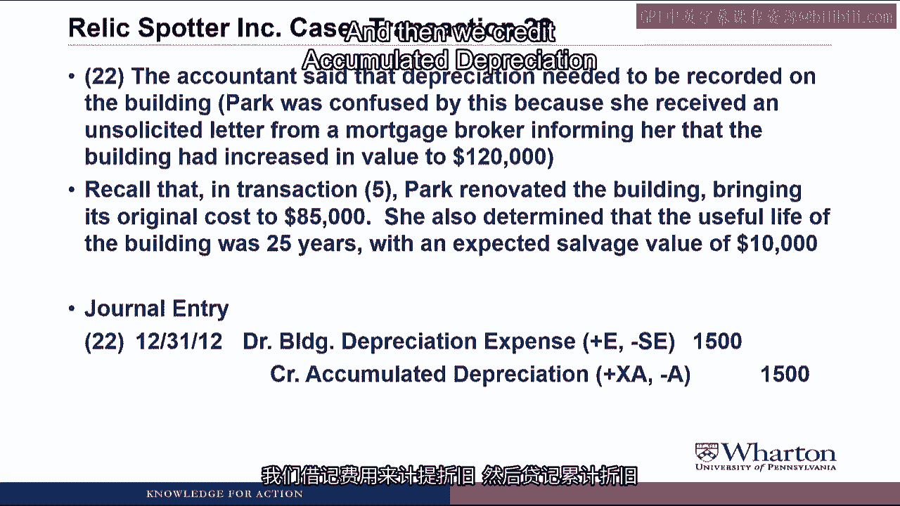

**过入T型账户：**
我们将此分录过账。这会创建一个“应付利息”负债账户（贷方余额），并增加“利息费用”账户（借方余额）。

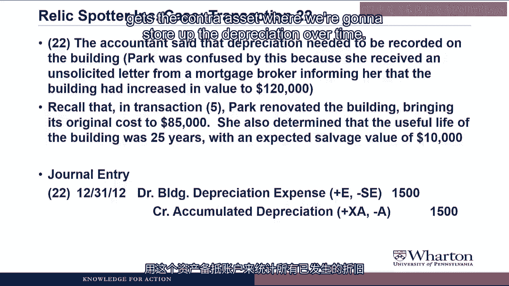

---

### 调整分录 22：建筑物折旧

**交易描述：**
会计师指出需要对建筑物记录折旧。帕克对此感到困惑，因为她收到一封未经请求的抵押贷款经纪人信件，告知她建筑物的价值已增至120，000美元。

**核心概念：**
对于建筑物这类非金融资产，会计上采用**历史成本法**或**摊销成本法**。这意味着，如果资产价值高于账面价值，我们从不调增；如果价值低于账面价值，则进行减值处理。这体现了会计的**谨慎性**原则。

**计算过程：**
回顾第5笔交易，帕克翻新了建筑物，使其原始成本达到85，000美元。她确定建筑物的使用寿命为25年，预计残值为10，000美元。
*   应折旧成本 = 原始成本 - 残值 = $85，000 - $10，000 = $75，000
*   每年折旧额 = 应折旧成本 / 使用年限 = $75，000 / 25年 = $3，000
*   本期折旧额（6个月）= $3，000 / 2 = $1，500

**调整分录：**
折旧费用的标准格式是借记费用，贷记累计折旧（一个资产备抵账户）。
日记账分录如下：
```
借：建筑物折旧费用 $1，500
贷：累计折旧 $1，500
```

**关于价值与折旧的疑问解答：**
*   **为什么只记录6个月折旧？** 公司只运营了6个月，为了将建筑物成本与这6个月产生的收入相匹配，我们记录半年的折旧。计算也更简便。
*   **为什么建筑物升值了还要折旧？** 根据历史成本原则，对于难以准确估值的资产（如建筑物），我们不允许管理者随意调增账面价值，以避免操纵空间，只允许在价值下跌时调减。我们不会依据未经请求的第三方信件来调整账面价值。

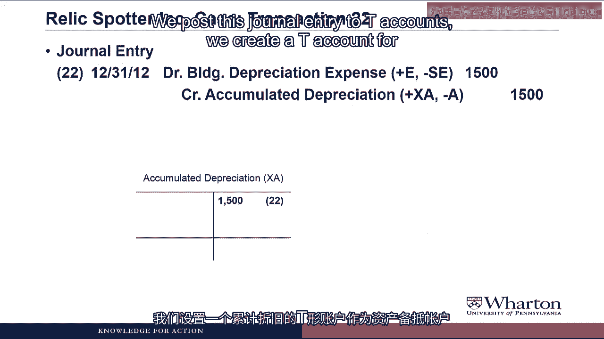


**过入T型账户：**
我们创建一个“累计折旧”资产备抵账户（贷方余额），并创建一个“建筑物折旧费用”账户（借方余额）。

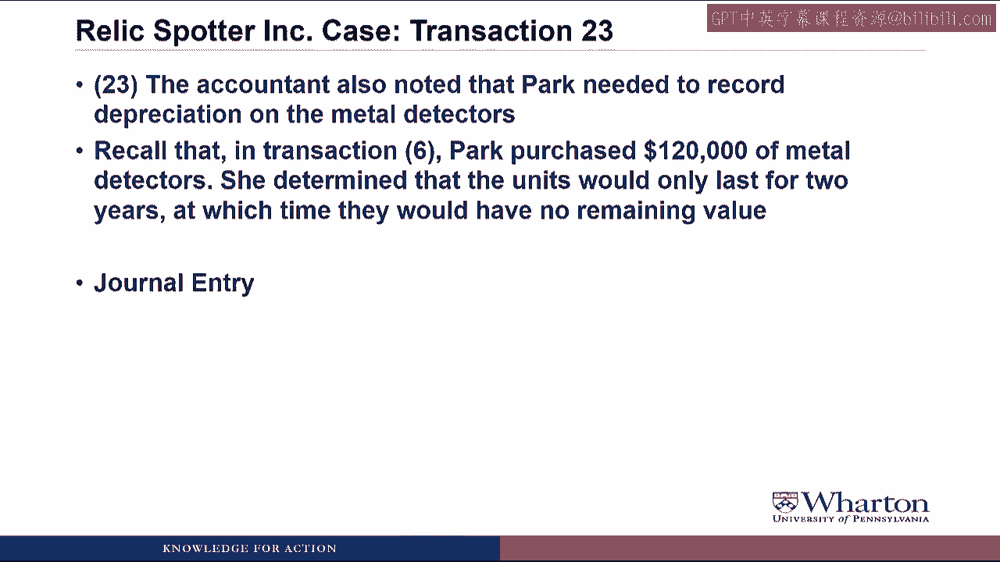

---


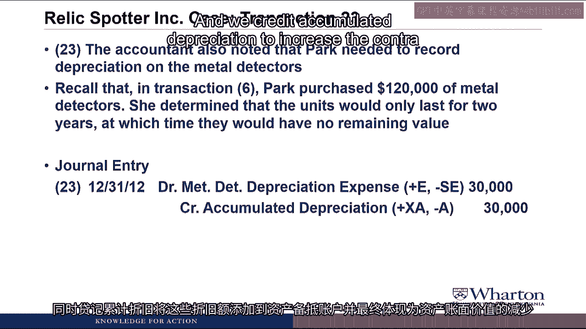

### 调整分录 23：金属探测器折旧


**交易描述：**
会计师还指出，需要记录金属探测器的折旧。回顾第6笔交易，帕克购买了价值120，000美元的金属探测器，她确定其使用寿命仅为2年，且届时无残值。


**计算过程：**
*   原始成本 = $120，000
*   残值 = $0
*   每年折旧额 = $120，000 / 2年 = $60，000
*   本期折旧额（6个月）= $60，000 / 2 = $30，000

**调整分录：**
格式与建筑物折旧相同。
日记账分录如下：
```
借：金属探测器折旧费用 $30，000
贷：累计折旧 $30，000
```

**关于账户设置的疑问解答：**
**为什么折旧费用分设账户，而累计折旧合并？**
在编制利润表时，“建筑物折旧费用”和“金属探测器折旧费用”可能会被归入不同部分（如运营费用），因此需要分开跟踪。而在编制资产负债表时，所有资产的累计折旧通常会汇总为一行列报，因此可以合并到一个“累计折旧”账户中。


**过入T型账户：**
在“累计折旧”T型账户中再增加一笔贷方记录，并创建一个“金属探测器折旧费用”账户（借方余额）。

---

### 调整分录 24：软件摊销

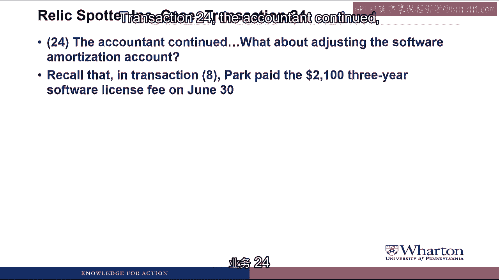

**交易描述：**
会计师继续询问关于调整软件摊销账户的事项。回顾第8笔交易，帕克于6月30日支付了2，100美元的三年期软件许可费。

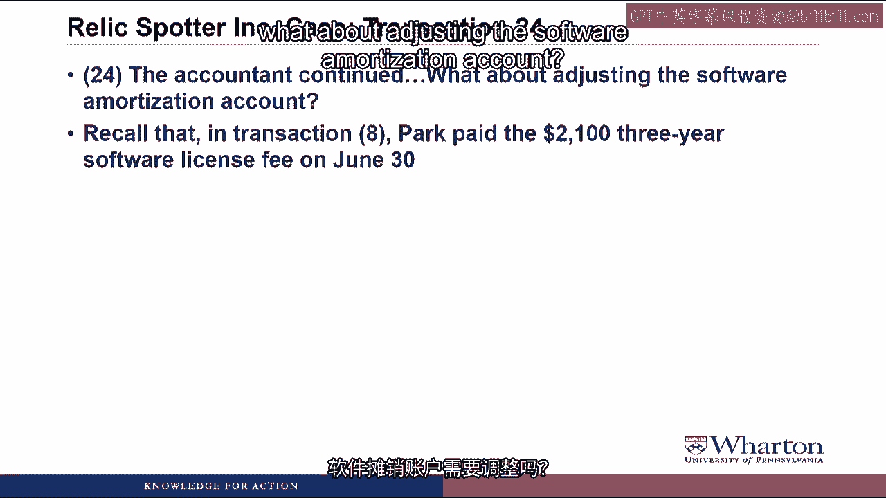


**核心概念：**
对于软件这类**无形资产**，我们使用“摊销”一词，其概念与有形资产的“折旧”类似。


**计算过程：**
*   许可费总额 = $2，100
*   许可期 = 3年
*   每年摊销额 = $2，100 / 3年 = $700
*   本期摊销额（6个月）= $700 / 2 = $350

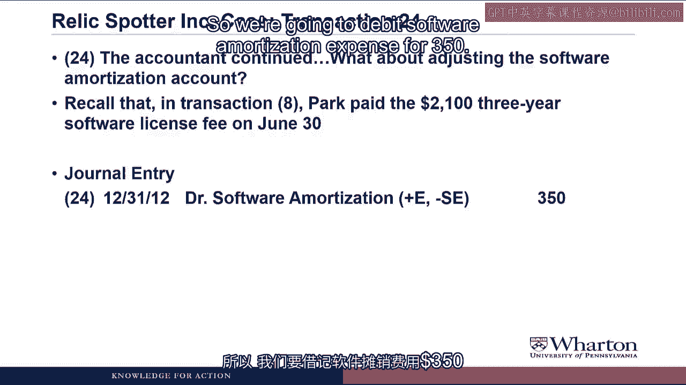


**调整分录：**
借记摊销费用。对于摊销，传统做法是直接贷记无形资产账户本身，而不是创建一个独立的“累计摊销”账户。
日记账分录如下：
```
借：软件摊销费用 $350
贷：软件 $350
```

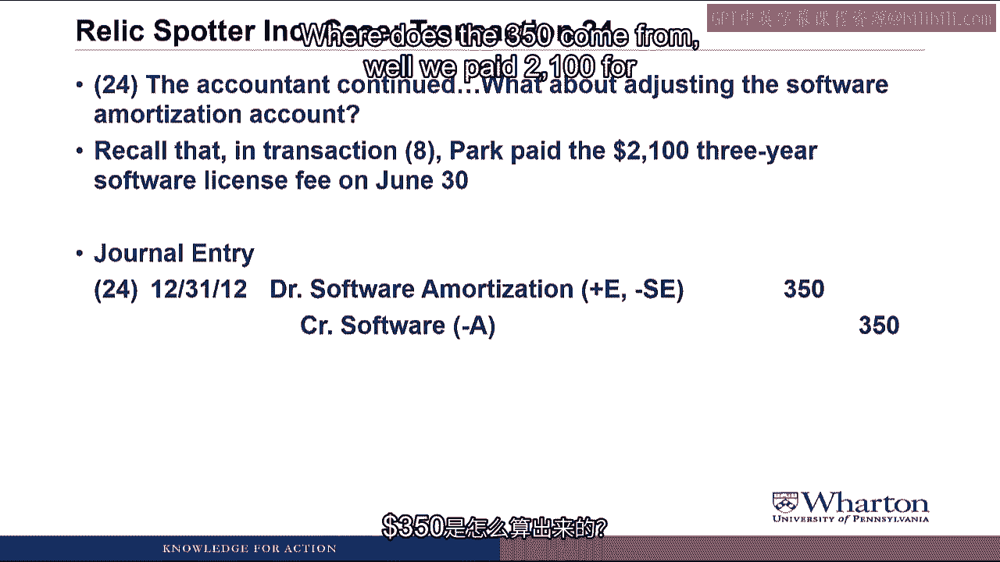

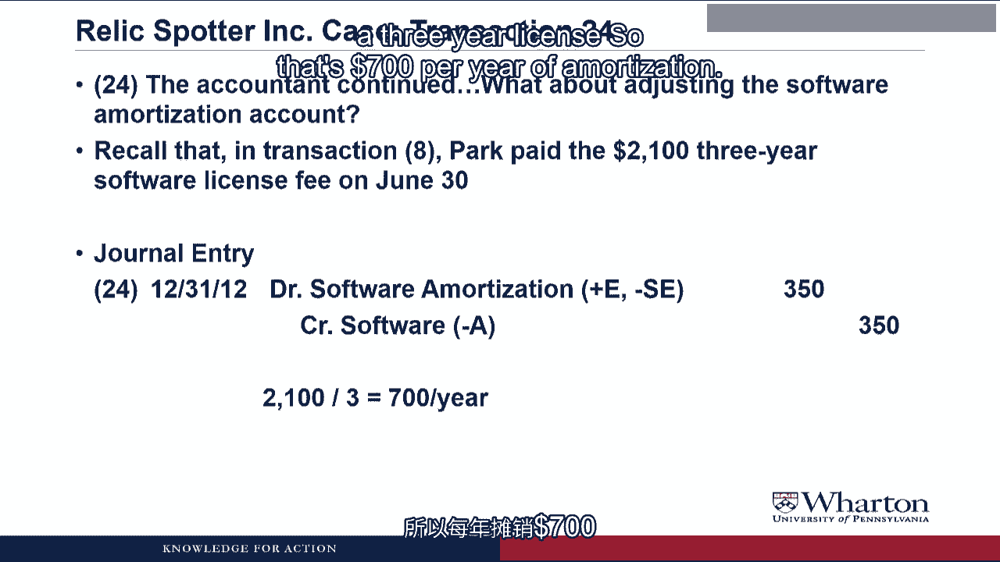


**关于直接减少资产账户的疑问解答：**
**为什么不创建“累计摊销”账户？**
这是历史传统做法，因为过去无形资产在资产负债表上占比不大。如今，随着无形资产越来越重要，你会看到越来越多的公司开始使用“累计摊销”账户。但直接减少资产账户的做法仍然很常见。

**过入T型账户：**
我们直接用贷方记录减少“软件”资产账户的余额，并借记一个“软件摊销费用”账户。

---


### 本节总结与预告

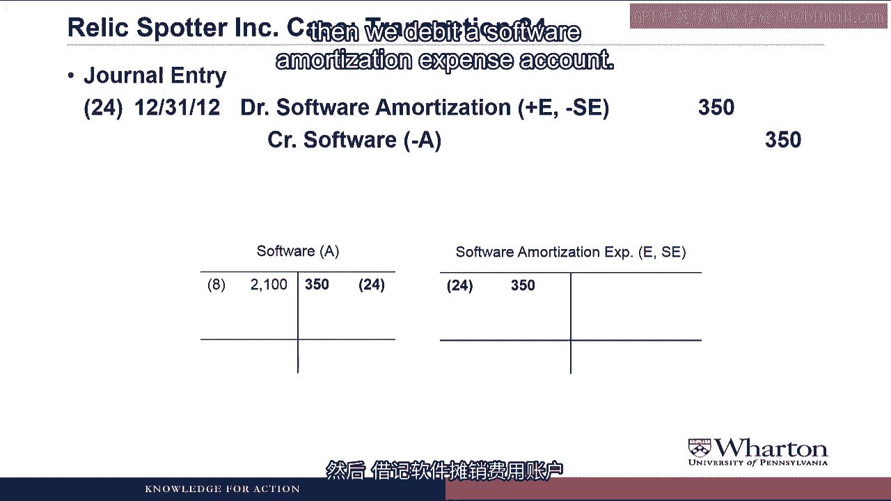

在本节中，我们一起学习了为“文物寻宝”公司案例编制前四笔调整分录：
1.  **应计利息**：确认已发生但未支付的利息费用和负债。
2.  **建筑物折旧**：根据历史成本和使用寿命，系统性地分摊建筑物成本。
3.  **金属探测器折旧**：同理，分摊金属探测器的成本。
4.  **软件摊销**：分摊无形资产（软件许可）的成本。

我们已经为“文物寻宝”公司记录了8笔调整分录中的4笔。在下一节视频中，我们将继续完成剩下的四笔调整分录。