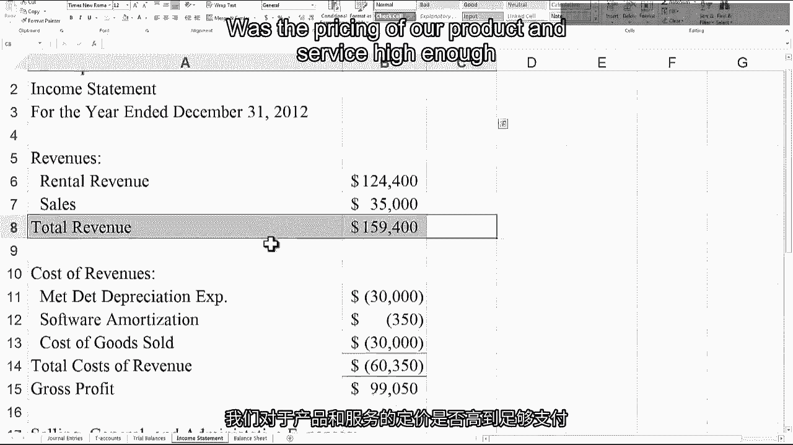
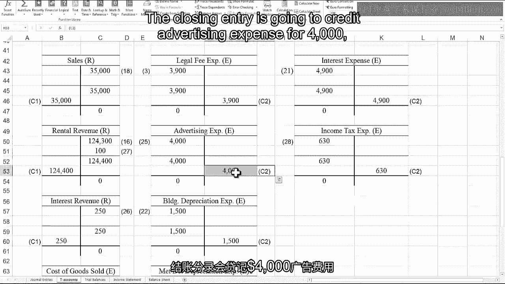
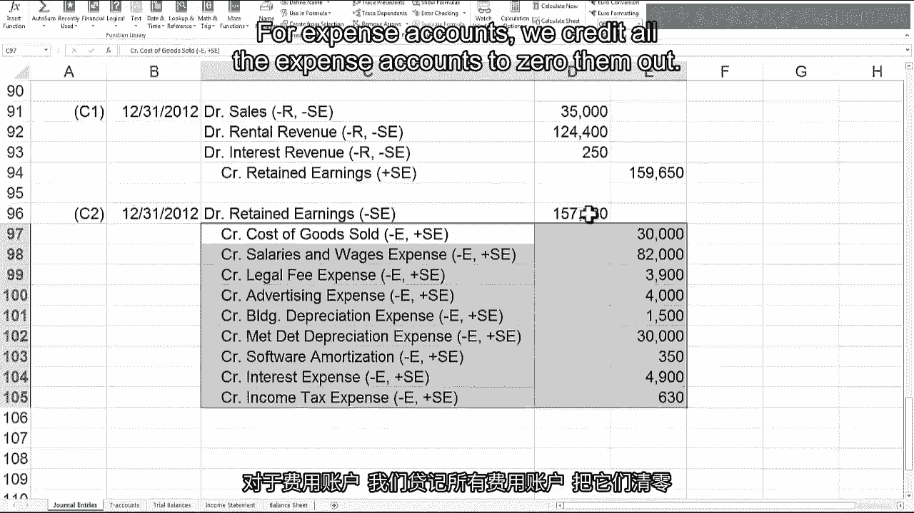

# 📊 沃顿商学院《商务基础》课程笔记｜P63：财务报表与结账分录

在本节课中，我们将学习会计循环的最后两个步骤：编制财务报表和进行结账分录。我们将以Relic Spotter公司为例，完成其资产负债表、利润表以及结账分录的编制。

---

## 1. 调整后试算平衡表与财务报表

上一节我们完成了Relic Spotter公司的调整分录。现在，我们可以进入会计循环的下两个步骤：编制调整后试算平衡表和准备财务报表。

调整后试算平衡表是在完成调整分录后，将所有账户的借贷方金额加总，确保借贷相等。然后，我们将利用这些余额来编制财务报表。

我们将首先编制利润表。接着，利用净利润更新留存收益，并编制资产负债表。最后，我们将完成现金流量表和股东权益变动表。

> 关于股东权益变动表，我最终会讲解，但不会告诉你具体时间。你需要持续观看视频，因为它随时可能出现。

---

## 2. 利润表格式解析

利润表通常遵循以下格式。需要说明的是，利润表没有绝对固定的格式要求，但我们将介绍公司最常用的格式。

*   **收入/销售额**：位于首行，指核心业务产生的收入。对于Relic Spotter公司，这包括金属探测器租赁收入和杂物销售收入。
*   **销售成本**：从收入中减去销售成本，得到**毛利润**。销售成本是产生收入的产品成本或直接成本。毛利润可以理解为在产品成本之上的加价。
*   **营业费用**：从毛利润中减去营业或销售、一般及行政管理费用，得到**营业利润**。SG&A费用代表销售、一般及行政管理费用，这些都是期间费用，是运营业务的其他所有成本。
*   **营业利润**：反映了核心业务的盈利能力。它有助于回答公司对其产品或服务的定价是否足以覆盖提供这些产品或服务的所有产品成本和期间成本。
*   **其他项目**：在营业利润之后，减去任何利息费用或加上利息收入，并调整**利得或损失**。利得或损失类似于收入或费用，但它们不来自核心业务。
*   **税前利润与净利润**：经过上述调整后，得到**税前利润**。然后减去所得税费用，得到最终的**净利润**，也称为收益或净利。

**利润表核心公式：**
`净利润 = 收入 - 销售成本 - 营业费用 ± 利息收支 ± 非经常性利得/损失 - 所得税`

> 管理者常谈论“线上”或“线下”项目。这里的“线”通常指**营业利润**。大多数投资者和分析师将营业利润视为核心业务绩效的关键指标。因此，管理层会设法将非经常性费用移至营业利润“线下”，以使核心业务的业绩看起来更好。

---

## 3. 资产负债表格式解析

资产负债表的格式中，资产列在最前面，并按以下顺序排列：

*   **流动资产**：指将在一年内提供效益的资产。它们按**流动性**（转换为现金的容易程度）排序。通常顺序为：现金、应收账款、存货，然后是任何预付资产（这些实际上不会转换为现金，只是递延费用）。
*   **非流动资产**：包括有形资产（不动产、厂房和设备）以及无形资产（如软件、商标或商誉）。商誉来自收购，我们将在课程后期讨论。
*   **负债与股东权益**：首先是**流动负债**，即一年内到期的义务。同样按流动性排序，通常为：银行借款、应付账款、其他应付款，然后是递延收入和其他非现金流动负债。
*   **非流动负债**：指一年后到期的负债，如长期银行借款和债券，以及其他类型的负债（如递延税项和养老金）。
*   **股东权益**：以投入资本开始，包括普通股、资本公积、库存股，然后是**留存收益**。

**资产负债表核心公式（会计恒等式）：**
`资产 = 负债 + 股东权益`

---

## 4. 结账分录详解

完成财务报表后，我们准备进入会计循环的最后一站：**结账分录**。这使我们能够为开始新周期做好准备，从而在公司的整个生命周期中一遍又一遍地重复这个循环。

结账分录涉及结清**临时性账户**。

*   **临时性账户**：仅在一定期间（财季或财年）内累积交易影响的账户。这包括收入和费用账户，它们在期末被结转到留存收益。
*   **永久性账户**：在业务生命周期内累积交易影响的账户。这包括资产负债表账户，如资产、负债、投入资本和留存收益。

实际的结账分录是在会计期末将临时性账户余额归零的内部交易。这里说的“内部交易”是指会计人员在其办公桌上完成的工作，并非与外部人员的交易。其目标是将收入和费用账户的余额转移到留存收益。

以下是结账分录的编制方法：

*   **对于收入账户**：收入账户有贷方余额。为了将其归零，我们借记收入账户，并贷记留存收益，从而将余额从收入转移到留存收益。
*   **对于费用账户**：费用账户有借方余额。为了将其归零，我们贷记费用账户，并借记留存收益。

请注意，在这两种情况下，我们都没有创造任何新的股东权益，只是将其从一种账户（临时性账户）转移到另一种账户（永久性账户，即留存收益）。

> 有些教科书会使用“收益汇总”账户。其做法是先将收入和费用账户结转到收益汇总账户，然后再将收益汇总账户结转到留存收益。最终效果是只有一个分录进入留存收益，而不是我们方法中的两个。两种方法结果相同，因此使用哪种方法并不重要。我倾向于不使用收益汇总账户，因为它更直接，且无需创建新账户。

完成结账分录后，我们会编制**结账后试算平衡表**，再次加总以确保借贷相等。此时，只有永久性账户应有余额，所有收入和费用账户的余额应为零。这样，我们就为开始下一个周期做好了准备。

---

## 5. Relic Spotter案例实操

我们将完成Relic Spotter案例的收尾工作：编制调整后试算平衡表、整理利润表、记录结账分录并过账到T型账户，最后编制资产负债表。

以下是关键步骤的总结：

1.  **调整后试算平衡**：在调整分录后，汇总所有账户的借贷方余额，确保其相等。
2.  **编制利润表**：
    *   从收入开始（租赁收入和杂物销售收入）。
    *   减去销售成本（对于租赁服务，包括金属探测器折旧和软件成本；对于杂物销售，即销售成本），得到毛利润。
    *   减去销售及行政管理费用（薪资、法律费、广告费和建筑物折旧），得到营业利润。
    *   调整利息收支后，得到税前利润。
    *   减去所得税费用，得到净利润 **$2,370**。
    *   **注意**：折旧费用可能需要拆分到不同类别（如产品成本 vs. 期间费用）。
3.  **进行结账分录**：
    *   借记所有收入账户以将其归零，汇总后贷记留存收益。
    *   贷记所有费用账户以将其归零，汇总后借记留存收益。
    *   过账后，所有临时性账户余额为零，留存收益更新为最终余额（本例中为借方余额 **$130**，即负的留存收益，因为支付的股利超过了净利润）。
4.  **编制资产负债表**：
    *   按流动性列出流动资产。
    *   列出有形资产（按原值列示，并单行列示累计折旧以得到“不动产、厂房和设备净值”）。
    *   列出无形资产（如软件）。
    *   按流动性列出流动负债。
    *   列出非流动负债。
    *   列出股东权益（普通股、资本公积、留存收益）。
    *   确保 `总资产 = 总负债 + 股东权益`。

---

## 6. 课程总结

本节课中，我们一起学习了会计循环的最后关键步骤：编制财务报表和进行结账分录。我们详细剖析了利润表和资产负债表的格式与构成，并通过Relic Spotter的案例，完整演练了从调整后试算平衡到编制资产负债表的全过程。结账分录确保了会计期间的顺利更替，为下一周期的核算做好准备。

至此，我们完成了本课程关于会计基本构建模块的部分。我们所学的所有这些知识，将在后续更高级的会计主题中反复应用。下一步是为Relic Spotter编制现金流量表，但这将需要大约一周的视频来学习如何操作。