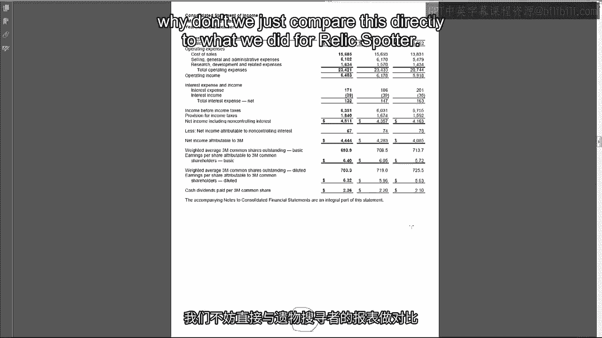
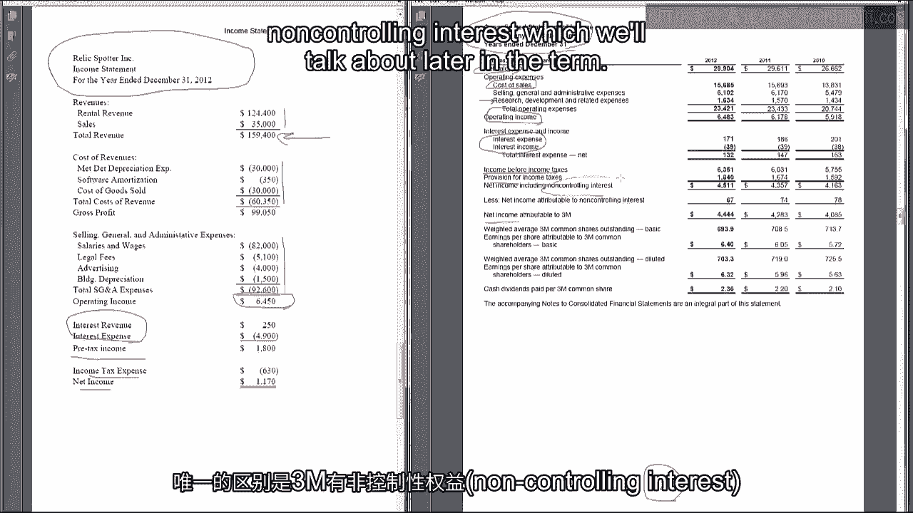
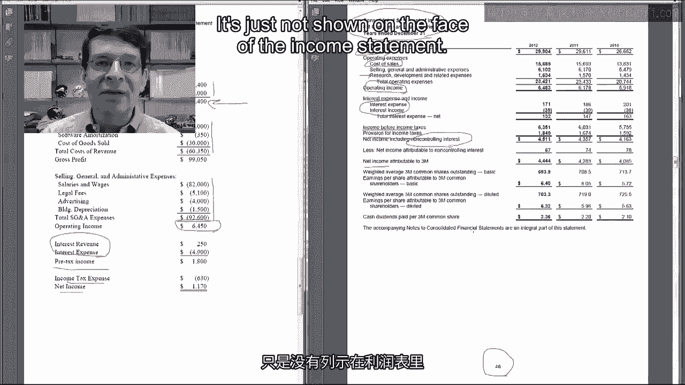
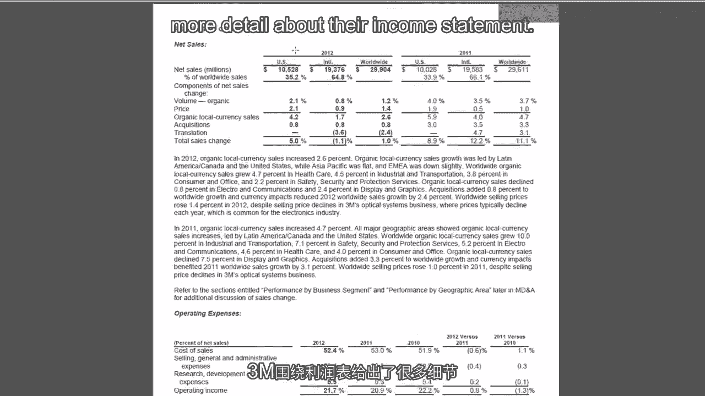
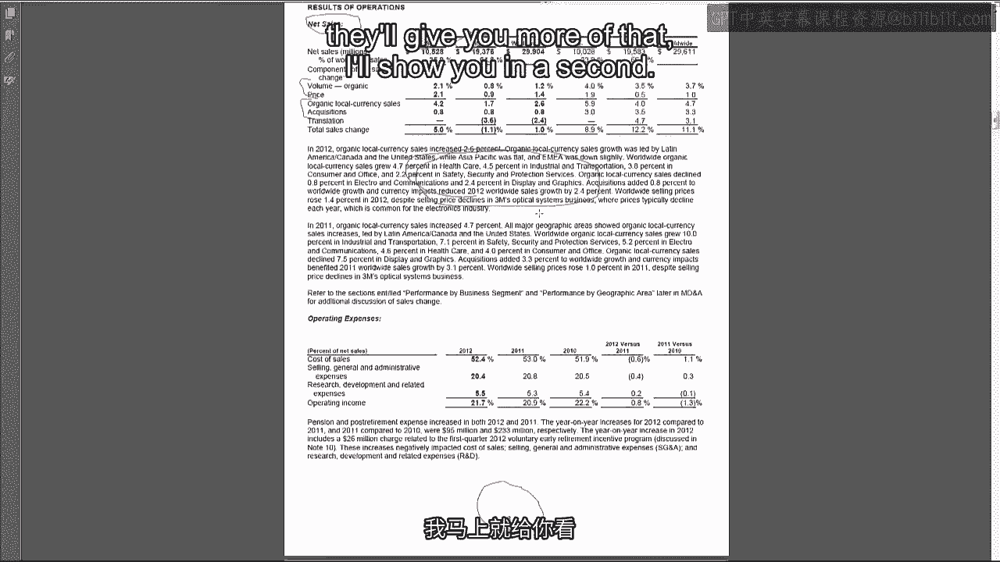
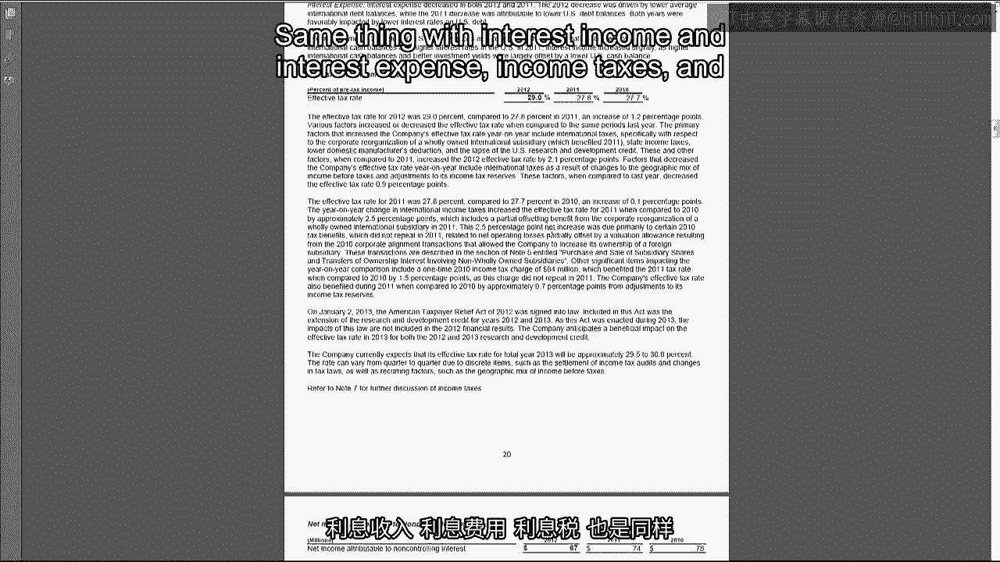
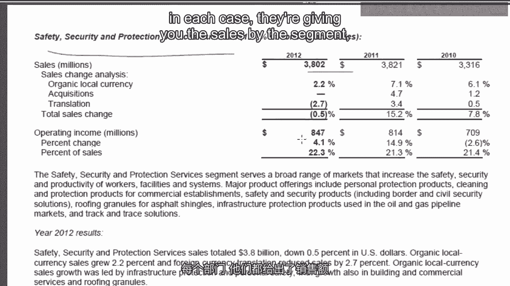
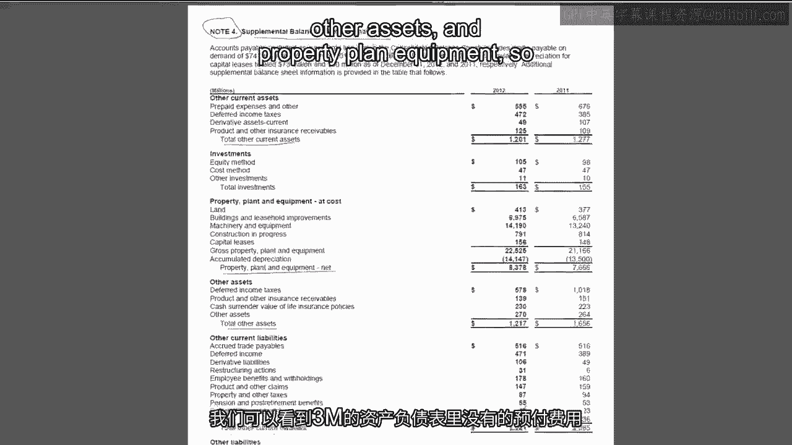
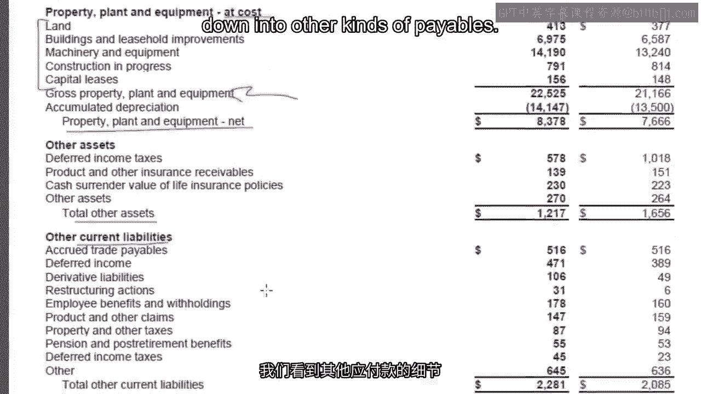
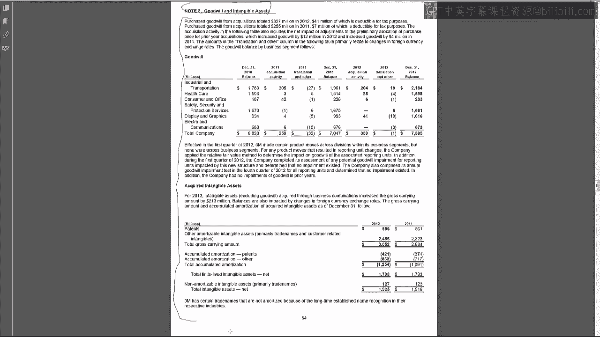

# 沃顿商学院《商务基础》课程 P64：3M公司利润表与资产负债表分析 📊

在本节课中，我们将学习如何阅读和分析一家真实公司的财务报表。我们将以3M公司为例，将其利润表和资产负债表与我们之前为Relics Potter公司编制的报表进行对比，从而理解大型上市公司财务报表的结构与呈现方式。

---

## 利润表对比分析

上一节我们介绍了会计循环的最终成果——财务报表的编制。本节中，我们来看看3M公司的利润表，并与Relics Potter公司的利润表进行直接比较。

以下是Relics Potter公司的利润表项目与3M公司利润表（摘自其年报第46页）的对比：

*   **营业收入**：Relics Potter将其分为两个业务部门列示。而3M公司仅以“净销售额”单行列出。
*   **营业成本**：Relics Potter列示了“收入成本”或“销售成本”。3M公司同样以单行项目列示。
*   **销售、一般及行政费用**：两家公司均有此项目，3M公司也以单行列出。
*   **研发费用**：3M公司单独列出了研发费用，而Relics Potter公司没有此项。
*   **营业利润**：计算方式相同，均在上述项目之后得出。
*   **利息收入与利息费用**：两家公司均单独列示。
*   **税前利润、所得税费用、净利润**：列示顺序完全相同。3M公司多出一项“非控制性权益”，我们将在后续课程中讨论。

你可能会疑惑，为何像3M这样生产便利贴、思高胶带等产品的大型跨国公司，其利润表提供的信息反而比Relics Potter更少？实际上，3M提供了更多细节信息，只是没有全部直接列示在利润表主表中。

---

## 在年报其他部分寻找详细信息

若需获取利润表项目的更详细信息，我们需要查阅年报的其他部分。

在**管理层讨论与分析**部分（MD&A，本例中位于年报第18页），3M公司提供了大量利润表项目的补充信息：

*   **净销售额**：分解为美国市场与国际市场，分析价格与销量增长的影响，区分有机增长与收购带来的增长，并提供地理和产品分部信息。
*   **营业费用**：对销售成本等项目的变动原因进行段落说明，涉及制造、工程、货运成本以及售价、原材料成本变动的影响。
*   **销售、一般及行政费用**：虽未详细拆分组成部分，但讨论了养老金费用、重组费用、成本控制与生产效率等因素的变化。
*   **分部信息**：对工业与运输、医疗保健、消费与办公（例如便利贴业务）、安全与防护服务等各个业务分部，分别提供了销售额、营业利润及业务动态详情。

因此，我们确实能获得比利润表主表更丰富的信息，但需要深入研读报告的不同章节。

---

## 资产负债表对比分析

接下来，我们分析3M公司的资产负债表（摘自其10-K报告第48页），并再次与Relics Potter公司的资产负债表进行对比。

以下是两家公司资产负债表项目的比较：

*   **资产端**：
    *   **现金**：均为最先列示的流动性最强资产。3M还包含“有价证券”。
    *   **应收账款**：均紧随其后。3M提到了“备抵”项目，我们将在后续课程中讲解。
    *   **存货**：两家公司均有。作为制造企业，3M的存货包含不同类别。
    *   **其他流动资产**：Relics Potter列示了预付利息、应收票据等。3M将这些项目合并计入“其他流动资产”。
    *   **不动产、厂房及设备**：Relics Potter详细列示了土地、建筑、金属探测器及其累计折旧。3M的处理方式本质相同：以成本价列示一行，减去累计折旧得到净值，只是未在主表中披露明细。
    *   **无形资产与其他资产**：Relics Potter仅列示了软件。3M则包含商誉、无形资产净值、预付养老金以及常见的“其他资产”。

*   **负债与股东权益端**：
    *   **流动负债**：Relics Potter包含应付账款、应付利息、应付所得税、预收收入。3M有应付账款、应付薪酬、应付所得税（“应计”与“应付”含义相同）及其他流动负债。
    *   **长期负债**：Relics Potter有一项长期债务（抵押贷款应付）。3M列示了长期债务，并将其当期部分列入流动负债。
    *   **股东权益**：Relics Potter包含普通股、**资本公积**和留存收益。3M的普通股面值极低（每股约0.01美元），因此大部分实收资本计入**资本公积**。留存收益之后，3M还列示了库存股和累计其他综合收益，这两项我们将在课程后期讨论。此外，还有“非控制性权益”。

最终，无论公司规模大小，会计恒等式必须成立：**资产 = 负债 + 股东权益**。3M公司的报表也严格遵循了这一原则。

---

## 通过财务报表附注获取明细

现在你可能想知道，如果需要了解3M公司“预付费用”的具体情况该怎么办？因为在资产负债表上只看到“其他流动资产”这个汇总项目。

答案是查阅**财务报表附注**。在10-K报告的附注4（第66页）中，3M公司提供了资产负债表部分项目的明细。

例如：
*   “其他流动资产”被分解，其中包含了未在资产负债表主表中单独列示的“预付费用”。
*   “不动产、厂房及设备”的成本被分解为土地、建筑物、机器设备、融资租赁等明细，即 **PPE（成本） = 土地 + 建筑物 + 机器设备 + ...**。
*   “其他流动负债”也被分解为其他应付款、衍生金融负债、重组费用、员工福利等具体类别。

3M公司的做法是，尽可能精简资产负债表主表的行数，然后在附注中对一些汇总项目提供分解信息。许多科目的详细信息通常都集中在相关附注中，例如关于商誉和无形资产的附注三。

---

本节课中，我们一起学习了如何解读3M公司的利润表和资产负债表，理解了大型上市公司为保持报表简洁，会将详细信息置于管理层讨论与分析部分及财务报表附注中。掌握在年报的不同章节定位所需信息的能力，对于进行深入的财务分析至关重要。