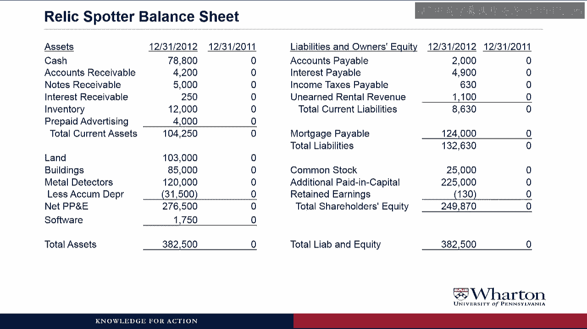
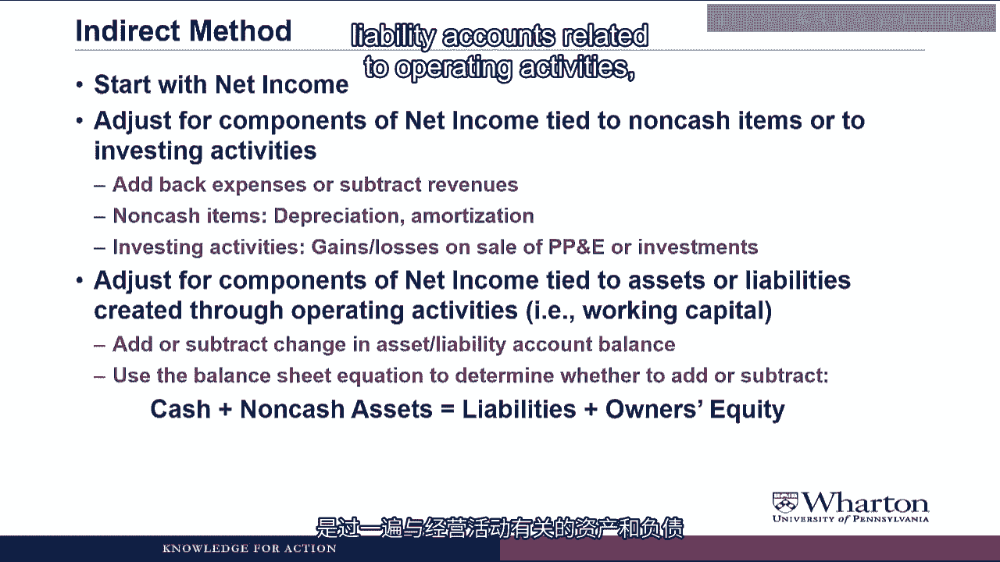
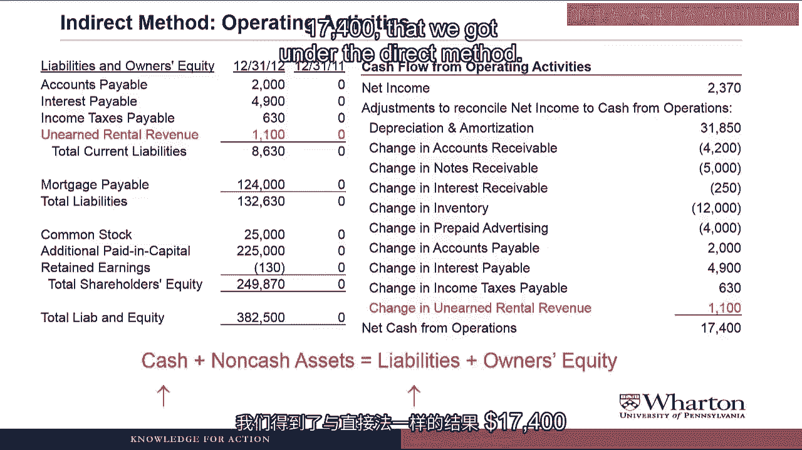
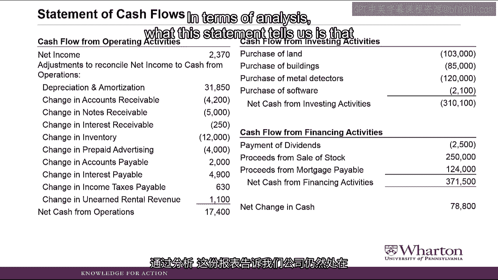

# 沃顿商学院《商务基础》｜Business Foundations Specialization｜（中英字幕） - P68：20_3 2 2 文物寻宝案例部分 6.zh_en - GPT中英字幕课程资源 - BV1R34y1c74c

Hello and Professor Brian Bichay， welcome back。 In this video we're finally going to finish the Relic Spotter case by putting together。

its statement of cash flows using the direct and indirect methods。 Let's get started。

Last time we looked at the Relic Spotter case， we put all of the cash transactions into operating。

investing and financing buckets。 So now we're going to go ahead and use these classifications to put together the cash。

flow statement。 To do the indirect method， we're going to need to pull some information off the income。

statement。 So here's a reminder of what the income statement looked like for Relic Spotter。

And we're going to need to use the balance sheet。 So here's what the balance sheet looked like for Relic Spotter。

What did all of the zeros come from？ I don't remember all of those zeros when we put together the balance sheet。

Good memory。 In fact， when we put together the Relic Spotter balance sheet。

we didn't have all these。

zeros in there because we only put together the ending balance sheet。

But when we do a cash flow statement， we need to change in the balances， the difference。

between the beginning balance and the ending balance。

There was no beginning balance in any of these accounts because Relic Spotters is a startup。

company。

So I went ahead and created a beginning balance sheet of all zeros to make it clear that we're。

taking the change in the balances for the statement of cash flows， not just the ending。

balance。

First I'm going to do the direct method for investing and financing activities。

Once we get that out of the way， then we'll look at operating activities under both the。

direct and indirect method。 For the investing activities。

we need to pull out the column of cash flows that we classified。

as investing and then just list them in the cash flow from investing activities section。

So we have purchase of land for 103，000， purchase of buildings， 85，000。

We purchase metal detectors of $120，000 cash and purchase the software which is a long-term。

asset $2，100。

At them all up， we get net cash outflow from investing activities of $310，100。

This section will go on the final cash flow statement。

How do you determine which line items to report on the statement？ Oftentimes。

don't companies simply report a line called capital expenditures？

There are generally no specific rules that govern how much or how little detail you break。

things into on the statement of cash flows。 It's the manager's choice。

but usually the manager makes the choice based on what investors， and analysts want to see。

Because of investors and analysts are looking for peace information that's not there， they'll。

just ask the company about it during a conference call or some other communication。

So what you're seeing on the cash flow statement is a joint agreement between managers and the。

users of the financial statement as to how much detail they want to see in these various。

line items about the company。 Next we do the direct method for the financing activities。

So here is the column of cash transactions that we classify as financing。

Now we just need to list them。 So we pay dividends of $2，500。

proceeds of sale of stock that was $250，000 coming in。

and proceeds from the mortgage payable was $124，000 coming in。

That gives us a net cash inflow from financing activities of $371，500， and this section will。

go on the final cash flow statement。

Now even though it's somewhat theoretical because companies never really report these。

we're going to look at the operating activities under the direct method。

So let me pull in the operating cash flow transactions， and under the direct method all。

we have to do is list them。 So first I'm going to take all the cash we collected from customers。

We received cash on the rental prepayment from the pen and tick-wities club。

The revenues that came in cash from metal detector rentals， and then the $35，000 of cash。

from the sundry sales， you add that together and we have cash collected from customers totaling。

$156，300。

Wait， we haven't recognized revenue yet on the rental prepayment amount。

How can we justify putting that on the cash flow statement？ Well。

we can justify putting it on the cash flow statement because RelicsBotter actually， received cash。

But you raised a good point in that a lot of the examples we've seen so far， companies。

are recording revenue before they receive the cash， and so we have a change in accounts， receivable。

But you could have a company receive the cash before they earn the revenue。

The cash flow statement is just giving you cash in and cash out during the period， and。

that's going to be different from revenue， but it could be different in either direction。

either you might get the cash first， or you might get the cash later compared to when。

you book the revenue。 Continuing on， we paid $2，000 cash to our supplier。

and we bought an additional $38，000。

of inventory with cash。 Add that up， cash paid to suppliers is $40，000。

Cash paid to employees for salaries and wages was $82，000。

Cash paid for short-term loans was $5，000， and then I'll combine legal fees and advertising。

into cash paid for miscellaneous expenses of $11，900。

Again whether you list those separately or combine them depends on what your financial。

statement users want to see in terms of the level of detail。

We add all this up and we get net cash from operations of $17，400， which is what we had。

in the operating bucket to begin with。 Okay。 This direct method is simple， clear， straightforward。

and informative。 But you said the companies rarely use it。 So？ So。

why do we have to learn the indirect method？ Why do companies prefer the indirect method？

And why does the FASB require it even when the direct method is chosen？ Um， yes。

that is what I was going to ask。 Let's hear your answer。

I'm glad you asked that question here because this is the best place for me to show you。

why the direct method is not that useful for the operating section of the cash flow statement。

Let me jump out to the slide to show you what I mean。

So RelicsBotters cash collected from customers was $156，300。

Is that good or bad？ RelicsBotters cash paid to suppliers was $40，000。

Is that good or bad？ Well， you can't tell without some kind of benchmark。

You could look at prior your numbers to see if there's a trend， but we really want to。

know is what was the level of activity surrounding these cash collections during the year。

For example， if RelicsBotter had $157，000 of revenue and collected $156，300 in cash， then。

the cash flow makes sense。

But if RelicsBotter had $500，000 in revenue， but only collected $156，300， then there may。

be a problem。 Or let's say that RelicsBotter sold $40，000 in inventory， paid $40。

000 of their suppliers。

Again， the cash flow makes sense。

But what if RelicsBotter only sold $10，000 of inventory？ Then the question is。

why did they spend an extra $30，000 in cash to acquire inventory。

they didn't sell？

What the indirect method is going to do is start with net income as a benchmark for the。

expected level of activity or expected level of cash flows during the period and then highlight。

any discrepancies from that level。 This is the kind of thing we'll talk about when we do an analysis of an indirect cash。

flow statement after we finally put one together later in the video。

Now we're going to do the indirect method， which will be what will show on the final cash。

flow statement for RelicsBotter。

We're going to go step by step following the algorithm that I did before， starting with。

net income。 So I pulled up the income statement at the bottom line。

We can see net income was $2，370。 So on our indirect method cash flow statement。

we started the top with net income of $23。70。

First I already have the answer at the bottom， net cash from operations of $17，400 because。

whatever we do in this section， we have to get the same answer that we got under the。

direct method。 Okay， so far so good。

Next step in our algorithm was to adjust your components of net income tied to non-cash。

items or investing activities。 We could ignore investing activities for RelicsBotter because they didn't have any gains or losses。

on sale of PPE or investments。

So it really involves adding back the depreciation and amortization。

Here is the income statement again。

We had metal detector depreciation of $3，000， software amortization expense of $3。50， and。

building depreciation expense of $1，500。

I'm going to combine those into one line item called depreciation and amortization of $31，850。

And we're going to add that back to remove that non-cash expense from net income。

Do we always combine all of the depreciation and amortization into one line？ Again。

this is a choice by managers about how much or how little detail they want to。

provide on their statements。 One thing I will say here is that generally the only place you can find depreciation and。

amortization expense in the statements is on the statement of cash flows。 Yes。

it's part of the income statement， but it's often combined with other items and not。

broken out separately， but you'll always be able to find it broken out separately in。

the operating section of the statement of cash flows。

The last step in our algorithm is to go through all the asset and liability accounts related。

to operating activities， in other words， the working capital accounts， and add or subtract。

the change in the balance based on the balance sheet equation。

So start with accounts receivable。

Cash receivable went from 0 to 4200， so it went up by 4200 during the year。

That's a non-cash asset going up， which means we need to subtract it on the cash flow statement。

to stay in balance。

Notes receivable went from 0 to 5，000。 Non-cash asset going up。

To stay in balance， we need to subtract that on the cash flow statement， so we subtract change。

in notes receivable to 5，000。

Cash receivable went from 0 to 250， non-cash asset going up， so we subtract it on the cash。

flow statement。

Inventory went from 0 to 12，000， non-cash asset going up， so we subtract it on the cash flow。

statement。 Prepaid advertising went from 0 to 4，000， and again， non-cash asset going up。

we subtract。

that on the cash flow statement。

I think I understand assets are always subtracted when the indirect method is used。 No， no， no， no。

no。 That's just a function of looking at a startup company， which of course had a balance of。

zero in all the assets in the beginning of the year， and so all the assets went up。

In a future video， we'll look at examples where companies do add assets to their statement。

of cash flows because they've had assets go down during the year。

If we look at the rest of the assets out of the balance sheet， we have land， buildings。

metal detectors， software， we don't do anything with those in the operating section because。

we've already taken care of those in the investing activities。

So we move on to the liability side of the balance sheet。

We have accounts payable went from 0 to 2，000。

That's an increase in a liability of 2，000。 Note we're on the other side of the equal sign with the liability。

so liability going。

up means that we need to add it to the cash flow statement。

Interest payable went from 0 to 4900， so that's an increase in a liability of 4900， which。

we need to add to the cash flow statement to keep the balance sheet equation in balance。

Income taxes payable went from 0 to 630。 Again an increase in a liability gets added to the cash flow statement。

And unearned revenue went from 0 to 1100。

That's an increase in liability that gets added to the cash flow statement。

And I think I am not wrong to assume that it is not necessarily the case that liabilities。

are always added under the indirect method。 Wow， there were a lot of negatives that are not really sure what the question was。

But you should not assume that liabilities are always added on the cash flow statement。 Again。

because we were looking at a startup， all the liabilities went up in value and so， we added them。

We will see examples where liabilities go down during the year and we end up subtracting。

them on the cash flow statement。 Going back to the balance sheet。

the next accounts we would have would be mortgage payable。

common stock， additional paid in capital。

But we are ready to care of those with the cash flow from financing activities and retained。

earnings that's just net income and dividends which we've also taken care of。

So looks like we're done， which is a good thing because we're out of space on the indirect。

method cash flow statement here on the right。 And if you add everything up。

you'll find that we get the same answer， 17，400 that we。

got under the direct method。

So putting it all together， this is what Relics Bottoms cash flow statement is going to look。

like。 Cash flows from operating activities are going to be under the indirect method。

And then we'll have cash flow from investing and financing activity under the direct method。

In terms of analysis， what this statement tells us is that this company is still in the early。

growth stage of its life cycle。

We do have positive cash from operations， 17，400。

But that's nowhere near enough to cover all the cash outflow for investing activities。

So Relics Bottoms had to go out and raise a lot of cash through financing activities。

both through stock and mortgage payable。

So again， just like we did in prior videos， we can look at these three buckets operating。

investing， and financing to get a sense for where a company is in its growth stage and。

life cycle。

Now I want to focus just on the cash flow from operating activities section so we can。

talk about what we learned from this indirect method presentation。

First thing we learned is it gives us the two different pictures of the company's performance。

during the year。 So we see Relics Bottoms net income， which answers the question。

did Relics Bottoms price。

their rentals and sales high enough to cover all the costs of running the business and。

thus post a profit。 And we can see they did。 They had a profit of 2370。

Then at the bottom we see net cash from operations， which answers the question， did Relics Bottoms。

have more cash coming in than cash going out in activities related to running the business？

And here we see that that was the case also。 Between those two pictures of the business。

we see all the discrepancies， all the reason。

why we got different answers。 And the biggest discrepancy is the depreciation and amortization。

And that makes sense because net income includes an expense or a charge for using up。

these fixed assets using the buildings and metal detector and softwares， whereas there。

is no cash implications of doing that and so it doesn't affect cash from operations。

So anytime you look at companies that are very capital intensity， if they have a lot of。

long term assets， you'll see this difference between net income and cash from operations。

is primarily driven by this depreciation and amortization。

Then we have all of the changes in working capital that have created discrepancies between。

net income and cash flow。 And from an analysis point of view。

I think these are the most interesting and important。

lines to focus on in the cash flow statement。

Because what these lines are telling you is that some management activity is creating。

a wedge between cash flows and revenue and expense recognition。

What you want to do is focus on the really big numbers and try to understand what's going， on。

So for instance the biggest number is the change in inventory is a negative 12，000。

What that represents is that relic spotter purchased $12，000 more inventory and cash。

than they needed for their level of sales which were recognized in net income。

What you want to do now is dig in and try to find out what caused that。

So did relic spotter management buy a bunch of inventory that they couldn't sell because。

nobody wanted it then this would be bad news。

Or were they getting some kind of volume discounts and so they were buying excess inventory。

in advance of future sales which would be good news。

I mean the cash flow statement is not going to tell you which one it is but it's going。

to tell you you need to dig into these further。 As another example a big discrepancy that you often see is changes in accounts receivable。

which in case of relic spotter was negative 4，200。

This indicates that they booked more sales than they collected cash。

This could be good news if their sales are growing dramatically and they just haven't。

had a chance to collect them yet。 Or it could be bad news if their sales on account to customers are not getting collected。

because the customers are not paying their financial difficulty。

Again we don't know which scenario is going on just by looking at the cash flow statement。

What it does is it highlights we need to dig into these further。

So you want to look for the big numbers and these changes in working capital and these。

are going to be a starting point for further information gathering to try to figure out。

what's going on at the company。

So that was our first trip through putting together an indirect method cash flow statement。

using the balance sheet and the income statement。 Not clear yet。 Don't worry。

There are more examples coming in the future videos。 I'll see you then。 See you next video。 Bye。

[BLANK_AUDIO]。
