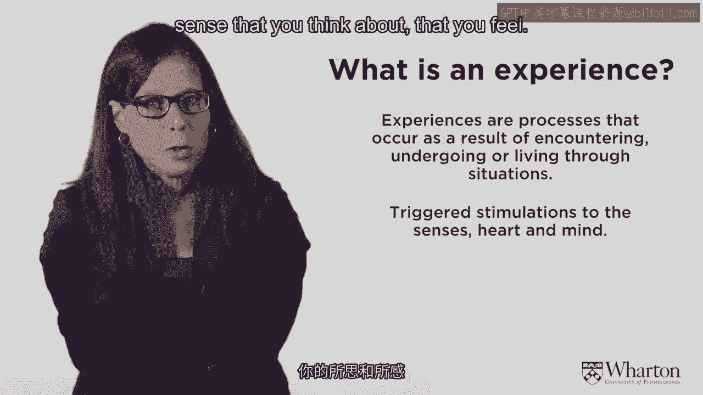
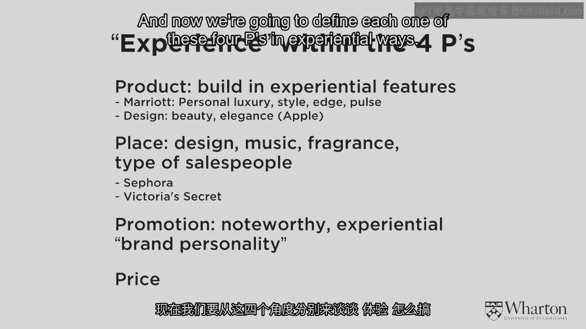
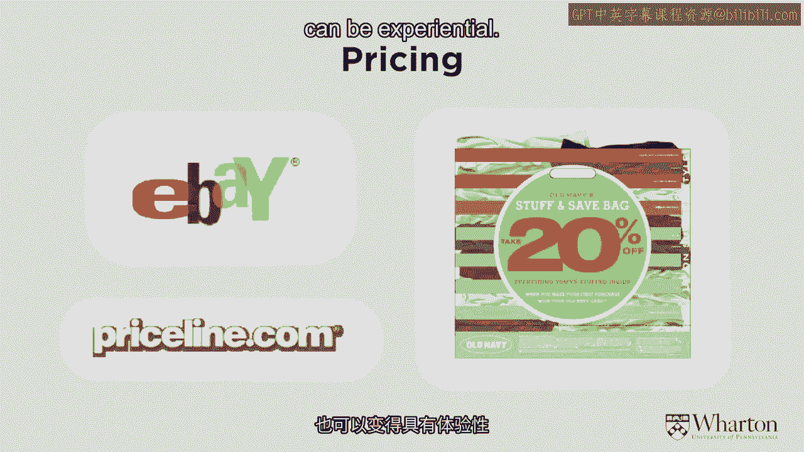
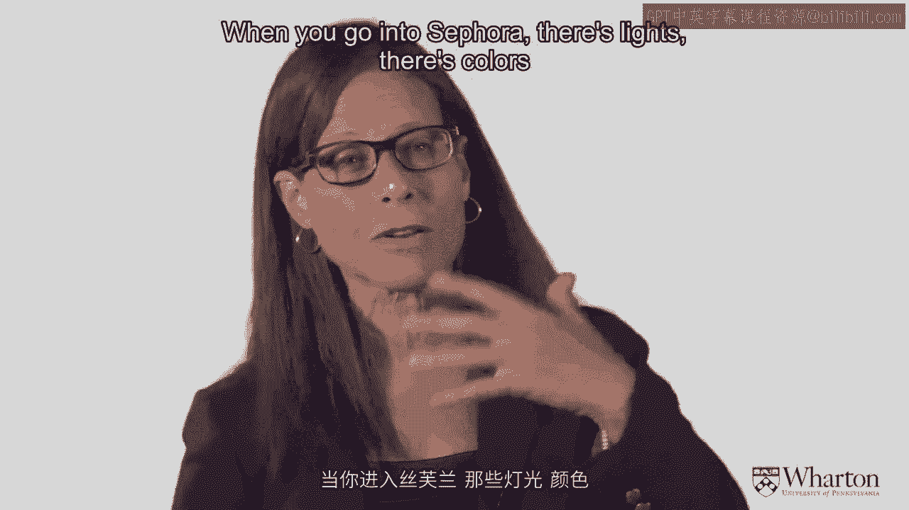
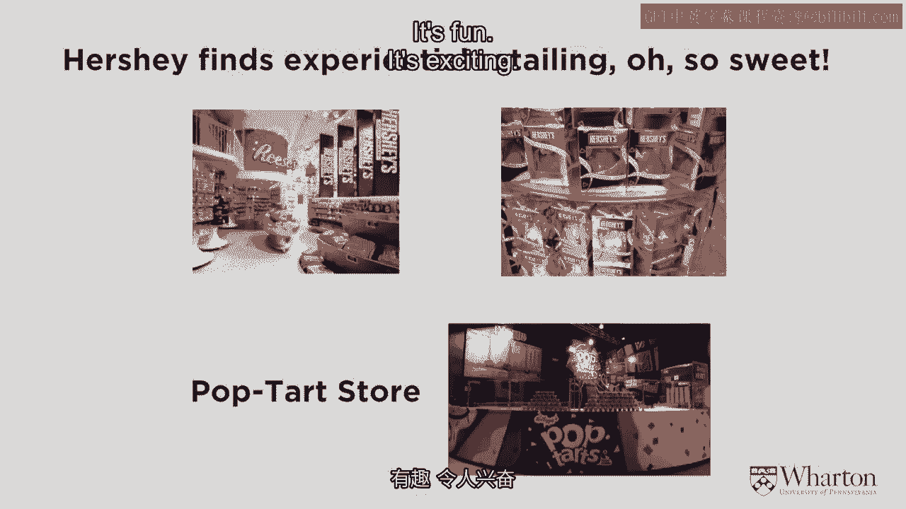
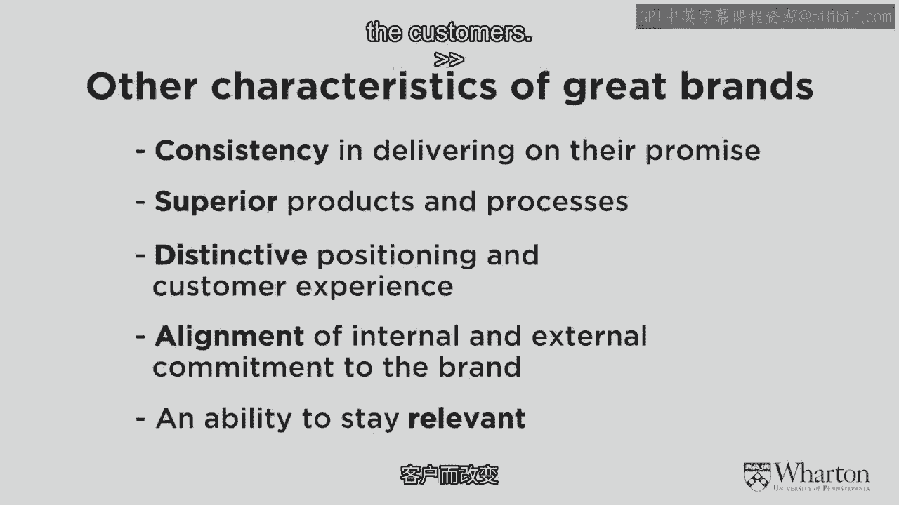

# 沃顿商学院《商务基础》｜Business Foundations Specialization｜（中英字幕） - P7：6_体验品牌.zh_en - GPT中英字幕课程资源 - BV1R34y1c74c

So in this last segment， we're really defining what a brand is。

We talked about what marketing is。 We've talked about marketing strategy， competitive analysis。

customer value。 We talked about the idea of segmentation targeting and positioning。 And the core。

core concept of a good strong brand， which is brand positioning。

And brand positioning that's so sharp that you can define it in just three words in。

30 seconds as a brand mantra。 That's kind of where we've gone。

right down to a sliver of a sharp definition of what， brand is。 And in this last piece of this。

I want to talk about the notion of experiential brand。 When I talked about what is marketing。

and we talked about things changing from seller's。

market to a buyer's market to the connected community， in the connected community， that's。

when this notion of customer experience comes in。 And brands like just general markets and customers' experiences also have become very experiential。

So it's not enough to justify a brand in terms of a crisp， clear brand mantra and a， crisp。

clear brand positioning。 But you also have to define all of the experience that exists around the brand。

What's the smell of the brand？ What's the feel of the brand？

All sorts of other things now become part of what the brand is in this new experiential。

world that we live in。 So what's an experience？ An experience is a process that occurs as a result of living through a situation。

undergoing， that situation。 So it's not just a moment in time。

It's a dynamic notion where you sense or feel this experience。 I'm going to define it later。

You'll see that it involves all the senses。 It's social， it's behavioral， it's cognitive。

it's emotional。 It's stimulations that are triggered to the sense that you think about。

that you feel。

They connect the company and the brand to the customer and they place the customer action。

and the individual's actions and personal occasions in a broader social context。

So the experience includes all of these kinds of things。

What I've been talking about up to this point really is pretty rational。

And here's where we bring in the emotions and all these other things。

And I know those of you who know and love brands really understand that brands are emotional。

they're experiential。 They're not just this hard and fast cognitive point of view。

And so that's what I'm emphasizing here on the point I want to end with in this section。

that a brand is an experience。 And so the things on the left are important。

I'm going to talk about those， but they all have to be augmented to be bigger than that。

and to embody this experience or emotional piece。 So we talked about differentiation。

That's a principle of marketing to be differentiated， the point of difference。

But now in today's brand， these rich brands are not just differentiated， they're experientially。

differentiated。 So the differentiation is also in the brand experience。

It's not just a single promise， it's a relationship。 You feel towards a brand。

the brands that you just love， if you're an apple lover or。

you're an Abercrombie lover or something， you have a relationship with that brand。

It's over time and it defines you。 It's not just brand attributes。

these cognitive that or these performance attributes or these， product attributes。

It's a personality。 You think of a brand almost as a friend。 It's not static， it's dynamic。

It's not a mass brand because you're co-creating with the brand。

The brand becomes very individualized， becomes very relevant to you。

You're not just aware of this brand， you're aware of how this brand fits into your life。

So you can see by the types of words that I'm saying that really， really strong brands。

embody all of this emotional experience。 And so when you define these terms。

these things that I've mentioned earlier and you， don't just think about brand positioning。

You think about experiential brand positioning。 So what does the brand stand for？

And it should be a multi-sensory strategy。 When you think about brand positioning。

experiential brand positioning， you not only want to think， about what the DNA is。

what the brand mantra is， you want to think， what's the smell of， the brand？

What's the color of the brand？ What's the emotion you feel when you think about the brand？

That's a brand positioning and experiential brand positioning。 And it needs to be。

as any kind of differentiation is， it needs to be distinct from everybody， else's。

so you don't want， all hotels don't smell the same， all soaps don't smell the， same。

They have different experiences。 And then the brand promised， the mantra， again。

it's not just three words， you know， cognitive words。

It also needs to describe what that brand promise is in experiential terms。

And here's where I'm going to be very clear of what I mean by experiential。 It needs to have senses。

so it needs to be what's the vision of it， what does it look， like， what does it smell like。

Maybe what does it taste like， what does it sound like。 Is there music associated with it。

what does it feel like， what are the senses。 And then when I say feel here， what I mean is emotions。

How do you feel about it？ Is it a happy brand？ Is it a sad brand？ Is it a tragic brand？

What are the emotions you feel with this brand？ What do you think about it？

And that's what we've been talking about。 How does it make you behave or act？

And relate refers to the social environment。 What people， what social context。

what culture do you consider or do you put this brand in？

And all this experiential aspect of the brand should be in all channels。

All channels should have an experiential component to it。 So just to go over those again。

the sensuous is across the five senses。 You wouldn't have a consistent experience。

The feel part are the emotions。 You should appeal to the customer's inner feelings and build strong emotions to it。

The cognitive is the intellect， the thought process， the intrigue， the surprise， whatever， it is。

the thoughts。 The behave is the way how people act around it。 It can be inspirational。

It can cause you to enact a certain way。 And social is the part of the social system。

the culture that surrounds the brand。 And you want to have these experiential functions delivered through the four P's。

We're back to the four P's。 The product， the place， the promotion。 Only now and the price even。

And now we're going to define each one of these four P's in experiential ways。

So let me just give you examples。 All of you know about， I'm sure you've seen a self-designed。

customized Nike。 It's not just a product that you're in but anymore。

It's a shoe that you can co-design， co-create。 You're part of the process that makes it very experiential。

You choose what you want in your shoes。 You choose what you want in your greeting cards。

Like I said， millennials are very much thinking like this。 They should be part of。

They should co-create the product。 That's an experiential notion of a product。

Advertising that's experiential， I think one of the ones who was a beginner really understood。

this was Apple。 When Apple would show their iPod when they were first coming out。

it was a very experiential， ad。 It was music。 It was dance。 It was， you know， you felt it。

The little white earbuds that came through was a color， was a design。 So you can see advertising。

This is traditional advertising。 The online advertising， mobile advertising is very experiential。

very interactive now。 I think that's what most people are now just assuming most advertising is that way。

When you're watching ads on the Super Bowl， you have your second screen there and you're。

interacting with it， that's very experiential。 What does it mean to experience price？ Well。

eBay certainly showed us that。 You know， with auctions。

Sometimes people will give you a bag and say anything you can put in this bag， you'll， save 20%。

And it makes price something that you're creating。

I'm not deciding what you're going to save 20% on。 You decide what fits in the bag。

Or even the concept of priceline。com where you kind of name your own price。

That's very much an experiential notion around price。 Even something as cognitive as price。

which is numbers， can be experiential。

And finally， channels。 You're seeing stores。 You're seeing online become very experiential。

These beautiful flagship stores， if any of you've seen Ralph Lauren's Mansion in New York。

City or in Paris or in Milan。 These are stores where in Ralph Lauren， for example。

they build an entire house， the entire， lifestyle。 People who wear Ralph Lauren clothes。

what kind of house would they live in？ What kind of furniture would they have？ And it's very。

very experiential。 Not just a store with clothes on a rack。 There's stores in the experience。

in the context that you're going to live and wear them。

Sephora is another experiential store。 When you go into Sephora， there's lights， there's colors。

there's smells。

People are touching you， they're putting things on。

This is how cosmetic should be。 It's not hidden behind a counter and you can't tell anything and you've got to get a sales。

person to come and get you。 That is not experiential。 You want to go and feel the colors。

put them on， see them， smell them。

That's experiential and that's what a lot of retail is happening。

And the very best retailers understand that。 If you go to Times Square in New York。

you'll see like incredibly， incredible candy stores， that are very experiential。

There's a pop-top store。 There's an M&M store。 You go into that store and the candies are everywhere。

The colors are everywhere。 You can taste different kinds of things。 It's a lot of fun。

It's almost like an amusement park。 That's what retailing has come to be。 It's fun。

It's exciting。 It's experiential。 And that's what we're talking about。 And all of these， by the way。

are within the DNA of the brand。 This is not random experience。

This is not things that are not extremely well thought out。

Each one of these pieces is delivering to the brand mantra in an experiential way through。

these four pieces。 This is what's happening in brands。

The very best brands are brands that you understand， that you live， that you experience。

and that you tell your friends about。 They're brands。

Some people think about these new kinds of experiential brands as religion。

It's like a religious experience。 And we certainly saw that when Steve Jobs passed away。

People went to the Apple Store and put flowers in front of the Apple Store。 That was his church。

That was a memorial。 These things， brands have taken on very new meanings， these global brands。

in today's world。

And so， just as a conclusion to this whole section， wrapping up everything I said， if。

you've got a strong brand， a strong brand makes clear promises。

Clarity is very important and it has to be dynamic。 These promises have to be kept over time。

You have rich， unique brand equity， strong emotions， strong thoughts with it。

And they're delivered dependably and consistently。

And strong brands have really loyal customers who help spread the brand message。

Weak brands on the other hand are vague。 They changed。 You never know what they're going to do。

There's no consistency。 There's no commitment。 There's no， it's a very spotty reputation。

There's doubt about it。 You never know what it is。 Pricing can change。 You know。

one time it looks like this， another time it's shoddy quality。 Those are not strong brands。

Consistent clear promises are what make very strong brands。 The other character's great brands。

as I said， is consistency。 Every time you get a product experience under this brand name。

it's the same。 You expect it。 It meets your expectations。 Very important。

Branded products tend to be superior products。 You're not just delivering a lukewarm tea。

You're delivering something that meets specific customer value。 It's distinctive。

A strong brand doesn't melt into another brand。 There's a very big difference between Disney and McDonald's。

You don't get them confused。 You don't get Coke and Pepsi confused。 They are very。

very distinct brand positioning and distinct customer experiences， even if。

the product itself might be somewhat similar。 Brands are aligned。

What is shown externally is aligned internally in the organization。

When you have a market leadership strategy， it not only indicates what your marketing strategy。

should be going forward， but it indicates what kind of organization you're going to have。

what the priority of your resources are going to be， how you allocate those resources， etc。

And it's very important， and we'll talk about this in the last section， for your brand to。

stay relevant。 Markets change， times change， customers change。

A great brand is flexible and adaptable and changes with the customers。

[MUSIC]。

