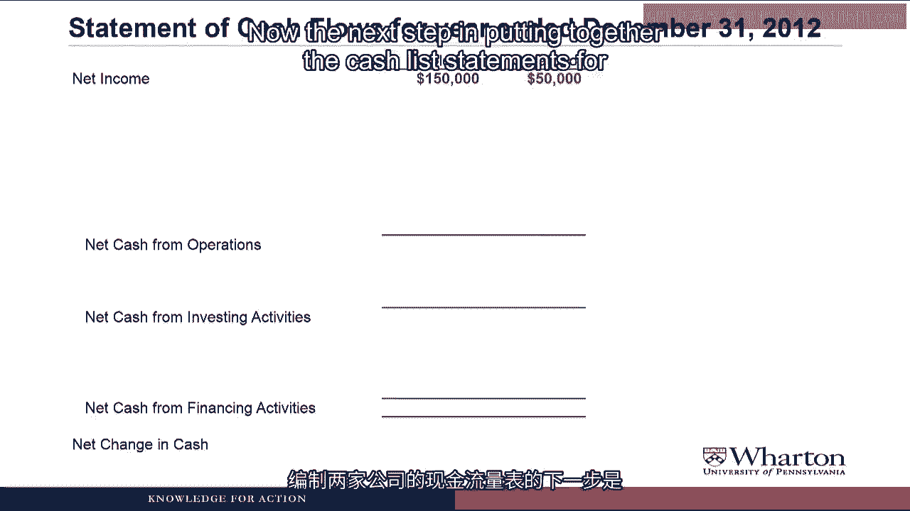
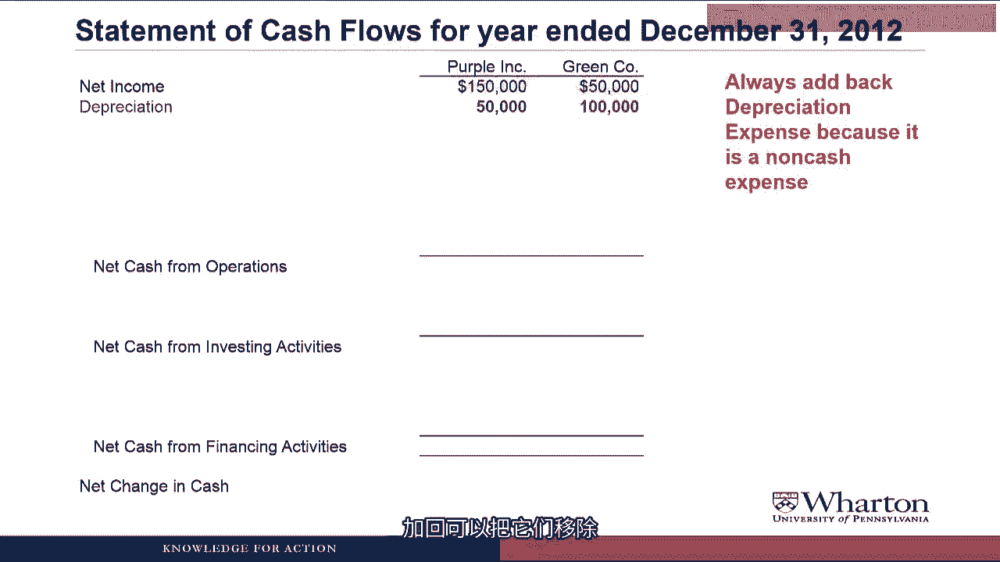
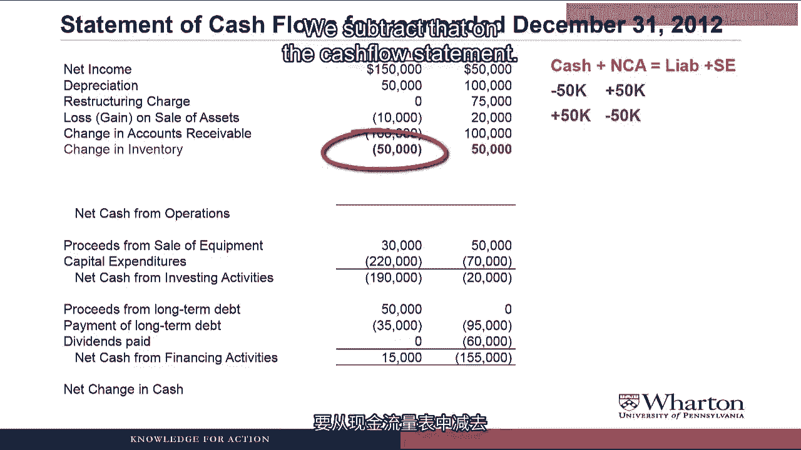
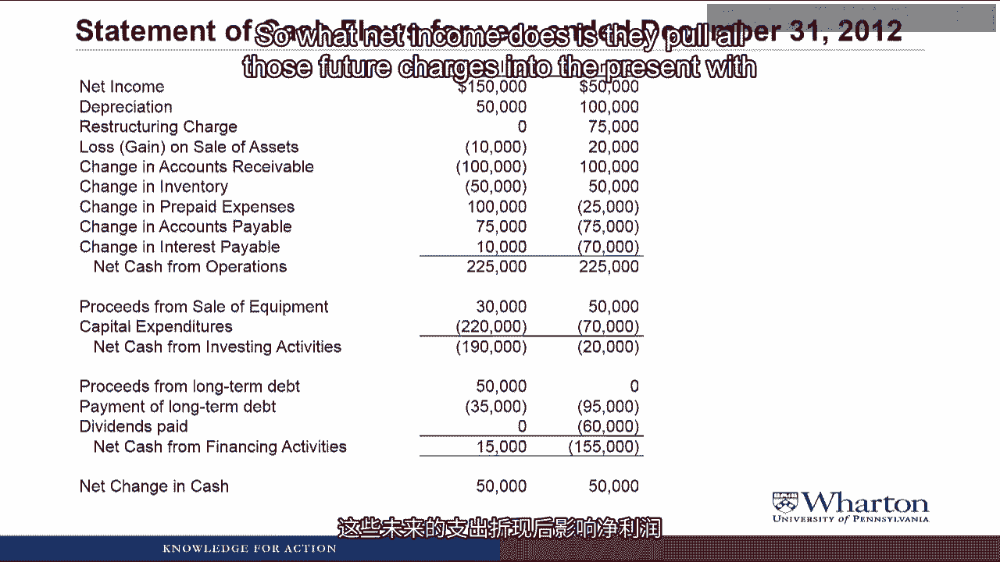
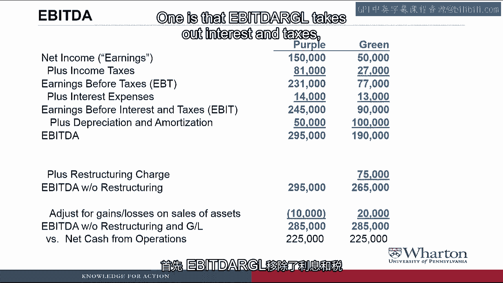

# 沃顿商学院《商务基础》｜Business Foundations Specialization｜（中英字幕） - P70：22_3 3 2 现金流量与 EBITDA 示例.zh_en - GPT中英字幕课程资源 - BV1R34y1c74c

Hello and Professor Brian Buchay， welcome back。 In this video。

we're going to look at a couple of made-up companies， Purple and Green。

which have very different net incomes， but exactly the same cash flow。

It will give us some more practice at putting together cash flow statements under the indirect method。

But more importantly， it will allow us to talk more about the differences between net income and cash flow。

and it will give us some practice in doing a complete analysis of a statement of cash flows。

Let's get started。 To put together cash flow statements for Purple Incorporated and Green Company。

we of course have to start with net income。

So here are the income statements for both Purple and Green。

We can see that Purple has 150，000 of net income， Green has 50，000。

So when we start on the statement of cash flows， that's going to be the top line。

the net income for Purple and the net income for Green。

Now the next step in putting together the cash flow statements for these two companies would be to look for non-cash charges like depreciation。

If we go back to the income statement， you don't see depreciation anywhere here。

That's because it's lumped in with cost of goods sold。

So what I'm going to do is give you some additional information that you'll need to solve this problem。

And the first piece of additional information is the depreciation for the two companies。

So Purple had 50，000 of depreciation included in cost of goods sold。

Green had 100，000 of depreciation included in cost of goods sold。

Under the indirect method， we add those two back。 They're non-cash expenses， so to remove them。

we have to add them back。

Now there's actually another non-cash expense for at least one of these companies。

and that's an expense due to restructuring。

So Purple had no restructuring activity in 2012。

Green recognized the 75，000 liability due to restructuring in 2012。

but did not pay any cash on that liability during the year。

Excuse me。 What is this restructuring liability？ Why is an expense recognized before any cash is paid？

This is the conservatism principle in action。 So we talked about this in prior videos。

but the conservatism principle says that when a company anticipates future losses。

they have to recognize an expense for them today。 So in this case， Green has decided to restructure。

They have a restructuring plan which will involve laying off employees and incurring employee severance costs。

closing facilities and incurring facility closing costs。

and they have to recognize an expense for the total amount of those estimated cash costs today。

and then create a liability that will represent the obligation to pay those cash costs in the future。

To reinforce this point， let's take a look at the journal entry Green would make when they record this restructuring liability。

They debit restructuring expense for 75，000。

That represents the amount of expected future cash flows they're going to spend in the restructuring。

which they're required to recognize an expense in the year they make the decision to restructure。

They credit the restructuring liability for 75，000。

which of course is the obligation to pay that cash in the future。

Notice there's no debit or credit to cash here， so this is a transaction that has no cash impact。

So we treat the restructuring charge like depreciation。 It's a non-cash expense。

so to remove the non-cash expense we add it back to get from net income to cash from operations。

Next， both companies had proceeds from selling equipment during 2012。

Purple sold equipment for $30，000， which included a $10。

000 gain over the book value of the equipment。

Green sold equipment for $50，000， which included a $20。

000 loss over the book value of the equipment。

Now I'm going to show you the journal entries here just to make clear how this works。

We're going to revisit this topic later in the course。

So what Purple would have done is debit cash for $30。

000 because that's how much cash they're receiving。

They have a gain on the sale， which is a credit。 It's like a revenue。

It increases net income and increases stockholders' equity， so you credit gain on sale for $10，000。

And then they would credit net property plan and equipment to take the PP&E off the books at its current book value。

What is an "P。P。&E" account？ Do they even have these in the real world？ No。

they don't have net PP&E accounts in the real world。

I'm just using this as a simplification for now。 In the real journal entry。

what you have to do is credit the building account for the original cost of the building。

and debit the accumulated depreciation account for all the depreciation that's accumulated so far in the building。

We'll see that journal entry in a couple weeks， but for now I'm trying to keep things simple。

so I created a net PP&E account。 Sorry。 Now let's look at the journal entry for green。

They would debit cash for $50，000 because they're receiving $50，000 cash。 They debit loss on sale。

The loss is just like an expense。

It reduces net income， reduces stockholders' equity。

So that leaves us with a credit to net property plan equipment。

The original book value of the equipment that was sold was $70，000。 We only got $50，000 cash。

which is why we got a loss of $20，000。

Now going to the statement of cash flows， what we want to do is take those two debits to cash。

the $30，000 and the $50，000。

and show them under investing activities as proceeds from sale of equipment。

But then to avoid double counting， we need to remove the gains and losses from the operating section。

So for purple， they had a gain of $10，000。

We subtract that gain to remove it from net income to get to cash from operations。

For green， they had a loss。 We need to add that loss back to remove it from net income to get to cash from operations。

By taking out the gains and the losses， we avoid double counting the cash flow and operating。

We've already recognized that cash flow in investing。

I believe the viewers would be more entertained right now if you did the Okey POTY again。 I suppose。

here it goes， for purple， you put the gain in， you take the gain out， you put the gain in。

and you shake it all about。

You do the Hokey Pokey and you turn yourself around。 That's what it's all about。

Now for green， you put the loss in， you take the loss out， you put the loss in。

and you shake it all about。

You do the Hokey and you turn yourself around。 That's what it's all about。

Next item， both purple and green spent cash flow on capital expenditures buying things like property plant equipment。

Purple had 220，000 of CapEx。 Green had 70，000 of CapEx。

So we know that CapEx is an investing， or is it CapEx are an invest in activities。

CapEx is or CapEx are。

You Americans have no idea how to use the correct verb tense。

You say England is eliminated from the World Cup， when everyone knows the correct version is。

England are eliminated from the World Cup。 Please move on。 Okay。 Anyway。

we put a line in the cash from investing activity section where we show the capital expenditures for both purple and green。

Next we have a number of financing activities that two companies did during 2012。

Purple received $50，000 proceeds from issuing long-term debt。

They made $35，000 of payments on their long-term debt， and they didn't pay any dividends。

Green did not issue any new debt。 They paid back $95，000 of their existing long-term debt。

and they paid $60，000 of dividends to their shareholders。

These are all financing activities。 So in the statement of cash flows。

we just put a line item for each activity to show the proceeds and payment of long-term debt。

and the dividends paid for the two companies。

So now we're done with the investing and financing sections of the statement of cash flows。

So we're going to go back and work on the rest of the operating section。

I'll give you the changes in the working capital accounts。

and we'll go ahead and put those in the cash flow statement。

So for accounts receivable， purple had an increase of $100，000 during 2012。

whereas green had a decrease in accounts receivable of $100，000。

So to know whether to add or subtract these， we need to use the balance sheet equation。

cash plus NCA equals liabilities plus Docklars' equity。

Excuse me。 What is NCA？ Sorry， NCA stands for non-cash assets。 Starting with purple。

their accounts receivable went up， so that's an increase in a non-cash asset。

which means we have to subtract it on the cash flow statement。

The intuition here is that they made more credit sales than they had cash collections。

so they're booked some revenue that was non-cash， and we have to subtract out the increase in accounts receivable as the non-cash portion。

For green， their accounts receivable went down by $100，000。 It's a non-cash asset going down。

so we add that back on the cash flow statement。

The intuition here is that their cash collections were greater than their new sales。

which must mean that they were collecting based on prior sales in addition to whatever they collected this period。

Next， purple had an increase in inventory of $50，000。 Green had a decrease in inventory of $50，000。

So starting with purple， inventory goes up， non-cash asset goes up。

we subtract that on the cash flow statement。

What must have happened here is purple bought more inventory than they sold with the amount of inventory they sold represented in net income。

For green， their inventory went down， so that's a non-cash asset going down。

We add that back on the cash flow statement to stay in balance。

and what this means is that green actually sold more inventory than they purchased。

So not only did they sell whatever they had this year。

but they tapped into the inventory at the beginning of the year and sold some of that as well。

So that's an extra source of cash flow by selling the inventory from the prior period。

Purple had prepaid expenses， which decreased by $100，000。 Green's prepaid expenses increased by $25。

000 during 2012。

So for purple， prepaid expenses go down and non-cash asset goes down。

we add that on the cash flow statement。

For green， non-cash asset goes up by $25，000 as prepaid expenses increase。

we subtract that on the cash flow statement。

For accounts payable， purple had an increase of $75，000 in 2012。 Green had a decrease of $75。

000 in 2012。

Now we're on the other side of the equal sign， so for purple， accounts payable goes up。

That means liability goes up by $75，000。 So we have to add that to the cash flow statement to stay in balance。

Intuition here is that if your accounts payable are going up。

that's money that you're not paying to your suppliers， which is a source of cash。

For green， their accounts payable went down， their liabilities went down。

and so we have to subtract that on the cash flow statement to stay in balance。

What happened here is green actually paid more cash to their suppliers than they acquired new inventory on account。

and that actually makes sense because we actually saw their inventory reduce。

so those two often go together。

Inventory as a source of cash is often accompanied by accounts receivable as a use of cash as you're paying off more creditors than you're adding in new accounts payable。

Finally， for interest payable， purple had an increase of $10，000 in 2012。

Green had a decrease of $70，000 in 2012。

So for purple， we have an increase in interest payable as an increase in liabilities。

so we add that to the cash flow statement。

For green， we had liabilities go down by $70，000 as interest payable dropped。

We subtract that on the cash flow statement。

And once all is said and done， and we add everything up。

it turns out that purple and green have exactly the same cash from operations of $225，000。

So these companies have the same cash flow， but purple has three times the earnings as green。

What do we make of this？ Does this happen in the real world？ Yes， in fact。

I think it happened in episode four of the real world Honolulu。

but maybe I'm not remembering that correctly。 Anyway。

I'm going to go through now and do a detailed analysis。

and we'll talk about why these two numbers can be so different。

Now that we've put them together， let's take a look at these two cash flow statements in detail to see what we can learn by analyzing them。

First， for purple， we see a nice big cash from operations of $220，000。

most of which they're reinvesting in long-term assets。

We see they have capital expenditures of $220，000。

Their net cash from financing is slightly positive because for some reason they decided to run up their cash balance by $50。

000。

But this profile overall looks sort of like a growth maybe into a mature stage where you've got healthy cash from operations。

but most of it is being reinvested back into the business through cash for investing activities。

Now let's take a look at green。 Green had the same high cash from operations of $225，000。

but they're investing almost nothing in long-term assets。

Their capital expenditures were only $70，000， and they sold $50。

000 worth of equipment during the year。

So what are they doing with all that cash they're not investing？

They're actually paying off financing and paying dividends。

So we see a big negative cash from financing activities。

They're not borrowing anything new。 They're paying off a lot of long-term debt。

and they're paying dividends to their shareholders。

This is typical of a late-mature and decline stage company where the investments aren't there。

so they're taking the excess cash flow and paying off debt and returning it to shareholders through dividends。

Next， I want to take a look at the operating sections in more detail for these two companies。

Starting on the top line we have net income， and we see that purple has three times as much net income as green even though their cash operations are the same。

So is purple three times better than green， or are they the same company？ Well。

we can learn what's going on with this discrepancy by looking at everything between net income and cash from operations。

so all the things that cause them to be different。

The first big difference is depreciation。 Green has much more depreciation than purple。

Now one way that we can try to understand what this means is to compare depreciation and capital expenditures。

If you think of depreciation as using up old equipment。

whereas capital expenditures is buying new equipment。

it's an interesting comparison to look at the relative magnitudes。

So for purple they have 50，000 of depreciation， but 220，000 of CapEx。

indicating that they're growing dramatically。

They're investing a lot more in new equipment than they're using up old equipment。

When we look at green we see 100，000 of depreciation and only 70，000 of CapEx。

so green is not even investing enough to replace its existing use of equipment。

So that would indicate that green does not have a lot of good growth prospects。

The next big discrepancy is the restructuring charge， which green ended up taking during the year。

That's a non-cash charge， so it caused net income to go down。

but did not affect cash from operations。

In fact it's one of the big reasons why green had much less net income。

But it's also an indication of bad news， because the restructuring charge is an estimate of all of the future cash flows that green will have to pay to lay off employees。

pay employee severances， close facilities and things like that。

So what net income does is they pull all those future charges into the present with an expense。

whereas the cashless statement will only show those future cash payments as they happen down the road。

Finally we can look at all of the changes in working capital。

So for purple we see negative effects of change in accounts receivable and inventory。

which means those two accounts are growing。

Change in accounts payable is positive， which also means it's growing。

So this indicates that purple's business is growing substantially in terms of their working capital。

When we look at green， we see that accounts receivable and inventory was a source of cash。

because they've been liquidating or reducing their accounts receivable and inventory。

Their payables have also been going down。

And so this profile is again consistent with a company that doesn't have a lot of growth and may actually be reducing its size。

So putting it all together， it turns out that these movements in working capital due to the different growth stages happen to make the cash from operations the same this period。

But purple looks like it's the much better bet long term because it's throwing off a lot more net income and it doesn't have to do this restructuring down the road。

Last， I want to look at EBITDA for these two companies。

Remember EBITDA is earnings before interest， taxes and depreciation and amortization。

And what we see from the EBITDA is that purple has much higher EBITDA than green。

which means that EBITDA is really not picking up cash flow。

Because what we just saw in the cash flow statement was that the cash from operations was identical between these two companies。

Now of course if you think back to the cash flow statement。

one of the things that green had was a restructuring charge。

which is a non-cash charge like depreciation that needs to get added back。

So if we add back the restructuring charge so that we get EBITDA without the restructuring。

now the two numbers are closer。

Also if we go back to the cash flow statement， they had different losses and gains on sales of assets。

That's part of earnings but it should be an investing cash flow so we need to take that out as well。

So why don't we adjust for the gains and losses on asset sales and when we do that。

then we get EBITDA that's identical between the two companies。

Although I guess since it's EBITDA without the restructuring and the gains and losses。

we should call it EBITDAARGLE。

I believe that you simply made up the term EBITDAARGLE。 Does anyone use that term in the real world？

Excuse me， I am the real world guy。 So does anyone use the term EBITDAARGLE in the real world？

I believe we should stop asking you silly questions so you can tell us。

What is the best measure of cash flow？ Yes， I did make up the term EBITDAARGLE。

Probably the only people that use that term in the real world are my former students and they probably only use it once。

get laughed at and then stop using it again。 But I want to raise the point with this EBITDAARGLE term that people often say EBITDA but they don't literally mean earnings before interest。

taxes， depreciation and amorization。 Because if there's other non-cash expenses or gains and losses from investing activities。

they'll take those out as well and still call it EBITDA。 So before you use EBITDA。

you've got to know what's in the measure。 So one more point I want to make before we wrap up the video。

We see that the EBITDAARGLE is identical between purple and green。

And we saw that the cash moparations was identical on the cash flow statement but the cash moparations was less than EBITDAARGLE。

So there's two reasons for this discrepancy。 One is that EBITDAARGLE takes out interest in taxes。

whereas the cash flow statement number includes cash taxes and cash interest。

The second discrepancy is that of course the net cash moparations adjust for changes in working capital。

whereas EBITDAARGLE doesn't。

So to get a really good cash moparations number， I would suggest one of the two following approaches。

Either calculate EBITDAARGLE and then adjust for all the changes in working capital。

or take net cash moparations， and then add back the cash interest and cash taxes to remove those two。

But you have to do one of those two approaches taking either EBITDAARGLE on its own or net cash moparations on its own is not going to give you the number you want if you're going to take this and put it into a free cash flow model。

I hope that gives you some sense of the things that you can learn by doing an analysis of the statement of cash flows。

And I hope it gives you some caution in using this EBITDAARG measure that everyone seems to like。

even though it has a lot of drawbacks。 And while， look at that。

We're already done with the week on cash flow statements。 Where has the time gone？

I'll see you next time。 See you next video。 [ Silence ]。
