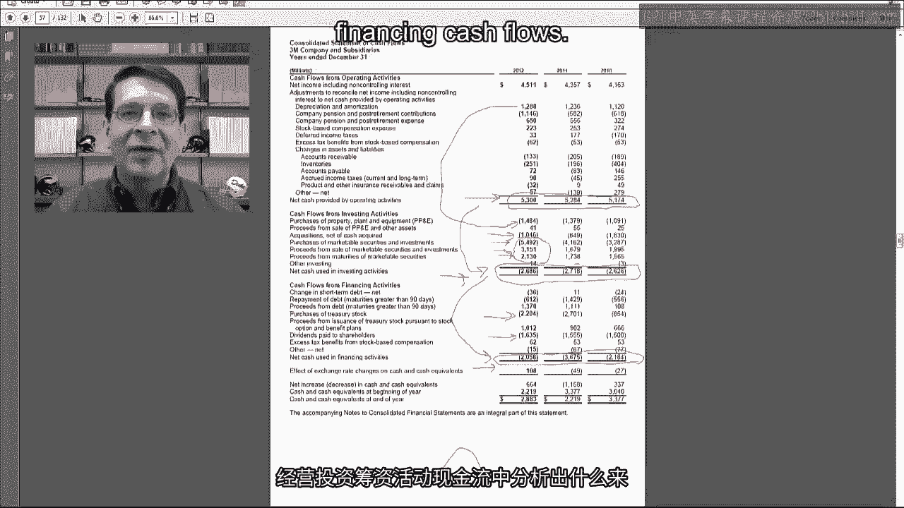
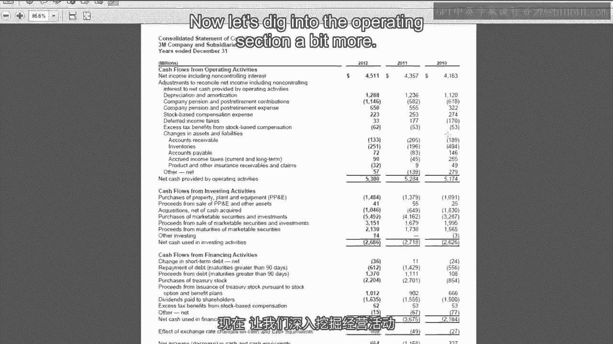
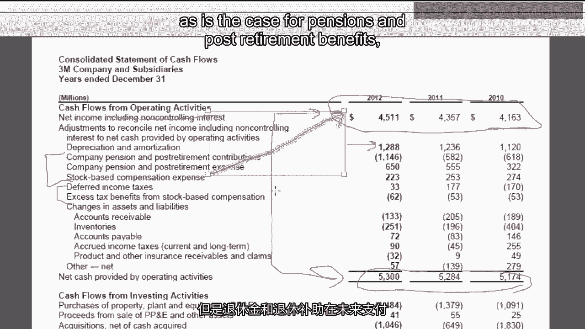
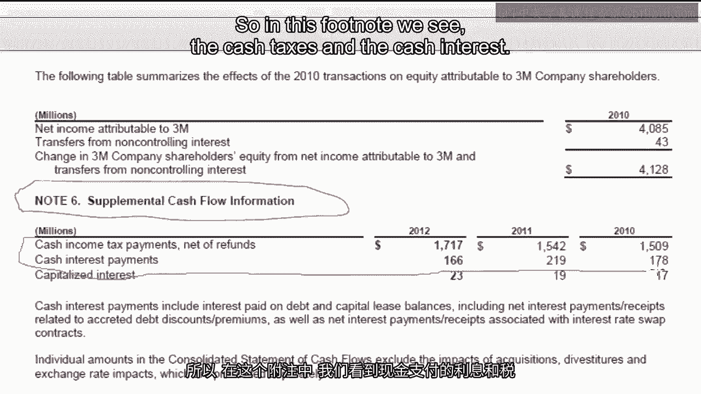
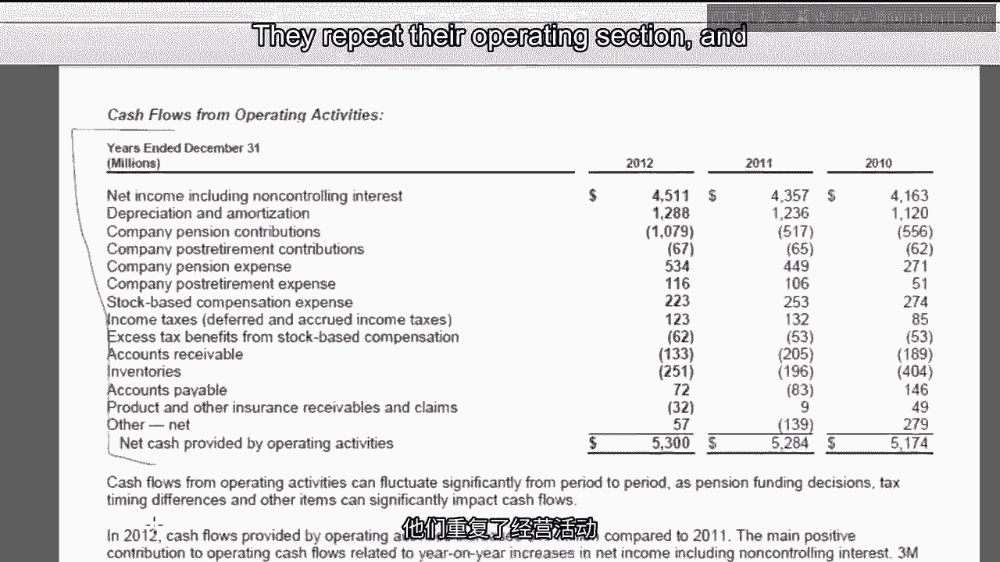

# 沃顿商学院《商务基础》｜Business Foundations Specialization｜（中英字幕） - P71：23_3 4 3M公司现金流量.zh_en - GPT中英字幕课程资源 - BV1R34y1c74c

Hello， I'm Professor Brian Buchay。 Welcome back。 In this video。

we're going to end our week looking at cash flows with a look at the。

3M company's cash flow statement。 We're going to take a look at their actual statement。

plus the supplemental disclosures， about the statement in the footnotes and the discussion of the cash flow statement in。

their management discussion analysis or MDNA section。 Let's get started。

The 3M statement of cash flows is on page 51 of their annual report。

First thing I like to look at is this breakdown of operating， investing， and。

financing activities to see what kind of stage or life cycle the company is in。

So 3M throws off about 5 billion of cash from operations every year。 It's pretty steady。

They have cash outflows from investing activities of about 2。6 billion every year。

They also have net financing cash outflows of about 2 billion other than a blip in 2011。

So this is sort of the classic mature company profile。

You've got products that are essentially cash cows。 They're just throwing off cash。

Things like Post-it Notes and Scotch tape。 Things that we can't do without。

They're still reinvesting a moderate amount back into the company back into long-term， assets。

They're more in a second。 They are net cash outflows for financing。 So they don't have to borrow。

They don't have to raise money to fund their operations or their investments anymore。 Instead。

their operations are able to fund all of their investing activities and still。

throw off some cash that they can use to pay off debt or repurchase equity or pay dividends。

So just to get some more insight into this， one thing that's often good to look at is。

comparing depreciation to purchase as a property plant equipment。 Again， it's very rough。

But if you view depreciation as using up your fixed assets， capital expenditures obviously。

is acquiring new ones。 It looks like 3M's add about replacement level。

So they are investing a lot in new PPE。 But it's sort of replacing the things that they're using up。

They do have those some active acquisitions， so about a billion or so in 2012。

And then there's a lot of activity with marketable securities。 So they bought about 5。

4 billion of marketable securities， but then they sold or had those， almost all mature within 2012。

So I think what happens is 3M is throwing off a lot of cash if they don't immediately。

have an acquisition in mind or immediately have purchased a property plant equipment。

they plow it into marketable securities and investments。

And then when those opportunities to make an acquisition or buy PPE come， they liquidate。

the marketable securities and use that to go out and make their acquisition。

So it's almost like they're serving as their own bank by buying these marketable securities。

holding their cash， getting some return， waiting until they can invest it。

And then in the financing section， we see a lot of the financing cash outflow is purchase。

of treasury stock。 That's probably for stock options。

And then there's a big dividend that they pay to shareholders， which again is another。

example oftentimes of a mature company that if you don't have a full set of investments。

that you can plow your cash back into， you may as well just pay it back to your shareholders。

and let them reinvest it somewhere。 I think you're ready to do these kinds of life cycle or growth analysis on your own。

So here's what I want you to do。 After the video's over， go on the internet。

find a firm that you're interested in， take， a look at their cash flow statement and see what you can learn by looking at the companies。

operating， investing and financing cash flows。

Now let's dig into the operating section a bit more。

So we start with net income， ignore the non-controlling interest stuff for now and just view it as。

net income。 They study growth and net income， indicating that they are consistently able to price their。

products enough to cover the cost of running the business。 And typically a mature company。

you have this steady profitability that steady profitability， turns into steady cash flows。

So very mature， well-performing， humming along nicely company。

One of the big discrepancies between net income and net cash and operations is depreciation。

and amortization。 Now remember that's not a source of cash， even though it looks like it here。

Remember depreciation reduces net income。 It's non-cash so we have to add it back to get to cash and operations。

Fairly big number for 3M because it does a lot of manufacturing and manufacturing companies。

tend to have high depreciation and amortization。 And we have a number of other non-cash expenses。

So things like pension， stock-based compensation， and we have some different taxes and excess。

tax benefits。 So first the pension and post retirement contribution， stock-based compensation。

These are things we recognize as expenses now， which means they're part of net income。

But the cash is either paid in the future， as is the case for pensions and post retirement。

benefits， or the cash really isn't paid as it is for stock-based compensation。

Although part of it is you're buying back treasury stock to use to satisfy options。 But in any case。

there's no cash flow this period for these expenses。

And we'll talk more about the stock-based compensation later on。 The pensions and post retirement。

that's beyond the scope of this course。 You'll have to come and take my course at Wharton。

my elective to see more on pensions， and post retirements。

The deferred taxes we'll obviously get to later in the class。

So then we get to the section on changes in assets and liabilities。

These are the changes in working capital。 And what we see is the big chunk here are accounts receivable and inventory are negative。

So let's think about what that means。 Negative number on the operating cash flow under the indirect method means that these。

amounts must be going up on the balance sheet。 Councillor Seawill goes up as a non-cash asset to stay in balance。

We have to subtract it on the cash flow statement。 And yes， even though you can't see it。

I am doing up and down arrows with my hand。 Inventories go up on the balance sheet。

non-cash asset going up。 We have to subtract that on the cash flow statement。

Bad news payable is also going up。 Now remember that's a liability。 So if accounts payable。

a liability increases。 It's on the other side of the balance sheet equation。

We have to increase it on the cash flow statement。 So these could represent either good or bad news。

Bad news scenario would be our customers are not paying us。

We're having trouble selling our inventory。 We're having to stretch our payables。

It's probably not the case here given the nice growth and profitability that's going， on。

And so a more likely story is it's still a growing company。

So during the year we're making a lot of credit sales at the end of the period。

We're building inventories and anticipation of future sales。

We are getting more raw materials at the end of the year in anticipation of production。

And so based on other things I've seen， it probably is a good news scenario that this。

is representing growth and working capital rather than bad news where you can't collect。

receivables and you can't get rid of your inventories。 So overall from the face of the statement。

it looks like a mature company that still has， some growth potential。

Now we're going to look at some other sections to try to get some additional information about。

what's going on with cash flows。 And yes， while you're looking at those cash flow statements that you downloaded from the。

internet， you should also take a close look at the operating section。 Look at net income。

look at cash operations and look at all the things that cause differences。

between the two to see what kind of items that you would have questions about or want。

to learn more about to understand why the company's net income is different from its cash flows。

Now I've jumped ahead to page 69 where we have footnote 6 which is supplemental cash。

flow information。

So if you remember back to the first video of the week， I said that there has to be a。

disclosure of cash taxes paid and cash interest payments。

And as we talked about in I think the second to last video， that disclosure is there。

So if people want to remove cash interest and cash taxes from operating cash flow， they。

have the number。 So in this footnote， we see the cash taxes and the cash interest。

So if you want to start with the cash operations and the cash flow statement in terms of doing。

some kind of valuation to measure operating cash flow but you don't want tax or interest， in there。

you can pull those numbers out using this disclosure。

One last section to look at related to cash flows is in the management discussion and。

analysis which is on page 36。 Remember， this is the MD&A is the section where 3M management is supposed to provide。

their own narrative to explain what happened during the year。

So it will give us more insight into some of the numbers that we saw in the cash flow statement。

They repeat their operating section and talk about what happened in terms of their cash。

flows during the year。 The big reason for the year and year increase in cash flows is net income went up。

They do note that accounts receivable inventories and payables increased by 312 compared to。

increases of 484 last year but they really don't talk much about what happened with that。

Then at the bottom of the page they disclose free cash flow。 As I said a couple videos ago。

this is a voluntary disclosure。 Notice it's labeled as a non-gap measure。

That means that there's no requirement by the SEC or the FASB to provide this measure。

which also means there's no standardization。 Companies can define this measure however they want and when they do that they have to。

alert investors and analysts that this is a non-gap measure so it's not standardized。

So remember free cash flow is supposed to be operating cash flow minus investment in the， future。

So we've got net cash operations from the cash flow statement as 3M's operating cash。

flow and then they use purchase of PP&E as their measure of investment in the future investing。

in new property plant equipment which gives them a pretty high free cash flow。

And there's actually a pretty good definition。 I've seen a lot worse。

There's a pretty good definition of free cash flow but again before you would use this number。

you want to make sure you know it's in the definition and that you're comfortable with， it。

On the next page we have cash from investing activities and what they've done here is。

they've netted all the marketable securities action into a small number so instead of showing。

on the face the 5 billion they bought and then almost 5 billion they sold they just show。

a net number。 So it really highlights that the big drivers of cash out flows were purchased the PP&E。

and acquisitions。 And they tell you the PP&E is expanding manufacturing capacity in key growth markets especially。

international like China， Turkey and Poland and so we can see that they do still have growth。

opportunities and a lot of those growth opportunities seem to be international。

For acquisitions they refer us to node 2 you can go there and look I'm probably not going。

to jump ahead and look at that。

And then finally they talk about cash flows from financing activities。

So remember the big chunks here were proceeds from I'm sorry purchase of treasury stock。

and the treasury stock they say is for stock based compensation。

Now we'll talk about this later in the course but basically stock based compensation is where。

you award your employees either stock options or stock grants you could either issue new。

stock to satisfy that or what most companies do is they just buy back their own stock and。

then either sell it to employees or give it to employees under the stock based ownership。

plan or compensation plans。 And then the other big chunk here is dividends to stockholders 3M has paid dividends since。

1916。 So we're almost on 100 years of dividends and again just consistent with companies that。

are very mature products throwing off a lot of cash one thing they tend to do is they。

start paying dividends 3M started pretty early。 Not sure it was posted notes in 1916 and the thing about dividends is they tend to be sticky。

once you start paying them you always want to keep paying them if you ever cut them it。

would be viewed by the market as bad news。 So that's where we find all of the cash flow information in the annual report and that's。

going to wrap it up for our week on cash flow statements。

Hey I was going to say that well this does wrap up our week long look at the cash flow， statement。

I know it was difficult and there were some parts that didn't probably make a lot of sense。

right off the bat but the cash flow statement is a very important statement and we're going。

to be seeing it again and again and again as we look at more advanced topics and the more。

you see it the more you'll get the hang of it。 I'll see you next time。 [BLANK_AUDIO]。
