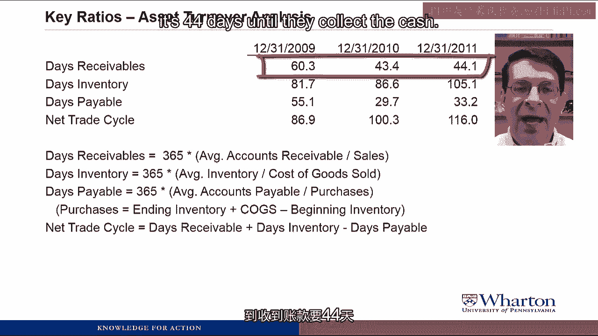
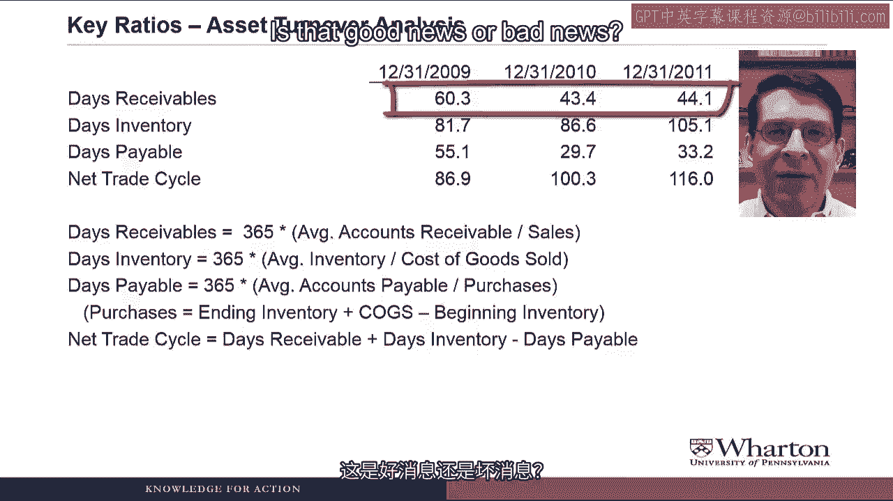

# 沃顿商学院《商务基础》｜Business Foundations Specialization｜（中英字幕） - P74：26_4 3 Plainview技术案例部分2.zh_en - GPT中英字幕课程资源 - BV1R34y1c74c

Hello and Professor Brian Michay， welcome back。 In this video。

we're gonna continue our ratio analysis， of plain view technology。

We've got a lot of ratios to get through， so let's get started。 Let's start by bringing back up。

the DuPont ratio analysis slide。

I've added a couple boxes to what we had last time。 Below return on sales。

we have some additional ratios。

that'll let us drill down into profitability， things like gross margin and various expense ratios。

And below asset turnover， we can look at turnover ratios for individual assets。

like receivables and inventory， and liabilities like accounts payable。

We're gonna start by looking at the profit margin ratios。

to try to figure out what are the drivers， of plain views profitability。

Most of these ratios are gonna come straight， from the common size income statement。

We're gonna look at gross margin。

which is sales minus cost of goods sold divided by sales， which gives us a sense of the markup。

of the selling price over cost。 We'll look at selling general administrative expenses。

to sales， so SG&A expense to sales， to get a sense for how much operating expenses。

are as a percent of sales。 The combination of those two is operating margin。

which is operating income over sales。 Then we'll also look at the ratio of interest expense。

to sales and something called the effective tax rate。

which is income tax is divided by pre-tax income。

Yes， yes。 We already saw all of these ratios。

of the common size income statement。 Will the entire video be this repetitious？

No， the whole video won't be repetitive， and it won't be repetitive either。

But these are the ratios from the common size， we looked at before。 We need to look at them again。

because to understand drivers of return on sales， we need to divide the various items。

on the income statement by sales as well。 Here are the profit margin ratios for plain view。

I have repeated all the definitions at the bottom。

I'm gonna put up the pause sign。 Why don't you take a look at the ratios。

and see what kind of things jump out at you。

One thing that leaps out at me is the steady increase。

in gross margin over the period。 Does anyone have any theories for what could explain。

this increase in gross margin？ Maybe the shifts to customized products。

and to customers in new industries， allow plain view to charge a higher price。

And it would certainly help that one large customer， does not have monotony power over plain view。

Ironically， plain view is probably afraid， to charge the defense contractor a high price。

for fear of losing the business。 No， you have it all wrong。

It is the shift to automation and the new technology。

that allowed plain view to reduce its manufacturing costs。

leading to a larger gross profit。 All excellent theories。

It could be that plain view is able to charge a higher price， for roughly the same cost。

And maybe that's by moving in new industries， or providing the customized products。

or by getting rid of the monotony relationship。 And monotony is the opposite of a monopoly。

where the customer has all the power instead of the flyer。

Or it could be something on the cost side。

where plain view is able to reduce costs， but charge around the same price。

So maybe it's the automation that's doing that， or it's the new technologies。

We're gonna have to look at a lot more ratios， to try to get more evidence。

on which of these theories is correct。

Let's look at the rest of the ratios。 The ratio of selling general administrative expenses。

to sales is completely flat over the period。

So as plain view has grown substantially， it's managed to keep its SG&A expenses in line。

and not have them grow faster than sales as a whole。 Then if we look at interest expense。

and effective tax rate， there's not much going on。 Interest expense is pretty flat。

And other than a blip a couple years ago， effective tax rate hasn't changed that much either。

- Could it not be the case， that a flat trend in SG&A would be back news？

If they were at economies of scale， we might expect the SG&A to sales ratio to go down。

- That's an excellent point， Elizabeth。 Usually when we look at a ratio。

and see that not much has changed， we assume that not much has changed。

But it could be the fact that plain view， should have gotten some economies of scale。 For instance。

they're able to grow their sales volume。

faster than they grow their sales force。 Or maybe they automated their accounts receivable collection。

so that they were able to reduce their SG&A costs， as they grew。

But lacking such information， we have to assume that this is just a flat trend。

and it's at least good news， that plain views SG&A hasn't grown faster than it's sales。

So our profit margin analysis tells us， that gross margin was the big driver of plain view success。

Now we have to think about what are some possible explanations。

for this improvement in gross margin。

Was plain view able to reduce production costs， while maintaining sales price？

So we'd have the question of did plain view， further automate its production？

Or were they able to raise the selling price， while keeping costs constant？ So we have the question。

did the entry into new markets。

the customized products allow a higher markup？

Or maybe it's a combination of both。 There are no more ratios in the income statement。

that would allow us to drill down even further。

So at this point， we're gonna have to search， for confirming or disconfirming evidence。

of these explanations elsewhere， in the financial statements and ratios。

And of course， if we were the analyst on the call。

we could actually ask management very specific questions。

about what the source of their improvement， in gross margin was。

That's it。 Can't the ratios tell us more？ I still don't know the answer。

to how they made their sales more profitable。 - I can't promise that we'll ever know for sure。

just by looking at the ratios。 Remember ratios allow us to ask better questions。

not necessarily give us the answers。 But I do have some more ratios we can look at。

- One place to look for further information。

on how plain view is doing， is to do a detailed asset turnover analysis。

Although plain views asset turnover ratio。

is steady over the period， looking at the detailed components of the ratio。

may give us more insight into what happened， with plain views turnaround。

For example， when there's dramatic increases in sales， like plain view had。

you often see lower inventory levels。

so production can barely keep up with sales。

and higher accounts receivable levels， because the company has to extend credit。

to risk your customers to fuel its sales growth。

And if you remember on the financial statements， we saw all this weird stuff going on。

with accounts receivable and inventory over the period。 So let's define the asset turnover ratios。

Basically what these ratios are gonna tell us， is how many times during a year。

a company cycles through its accounts。 For example， inventory turnover of eight。

would meant that it builds and sells inventory。

eight times during the year on average。 So we're gonna look at accounts receivable turnover。

which is sales divided by average accounts receivable。

Inventory turnover， which is cost of goods sold。

divided by average inventory， accounts payable turnover。

which is purchases over average accounts payable。

Purchases we're trying to get out the purchase， of new raw materials。

So we calculate that as the difference between ending， and beginning inventory plus cogs。

And then fixed asset turnover is sales divided， by average property plant equipment。

Here are the asset turnover ratios for plain view。

along with the definitions at the bottom。 I'm gonna put up the pause sign。

so you can take a look and see， what these ratios are telling you。

- I do not find these turnover ratios very intuitive。

I mean accounts receivable turns over six times。

What's that？ That's about 60 days on average。

Could we think about it that way？ - Yeah， I've never found these turnover ratios。

that intuitive either。 So I'm gonna recast them in a way that is more intuitive。

to me and hopefully will be more intuitive to you as well。

- So now we're gonna look at the same ratios。

from a different perspective。 We're gonna turn them into what are called。

days outstanding ratios。 These ratios will help answer the question。

how many days on average are given accounts outstanding？

For example， if you saw a days inventory of 45， it means that it takes 45 days on average。

from the time we start building the inventory， until we sell it。

So the days receivable outstanding ratio， or day sales outstanding ratio， which is often called DSO。

So if you've heard the term DSO， it's referring to this ratio。

It's just 365 divided by the AR turnover。

So 365 being the number of days in the year。 And in fact， that's how the days inventory。

and days payable ratios work as well。 We just take the turnover ratio and divide it into 365。

But by putting these ratios in days， we can come up with a new ratio called the net trade cycle。

This is the days receivable plus the days inventory。

minus the days payable。 The net trade cycle represents the gap。

between cash outflows， which are the days payable， and cash inflows。

which come from the days receivable。

that we need to bridge with short-term financing。

So in other words， the bigger the net trade cycle， the more borrowing you have to do。

I'll talk about this ratio more in the context of plainview。

Speaking of plainview， here are the days ratios for plainview。

These are the ones we're going to talk about in detail。

So why don't you pause the video and take a look at them。

Let's start on the top line with days receivable。

So days receivable for plainview， has gone down from 60 to 44 over this period。

Now， the 44 means that from the time plainview makes the sale。

it's 44 days until they collect the cash。

So they're collecting their cash 16 days more quickly， over this period。

Is that good news or bad news？

Well， it depends。 Remember， ratios on their own are not good news or bad news。

But instead， we want to figure out， what activity drove the change in the ratio。

and is that activity good news or bad news。 For example， this could be good news if plainview put。

in new collection efforts。 And as a result， they get paid more quickly。

It could be bad news if they've been restricting their sales。

to customers that pay more quickly。 And as a result， they've been giving up。

a lot of sales growth and profitability。 But let me ask you guys， what do you think caused this？

Clearly， it is the loss of the death-ense contract。

that allowed plainview to collect more quickly。 Such a large customer can practically dictate its payment terms。

Maybe plainview offer discounts for customers。

that paid more quickly。 Or it was the improvement in the economy。

After the financial crisis ended， customers had better financial health。

and it were better able to pay on time。

Those are all excellent theories。 Let's look at them one by one。

Elizabeth suggested it was losing the defense contractor， that allowed us to collect more quickly。

And certainly， if one big customer has power over us。

and refuses to pay more quickly， it's going to hurt our days receivable。

Once that customer leaves and we can choose other customers。

we can choose customers that pay more quickly。 Plus， plainview moved into new industries。

And one thing we could look at is maybe the companies。

in those industries just tend to pay more quickly。

Eric suggested that maybe we're offering discounts， for more quick payments。

The problem with that theory is that if we were offering discounts。

it would cut into our selling price， and cut into our gross margin。

But we see that plainview actually had。

an increase in gross margin。 Dave suggested it's the economy as a whole。

Well， we can check on that one as well。 Why don't we bring up three of plainview's competitors？

Because if it's the economy， this improvement in collection。

should be shared by everyone in the economy。

And as we can see， that's not the case。 Only plainview had an improvement in days receivable。

Their competitors did not。

So the most likely theory is that it's the fact， that we got rid of the defense contractor。

and moved into the new industries with new customers。

that's now allowing us to collect 16 days more quickly。

Next， let's look at days inventory。

Days inventory has increased from 81 days to 105 days。

which means from the first point， that plainview gets raw materials。

it's 105 days before the finished inventory， leaves the warehouse to go to the customers。

So plainview is having to hold inventory 24 days longer。 Is that good news or bad news？

Well， I guess it depends on what it reflects。 It would be bad news if the inventory wasn't selling。

but that's probably not the case， for plainview given their growth in sales。

It could be good news if they are ramping up， their inventory production in advance of future sales。

But what do you guys think is the explanation？

I think it was a shift to customization。 It takes longer to produce inventory。

when it is made in customized small batches。 Yes， that would make sense with a higher gross margin。

Plainview can charge more for our product。

because it is customized and takes longer to produce。

But it is peculiar that plainview holds inventory longer。

when its sales are growing so much。 I really like Eric's customization explanation。

for the increase in days inventory。

If you make customized products， they're going to take longer to make。

You have to make smaller batches， set up the machine for each batch。

bring in different raw materials， and you're just going to have inventory longer。

But as long as you're getting paid for that， you should see the gross margin increase。

which is what we see with plainview。 Elizabeth raises an excellent point。

that it's strange to see days inventory go up， when sales growth is also going up quite a bit。

What could explain that is the two new factories。

So maybe plainview sales are not at a level， that can support the two new factories。

to run around the clock， but we want to run them at capacity。 So maybe plainview is overproducing。

a little bit of inventory now， in anticipation of future sales。

Now let's look at the days payable ratio。

That's gone down from 55 days to 33 days。

which means that from the point plainview。

gets raw materials from its suppliers， it's 33 days until they send them a check。

to pay them what they owe them。 So plainview is paying its suppliers。

22 days more quickly than it did before。

What could explain that？ - No though， collect cash faster from customers。

pay suppliers more quickly。 - If buying view pays suppliers more quickly。

it might get to take advantage of discounts。

which would reduce inventory costs， and improve gross margin。

Hey， this is fun。 - Yeah， this is fun。 So maybe it is a simple matter。

that if you collect cash more quickly， you can pay your suppliers more quickly。 And in doing so。

you can take advantage of discounts。

as Eric pointed out。 And if you take advantage of discounts。

your raw materials costs less， which means your cost of goods sold is lower。

and your gross margin is higher。

So why doesn't everybody always take advantage， of discounts？ Well， there's a cost to it。

and that's what we're gonna look at， in this next ratio， the net trade cycle。

The net trade cycle is basically a measure。

of the number of days that you have to borrow， from a bank to meet a short-term cash shortfall。

So the net trade cycle is days inventory。

plus days receivable。 So that's basically the number of days。

from when you first get raw materials， to when you make the sale and then collect the cash。

So in PlayView's case， it's 105 days inventory。

44 days receivable， 149 days， from when you get the raw materials， to when you collect cash。

Then we subtract the days payable。

which is the number of days that you have， until you have to pay cash to your supplier。

That's only 33 days。

So 149 minus 33 creates a gap of 116 days。

That 116 days is the number of days， plainview has to go to a bank to borrow money。

And note that plainview is borrowing 30 days more now。

than they were a few years ago。 Hmm， is this good news or bad news？

- This is very odd。 Why would plainview pay its supplies more quickly。

when it would have to turn around， and borrow more money from the bank？ - Yeah。

the only way this would make sense for plainview。

is if the discounts that they get， by paying their suppliers earlier。

are greater than the extra interest， that they pay from borrowing from the bank longer。

And that's probably the case for plainview。 We saw earlier that their interest expense。

as a percent of sales has been fairly flat over time， indicating that they're able to borrow more。

without having it negatively affect， their interest rate or their interest expense。

So all in all， this seems to be a good thing for plainview。

whereby taking advantage of the discounts。

they're able to reduce their costs， and increase their gross margin。

- So what are the overall conclusions， that we can draw from this DuPont ratio analysis？

It seems that for plainview， the entry into new markets has produced higher margin sales。

with faster collections， and those faster collections are potentially allowing them。

to take advantage of discounts， but they have much longer production times。

and have to hold much more inventory。 There's still a couple puzzles out there。

How are they able to do this with 40%， and higher sales growth？

And why is their cash flow from operations so volatile？ Or as we said before， squirrely。

So at this point， we have a pretty good idea， of what's going on with plainview。

but it's only a pretty good idea。 We don't know specifics。

but we're at a point now where the ratio analysis。

will allow us to ask much better， much more specific questions。

to try to get to the bottom of what's going on， with the company。

- So can you tell us what happened？ - No， I'm not gonna tell you what happened。

because if this was real life， you would do the ratio analysis。

without knowing what was gonna happen， in the company's future。

The ratio analysis is not about the outcome， it's about the journey。

It's about using a systematic approach， to looking at ratios。

to try to figure out what may be working， or not working for the company。

but also to generate a good set of questions， that you would then follow up and do more research。

or try to contact the company to find out the answers。 So I'm gonna leave you hanging。

and not tell you what ended up happening to plainview。

So we just have one more video to do on plainview technology。

We haven't looked at any of the liquidity ratios yet。 So in the next video。

we'll introduce the liquidity ratios， and take a look at those ratios for plainview。

I'll see you then。 - See you next video。 [ Silence ]。
