# 沃顿商学院《商务基础》｜Business Foundations Specialization｜（中英字幕） - P76：28_4 5 3M公司财务比率.zh_en - GPT中英字幕课程资源 - BV1R34y1c74c

Hello and Professor Brian Buchay。 Welcome back。 In this video。

we're going to do a ratio analysis on the 3M company， the company whose。

financial statements we've been following along with this entire course。 Let's get started。

So here we are at 3M's financial statements。 So there's a couple ways we could do the ratios。

We could take all the numbers in the income statement and in the balance sheet that we。

need and also from the cash flow statement， put them in a spreadsheet or put them in our。

calculator and calculate the ratios。 A second way we could do it is try to look the ratios up on the internet。

Why don't we do the second？ Before we jump on the internet to pull some ratios， a quick warning。

There's a lot of bad stuff on the internet。 Hopefully you aren't thinking that this course is one of those bad things。

But the problem with ratios provided on the internet is oftentimes the provider does。

not give you the definitions。 You don't know how they're calculating the ratios。

So my advice is find one source that you trust so they seem to use the same ratios that。

you would get doing it by hand and then always use that source so at least the ratios will。

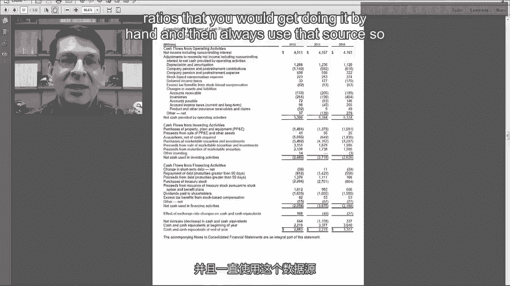

always have consistent definitions。 So one of the best sources on the web that I found to get ratios is Morningstar because。

they give you a long time series of ratios that you can use。

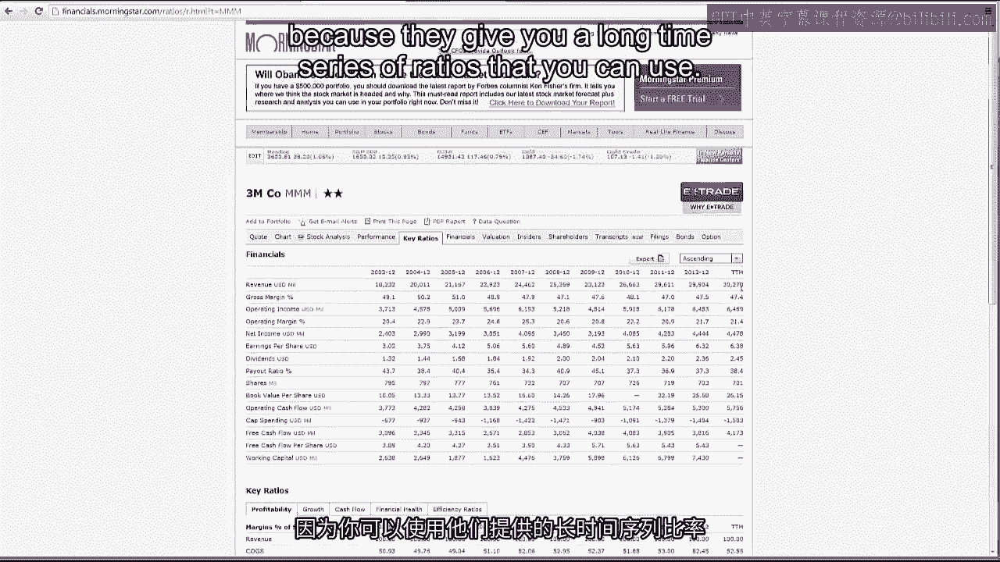

So if we look at 3M companies page， there's some summary financial information and then。

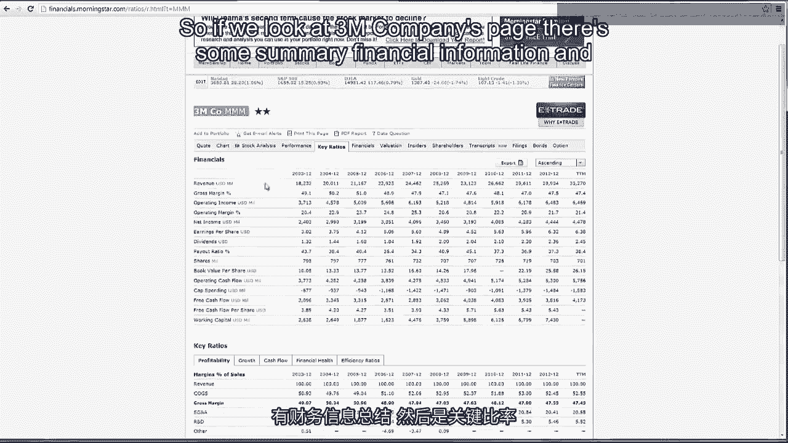

key ratios。 So we've got right here return on equity。

So that's our starting point in the new pond formula。

You notice it's sort of been going down the last few years slightly。 We can look at the components。

Here's financial leverage going down so they're becoming less levered over time。

Turn on assets up and then down again so a little bit more volatility with return on， assets。

Then you can look at return on assets going into asset turnover and what they call net。

margin percentage is what I call return on sales。 It's the profitability and you can see the profitability up and then sort of down again。

which is tracking what we saw with ROA and asset turnover has been up and down as well。

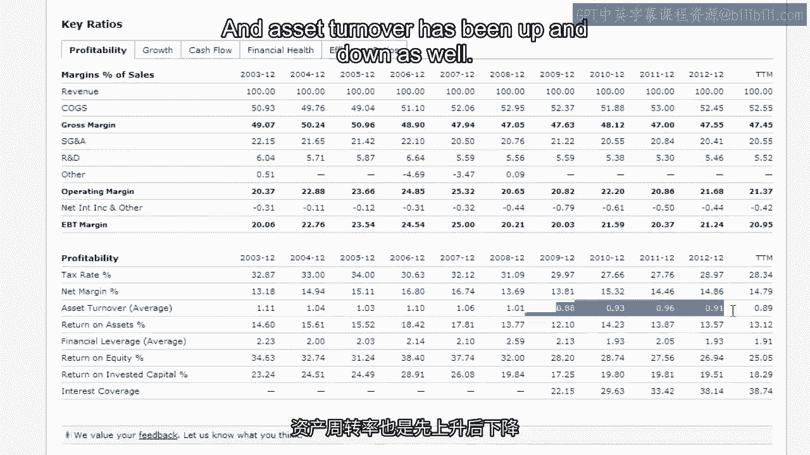

But what we really need is to find three or four of 3M's closest competitors and then。

compare these ratios to the competitors to see whether these trends are specific to 3M。

or whether there's some kind of industry effect that's going on。

But based on my knowledge of the industry， these are still pretty healthy ROA and ROA， numbers。

And then above we have the profit margin breakdown so we have gross margin which is really high。

almost 50% SG&A to sales which has been fairly flat and operating margin。

You also get R&D to sales since it is a company that does R&D。

So we get to see the profitability margin ratios as well。

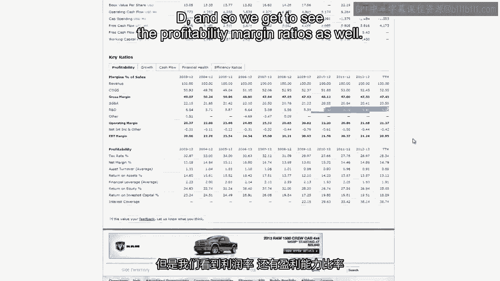

In case you're wondering the TTM column on the far right that stands for trailing 12。

months so that's the last 12 months before the date of the ratio calculation。

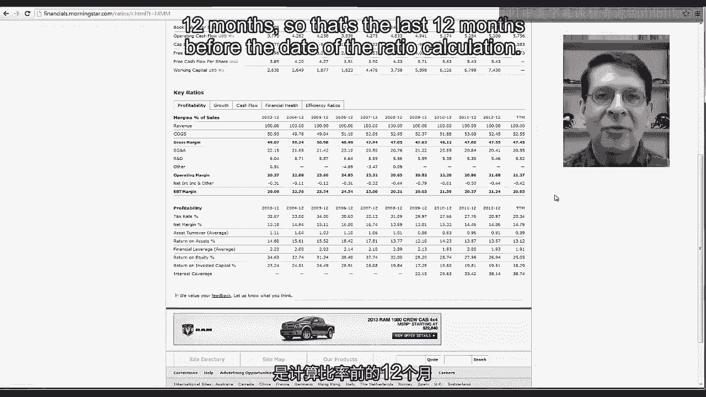

Then there's a tab for some growth percentages so this is just year on year 3 or average。

5 year average， 10 year average growth in revenue， operating income， net income， earnings。

per share。 Similar numbers for growth in cash flow。

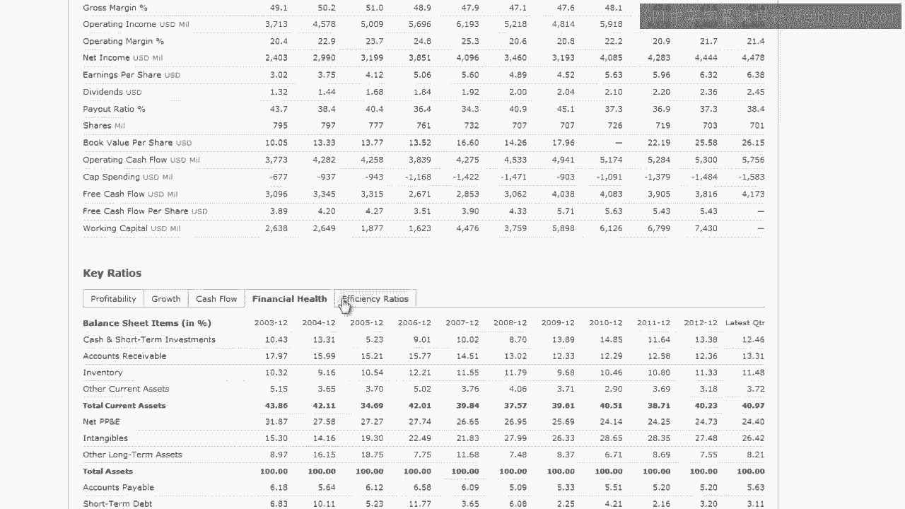

In the financial health this is essentially the common size balance sheet for 3M。

And then down below we have our old friends the quick and current ratio。 3M is in really good shape。

current ratio above 2， quick ratio above 1。3， 1。4。

Financial leverage which we saw earlier and then a more traditional debt to equity ratio。

looks like 3M is not a very risky company not very highly levered。 Then there's efficiency ratios。

So here we have day sales outstanding， days inventory and days payable。

So we can see there's a slight downward trend in 3M's day sales outstanding。

Their receivables or inventory turnover has been sort of steady between 75 to 85 days。

and the payables ratio is similar。 What they call a cash conversion cycle is what I was calling the net trade cycle。

So it's basically the number of days you'd have to borrow from a bank。

And then if you want to look at the ratios the other way they have receivables turnover。

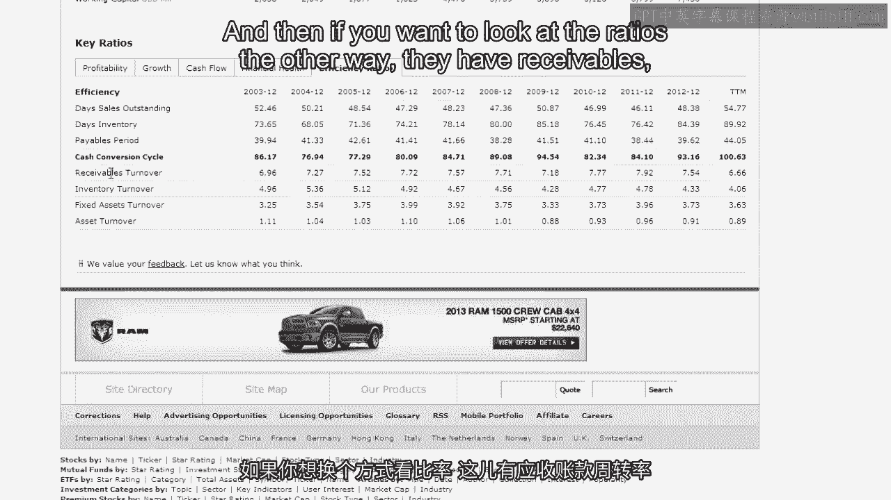

inventory， turnover fixed asset turnover and asset turnover。

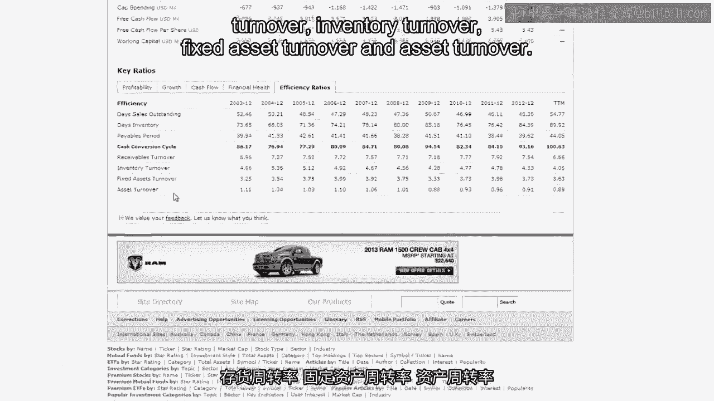

And then one more thing to show you is Morningstar has a extensive glossary。

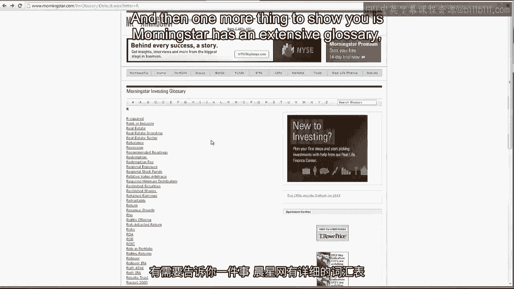

So if you don't know what any of these terms are like one ratio we didn't talk about is。

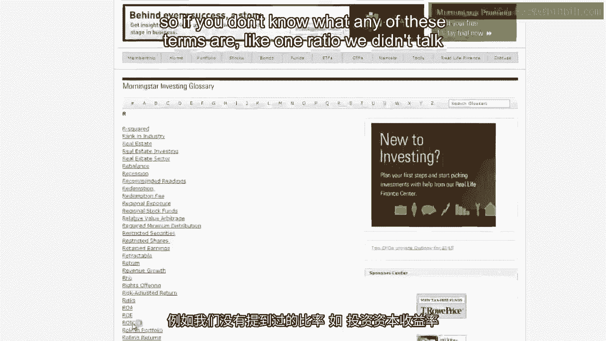

return on invested capital that's net income divided by stockholders equity plus long term。

debt and capital leases short term debt and capital leases。

So basically it's like RWE except it also adds debt into the denominator。

So you could just pull the ratios from a source like this， pull them from three or four competitors。

and then do the comparisons and you don't have to use your own calculator or spreadsheet。

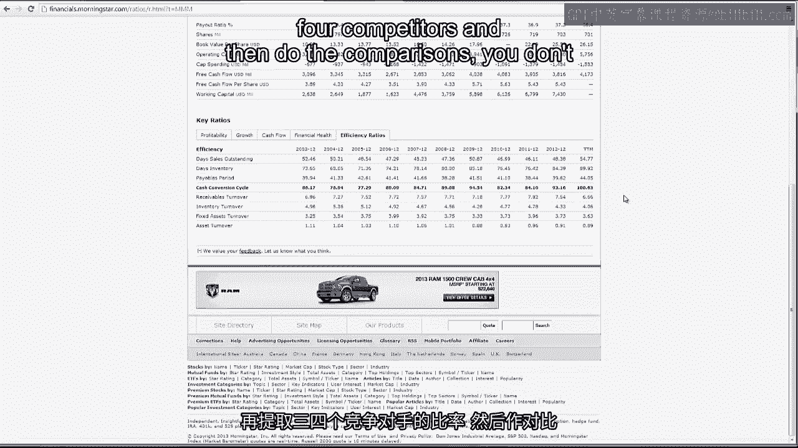

to calculate all these ratios。 And that's a wrap on our week long look at ratio analysis。

Now it's time for you to focus on the exam。 Good luck and I'll see you on the other side。

[BLANK_AUDIO]。
