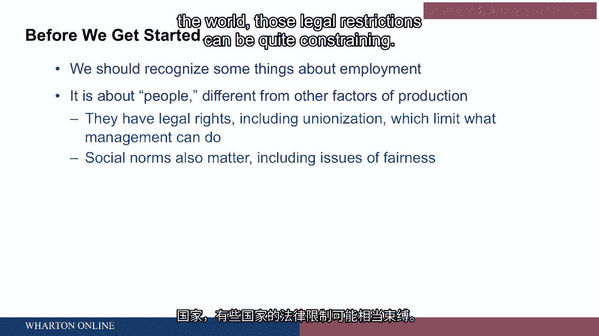
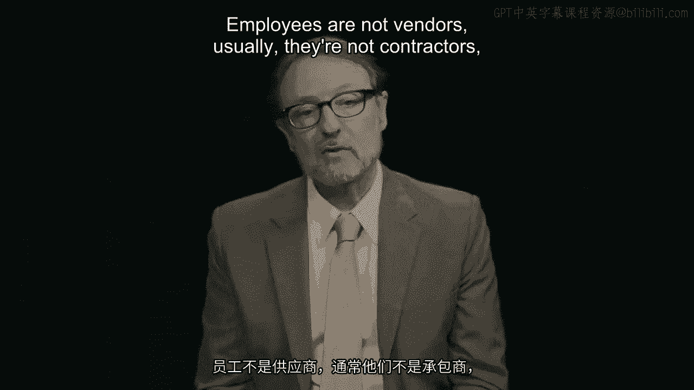

# 沃顿商学院《商务基础》｜第79课：人力资源管理导论 👨‍🏫

在本节课中，我们将学习人力资源管理的基础概念。我们将探讨如何激励员工、如何进行有效招聘、如何管理绩效以及如何设计工作，以提升组织整体表现。课程将涵盖全球通用的核心原则，无论您身处何地，这些知识都同样适用。

---

我叫彼得·卡佩利。

我是沃顿商学院的管理学教授。我在这里任教已经很久了。

当我刚来到这里时，当时的总统是共和党人，而且不是布什。

这可以让你大致了解我在沃顿商学院工作了多长时间。

在本课程中，我们将讨论人力资本管理。

我们将讨论其中的几个基本组成部分，无论你在世界何处，这些问题都大同小异。

我们将从讨论动机开始，探讨如何让员工去做组织或雇主需要他们做的事情，以及如何将奖励作为其中的一部分。

招聘实践，如何正确地进行招聘。管理绩效，特别是绩效评估的问题。

我们将讨论工作设计，如何做得更好。

设计有意义并能提升员工动力的培训工作。

以及能够提升绩效、契合组织战略并使一切变得更好的工作系统。这就是我们将要探讨的主题列表。

---

我们将从一些关于雇佣关系的总体思考开始。

即当你雇佣员工时，我们如何看待这个问题？

首先要记住的是，我们这里谈论的是人，特别是对于那些具有更多技术或经济学背景的人来说。

很容易想到生产要素，并认为它们都差不多。

但它们并不相同。我们谈论的是雇佣关系。我们谈论的是招聘和管理。

我们谈论的是人。从实际角度出发，之所以不同，是因为人拥有法律权利。

在世界上大多数国家，这些权利包括组建工会、与雇主进行谈判的能力。这基本上意味着可以迫使雇主去做员工希望的事情。

因此，管理者的能力并非无限的。

根据你所在的世界不同地区，这些法律限制可能相当具有约束力。

在发达国家中，美国可能拥有对雇主最有利的法律环境。

与其他国家相比，雇主可以更多地按照自己的意愿行事。

但即使在美国，你的行为也受到许多限制。

大多数限制与歧视受保护群体有关。

在美国，你看到这些立法，在欧盟和其他国家也是如此。

基本上，这意味着你不能歧视女性、少数族裔（即种族上的少数群体）、宗教团体（因其宗教信仰）的人。现在许多国家还包括年龄歧视。

这意味着在美国是40岁以上的人，不同国家可能年龄标准稍高。

在实践中，这意味着你不能采取雇佣行动——如雇佣、薪酬、晋升等任何对员工产生实质性影响的方式——对受保护群体造成特定不利影响。

根据你所在的国家，举证责任在你身上，需要证明你没有这样做。例如，如果被解雇的大多数人是女性，那么雇主的责任是证明解雇是以公平的方式进行的，并非有意歧视，而是基于某种客观标准。

除了法律，我们还有重要的社会规范。

这些规范主要涉及公平问题。

这意味着企业领导者、政治领袖和政府领导者，他们对待员工的方式会受到问责，无论他们是否违法。

以上内容是对我们将要讨论话题的一个前提说明。

作为管理者或所有者，你的权力并非无限的。你管理员工的方式，与你购买电脑、组装零件或与供应商打交道的方式不同。员工通常不是供应商，也不是承包商，他们拥有许多不同的权利。

因此，在我们开始讨论管理员工的重要议题时，请记住这一点。

---

**本节课总结**

在本节课中，我们一起学习了人力资源管理的基本框架。我们了解到，管理人力资本不同于管理其他生产要素，因为它涉及具有法律权利和社会规范的人。我们讨论了管理者权力的法律和社会限制，特别是关于公平对待员工和避免歧视受保护群体的重要性。这些是我们在后续深入探讨动机、招聘、绩效评估和工作设计等具体话题前，必须牢记的基础背景。