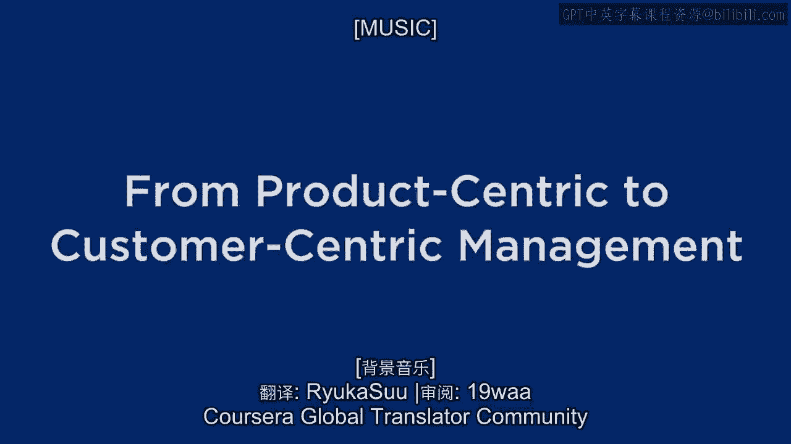
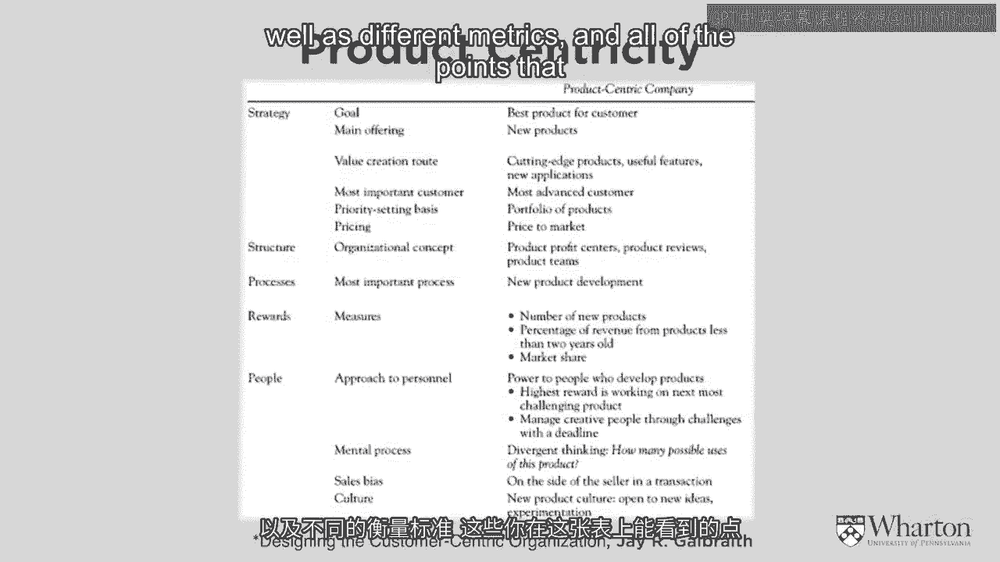
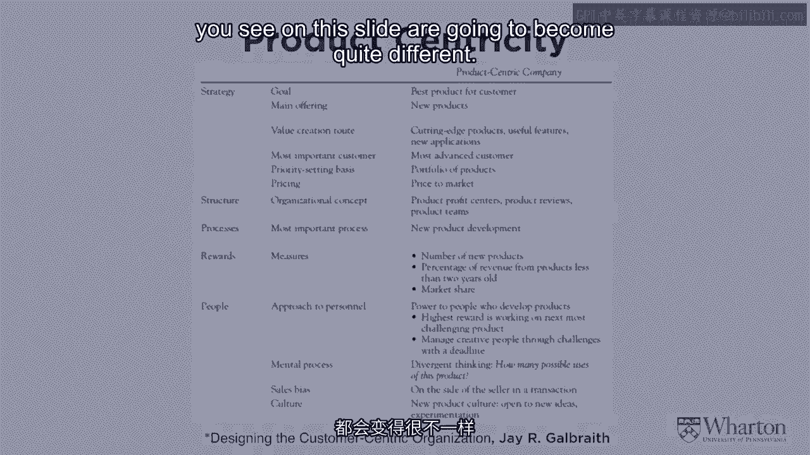
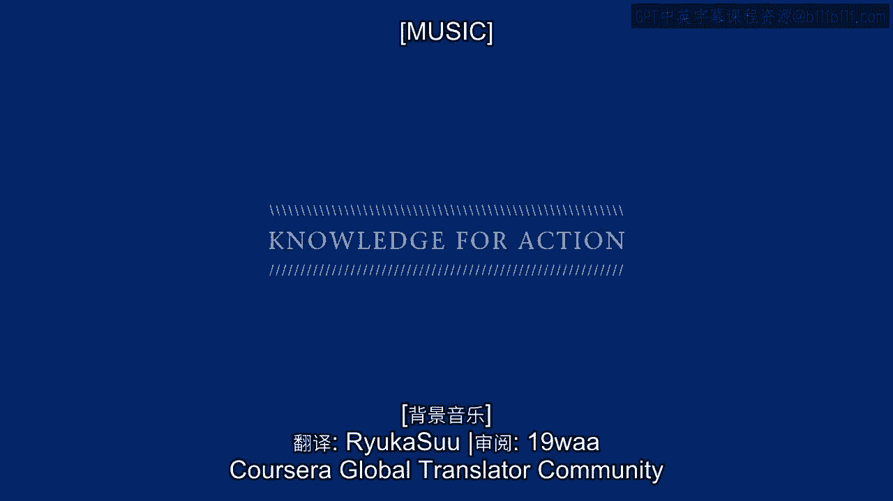
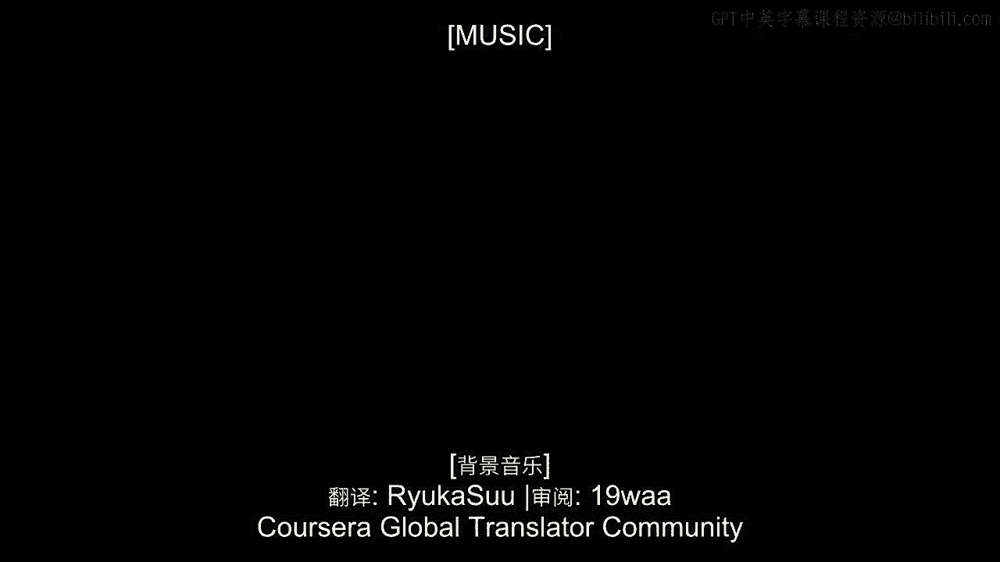

# 沃顿商学院《商务基础》｜Business Foundations Specialization｜（中英字幕） - P8：7_从产品中心转向客户中心管理.zh_en - GPT中英字幕课程资源 - BV1R34y1c74c

Hi， I'm Pete Fader。

I'm the Payone Chaw Professor of Marketing at the Wharton School and Co-Director of the。

Wharton Customer Analytics Initiative and I'm really excited to be starting my module。

of our Introduction to Marketing course。 The fact that I run a research center called the Customer Analytics Initiative suggests。

that I'm a data guy and that's certainly true。 I love looking at data about customers。

trying to figure out which customer is doing what。

and for how long and for how much money and what kinds of tactics can companies use to。

create and extract even more value from the customers。

So for me it's all about the customer behavior， the patterns that we see over time and the。

kinds of strategies that companies can build around those patterns in order to do better。

for themselves。 So I want to start by going back to one of the frameworks that Barbara Kahn used in her。

modules。 You might recall this slide over here where she laid out the basic kinds of strategies。

that companies can follow。 And a couple of these strategies are really clear。

Everyone understands what performance superiority means。

It's just having the very best product out there。 So whether you're an Apple。

a BMW or a luxury product like Louis Vuitton or a Gucci， you， want to have the best。

Operational excellence is also pretty clear。 You want the lowest price。

you want the most efficient operation or the most efficient， experience for your customer。

So whether you're talking about a Walmart or an IKEA or a Zara， you're really interested。

in keeping the cost low， keeping the process very efficient。 That gives us operational excellence。

But it's the third leg of this diagram that we're going to spend a lot of time on。

It's the idea of customer intimacy。 And basic idea makes sense。 Let's focus on the customer。

But exactly what does that mean？ Who is the customer？

Are we going to focus on all customers the same way？ Just how intimate do we want to get？

And how do we actually make more money on something that actually adds costs than some。

of these other strategies？ So that's going to be the main focus of our efforts。

It's taking this idea of customer intimacy or， as I like to call it， customer centricity。

and really understanding what it is， clarifying what it isn't， motivating why it's important。

and trying to get firms to make a well-informed decision about whether they want to pursue。

that kind of strategy and whether， when， and how to actually go after it。

So that's going to be the focus of our work。 I'm here on South Street。

one of the popular shopping areas in Philadelphia， and all around。

me would be stores that represent the different kinds of strategies that Barbara spoke about。

Just over my right shoulder， you'll see one of my favorite pizza places。

That's performance superiority。 Right down the block， there's a number of fast food restaurants。

That would be operational excellence。 But what about customer intimacy？

What kinds of stores would really be customer intimate or customer centric， as I like to， say。

and what makes them different？ So let's really understand how these different strategies compare with each other and then。

take the deeper plunge into customer centricity。 So give me a few minutes to review the traditional steps of running a business。

Running a business in a performance superior or an operationally excellent kind of way。

And that's going to give us the basic foundation so that we can really understand how customer。

centricity is different， some of the challenges associated with it， and some of the opportunities。

that customer centricity can provide that you might not be able to achieve with a performance。

superiority or an operational excellence strategy。

So let's take a step back and review these traditional steps of running a business。

For most commercial enterprises， the overall objective， beyond everything else， beyond all。

the tactics that a company is using and the strategy that it's hoping to follow， it's。

all about making money。 And again， Barbara reviewed this and you don't need to be told this。

It's all about maximizing the value of the whole corporation。

It's looking at the money that we make today， the money that we'll make tomorrow， the money。

that we'll make 10 years from now。 And when we recognize the time value of that money that today's dollars are more important。

to us than tomorrow's dollars， when we take the discounted flow of the company's profits。

that in theory gives us the overall value of the corporation。

So it's our job as a manager to maximize the value of the corporation， which means maximizing。

the net present value of profits that the company is bringing in。 So we agree on that。

That part is pretty easy conceptually， but the question is how do companies achieve it？

And that takes us back to those core strategies that Barbara laid out。

And when you think about the most traditional among them， again， performance superiority。

and operational excellence， it's all about coming up with a blockbuster product or service。

coming up with a brilliant idea that puts a step ahead of all of our competition and。

figure out ways to bring that idea， that product or service to market。 So it's conceptualizing it。

it's developing it， it's manufacturing， distributing， marketing， that idea。

That's what business is traditionally all about。 And so the key for most firms to making money isn't only coming up with that idea。

but then， figuring out ways to produce lots and lots of it。

And one of the things that we discovered over the years is that producing lots and lots。

of quantities of this product or service that we want to deliver not only helps us make。

greater revenue， but the fact that we're producing and distributing so much of it also。

brings our costs down。 So the core focus of most traditional businesses is high volume low cost。

And again， coming up with a great idea that enables us to do that。

So so many companies have built their business around that。 And even today。

a common question that we always ask ourselves， particularly when we， have a new business is。

will it scale？ Can we produce or deliver this product or service at scale so we can do so much of it。

that's going to let us bring in the revenue and bring our costs down。

So that's the basic way that most companies operate。 And over the years。

many different metrics have arisen that help companies understand， how well they're doing it。

Obviously， they can look at the volumes that they're delivering。 Obviously。

they can look at changes in their costs。 Our costs coming down as we develop and deliver more and more of this product or service。

So some metrics that show us how well we're doing our business are fairly clear。

Some of them are less clear。 For instance， a very powerful metric is market share。

So many companies today obsess over market share because not only does it give them an。

indication of how well they're doing relative to their competitors in a given industry， but。

it also has these interesting properties of being a leading indicator of how well you。

will be doing。 There's a lot of research that goes back to the 1960s and 1970s that shows that market。

share is not only a good backwards indicator of how well you've done， but a leading indicator。

of how well you will likely be doing in the future。

So many other metrics like market share and others are central to this product superiority。

or operationally excellent strategy。 Beyond running your business and measuring to see how well you're doing it。

a company， isn't only interested in fine-tuning those metrics。 They're interested in， in fact。

they're mandated to have growth。 It's not enough just to do what you're doing a little bit more efficiently and effectively。

More shareholders demand growth。 They want more。 They want more than you could possibly have delivered before。

So where does growth come from in a world characterized by performance superiority or。

operational excellence？ What are the sources of major growth that a company can enjoy？

And we really see two different sources that at first sound fairly distinct from each other。

But when we think about it a little bit more carefully， there are actually just different。

flavors of the same kind of growth。 So let's think about them a little bit。

One source of growth is taking the products of services that we've been delivering already。

and bringing them to new customers， either going to new customer segments or to new geographies。

So it's taking this great product of service and bringing it to new customers。

That's clearly a source of growth。 The other source of growth that I'm sure all of you could think about would be innovation。

So in addition to producing and distributing a certain set of products of service， what。

more can we do？ So let's go back to the folks who developed these great products of services in the beginning。

and say， give us some new products of services。 Let's go back to the R&D people and say， okay。

you have a certain degree of expertise that， has enabled you to bring us the current product。

What more can you do to bring us either variants of that product or entirely new ones that haven't。

existed before？ So an obvious source of growth would be new products or extensions to existing products。

So at first， this idea of taking our current product and bringing it to new customers or。

coming up with new and different products seem fairly different from each other。 And indeed。

the tactics associated with them， the expertise within the corporation does。

have to be a bit different。 When we step back and think strategically。

both of them actually have a lot in common。 Other than share this basic idea。

we have a certain degree of product expertise。 How can we extend it？

How can we take that product expertise and either extend it to new customers or extend。

it to new products？ So regardless of the specific way that you go after growth。

the main source of growth， is extending our overall product or service delivery。

And that's what most companies have to be really good at。

We're good at doing a certain kind of thing。 We're going to try to do it as efficiently or effectively as possible。

Now how can we take that product expertise and extend it in new directions？

And how do companies go about doing that？ How do they go about running the existing business as well as figuring out how to extend。

the product？ Well， if you look at the organizational chart of almost any company on the planet。

the company， tends to be organized around the different kinds of products and services that it delivers。

So you'll have a product manager or a brand manager。

But it's all about having separate silos around the different products or services and then。

organizing all the activities that way。 And so very often。

each of these different silos will be responsible not only to run its。

own operation as efficiently as possible， but thinking about its own way of extending that。

kind of product expertise。 And so if we sum up the way that most companies operate。

it's all about this idea of product， or service expertise。

That's the competitive advantage that so many managers， so many academics， so many industry。

experts have focused on for so many years。 We are the best at conceptualizing， developing。

delivering a certain kind of product or service， and we're going to stay ahead of our competitors by becoming more efficient。

by going to new， markets and always developing new product or services that are going to keep us a step。

ahead， product expertise。 So what I've just described to you is pretty standard stuff。

For most of you， if you look at your experience as a consumer or through your work experience。

you'll realize that that's the way that most businesses operate。

And instead of just calling it business， we can now put a label on that。

And that label I like to use is product centricity。 See， in the old days。

we didn't need a special label for it because for most companies， this。

was business and business was this set of steps that I just described to you。 But today。

we're seeing different kinds of business models emerging。

And so we want to now distinguish the set of practices that I just described。 In fact。

I like to use a metaphor about a fish swimming around in water。 So while a fish is in the water。

it doesn't realize that it's in water until it jumps， into a new environment。

It jumps out of the water for a moment and realizes， "Uh-oh， I'm in a different environment， now。"。

And I kind of like the old environment better。 I'm going to stay in the water。

And this is exactly the kind of issue that many companies are facing today。

They're swimming around in their own water of product centricity。 It works。

It keeps the business going。 It gives them some opportunities for growth。 And for many companies。

that's totally fine。 But for other companies， whether it's out of desperation or perhaps opportunity。

they're， looking for different kinds of environments。

They're looking for different kinds of strategies。

We're seeing more and more companies jumping out of the water and saying， "Is it better， out here？

How can I operate out here？ Should I operate out here？"。

And that's why we're now going to put a specific label on the old way of doing things， product。

centricity。 So again， most of you understand that。 This is business as usual。

Many of the concepts that Barbara was talking about implicitly referred to a product centric。

approach and just to sum up the product centric world before we kind of start moving away， from it。

I have this one other slide for you here that shows you many of the classic characteristics。

of a product centric business。 And if you look up and down the slide。

you won't find a lot that's tremendously insightful。

And that's the point I want to make is that the traditional product centric approach to， business。

Again， focusing on performance superiority or operational excellence is by now second。

nature to most managers。 So if you look at， as the slide shows。

the kinds of customers that we're going after， the kinds of metrics that we're using。

the overall focus and the organization of the business， it's pretty standard stuff。

I just want to call your attention to this one point towards the bottom of the slide。

the idea of the mental process。 And I love this idea of divergent thinking。

And it goes back to an idea I mentioned a few minutes ago。 We have this product expertise。

What can we do with it？ How can we spread it out to other kinds of customers and other kinds of businesses？

Again， implicitly， that's the way that most businesses operate。

And we hire people who can think divergently， who can take our particular core business。

and think about ways of spreading it out to new markets and new products and services。

So I want to make that explicit because as we go on， we're going to talk about some very。

different mental processes as well as different metrics。

And all of the points that you see on this slide are going to become quite different。

[MUSIC]。

