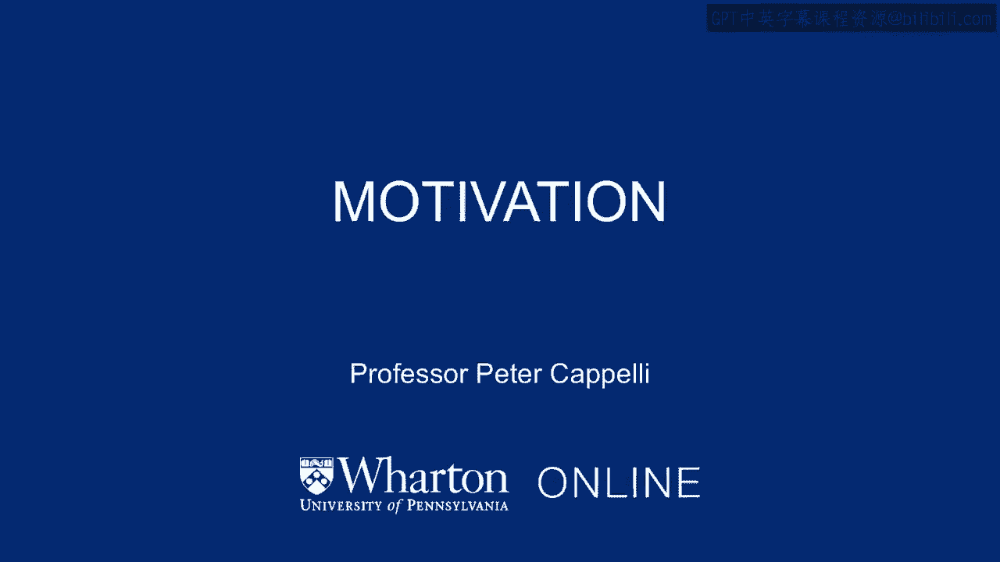
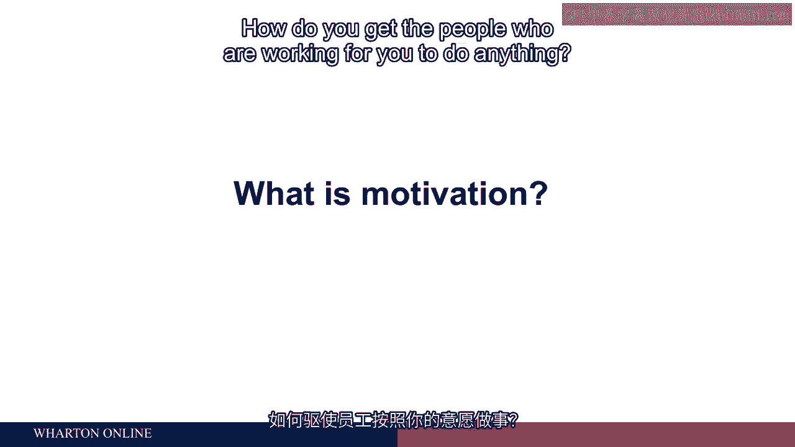
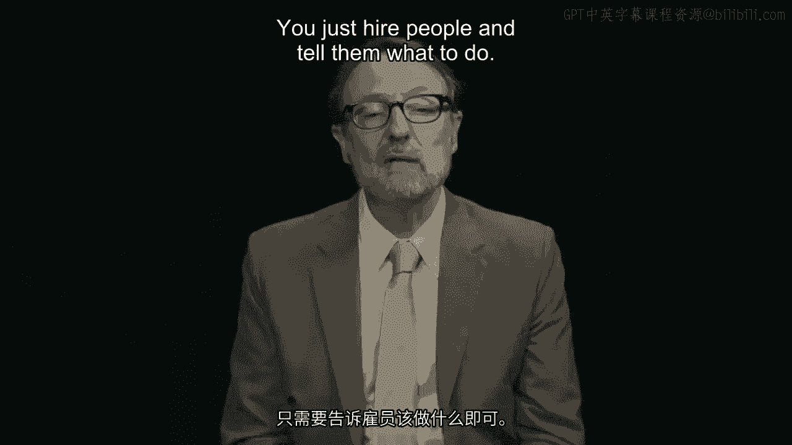
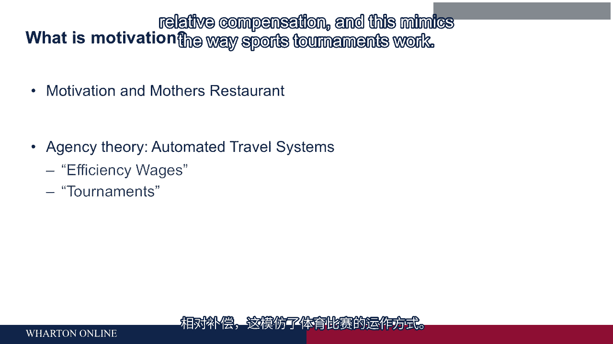
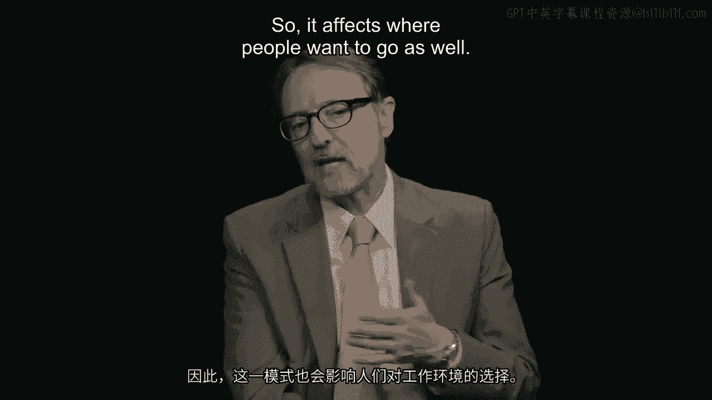

# 沃顿商学院《商务基础》｜Business Foundations Specialization｜（中英字幕） - P80：3_动机.zh_en - GPT中英字幕课程资源 - BV1R34y1c74c

How do you get the people who are working for you to do anything？

Now， it may seem like it's pretty simple。

You just hire people and tell them what to do unless you've ever been an employee， of。

course。 And then you realize that sometimes the employees don't want to do what you want them to do。

And sometimes that's for principal reasons。 And sometimes it's because they're having a bad day or they're tired or whatever。

And the question is going to be how do you get employees to do what you want them to， do？

And I wanted to illustrate with a story that I saw myself in New Orleans in a restaurant。

many years ago now called Mothers。 And in that restaurant I was there sort of a cafeteria line。

great food。 And the electricity went off in the restaurant， but they kept going。

which was cool and admirable。 But at the end of the food line you get to the point where they total up your bill and。

they take your money and give you change。 So there was somebody there with a calculator totaling up your bill。

And there was somebody there at the cash register。

The cash register doesn't work because the electricity is off。 Calculators got batteries。

The cash register doesn't， so the cash register is not working。 Cash registers are a control device。

right？ You put in what the food was。 It says how much it was。

At the end of the day you total that number up and it better correspond with the amount。

of cash in the drawer or if it's less than that somebody's probably stealing or made a。

mistake or something。 So we get to the cash register， right？ And it's open。

And there's somebody there who's taking your money and giving you change， but they're just。

doing it with an open box of cash， right？ Behind that person is another person who is standing there just looking over the shoulder。

of the person who is taking your money and giving you change。 Now what is that person doing？ Well。

that person is just watching the person with the open cash drawer and probably， I'm。

assuming I didn't ask them， the reason is because they want to make sure the person in。

front of the cash is not stealing cash。 But then you might wonder。

shouldn't there be a person standing behind the person who's。

watching the person with the open cash drawer to make sure that they're not in coheuts together？

Well you start thinking about this and you realize one of the problems of management。

you could try to manage people by having somebody stand over and watch them。

But that doesn't work very well。 First of all， it's really expensive to do。 Second。

how can you trust the person who's watching if you can't trust the first person？

So this is all around the question of motivation。 How do you motivate people to work in the way that you want them to work？

And that might include things like not stealing from you。 In general， you can think about it。

I think this way， I always think about this test。 If your employees are doing the right thing for you。

we talk sometimes also about questions， of engagement now。

a common phrase which means really commitment， are they looking after， your interest？

If it's five o'clock in your office and it's quitting time and it's hit five o'clock。

and the phone's ringing， do people go back and answer the phone or do they continue to。

walk out the door？ If they are committed to the organization。

if they're engaged and looking after your interests。

they might take the extra minute or so and answer the phone。 If not， they're probably out the door。

And as an employer， you want to make sure people will go back in and answer that phone。

You want to make sure that you can trust your employees with an open cash drawer and you。

don't need somebody standing behind them in order to figure out whether they're cheating， or not。

So we're going to talk about how to do that and also understand some of the companies。

that describe how they manage in completely different ways than the example of the restaurant。

I was giving you。 Companies that talk about， for example。

giving their employees 10 hours a week or so Google， I think was famous for this among others。

3M as well， to just work on stuff that the， employees want to work on。

Now they could be sitting on their hands as far as their supervisors probably know because。

you're giving people discretion and you're not supervising them。

You're giving them autonomy to go do what they want to do that's in the interest of the company。

So you really got to trust them。 What makes it possible to trust those people in those kind of companies when in lots of。

other companies you've got cameras watching people you got supervisors standing over them。

What's different in those two operations？ And we're going to talk about how you might make that happen as we go along in this course。

So let's start talking about the simplest model of management。

This is a model that is associated with economics people in economics call this an agency approach。

agency model。 The idea here is that you have an agent the employee is like an agent who's working for。

you and you are the principal that is you are the person who is trying to guide the agent。

Actually this is not the way employment works at all but it is a useful abstraction to think。

about how it works and we're get to the more complicated， more realistic ideas in just a， minute。

If you have an agent who is working for you how might you motivate that person to do the。

right thing and you don't want to stand over them and watch them。

In our course at the Wharton School we teach a case about a company called Automated Travel。

Systems which was started a while ago and created the software that drives search engines。

for finding flights now。 And in that company they had a particularly difficult moment where their software engineers。

were holding the company up。 I mean literally talk about a hold up company that's like you're sticking a gun at somebody。

And the gun they were sticking is we're going to quit unless you give us more money or stock。

options whatever it was。 And in this particular company that was happening the engineers were threatening to quit and。

the company was on a very short deadline it had investor money that wasn't in deep pockets。

of money and they had a deadline they had to get to in order to remain solvent and the。

engineers are holding them hostage and saying we're going to walk away and your project won't。

get done unless you give us more money。 Well this is a problem with this kind of basic model where it's all about money and we are。

can hold you up for more money because we don't really care about the mission of the company。

and we don't really care about our job we're just in it for the money。

And how you solve that problem basically is unfortunately going to be that you can't。

do it with simple contracts you're going to have to do other things as well and we'll。

come back to that in just a couple minutes。 But the basic idea about incentives is the solution to the agency problem as it usually。

describes you're trying to reward people for doing the right thing you want them to finish。

this project they get paid so much when they finish a project think about it almost like。

a contractor right now there's a couple of other ideas around this simple model one of。

them is something that economists call efficiency wages and the idea here is about kind of about。

relative competition that if you pay more than your competitors even if it's only a little。

bit more you will get better workers first of all because if they can choose where to。

go the best ones will come to you if you pay a little premium over everybody else。

The second factor is that those folks are less likely to quit because where they're going。

to go if your job is better than everybody else's and the third is they're likely to。

behave better because if they don't they might get fired and they lose a job which is。

better than everybody else's job。 So basically it's the advantages of having a job that on balance is better than the ones。

your competitors have got and there's pretty clear evidence on that I did one of these studies。

a while ago showing the discipline rates were actually lower at plants where companies were。

paying a little premium above the market rate。 Now you got to pay more for that but the idea is because you're paying a little better。

than everybody else you get lots of benefits。 Now the obvious question is what happens if everybody else starts paying more and then。

the benefits go away right so it's all about relative competition and the idea of a tournament。

as a way to structure pay is another kind of economics based argument that is about relative。

compensation and this mimics the way sports tournaments work。

So for example if you're a golfer or somebody playing an individual sport you'd know that。

if you win the tournament you get a big prize the people coming in second get something。

that's pretty good the third you get a little trophy and fourth place you get a carry on。

bag and that's about it as you work your way down the big prizes are for winning。

Now why is that a good thing because you could have many people playing in the tournament。

all motivated by that one prize and that makes it a very efficient way to do things。

Of course there are downsides to this as well and the downsides are that this works great。

in a tournament where nobody's going to work together and everybody's literally competing。

against each other but inside an organization where these tournament models are set up they're。

usually promotion systems so if you get promoted to partner you make a ton more than the people。

who are associates。 If you get promoted to the next level up in a company particularly to the CEO level you。

make a ton more money than the people just below you it motivates lots of people along。

the way but if you want people to cooperate and work together in a company or in a professional。

service firm it cuts against that it creates incentives for you to fight each other and。

it also creates incentives for you to join week tournaments that is you don't necessarily。

want to be in a tournament full of stars because it's going to be hard to win you want to be。

in a tournament with a lot of losers because then it's easier for you to win so it affects。

where people want to go as well plus is and minus is to efficiency wages plus is and minus。

is to tournaments。 [BLANK_AUDIO]。

