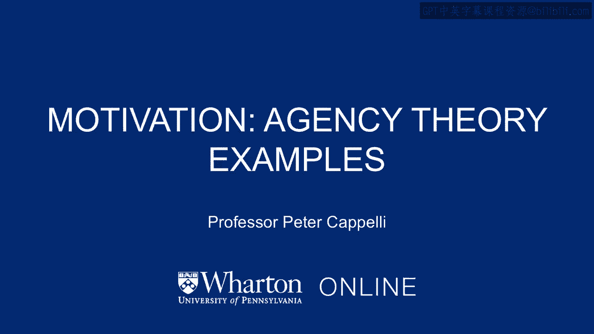
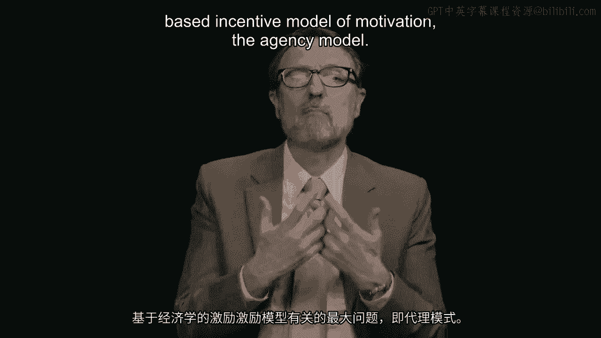
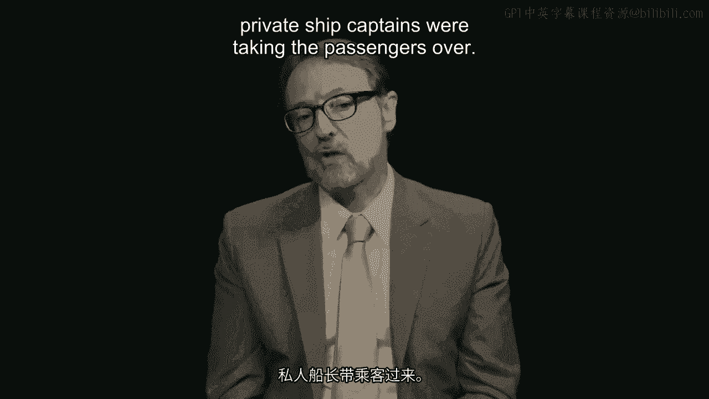
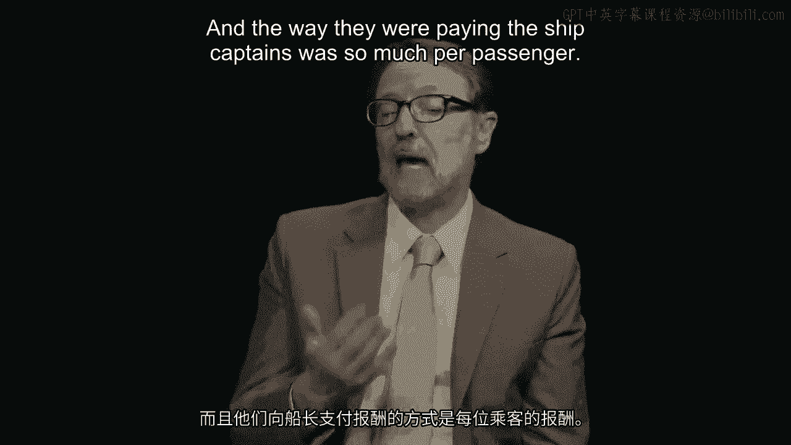
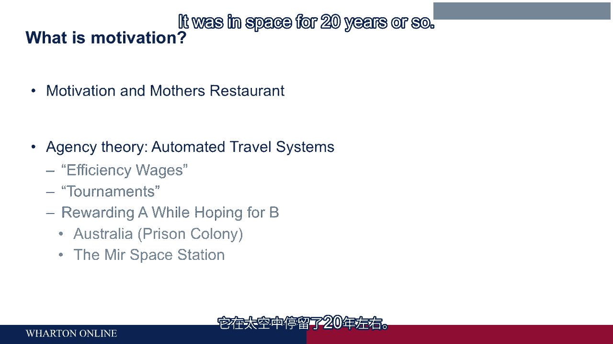

# 沃顿商学院《商务基础》｜Business Foundations Specialization｜（中英字幕） - P81：4_代理理论的动机案例.zh_en - GPT中英字幕课程资源 - BV1R34y1c74c

But maybe the biggest problem associated with the economics-based incentive model of motivation。

the agency model， is that it's easy to get the incentives out of alignment。

And they could be out of alignment even a little bit and they caused a ton of problems。

So for example， it's a famous story which I learned from my colleague Mike Useem， where。

you're going to hear from a little later on this， about Australia， which began its civilization。

modern western civilization anyway， as a prison colony for England。

And at that time， you might have thought being sent to Australia from England， particularly。

in the winter， was a pretty good thing。 Why not be in Sydney where the weather's pleasant？

But it turned out the reason it was such a terrible thing to be sentenced to time in。

Australia was that a very large proportion， I think at one point a majority of people。

sent to Australia， died。 So even if you were sent there for a two or three-year sentence。

highly likely you might， die。 And the reason they were dying， a Royal Commission investigated。

is they were dying on the way， over。 And what were they dying of？ Dehydration， disease， exposure。

all things that were preventable。 The Royal Commission took a little look in this and they discovered that the English。

government was outsourcing the shipping of prisoners to Australia。 They weren't doing it themselves。

The private ship captains were taking the passengers over and the way they were paying。

the ship captains was so much per passenger。

So ten pounds or something for each passenger who they shipped to Australia。 Well。

if you were a profit maximizing ship captain who didn't have any scruples， the。

way you would make a lot of money is you would skimp on food， you would skimp on blankets， and heat。

you would skimp on water and actually if the prisoners died it was simpler for you。

because the boat didn't weigh as much， you'd just toss them overboard and you didn't have。

to feed them。 And that's what was happening。 So the Royal Commission set up an alternative compensation system which was very simple。

It just paid the ship captains for the number of prisoners who walked off the boat on their。

own power in Sydney Harbor and the death rate fell to maybe 2% from a majority to just a。

couple of percent。 So we talk about rewarding A while hoping for B。

That means the incentive system is hoping， let's say to get passengers。

prisoners to Australia in an efficient， inexpensive way。

That's B but what they're actually rewarding was simply piling people on the boat。

So it's unintended consequences。 I've got a contemporary story about this which is in a very different context。

It takes place in outer space and it takes place on the mere space station which was。

the Soviet era space station which turned out to be a pretty remarkable piece of engineering。

at least robustness wise。 It was in space for 20 years or so。

And there was a moment where the mere had an accident that was completely preventable。

We know the story about this because there was a US astronaut on board with the cosmonauts。

and he told the story afterwards。 Here's what happened on the mere。

It's a classic example of rewarding A while hoping for B。 What happened on the mere is。

that they were serviced every month by a spaceship that would be launched from Siberia， a little。

ship called the Progress。 They would launch it full of oxygen and food and water and whatever else they wanted pizza。

Ship it up and it would dock automatically with the mere。

They had this very elaborate computer and radar based system to pull it in and slowly dock。

But then as soon as it was done docking and they had unloaded it they filled it up with。

trash and they kicked it back into space and it would spiral down to earth and burn up。

in the process。 Now it worked pretty well except for the fact that it's incredibly expensive pizza delivery。

right because you're burning up one of those ships every time， every month when you're。

servicing the mere。 So the guys on the ground in Mission Control decided maybe there's a way to do this without。

quite as much expense。 Most expensive part or one of the most expensive parts of the Progress。

the ship that was coming， up was the avionics that is the system for docking the mere。

So what they decided to do was to see whether it was possible to launch the Progress and。

dock it without all that fancy avionics。 So they tried it out and they got it up there and then they turned off everything and they。

let the cosmonauts on the mere steer it into the mere。 Now the problem with doing this。

imagine parallel parking right。 Except in this case the curb is the mere space station and it's a bunch of pretty fragile。

stuff。 There's no bumpers around it right。 It's got antennas and solar panels and stuff like that。

The Progress is coming at you at 10，000 miles an hour and they got to slow it down you know。

it's hundreds of miles away and they got to slow it down enough to dock。

And if you bump you got a big problem right。 So the Progress is coming at them and they can't see it。

They can't find it。 They're looking out the window trying to see where it is and the radar image isn't clear。

and they got a camera on the Progress but it can't quite pick the mirror out because。

it's looking at Earth behind it and it's white and it's， I mean they can't see it。

And they finally get a glimpse of it and they try to slow it down enough but it couldn't。

slow it enough and it went zooming past them and it fortunately missed them。

But if it had hit him it would have been a huge disaster。

So the cosmonauts got on the phone and they called mission control and they said hey this。

is really really dangerous and it almost killed us we can't do this again。

What happened on the MIR space station was that the cosmonauts were paid a pretty big。

bonus for following orders。 So it wasn't for a successful mission it was for following orders that's what they were。

rewarded for that's what they were actually rewarding that was A while hoping for B in。

this case was a successful mission。 [BLANK_AUDIO]。

