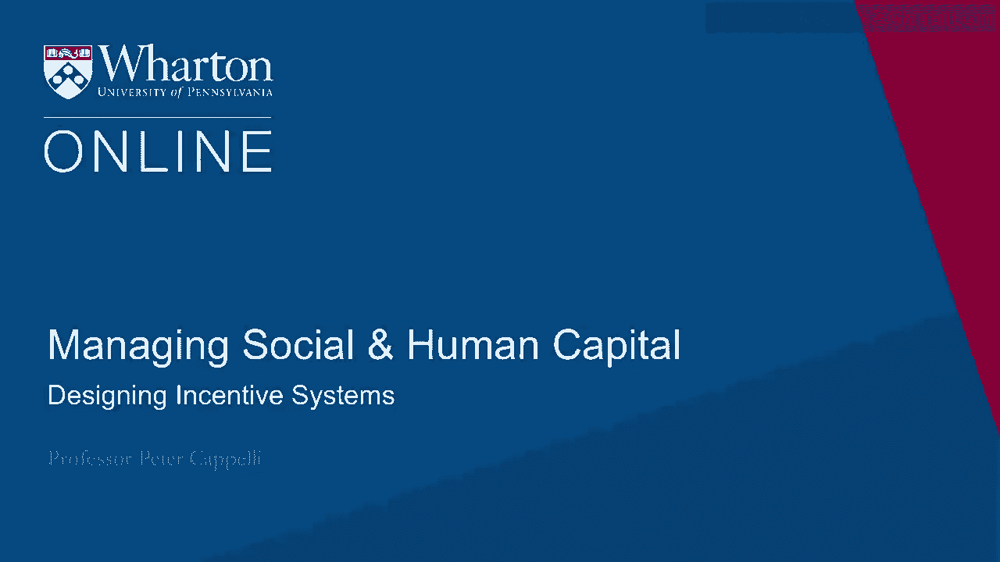

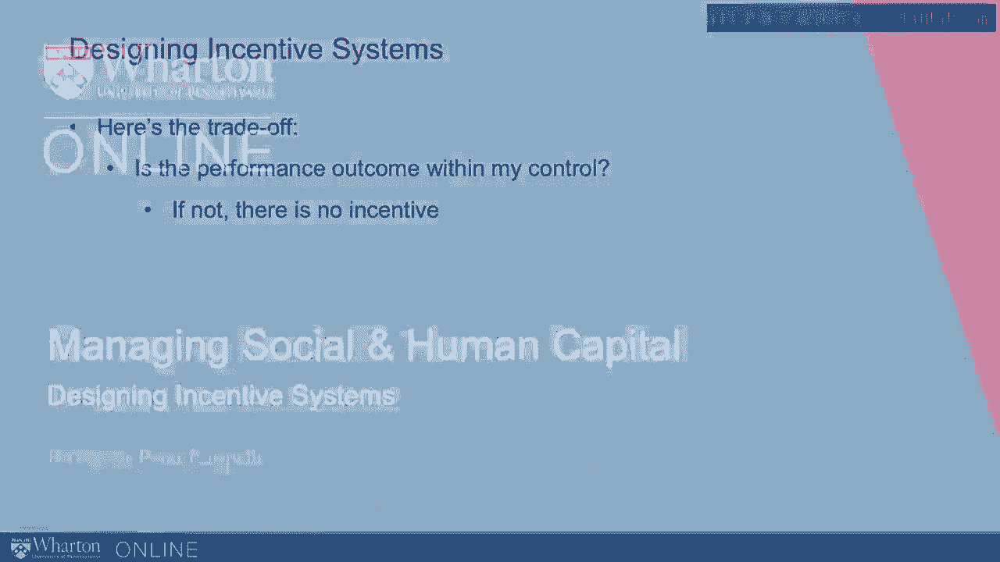

# 沃顿商学院《商务基础》课程 P82：5_设计激励机制 🎯

在本节课中，我们将要学习激励机制设计的核心原则与挑战。我们将探讨基于经济学的简单激励模型，以及心理学家提出的更复杂、更贴近现实的行为管理模型。理解这些模型有助于我们设计更有效的管理策略。

## 激励机制的核心权衡 ⚖️

上一节我们介绍了激励机制的基本概念，本节中我们来看看其内在的核心权衡。

当我们谈论激励体系时，存在一个权衡。这个权衡是针对员工的。理想情况下，你希望激励体系基于一个我能控制的、与我的工作相关的**产出衡量标准**。即：我做了这件事，就能得到那个奖励。如果没有这种关联，就没有真正的激励。如果我无法控制我能从你那里得到多少，那么我就没有动力去做好工作。我可能仍然会做好工作，但那是因为我本身是个好人，而不是因为激励。

在许多工作中，问题在于很难衡量我的个人产出。例如，如果我在行政部门工作，或者在一个团队中工作，或者在一个我与他人相互依赖或有特殊问题需要处理的环境中，衡量我的个人产出是非常困难的。

另一种可能性是，将产出设定为更大的目标，比如整个公司的目标或整个组织的绩效。这样做的问题在于，这超出了我的控制能力。这样做的后果是，我感觉不到任何激励。例如，如果你给我股票期权，而我在一家庞大的公司工作，我对股价的影响几乎为零。因此，我并没有真正的激励。可能还有其他原因让我拥有激励，比如让我感觉自己是组织的一部分，但促使我以特定方式表现的，并非来自那些奖励的激励。

那么，无论如何都设定组织目标呢？设定那些可能在我控制范围内、但即使离我较远的目标，还存在另一个问题：我可能以牺牲整体业务为代价来实现我的目标。例如，如果我是一名销售人员，你说“我们希望你卖出更多东西”，我可以通过给客户非常优惠的交易（即低价）来卖出很多东西。我可以卖出很多东西，从而提高我的绩效和激励薪酬。这样做的问题是**次优化**。我很好地完成了我的目标，但这是以牺牲整体业务为代价的。这是“奖励A却希望得到B”的另一个例子。

因此，关于大多数基于激励的薪酬，最好的解决方案是不要过度依赖它，并且要让激励措施非常简单。如果你试图设计一个激励体系，以防止人们以各种可能的方式作弊，你将不得不制定一本规则手册，人们将不得不经常查阅来决定在工作中该做什么，而这并不是你真正想要的。

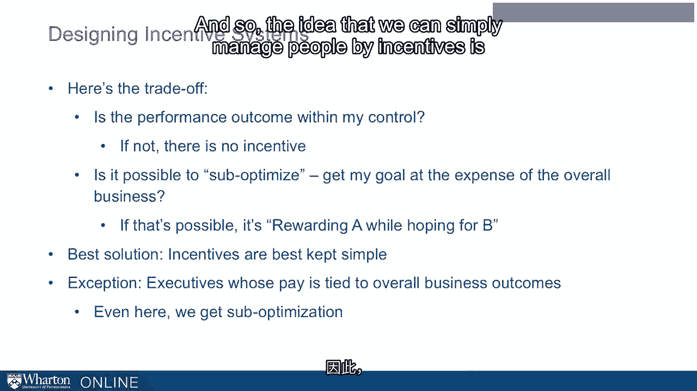

目前我们看到的一个例外是基于激励的薪酬出现在高管层面。对于这些我们认为其个人工作能驱动整个组织绩效的人，你可以将他们的薪酬与整体业务成果挂钩，这对基层员工来说没有意义，因为他们对公司的整体股价或整体绩效几乎没有控制力。但即使在这里，你也可能遇到次优化问题。例如，有些高管的激励薪酬基于相对短期的绩效，这就引发了担忧：他们可能以牺牲长期绩效为代价来提升公司的短期绩效，而那时他们可能已经不在公司了。因此，很难摆脱这些激励问题，所以认为我们可以简单地通过激励来管理人的想法，不幸的是并不正确。

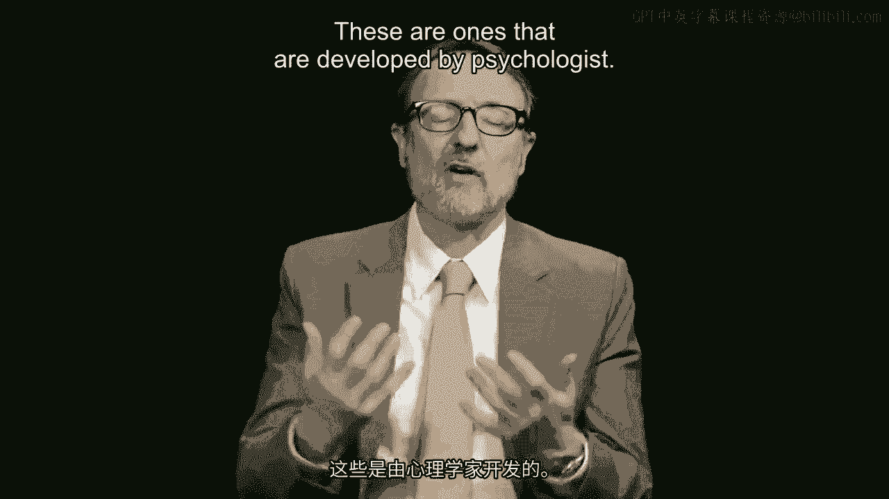

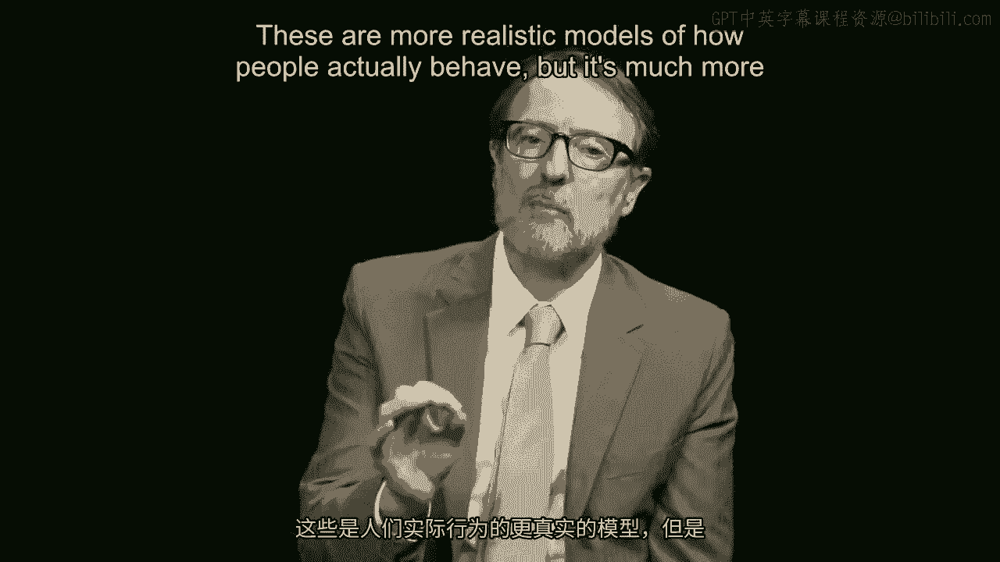

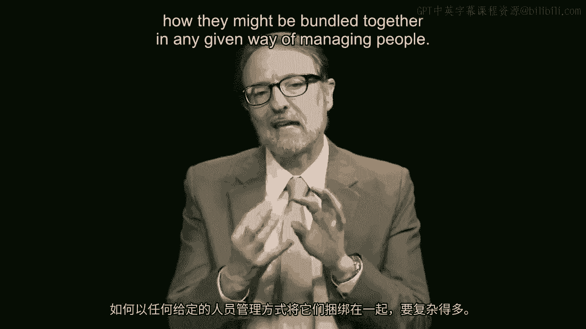

## 更复杂的管理模型 🧠

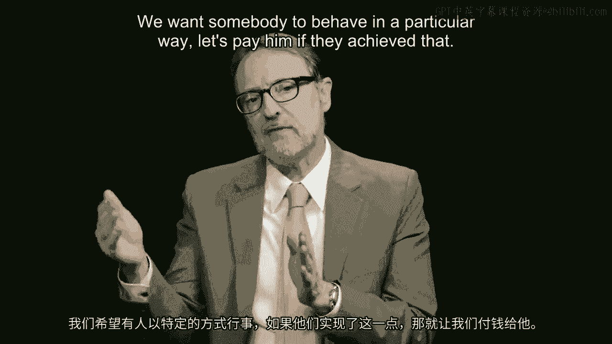

上一节我们讨论了基于经济学的简单激励模型及其局限性，本节中我们来看看心理学家提出的更复杂的管理模型。

这些模型更贴近人们实际行为的方式，但要理解所有这些不同的效应，并思考它们如何以任何给定的管理方式捆绑在一起，则要复杂得多。

以下是心理学家对激励问题的几种重要补充视角：

### 期望理论

我们从心理学家对经济学家**代理理论**（即激励故事）的看法开始。激励故事是：我们希望某人以特定方式行事，如果他们做到了，我们就付钱给他们。心理学家对此增加了一个细微差别，他们称之为**期望理论**。期望理论基本上意味着：我实际上对雇主有什么期望？这可能意味着：如果我有一个基于激励的计划，但我不相信如果我真正达到绩效就真的会得到奖励，那么我的动机会降为零。因此，在这些模型中，拥有可预测性和信任非常重要。你不能只是递给某人一份合同，就期望它能起作用。如果你相信可能会发生某些变化（如所有权变更、目标变更、薪酬结构变更），那么你的动机就会减弱。

### 路径-目标理论

另一个由不同心理学家群体（特别是我们沃顿商学院的前同事鲍勃·豪斯）提出的复杂因素，被称为**路径-目标理论**。路径-目标理论认为，你可以拥有世界上所有的激励，甚至可以给人们一个明确、无歧义的目标。但如果他们不知道如何达到目标，激励对你没有任何好处。例如，如果你要求我在工作中做一些复杂的事情，比如解决某个特定算法，并告诉我如果做到了就能得到奖励，但我不知道如何做那种数学运算，那么世界上所有的动机都无关紧要。这提醒我们，人们拥有技能、接受培训、理解该做什么非常重要，而不仅仅是激励。

### 行为矫正

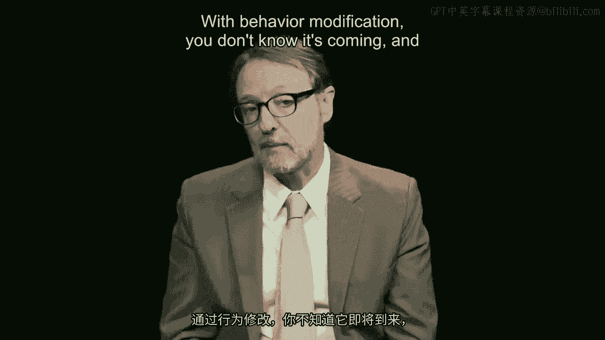

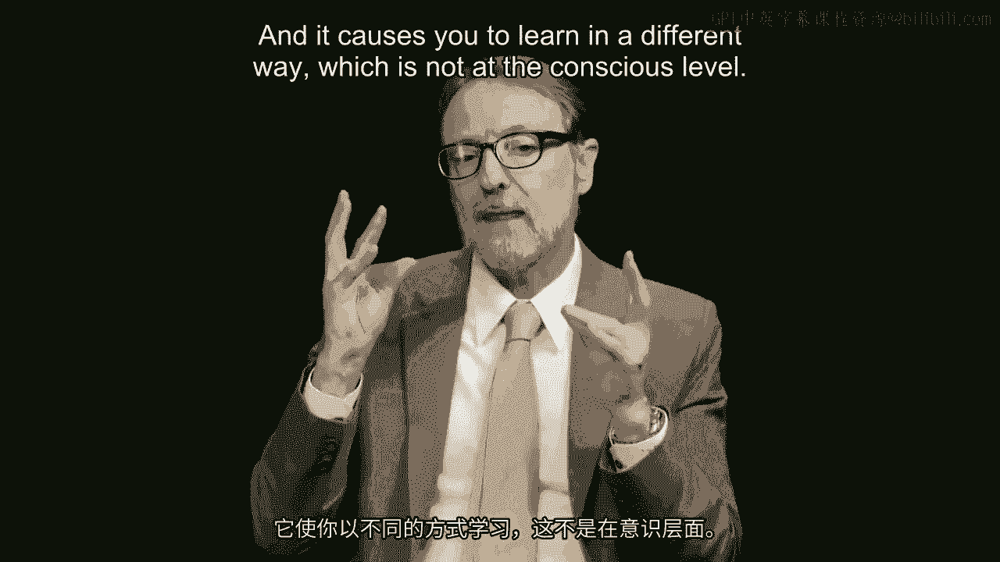

第三个问题使我们完全脱离了经济学家的范畴，它始于一系列我们可以称之为**认知模型**的理论，这些模型与大脑处理信息的方式有关。其中最简单的一个是**行为矫正**。假设一位雇主或主管在零售店巡视，看到某人做了好事，当场给予他们即时奖金。这是一种行为矫正技术。我因为这样行为而得到了即时奖金。我开始预期，如果我继续那样做，可能会得到更多奖金。但行为矫正的美妙之处在于，你不必总是得到那些奖金。事实上，一些最强烈的动机、关于如何以特定方式行事的最强学习，来自于你并非总是得到它们的时候，当你几乎随机地因为做对了事而得到它们时。它教会人们以一种无意识的方式行事。它可能看起来像激励，但与激励的区别在于，你必须知道它会来。有人必须告诉你“做这个，你就能得到奖金”。在行为矫正中，你不知道它会来，也不知道你什么时候会得到它。它导致你以一种不同的方式学习，这种方式不是在意识层面。

## 社会心理与行为影响 👥

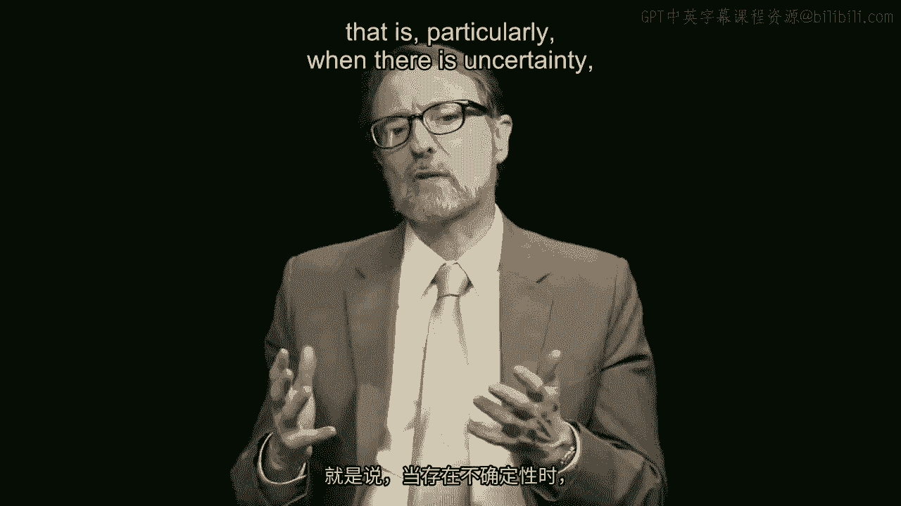

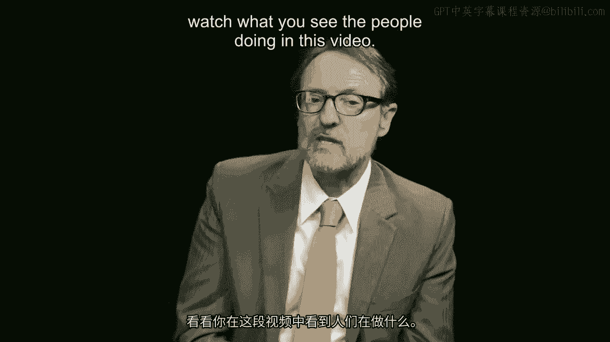

上一节我们探讨了基于个体认知的管理模型，本节中我们来看看如何利用社会心理学原理来管理人们，使他们按照我们希望的方式表现。

这些也属于认知范畴，与社会心理学相关，即人们在他人环境中的行为方式。

以下是几种重要的社会心理影响：

### 从众

也许其中最简单的是**从众**的概念。特别是在不确定的情况下，我们会环顾周围的人，看看我们应该如何行事。在工作场所如何运用这一点？当你雇佣新人进入一个组织时，他们不知道它是如何运作的，也不知道规则是什么。你把他们和一群你的高绩效员工放在一起，他们就会模仿那些人。如果你有一个表现不太好的人，也许可以暂时把他们放到一个人人都做正确事情的群体中，他们就会开始遵从群体的规范。

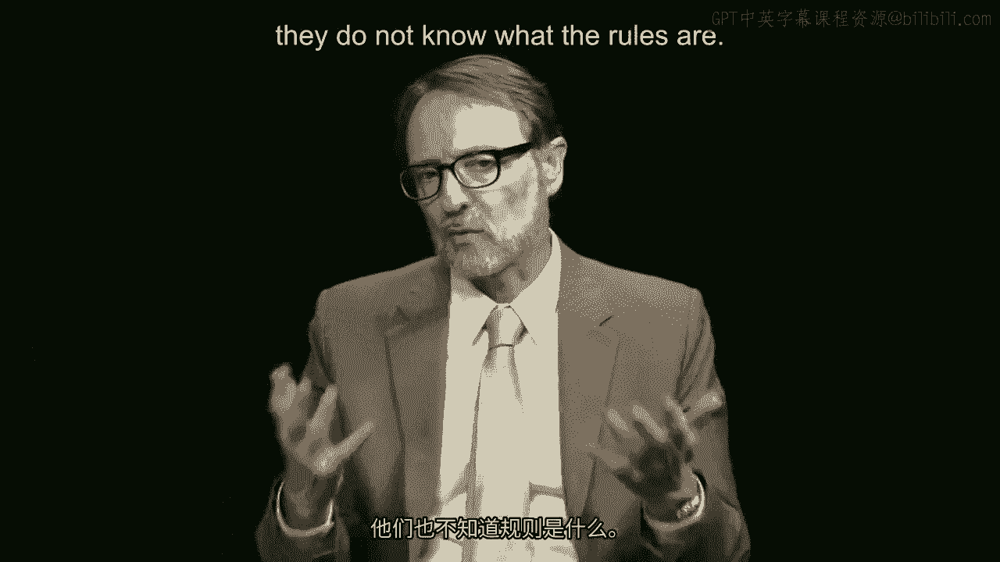

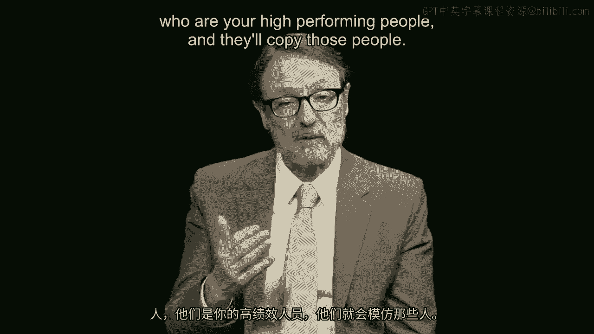

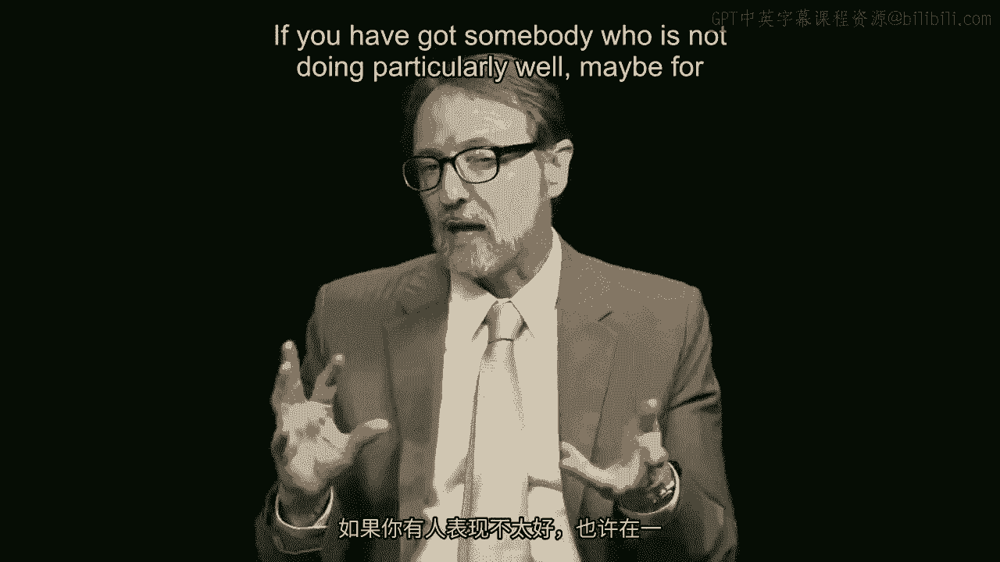

### 模仿

另外两种类似的方式。一种是**模仿**。模仿不同于从众。想想榜样。一个有权力的人（比如老师），或者一个在各方面有吸引力的人（即他们是你的理想榜样），我们会发现自己会模仿那些人。这就是我们为孩子们担心榜样的原因，尤其是运动员、演员等公众人物，因为他们做着光鲜的事情，年轻人会模仿他们。同样的事情也发生在工作场所。如果你有一个主管，他对你有权力，但他在某些方面对你有吸引力，拥有你想要的东西，并且他们在工作中做正确的事情，你很可能会模仿那个人。这对组织有好处。如果你有一个有吸引力、对你有一定权力但没做正确事情的人，人们也会模仿那个人。这是件坏事。

### 服从

**服从**是指我们对正式权威和权威的象征反应非常强烈。这方面著名的研究由斯坦利·米尔格拉姆在20世纪50年代进行，展示了人们如何在医疗环境中（某人穿着白大褂、拿着写字板）遵循权威人物的命令，被告知是进行行为矫正研究（实际上是关于服从的研究），以观察人们会走多远。仅仅因为一个权威人物告诉他们这样做，就去电击某人。因此，我们对拥有权威的人赋予了很多权力，我们倾向于按照他们说的去做。所以我们也需要注意这一点。我们希望组织中的权威人物做正确的事情，因为如果他们下达命令，我们倾向于服从。

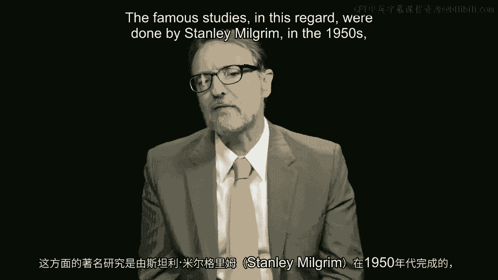

## 认知失调及其影响 🔄

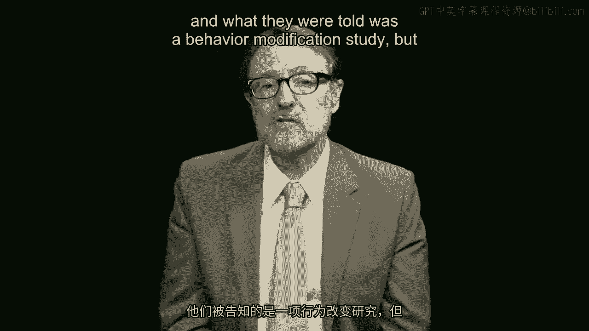

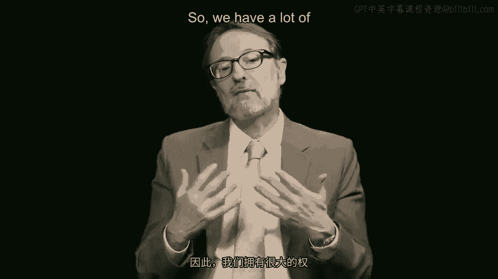

上一节我们了解了社会影响如何塑造行为，本节中我们来看看影响动机的最后一组问题或理论模型，它们有一个共同的根源。

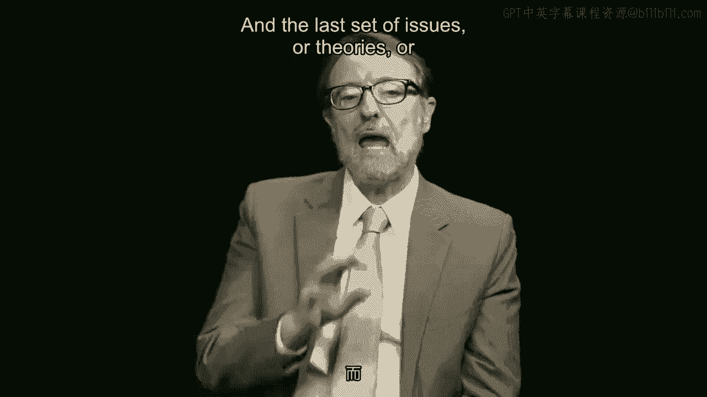

这个共同的根源叫做**认知失调**。对于提出这个概念的心理学家来说，这意味着在我们头脑中同时持有相互矛盾的证据或对同一事物的矛盾想法是非常困难的。例如，如果你有一个你非常疼爱的孩子，你认为孩子很棒，老师却告诉你你的孩子在学校是个大问题。最初的反应是认知失调，这意味着两个不一致的事情：我知道我的孩子很棒，老师告诉我孩子是个混蛋。我们如何处理？这是不愉快的。在我们的头脑中，我们不喜欢持有这种矛盾，所以我们以各种方式解决它。

以下是认知失调在工作场所的几种应用：

### 目标设定

我们解决认知失调的方式之一体现在**目标设定**中。在组织或个人生活中设定目标的重要性。例如，想想戒烟或其他类似行为的模型，它们通常涉及你做出承诺。但承诺往往是给你关心的人，比如对你的孩子说：“我明白吸烟正在杀死我，我向你保证我会戒烟。”你给了他们那封信，他们知道你做出了承诺。然后不久，当你想抽烟的时刻到来时，你会怎么做？他们不在身边，不会看到你这样做，所以你可以偷偷溜走抽一支。问题是你那时对自己感觉如何？我答应了我的孩子我会这样做，我不认为自己是骗子，但我即将做的事情基本上是在对我的孩子撒谎。抵抗这样做的原因在于你设定的目标以及认知失调带来的不适感。我认为自己是个好人，但我即将违背对孩子的承诺，这令人不快，所以我不这样做。

### 皮格马利翁效应

另一个例子是众所周知的**皮格马利翁效应**。它的运作方式非常相似。它源自希腊神话、萧伯纳的戏剧以及迪士尼的百老汇音乐剧《窈窕淑女》。其理念是，你可以通过你对人们的期望来塑造他们的行为。皮格马利翁效应认为，如果你是一个榜样，特别是你向学生或你监督的人传达了对他们的高期望，这会影响他们对自己的看法，并影响他们的表现。因此，如果你为他们设定更高的目标和期望，他们倾向于取得更多成就。为什么？因为他们相信自己能做到。他们可能会说：“天哪，我不认为我能完成这场比赛，但教练告诉我我能行，她相信我能做到。因此，我回去后会更努力一点。”这就是皮格马利翁效应的运作方式。

### 公平理论

第三个例子是我的同事迈克·尤西姆稍后会详细讨论的**公平理论**，这与不公平问题有关。当我们认为某事不公平时，它会在我们头脑中产生类似的问题，我们会通过改变我们贡献的平衡来采取行动，试图创造公平。如果我们认为某事不公平，我们可能会通过不那么努力工作来试图使其公平。我们稍后会更多地讨论这一点。

## 总结 📝

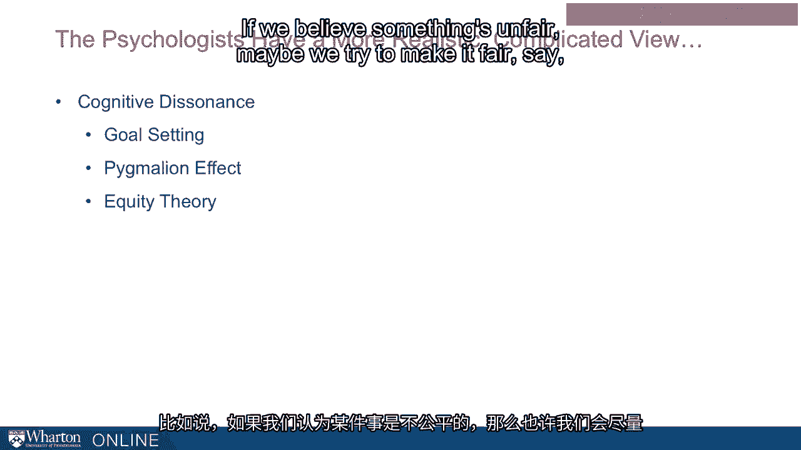

本节课中我们一起学习了激励机制设计的核心权衡与多种管理模型。我们了解到，简单的经济激励模型存在**次优化**和**可控性**问题，难以完美实施。心理学家引入了**期望理论**和**路径-目标理论**，强调了信任、技能和清晰路径的重要性。**行为矫正**展示了无意识学习的力量。社会心理学模型，如**从众**、**模仿**和**服从**，揭示了群体和权威对个体行为的强大影响。最后，基于**认知失调**的模型，如**目标设定**、**皮格马利翁效应**和**公平理论**，说明了我们如何通过内部心理机制来引导和维持行为。有效的管理需要综合考虑这些因素，而不仅仅依赖于简单的金钱激励。